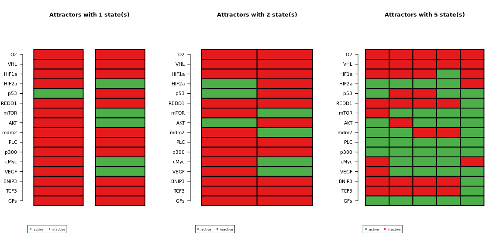
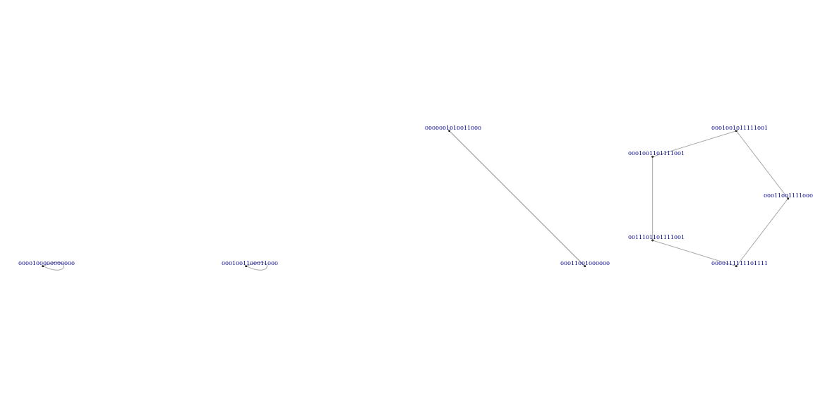
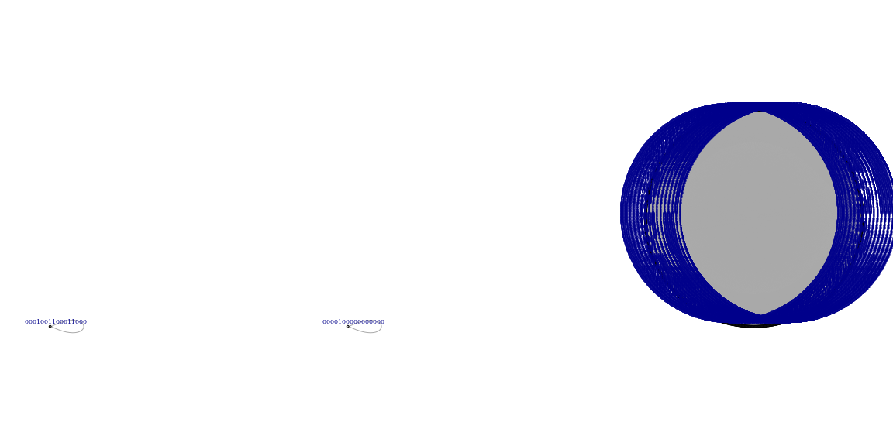
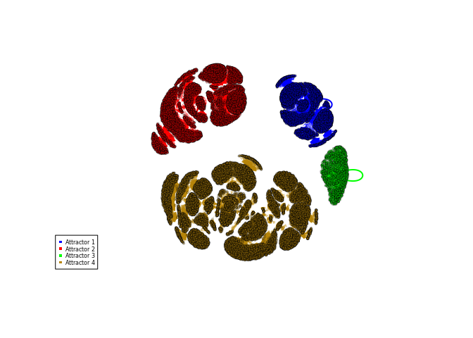
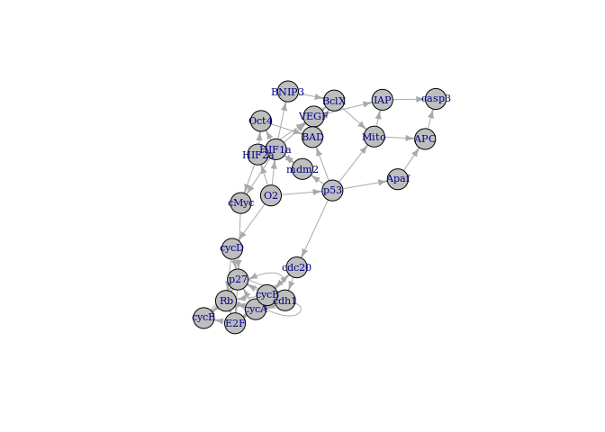
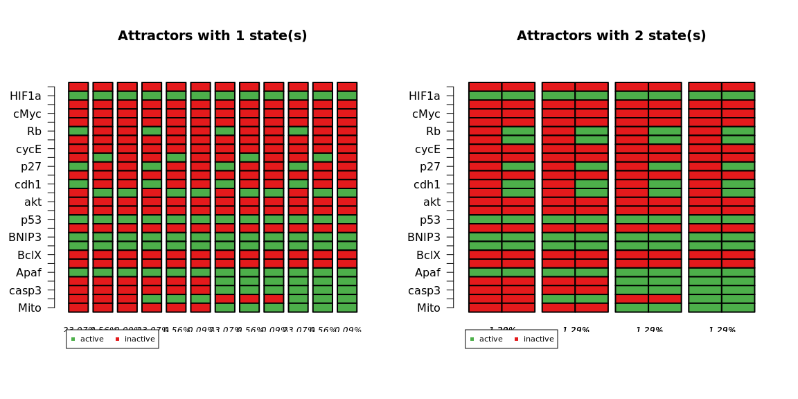
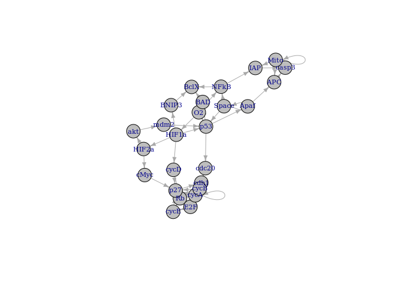

BoolNet
================

``` r
library(BoolNet)
setwd("/data4/terrematte/modelling/BoolNet")
```

# Boolean network from HIFaxis 10/09/2020

``` r
net <- loadNetwork("boolean_network_HIFaxis.bn")
```

    ## Warning in readLines(file, -1): linha final incompleta encontrada em
    ## 'boolean_network_HIFaxis.bn'

    ## Warning in loadNetwork("boolean_network_HIFaxis.bn"): There is no transition
    ## function for gene "GFs"! Assuming an input!

``` r
net
```

    ## Boolean network with 16 genes
    ## 
    ## Involved genes:
    ## O2 VHL HIF1a HIF2a p53 REDD1 mTOR AKT mdm2 PLC p300 cMyc VEGF BNIP3 TCF3 GFs
    ## 
    ## Transition functions:
    ## O2 = 0
    ## VHL = O2 & !PLC
    ## HIF1a = !VHL & ((!p53 & p300) & !mdm2)
    ## HIF2a = !HIF1a & !VHL & (p300 | mTOR)
    ## p53 = ((! O2 & ((!HIF1a & p300) & !mdm2)) | HIF1a) | (!VHL & !HIF2a)
    ## REDD1 = HIF1a
    ## mTOR = GFs & !REDD1 & !BNIP3 | (HIF2a & !VHL)
    ## AKT = mTOR
    ## mdm2 = AKT & p53
    ## PLC = GFs
    ## p300 = PLC
    ## cMyc = HIF2a & !HIF1a
    ## VEGF = HIF1a | HIF2a
    ## BNIP3 = HIF1a
    ## TCF3 = HIF1a
    ## GFs = GFs
    ## 
    ## Knocked-out and over-expressed genes:
    ## O2 = 0

``` r
attr.syn <- getAttractors(net, type = "synchronous")

# calculate number of different attractor lengths, 
# and plot attractors side by side in "table" mode
par(mfrow=c(1, length(table(sapply(attr.syn$attractors,
                          function(attr.syn)
                          {
                            length(attr.syn$involvedStates)
                          })))))

plotAttractors(attr.syn)
```

<!-- -->

    ## $`1`
    ##       Attr1.1 Attr2.1
    ## O2          0       0
    ## VHL         0       0
    ## HIF1a       0       0
    ## HIF2a       0       1
    ## p53         1       0
    ## REDD1       0       0
    ## mTOR        0       1
    ## AKT         0       1
    ## mdm2        0       0
    ## PLC         0       0
    ## p300        0       0
    ## cMyc        0       1
    ## VEGF        0       1
    ## BNIP3       0       0
    ## TCF3        0       0
    ## GFs         0       0
    ## 
    ## $`2`
    ##       Attr3.1 Attr3.2
    ## O2          0       0
    ## VHL         0       0
    ## HIF1a       0       0
    ## HIF2a       1       0
    ## p53         1       0
    ## REDD1       0       0
    ## mTOR        0       1
    ## AKT         1       0
    ## mdm2        0       1
    ## PLC         0       0
    ## p300        0       0
    ## cMyc        0       1
    ## VEGF        0       1
    ## BNIP3       0       0
    ## TCF3        0       0
    ## GFs         0       0
    ## 
    ## $`5`
    ##       Attr4.1 Attr4.2 Attr4.3 Attr4.4 Attr4.5
    ## O2          0       0       0       0       0
    ## VHL         0       0       0       0       0
    ## HIF1a       0       0       0       1       0
    ## HIF2a       1       1       1       1       0
    ## p53         1       0       0       1       1
    ## REDD1       0       0       0       0       1
    ## mTOR        0       1       1       1       1
    ## AKT         1       0       1       1       1
    ## mdm2        1       1       0       0       1
    ## PLC         1       1       1       1       1
    ## p300        1       1       1       1       1
    ## cMyc        0       1       1       1       0
    ## VEGF        0       1       1       1       1
    ## BNIP3       0       0       0       0       1
    ## TCF3        0       0       0       0       1
    ## GFs         1       1       1       1       1

``` r
# plot attractors in "graph" mode
par(mfrow=c(1, length(attr.syn$attractors)))
plotAttractors(attr.syn, mode="graph")
```

<!-- -->

``` r
# identify asynchronous attractors
attr.asyn <- getAttractors(net, type="asynchronous")

# plot attractors in "graph" mode
par(mfrow=c(1, length(attr.asyn$attractors)))
plotAttractors(attr.asyn, mode="graph")
```

<!-- -->

``` r
plotStateGraph(attr.syn)
```

<!-- -->

``` r
sim <- markovSimulation(net,
                        numIterations=1024,
                        returnTable=FALSE)
sim
```

    ## States reached at the end of the simulation:
    ##   O2 VHL HIF1a HIF2a p53 REDD1 mTOR AKT mdm2 PLC p300 cMyc VEGF BNIP3 TCF3 GFs
    ## 1  0   0     0     0   1     0    0   0    0   0    0    0    0     0    0   0
    ## 2  0   0     0     1   1     0    0   1    0   0    0    0    0     0    0   0
    ## 3  0   0     0     1   0     0    1   1    0   0    0    1    1     0    0   0
    ## 4  0   0     0     0   0     0    1   0    1   0    0    1    1     0    0   0
    ## 5  0   0     0     1   1     0    0   1    1   1    1    0    0     0    0   1
    ## 6  0   0     0     1   0     0    1   1    0   1    1    1    1     0    0   1
    ## 7  0   0     1     1   1     0    1   1    0   1    1    1    1     0    0   1
    ## 8  0   0     0     1   0     0    1   0    1   1    1    1    1     0    0   1
    ## 9  0   0     0     0   1     1    1   1    1   1    1    0    1     1    1   1
    ##   Probability
    ## 1  0.17578125
    ## 2  0.24218750
    ## 3  0.04687500
    ## 4  0.03515625
    ## 5  0.13916016
    ## 6  0.11669922
    ## 7  0.06298828
    ## 8  0.04980469
    ## 9  0.13134766

``` r
plotNetworkWiring(net)
```

<!-- -->

# Boolean network from 09/07/2020

``` r
net <- loadNetwork("boolean_network_2020_07_09.bn")
net
```

    ## Boolean network with 25 genes
    ## 
    ## Involved genes:
    ## O2 HIF1a HIF2a p53 BNIP3 VEGF cMyc Oct4 cycD Rb E2F cycE cycA p27 cdc20 cdh1 cycB mdm2 BAD BclX Mito IAP Apaf APC casp3
    ## 
    ## Transition functions:
    ## O2 = 0
    ## HIF1a = !O2 & !mdm2
    ## HIF2a = !O2 & !HIF1a
    ## p53 = !O2
    ## BNIP3 = HIF1a
    ## VEGF = HIF1a | HIF2a
    ## cMyc = HIF2a & !HIF1a
    ## Oct4 = HIF2a & !HIF1a
    ## cycD = O2
    ## Rb = (!cycD & !cycE & !cycA & !cycB) | (p27 & !cycD & !cycB)
    ## E2F = (!Rb & !cycA & !cycB) | (p27 & !Rb & !cycB)
    ## cycE = E2F & ! Rb
    ## cycA = (E2F & !Rb & !cdc20) | (cycA & !Rb & !cdc20)
    ## p27 = ((!cycD & !cycE & !cycA & !cycB) | (p27 & !(cycE & cycA) & !cycB & cycD)) & !cMyc
    ## cdc20 = cycB & !p53
    ## cdh1 = (!cycA & !cycB) | cdc20 | (p27 & !cycB)
    ## cycB = !cdc20 & !cdh1
    ## mdm2 = p53 & !HIF1a
    ## BAD = p53 & !Oct4
    ## BclX = (!BNIP3 | !BAD) & VEGF
    ## Mito = !BclX & p53
    ## IAP = VEGF & !Mito
    ## Apaf = p53
    ## APC = Mito & Apaf
    ## casp3 = APC & !IAP
    ## 
    ## Knocked-out and over-expressed genes:
    ## O2 = 0

``` r
attr.syn <- getAttractors(net, type = "synchronous")

# calculate number of different attractor lengths, 
# and plot attractors side by side in "table" mode
par(mfrow=c(1, length(table(sapply(attr.syn$attractors,
                          function(attr.syn)
                          {
                            length(attr.syn$involvedStates)
                          })))))

plotAttractors(attr.syn)
```

<!-- -->

    ## $`1`
    ##       Attr1.1 Attr2.1 Attr3.1 Attr4.1 Attr5.1 Attr6.1
    ## O2          0       0       0       0       0       0
    ## HIF1a       1       1       1       0       0       0
    ## HIF2a       0       0       0       1       1       1
    ## p53         1       1       1       1       1       1
    ## BNIP3       1       1       1       0       0       0
    ## VEGF        1       1       1       1       1       1
    ## cMyc        0       0       0       1       1       1
    ## Oct4        0       0       0       1       1       1
    ## cycD        0       0       0       0       0       0
    ## Rb          0       0       1       0       0       1
    ## E2F         0       0       0       0       0       0
    ## cycE        0       0       0       0       0       0
    ## cycA        1       0       0       1       0       0
    ## p27         0       0       1       0       0       0
    ## cdc20       0       0       0       0       0       0
    ## cdh1        0       0       1       0       0       1
    ## cycB        1       1       0       1       1       0
    ## mdm2        0       0       0       1       1       1
    ## BAD         1       1       1       0       0       0
    ## BclX        0       0       0       1       1       1
    ## Mito        1       1       1       0       0       0
    ## IAP         0       0       0       1       1       1
    ## Apaf        1       1       1       1       1       1
    ## APC         1       1       1       0       0       0
    ## casp3       1       1       1       0       0       0
    ## 
    ## $`2`
    ##       Attr7.1 Attr7.2 Attr8.1 Attr8.2 Attr9.1 Attr9.2 Attr10.1 Attr10.2
    ## O2          0       0       0       0       0       0        0        0
    ## HIF1a       1       1       0       1       0       1        0        1
    ## HIF2a       0       0       0       1       0       1        0        1
    ## p53         1       1       1       1       1       1        1        1
    ## BNIP3       1       1       1       0       1       0        1        0
    ## VEGF        1       1       1       0       1       0        1        0
    ## cMyc        0       0       0       0       0       0        0        0
    ## Oct4        0       0       0       0       0       0        0        0
    ## cycD        0       0       0       0       0       0        0        0
    ## Rb          0       1       0       1       0       0        0        0
    ## E2F         0       1       0       1       0       0        0        0
    ## cycE        0       0       0       0       0       0        0        0
    ## cycA        0       0       0       0       1       1        0        0
    ## p27         0       1       0       1       0       0        0        0
    ## cdc20       0       0       0       0       0       0        0        0
    ## cdh1        0       1       0       1       0       0        0        0
    ## cycB        0       1       0       1       1       1        1        1
    ## mdm2        0       0       0       1       0       1        0        1
    ## BAD         1       1       1       1       1       1        1        1
    ## BclX        0       0       0       0       0       0        0        0
    ## Mito        1       1       1       1       1       1        1        1
    ## IAP         0       0       0       0       0       0        0        0
    ## Apaf        1       1       1       1       1       1        1        1
    ## APC         1       1       1       1       1       1        1        1
    ## casp3       1       1       1       1       1       1        1        1
    ##       Attr11.1 Attr11.2 Attr12.1 Attr12.2 Attr13.1 Attr13.2
    ## O2           0        0        0        0        0        0
    ## HIF1a        0        1        0        1        0        0
    ## HIF2a        0        1        0        1        1        1
    ## p53          1        1        1        1        1        1
    ## BNIP3        1        0        1        0        0        0
    ## VEGF         1        0        1        0        1        1
    ## cMyc         0        0        0        0        1        1
    ## Oct4         0        0        0        0        1        1
    ## cycD         0        0        0        0        0        0
    ## Rb           1        1        1        0        0        1
    ## E2F          0        0        1        0        0        1
    ## cycE         0        0        0        0        0        0
    ## cycA         0        0        0        0        0        0
    ## p27          1        1        1        0        0        0
    ## cdc20        0        0        0        0        0        0
    ## cdh1         1        1        1        0        0        1
    ## cycB         0        0        1        0        0        1
    ## mdm2         0        1        0        1        1        1
    ## BAD          1        1        1        1        0        0
    ## BclX         0        0        0        0        1        1
    ## Mito         1        1        1        1        0        0
    ## IAP          0        0        0        0        1        1
    ## Apaf         1        1        1        1        1        1
    ## APC          1        1        1        1        0        0
    ## casp3        1        1        1        1        0        0

``` r
# plot attractors in "graph" mode
par(mfrow=c(1, length(attr.syn$attractors)))
plotAttractors(attr.syn, mode="graph")
```

<!-- -->

``` r
# # identify asynchronous attractors
# attr.asyn <- getAttractors(net, type="asynchronous")
# 
# # plot attractors in "graph" mode
# par(mfrow=c(1, length(attr.asyn$attractors)))
# plotAttractors(attr.asyn, mode="graph")
```

<!-- ```{r} -->

<!-- plotStateGraph(attr.syn) -->

<!-- ``` -->

``` r
sim <- markovSimulation(net,
                        numIterations=1024,
                        returnTable=FALSE)
sim
```

    ## States reached at the end of the simulation:
    ##    O2 HIF1a HIF2a p53 BNIP3 VEGF cMyc Oct4 cycD Rb E2F cycE cycA p27 cdc20 cdh1
    ## 1   0     0     1   1     0    1    1    1    0  0   0    0    0   0     0    0
    ## 2   0     0     1   1     0    1    1    1    0  1   0    0    0   0     0    1
    ## 3   0     0     1   1     0    1    1    1    0  0   0    0    0   0     0    0
    ## 4   0     0     1   1     0    1    1    1    0  0   0    0    1   0     0    0
    ## 5   0     0     1   1     0    1    1    1    0  1   1    0    0   0     0    1
    ## 6   0     0     0   1     1    1    0    0    0  0   0    0    0   0     0    0
    ## 7   0     1     0   1     1    1    0    0    0  0   0    0    0   0     0    0
    ## 8   0     0     0   1     1    1    0    0    0  1   0    0    0   1     0    1
    ## 9   0     1     0   1     1    1    0    0    0  1   0    0    0   1     0    1
    ## 10  0     0     0   1     1    1    0    0    0  0   0    0    0   0     0    0
    ## 11  0     1     0   1     1    1    0    0    0  0   0    0    0   0     0    0
    ## 12  0     0     0   1     1    1    0    0    0  0   0    0    1   0     0    0
    ## 13  0     1     0   1     1    1    0    0    0  0   0    0    1   0     0    0
    ## 14  0     0     0   1     1    1    0    0    0  1   1    0    0   1     0    1
    ## 15  0     1     0   1     1    1    0    0    0  1   1    0    0   1     0    1
    ## 16  0     1     1   1     0    0    0    0    0  0   0    0    0   0     0    0
    ## 17  0     1     1   1     0    0    0    0    0  1   0    0    0   1     0    1
    ## 18  0     1     1   1     0    0    0    0    0  0   0    0    0   0     0    0
    ## 19  0     1     1   1     0    0    0    0    0  0   0    0    1   0     0    0
    ## 20  0     1     1   1     0    0    0    0    0  1   1    0    0   1     0    1
    ##    cycB mdm2 BAD BclX Mito IAP Apaf APC casp3 Probability
    ## 1     0    1   0    1    0   1    1   0     0 0.019531250
    ## 2     0    1   0    1    0   1    1   0     0 0.055053711
    ## 3     1    1   0    1    0   1    1   0     0 0.011718750
    ## 4     1    1   0    1    0   1    1   0     0 0.023437500
    ## 5     1    1   0    1    0   1    1   0     0 0.015258789
    ## 6     0    0   1    0    1   0    1   1     1 0.009765625
    ## 7     0    0   1    0    1   0    1   1     1 0.029296875
    ## 8     0    0   1    0    1   0    1   1     1 0.064819336
    ## 9     0    0   1    0    1   0    1   1     1 0.261596680
    ## 10    1    0   1    0    1   0    1   1     1 0.011718750
    ## 11    1    0   1    0    1   0    1   1     1 0.015625000
    ## 12    1    0   1    0    1   0    1   1     1 0.023437500
    ## 13    1    0   1    0    1   0    1   1     1 0.046875000
    ## 14    1    0   1    0    1   0    1   1     1 0.015258789
    ## 15    1    0   1    0    1   0    1   1     1 0.021606445
    ## 16    0    1   1    0    1   0    1   1     1 0.039062500
    ## 17    0    1   1    0    1   0    1   1     1 0.251831055
    ## 18    1    1   1    0    1   0    1   1     1 0.015625000
    ## 19    1    1   1    0    1   0    1   1     1 0.046875000
    ## 20    1    1   1    0    1   0    1   1     1 0.021606445

``` r
plotNetworkWiring(net)
```

<!-- -->

# Boolean network from 10/06/2020

``` r
net <- loadNetwork("boolean_network_2020_06_10.bn")
```

    ## Warning in loadNetwork("boolean_network_2020_06_10.bn"): There is no transition
    ## function for gene "Space"! Assuming an input!

    ## Warning in loadNetwork("boolean_network_2020_06_10.bn"): There is no transition
    ## function for gene "Mito"! Assuming an input!

``` r
net
```

    ## Boolean network with 26 genes
    ## 
    ## Involved genes:
    ## O2 HIF1a HIF2a cMyc cycD Rb E2F cycE cycA p27 cdc20 cdh1 cycB akt mdm2 p53 NFkB BNIP3 BAD BclX IAP Apaf APC casp3 Space Mito
    ## 
    ## Transition functions:
    ## O2 = 0
    ## HIF1a = !O2
    ## HIF2a = !HIF1a
    ## cMyc = HIF2a
    ## cycD = !HIF1a
    ## Rb = (!cycD & !cycE & !cycA & !cycB) | (p27 & !cycD & !cycB)
    ## E2F = (!Rb & !cycA & !cycB) | (p27 & !Rb & !cycB)
    ## cycE = E2F & !Rb
    ## cycA = (E2F & !Rb & !cdc20) | (cycA & !Rb & !cdc20)
    ## p27 = (!cycD & !cycE & !cycA & !cycB) | (cMyc & !(cycE & cycA) & !cycB & cycD)
    ## cdc20 = cycB & !p53
    ## cdh1 = (!cycA & !cycB) | cdc20 | (p27 & !cycB)
    ## cycB = !cdc20 & !cdh1
    ## akt = HIF2a
    ## mdm2 = akt
    ## p53 = (HIF1a | (O2 & Space)) & !mdm2
    ## NFkB = O2 & Space
    ## BNIP3 = HIF1a
    ## BAD = p53
    ## BclX = (!BNIP3 | !BAD) & NFkB
    ## IAP = NFkB & !Mito
    ## Apaf = p53
    ## APC = Mito & Apaf
    ## casp3 = APC & !IAP
    ## Space = Space
    ## Mito = Mito
    ## 
    ## Knocked-out and over-expressed genes:
    ## O2 = 0

``` r
attr.syn <- getAttractors(net, type = "synchronous")

# calculate number of different attractor lengths, 
# and plot attractors side by side in "table" mode
par(mfrow=c(1, length(table(sapply(attr.syn$attractors,
                          function(attr.syn)
                          {
                            length(attr.syn$involvedStates)
                          })))))

plotAttractors(attr.syn)
```

<!-- -->

    ## $`1`
    ##       Attr1.1 Attr2.1 Attr3.1 Attr4.1 Attr5.1 Attr6.1 Attr7.1 Attr8.1 Attr9.1
    ## O2          0       0       0       0       0       0       0       0       0
    ## HIF1a       1       1       1       1       1       1       1       1       1
    ## HIF2a       0       0       0       0       0       0       0       0       0
    ## cMyc        0       0       0       0       0       0       0       0       0
    ## cycD        0       0       0       0       0       0       0       0       0
    ## Rb          1       0       0       1       0       0       1       0       0
    ## E2F         0       0       0       0       0       0       0       0       0
    ## cycE        0       0       0       0       0       0       0       0       0
    ## cycA        0       1       0       0       1       0       0       1       0
    ## p27         1       0       0       1       0       0       1       0       0
    ## cdc20       0       0       0       0       0       0       0       0       0
    ## cdh1        1       0       0       1       0       0       1       0       0
    ## cycB        0       1       1       0       1       1       0       1       1
    ## akt         0       0       0       0       0       0       0       0       0
    ## mdm2        0       0       0       0       0       0       0       0       0
    ## p53         1       1       1       1       1       1       1       1       1
    ## NFkB        0       0       0       0       0       0       0       0       0
    ## BNIP3       1       1       1       1       1       1       1       1       1
    ## BAD         1       1       1       1       1       1       1       1       1
    ## BclX        0       0       0       0       0       0       0       0       0
    ## IAP         0       0       0       0       0       0       0       0       0
    ## Apaf        1       1       1       1       1       1       1       1       1
    ## APC         0       0       0       0       0       0       1       1       1
    ## casp3       0       0       0       0       0       0       1       1       1
    ## Space       0       0       0       1       1       1       0       0       0
    ## Mito        0       0       0       0       0       0       1       1       1
    ##       Attr10.1 Attr11.1 Attr12.1
    ## O2           0        0        0
    ## HIF1a        1        1        1
    ## HIF2a        0        0        0
    ## cMyc         0        0        0
    ## cycD         0        0        0
    ## Rb           1        0        0
    ## E2F          0        0        0
    ## cycE         0        0        0
    ## cycA         0        1        0
    ## p27          1        0        0
    ## cdc20        0        0        0
    ## cdh1         1        0        0
    ## cycB         0        1        1
    ## akt          0        0        0
    ## mdm2         0        0        0
    ## p53          1        1        1
    ## NFkB         0        0        0
    ## BNIP3        1        1        1
    ## BAD          1        1        1
    ## BclX         0        0        0
    ## IAP          0        0        0
    ## Apaf         1        1        1
    ## APC          1        1        1
    ## casp3        1        1        1
    ## Space        1        1        1
    ## Mito         1        1        1
    ## 
    ## $`2`
    ##       Attr13.1 Attr13.2 Attr14.1 Attr14.2 Attr15.1 Attr15.2 Attr16.1 Attr16.2
    ## O2           0        0        0        0        0        0        0        0
    ## HIF1a        1        1        1        1        1        1        1        1
    ## HIF2a        0        0        0        0        0        0        0        0
    ## cMyc         0        0        0        0        0        0        0        0
    ## cycD         0        0        0        0        0        0        0        0
    ## Rb           0        1        0        1        0        1        0        1
    ## E2F          0        1        0        1        0        1        0        1
    ## cycE         0        0        0        0        0        0        0        0
    ## cycA         0        0        0        0        0        0        0        0
    ## p27          0        1        0        1        0        1        0        1
    ## cdc20        0        0        0        0        0        0        0        0
    ## cdh1         0        1        0        1        0        1        0        1
    ## cycB         0        1        0        1        0        1        0        1
    ## akt          0        0        0        0        0        0        0        0
    ## mdm2         0        0        0        0        0        0        0        0
    ## p53          1        1        1        1        1        1        1        1
    ## NFkB         0        0        0        0        0        0        0        0
    ## BNIP3        1        1        1        1        1        1        1        1
    ## BAD          1        1        1        1        1        1        1        1
    ## BclX         0        0        0        0        0        0        0        0
    ## IAP          0        0        0        0        0        0        0        0
    ## Apaf         1        1        1        1        1        1        1        1
    ## APC          0        0        0        0        1        1        1        1
    ## casp3        0        0        0        0        1        1        1        1
    ## Space        0        0        1        1        0        0        1        1
    ## Mito         0        0        0        0        1        1        1        1

``` r
# # plot attractors in "graph" mode
# par(mfrow=c(1, length(attr.syn$attractors)))
# plotAttractors(attr.syn, mode="graph")

# # identify asynchronous attractors
# attr.asyn <- getAttractors(net, type="asynchronous")
# 
# # plot attractors in "graph" mode
# par(mfrow=c(1, length(attr.asyn$attractors)))
# plotAttractors(attr.asyn, mode="graph")
```

<!-- ```{r} -->

<!-- plotStateGraph(attr.syn) -->

<!-- ``` -->

<!-- ```{r} -->

<!-- sim <- markovSimulation(net, -->

<!--                         numIterations=1024, -->

<!--                         returnTable=FALSE) -->

<!-- sim -->

<!-- ``` -->

``` r
plotNetworkWiring(net)
```

<!-- -->
