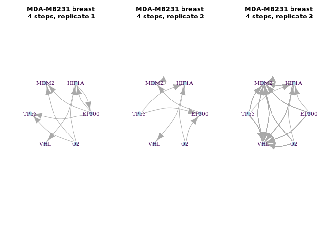
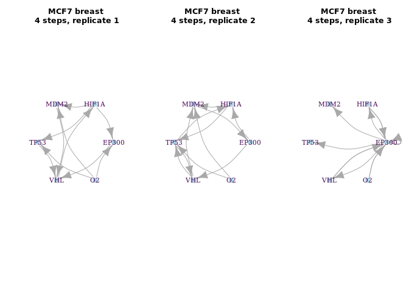
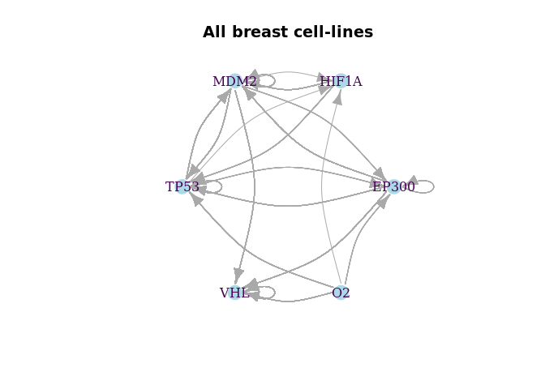
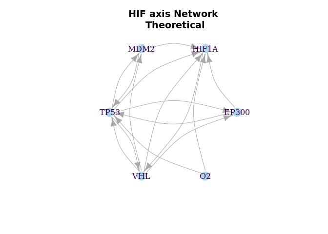

BoolNet Inference (E-GEOD-18494, GSE47533 and GSE41491)
================

# Integrated analysis of microRNA and mRNA expression and association with HIF binding in MCF-7 cells under hypoxia (GSE47533)

Camps C, Saini HK, Mole DR, Choudhry H et al. Integrated analysis of
microRNA and mRNA expression and association with HIF binding reveals
the complexity of microRNA expression regulation under hypoxia. Mol
Cancer 2014 Feb 11;13:28. PMID: 24517586

<https://www.ncbi.nlm.nih.gov/geo/query/acc.cgi?acc=GSE47533>

# Expression profiling of hypoxic HepG2 hepatoma, U87 glioma, and MDA-MB231 breast cancer cells: time course (E-GEOD-18494)

<https://www.ebi.ac.uk/arrayexpress/experiments/E-GEOD-18494/>

# Hypoxia transcriptomic time-series data in three different cancer cell lines (GSE41491)

Tumour hypoxia exhibits a highly dynamic spatial and temporal
distribution and is associated with increased malignancy and poor
prognosis.

<https://www.ncbi.nlm.nih.gov/geo/query/acc.cgi?acc=GSE41491>

Exponentially growing prostate (DU145), colon (HT29) and breast (MCF7)
carcinoma cells were seeded on glass dishes in McCoy, DMEM or RPMI
media, respectively with 10% FCS.

# Network inference:

``` r
# MDA-MB231 breast cancer - 4 time-points
par(mfrow = c(1,3))
plot(breast_MDA.1.p, vertex.label.color="#440154ff", vertex.color="lightblue", vertex.frame.color="white", layout=layout_in_circle, edge.curved=.3,
     main="MDA-MB231 breast\n 4 steps, replicate 1")
plot(breast_MDA.2.p, vertex.label.color="#440154ff", vertex.color="lightblue", vertex.frame.color="white", layout=layout_in_circle, edge.curved=.3,
     main="MDA-MB231 breast\n 4 steps, replicate 2")
plot(breast_MDA.3.p, vertex.label.color="#440154ff", vertex.color="lightblue", vertex.frame.color="white", layout=layout_in_circle, edge.curved=.3,
     main="MDA-MB231 breast\n 4 steps, replicate 3")
```

<!-- -->

``` r
# MCF7 breast cancer - 4 time-points 
par(mfrow = c(1,3))
plot(breast_MCF7.1.p, vertex.label.color="#440154ff", vertex.color="lightblue", vertex.frame.color="white", layout=layout_in_circle, edge.curved=.3,
     main="MCF7 breast\n 4 steps, replicate 1")
plot(breast_MCF7.2.p, vertex.label.color="#440154ff", vertex.color="lightblue", vertex.frame.color="white", layout=layout_in_circle, edge.curved=.3,
     main="MCF7 breast\n 4 steps, replicate 2")
plot(breast_MCF7.3.p, vertex.label.color="#440154ff", vertex.color="lightblue", vertex.frame.color="white", layout=layout_in_circle, edge.curved=.3,
     main="MCF7 breast\n 4 steps, replicate 3")
```

<!-- -->

``` r
# MCF7 breast cancer - 8 time-points
par(mfrow = c(1,3))
plot(breast_MCF7.p, vertex.label.color="#440154ff",  vertex.color="lightblue", vertex.frame.color="white", layout=layout_in_circle, edge.curved=.3,
     main="MCF7 breast\n 8 steps")

# all samples breast cancer merged
par(mfrow = c(1,1))
```

<!-- -->

``` r
plot(all.p, vertex.label.color="#440154ff", vertex.color="lightblue", vertex.frame.color="white", layout=layout_in_circle, edge.curved=.3,
     main="All breast cell-lines")
```

<!-- -->

``` r
HIFaxis.net <- loadNetwork("reduced_HIFaxis.bn")
HIFaxis.p <- plotNetworkWiring(HIFaxis.net, plotIt=F)
HIFaxis.net
```

    ## Boolean network with 6 genes
    ## 
    ## Involved genes:
    ## EP300 HIF1A MDM2 TP53 VHL O2
    ## 
    ## Transition functions:
    ## EP300 = (!VHL & TP53) | (VHL & !TP53)
    ## HIF1A = !VHL & ((!O2 & EP300 & !TP53) | (!O2 & !MDM2))
    ## MDM2 = TP53 & !VHL
    ## TP53 = !MDM2 | (!O2 & EP300 & VHL)
    ## VHL = HIF1A & !TP53
    ## O2 = 0
    ## 
    ## Knocked-out and over-expressed genes:
    ## O2 = 0

``` r
plot(HIFaxis.p, vertex.label.color="#440154ff",  vertex.color="lightblue", vertex.frame.color="white", layout=layout_in_circle, edge.curved=.3,
     main="HIF axis Network\n Theoretical")
```

<!-- -->
