BoolNet Inference (E-GEOD-18494)
================

Expression profiling of hypoxic HepG2 hepatoma, U87 glioma, and
MDA-MB231 breast cancer cells: time course (E-GEOD-18494)

Analysis of expression changes of cultured HepG2 hepatoma, U87 glioma,
and MDA-MB231 breast cancer cells subjected to hypoxia (0.5% O2) for 0,
4, 8, 12 hours . Results provide insight to cell type-specific response
to hypoxia. HepG2 hepatoma, U87 glioma, and MDA-MB231 breast cancer
cells were collected under normoxic conditions (\~19% O2, 0 hours) and
after 4, 8 and 12 hours of hypoxia treatment (0.5% O2). For each cell
line, three replicates of total RNA at each time point were prepared
using Trizol and submitted to the DFCI Microarray Core for labeling,
hybridization to Affymetrix HG-U133Plus2 oligonucleotide arrays and
image scanning.

<https://www.ebi.ac.uk/arrayexpress/experiments/E-GEOD-18494/>

``` r
packages_cran = c("igraph", "BoolNet", "BiocManager", "tidyverse", "fs")


# Install and load packages
package.check <- lapply(packages_cran, FUN = function(x) {
  if (!require(x, character.only = TRUE)) {
    install.packages(x, dependencies = TRUE)
    library(x, character.only = TRUE)
  }
})

library(RSQLite, lib.loc = "/usr/local/lib/R/site-library")

# For oligo and ArrayExpress First install:
#install.packages('https://cran.r-project.org/src/contrib/Archive/ff/ff_2.2-14.tar.gz',repos=NULL)

packages_bioconductor = c("Biobase", "GEOquery", "ArrayExpress", "hgu133plus2.db", "preprocessCore")

# Install and load packages
package.check <- lapply(packages_bioconductor, FUN = function(x) {
  if (!require(x, character.only = TRUE)) {
    BiocManager::install(x, dependencies = TRUE)
    library(x, character.only = TRUE)
  }
})

rm(package.check, packages_bioconductor, packages_cran)
```

``` r
download_dir <- fs::path(".data_tmp")
if (!dir_exists(download_dir)) {
    dir_create(download_dir)
    EGEOD18494 <- ArrayExpress( "E-GEOD-18494", save=TRUE, path=download_dir)
} else {
    EGEOD18494 <- ArrayExpress( "E-GEOD-18494", save=TRUE, path=download_dir)
}
```

    ## Reading in : .data_tmp/GSM460679.CEL
    ## Reading in : .data_tmp/GSM460699.CEL
    ## Reading in : .data_tmp/GSM460681.CEL
    ## Reading in : .data_tmp/GSM460685.CEL
    ## Reading in : .data_tmp/GSM460700.CEL
    ## Reading in : .data_tmp/GSM460675.CEL
    ## Reading in : .data_tmp/GSM460695.CEL
    ## Reading in : .data_tmp/GSM460686.CEL
    ## Reading in : .data_tmp/GSM460677.CEL
    ## Reading in : .data_tmp/GSM460698.CEL
    ## Reading in : .data_tmp/GSM460678.CEL
    ## Reading in : .data_tmp/GSM460696.CEL
    ## Reading in : .data_tmp/GSM460697.CEL
    ## Reading in : .data_tmp/GSM460693.CEL
    ## Reading in : .data_tmp/GSM460692.CEL
    ## Reading in : .data_tmp/GSM460683.CEL
    ## Reading in : .data_tmp/GSM460676.CEL
    ## Reading in : .data_tmp/GSM460673.CEL
    ## Reading in : .data_tmp/GSM460690.CEL
    ## Reading in : .data_tmp/GSM460684.CEL
    ## Reading in : .data_tmp/GSM460688.CEL
    ## Reading in : .data_tmp/GSM460687.CEL
    ## Reading in : .data_tmp/GSM460669.CEL
    ## Reading in : .data_tmp/GSM460682.CEL
    ## Reading in : .data_tmp/GSM460671.CEL
    ## Reading in : .data_tmp/GSM460702.CEL
    ## Reading in : .data_tmp/GSM460701.CEL
    ## Reading in : .data_tmp/GSM460674.CEL
    ## Reading in : .data_tmp/GSM460691.CEL
    ## Reading in : .data_tmp/GSM460704.CEL
    ## Reading in : .data_tmp/GSM460680.CEL
    ## Reading in : .data_tmp/GSM460670.CEL
    ## Reading in : .data_tmp/GSM460694.CEL
    ## Reading in : .data_tmp/GSM460672.CEL
    ## Reading in : .data_tmp/GSM460703.CEL
    ## Reading in : .data_tmp/GSM460689.CEL

``` r
data.EGEOD18494 <- Biobase::pData(EGEOD18494)

data.EGEOD18494 <- data.frame(
                  codes = substr(data.EGEOD18494$Source.Name,1,9),
                  cell_line = data.EGEOD18494$Characteristics..cell.line.,
                  time = data.EGEOD18494$Characteristics..time,
                  condition = data.EGEOD18494$Characteristics..stress.
                  )
data.EGEOD18494 <- data.EGEOD18494[order(data.EGEOD18494$codes),]
data.EGEOD18494$rep <- rep(1:3, n= length(data.EGEOD18494$codes))

# Normalisation
eset.EGEOD18494 <- oligo::rma(EGEOD18494,  normalize = TRUE)
```

    ## Background correcting
    ## Normalizing
    ## Calculating Expression

``` r
exp.EGEOD18494 <- exprs(eset.EGEOD18494)

colnames(exp.EGEOD18494) <- substr(colnames(exp.EGEOD18494),1,9)

EGEOD18494@annotation
```

    ## [1] "pd.hg.u133.plus.2"

``` r
rm(download_dir)
```

# Convert the probes to Symbol names

``` r
anno.EGEOD18494 <- AnnotationDbi::select(hgu133plus2.db, keys=rownames(exp.EGEOD18494), columns=c("ENSEMBL", "SYMBOL", "GENENAME"), keytype="PROBEID")
```

    ## 'select()' returned 1:many mapping between keys and columns

``` r
colnames(anno.EGEOD18494) <- c("probes", "ensgene", "symbol", "description")
```

# Selecting the HIF Genes

``` r
# Selecting genes from HIF Axis
hif.symbols <- c("TP53", "HIF1A", "EP300", "MDM2", "VHL")

hif.probes <- anno.EGEOD18494$probes[anno.EGEOD18494$symbol %in% hif.symbols]

# Select the probes and genes
exp.EGEOD18494.hif <- as.data.frame(exp.EGEOD18494) %>% 
  rownames_to_column('probes') %>% 
  filter(probes %in% hif.probes) %>% 
  merge(anno.EGEOD18494[anno.EGEOD18494$symbol %in% hif.symbols, c("probes","symbol")], by = "probes") %>% 
  #distinct(symbol, .keep_all = TRUE) %>% # Take the first one
  dplyr::select(!(probes)) 
  

# Function to binarize according an consensus mean of probes, add the O2 state and rename columns 
binNet <- function(b){
  binarizeTimeSeries(b[,-5], method="kmeans")$binarizedMeasurements  %>% 
  as.data.frame(.)  %>% 
  aggregate(., list(symbol = b$symbol), mean) %>% 
  mutate_at(vars(-symbol), funs(ifelse(. > 0.4, 1, 0))) %>% 
  rbind(., c("O2", 1,0,0,0)) %>% 
    rename_at(vars(data.EGEOD18494$codes[data.EGEOD18494$codes %in% names(b)] ),
            ~paste0(substr(data.EGEOD18494$condition[data.EGEOD18494$codes %in% names(b)],1,4),".",
                    data.EGEOD18494$time[data.EGEOD18494$codes %in% names(b)],".",
                    substr(data.EGEOD18494$cell_line[data.EGEOD18494$codes %in% names(b)],1,1), ".",
                    data.EGEOD18494$rep[data.EGEOD18494$codes %in% names(b)])) %>% 
  column_to_rownames("symbol")
}
```

# Exemplifying the Binarization

``` r
breast1x <- 
exp.EGEOD18494.hif %>% 
  dplyr::select(c(data.EGEOD18494$codes[data.EGEOD18494$cell_line == "MDA-MB231 breast cancer" &
                  data.EGEOD18494$rep == 1], "symbol")) %>% arrange(symbol)

names(breast1x) <- c("norm.control.M.1",  "hypo.4h.M.1", "hypo.8h.M.1", "hypo.12h.M.1", "symbol")

breast1x[, c("symbol","norm.control.M.1",  "hypo.4h.M.1", "hypo.8h.M.1", "hypo.12h.M.1")]
```

<div data-pagedtable="false">

<script data-pagedtable-source type="application/json">
{"columns":[{"label":["symbol"],"name":[1],"type":["chr"],"align":["left"]},{"label":["norm.control.M.1"],"name":[2],"type":["dbl"],"align":["right"]},{"label":["hypo.4h.M.1"],"name":[3],"type":["dbl"],"align":["right"]},{"label":["hypo.8h.M.1"],"name":[4],"type":["dbl"],"align":["right"]},{"label":["hypo.12h.M.1"],"name":[5],"type":["dbl"],"align":["right"]}],"data":[{"1":"EP300","2":"7.117723","3":"7.444650","4":"7.564863","5":"7.102371"},{"1":"EP300","2":"7.413672","3":"7.507501","4":"7.570583","5":"7.374402"},{"1":"HIF1A","2":"12.201881","3":"11.633014","4":"10.456373","5":"10.119609"},{"1":"MDM2","2":"5.524042","3":"5.320023","4":"5.350573","5":"5.446186"},{"1":"MDM2","2":"4.045154","3":"3.853332","4":"4.078569","5":"4.257243"},{"1":"MDM2","2":"5.078994","3":"4.927372","4":"5.029658","5":"4.981994"},{"1":"MDM2","2":"6.355831","3":"6.328876","4":"6.389927","5":"6.806724"},{"1":"MDM2","2":"4.287158","3":"4.755383","4":"4.670058","5":"4.462138"},{"1":"MDM2","2":"8.162994","3":"8.179121","4":"8.219938","5":"8.085525"},{"1":"MDM2","2":"7.285900","3":"7.207761","4":"7.123573","5":"6.955918"},{"1":"MDM2","2":"3.623543","3":"3.829355","4":"3.753720","5":"4.100483"},{"1":"MDM2","2":"4.054654","3":"4.129631","4":"4.067410","5":"4.256327"},{"1":"MDM2","2":"8.207312","3":"7.778604","4":"7.656600","5":"7.797764"},{"1":"TP53","2":"8.895355","3":"8.773830","4":"9.104009","5":"9.136858"},{"1":"TP53","2":"8.600345","3":"8.240598","4":"8.641253","5":"8.664151"},{"1":"VHL","2":"7.698038","3":"7.713089","4":"7.348580","5":"7.098092"},{"1":"VHL","2":"3.738962","3":"3.749649","4":"3.759698","5":"3.638137"}],"options":{"columns":{"min":{},"max":[10]},"rows":{"min":[10],"max":[10]},"pages":{}}}
  </script>

</div>

``` r
binarizeTimeSeries(breast1x[,-5], method="kmeans")$binarizedMeasurements  %>% 
  as.data.frame(.)  %>% 
  add_column(symbol = breast1x$symbol) %>%   dplyr::select( c("symbol","norm.control.M.1",  "hypo.4h.M.1", "hypo.8h.M.1", "hypo.12h.M.1")) 
```

<div data-pagedtable="false">

<script data-pagedtable-source type="application/json">
{"columns":[{"label":["symbol"],"name":[1],"type":["chr"],"align":["left"]},{"label":["norm.control.M.1"],"name":[2],"type":["dbl"],"align":["right"]},{"label":["hypo.4h.M.1"],"name":[3],"type":["dbl"],"align":["right"]},{"label":["hypo.8h.M.1"],"name":[4],"type":["dbl"],"align":["right"]},{"label":["hypo.12h.M.1"],"name":[5],"type":["dbl"],"align":["right"]}],"data":[{"1":"EP300","2":"0","3":"1","4":"1","5":"0"},{"1":"EP300","2":"0","3":"1","4":"1","5":"0"},{"1":"HIF1A","2":"1","3":"1","4":"0","5":"0"},{"1":"MDM2","2":"1","3":"0","4":"0","5":"1"},{"1":"MDM2","2":"1","3":"0","4":"1","5":"1"},{"1":"MDM2","2":"1","3":"0","4":"1","5":"0"},{"1":"MDM2","2":"0","3":"0","4":"0","5":"1"},{"1":"MDM2","2":"0","3":"1","4":"1","5":"0"},{"1":"MDM2","2":"1","3":"1","4":"1","5":"0"},{"1":"MDM2","2":"1","3":"1","4":"1","5":"0"},{"1":"MDM2","2":"0","3":"0","4":"0","5":"1"},{"1":"MDM2","2":"0","3":"0","4":"0","5":"1"},{"1":"MDM2","2":"1","3":"0","4":"0","5":"0"},{"1":"TP53","2":"0","3":"0","4":"1","5":"1"},{"1":"TP53","2":"1","3":"0","4":"1","5":"1"},{"1":"VHL","2":"1","3":"1","4":"0","5":"0"},{"1":"VHL","2":"1","3":"1","4":"1","5":"0"}],"options":{"columns":{"min":{},"max":[10]},"rows":{"min":[10],"max":[10]},"pages":{}}}
  </script>

</div>

``` r
binarizeTimeSeries(breast1x[,-5], method="kmeans")$binarizedMeasurements  %>% 
  as.data.frame(.)  %>% 
  aggregate(., list(symbol = breast1x$symbol), mean) %>% 
  mutate_at(vars(-symbol), funs(ifelse(. > 0.4, 1, 0))) %>% 
  rbind(., c("O2", 1,0,0,0))
```

<div data-pagedtable="false">

<script data-pagedtable-source type="application/json">
{"columns":[{"label":["symbol"],"name":[1],"type":["chr"],"align":["left"]},{"label":["norm.control.M.1"],"name":[2],"type":["chr"],"align":["left"]},{"label":["hypo.4h.M.1"],"name":[3],"type":["chr"],"align":["left"]},{"label":["hypo.8h.M.1"],"name":[4],"type":["chr"],"align":["left"]},{"label":["hypo.12h.M.1"],"name":[5],"type":["chr"],"align":["left"]}],"data":[{"1":"EP300","2":"0","3":"1","4":"1","5":"0"},{"1":"HIF1A","2":"1","3":"1","4":"0","5":"0"},{"1":"MDM2","2":"1","3":"0","4":"1","5":"1"},{"1":"TP53","2":"1","3":"0","4":"1","5":"1"},{"1":"VHL","2":"1","3":"1","4":"1","5":"0"},{"1":"O2","2":"1","3":"0","4":"0","5":"0"}],"options":{"columns":{"min":{},"max":[10]},"rows":{"min":[10],"max":[10]},"pages":{}}}
  </script>

</div>

# MDA-MB231 breast cancer

``` r
breast1x <- 
exp.EGEOD18494.hif %>% 
  dplyr::select(c(data.EGEOD18494$codes[data.EGEOD18494$cell_line == "MDA-MB231 breast cancer" &
                  data.EGEOD18494$rep == 1], "symbol"))  %>% 
  binNet(.) 
breast1x
```

<div data-pagedtable="false">

<script data-pagedtable-source type="application/json">
{"columns":[{"label":[""],"name":["_rn_"],"type":[""],"align":["left"]},{"label":["norm.control.M.1"],"name":[1],"type":["chr"],"align":["left"]},{"label":["hypo.4h.M.1"],"name":[2],"type":["chr"],"align":["left"]},{"label":["hypo.8h.M.1"],"name":[3],"type":["chr"],"align":["left"]},{"label":["hypo.12h.M.1"],"name":[4],"type":["chr"],"align":["left"]}],"data":[{"1":"0","2":"1","3":"1","4":"0","_rn_":"EP300"},{"1":"1","2":"1","3":"0","4":"0","_rn_":"HIF1A"},{"1":"1","2":"0","3":"1","4":"1","_rn_":"MDM2"},{"1":"1","2":"0","3":"1","4":"1","_rn_":"TP53"},{"1":"1","2":"1","3":"1","4":"0","_rn_":"VHL"},{"1":"1","2":"0","3":"0","4":"0","_rn_":"O2"}],"options":{"columns":{"min":{},"max":[10]},"rows":{"min":[10],"max":[10]},"pages":{}}}
  </script>

</div>

``` r
breast2x <- 
exp.EGEOD18494.hif %>% 
  dplyr::select(c(data.EGEOD18494$codes[data.EGEOD18494$cell_line == "MDA-MB231 breast cancer" &
                  data.EGEOD18494$rep == 2], "symbol"))  %>% 
  binNet(.) 
breast2x
```

<div data-pagedtable="false">

<script data-pagedtable-source type="application/json">
{"columns":[{"label":[""],"name":["_rn_"],"type":[""],"align":["left"]},{"label":["norm.control.M.2"],"name":[1],"type":["chr"],"align":["left"]},{"label":["hypo.4h.M.2"],"name":[2],"type":["chr"],"align":["left"]},{"label":["hypo.8h.M.2"],"name":[3],"type":["chr"],"align":["left"]},{"label":["hypo.12h.M.2"],"name":[4],"type":["chr"],"align":["left"]}],"data":[{"1":"1","2":"0","3":"1","4":"1","_rn_":"EP300"},{"1":"1","2":"1","3":"0","4":"0","_rn_":"HIF1A"},{"1":"1","2":"0","3":"1","4":"0","_rn_":"MDM2"},{"1":"0","2":"1","3":"1","4":"1","_rn_":"TP53"},{"1":"1","2":"1","3":"1","4":"0","_rn_":"VHL"},{"1":"1","2":"0","3":"0","4":"0","_rn_":"O2"}],"options":{"columns":{"min":{},"max":[10]},"rows":{"min":[10],"max":[10]},"pages":{}}}
  </script>

</div>

``` r
breast3x <- 
exp.EGEOD18494.hif %>% 
  dplyr::select(c(data.EGEOD18494$codes[data.EGEOD18494$cell_line == "MDA-MB231 breast cancer" &
                  data.EGEOD18494$rep == 3], "symbol"))  %>% 
  binNet(.) 
breast3x
```

<div data-pagedtable="false">

<script data-pagedtable-source type="application/json">
{"columns":[{"label":[""],"name":["_rn_"],"type":[""],"align":["left"]},{"label":["norm.control.M.3"],"name":[1],"type":["chr"],"align":["left"]},{"label":["hypo.4h.M.3"],"name":[2],"type":["chr"],"align":["left"]},{"label":["hypo.8h.M.3"],"name":[3],"type":["chr"],"align":["left"]},{"label":["hypo.12h.M.3"],"name":[4],"type":["chr"],"align":["left"]}],"data":[{"1":"0","2":"1","3":"1","4":"1","_rn_":"EP300"},{"1":"1","2":"1","3":"0","4":"0","_rn_":"HIF1A"},{"1":"1","2":"1","3":"0","4":"1","_rn_":"MDM2"},{"1":"0","2":"1","3":"1","4":"1","_rn_":"TP53"},{"1":"1","2":"1","3":"0","4":"1","_rn_":"VHL"},{"1":"1","2":"0","3":"0","4":"0","_rn_":"O2"}],"options":{"columns":{"min":{},"max":[10]},"rows":{"min":[10],"max":[10]},"pages":{}}}
  </script>

</div>

``` r
# All breast cancer nets merged:

net <- reconstructNetwork(list(breast1x, breast2x, breast3x), method="bestfit",returnPBN=TRUE,readableFunctions=TRUE)
plotNetworkWiring(net)
```

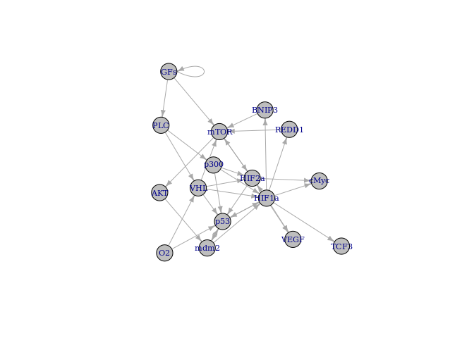<!-- -->

``` r
print(net)
```

    ## Probabilistic Boolean network with 6 genes
    ## 
    ## Involved genes:
    ## EP300 HIF1A MDM2 TP53 VHL O2
    ## 
    ## Transition functions:
    ## 
    ## Alternative transition functions for gene EP300:
    ## EP300 = (!O2) | (!EP300) ( probability: 1, error: 1)
    ## 
    ## Alternative transition functions for gene HIF1A:
    ## HIF1A = (O2) ( probability: 1, error: 0)
    ## 
    ## Alternative transition functions for gene MDM2:
    ## MDM2 = (!MDM2 & TP53) | (!EP300 & MDM2 & !TP53) | (EP300 & !MDM2) ( probability: 0.5, error: 1)
    ## MDM2 = (!MDM2) | (!EP300 & !TP53) ( probability: 0.5, error: 1)
    ## 
    ## Alternative transition functions for gene TP53:
    ## TP53 = (!O2) | (!TP53) ( probability: 1, error: 0)
    ## 
    ## Alternative transition functions for gene VHL:
    ## VHL = (!MDM2 & !O2) | (MDM2 & O2) ( probability: 0.5, error: 0)
    ## VHL = (!MDM2) | (O2) ( probability: 0.5, error: 0)
    ## 
    ## Alternative transition functions for gene O2:
    ## O2 = 0 ( probability: 1, error: 0)
    ## 
    ## Knocked-out and over-expressed genes:
    ## O2 = 0

``` r
# Individual nets of each replica:

net <- reconstructNetwork(breast1x, method="bestfit",returnPBN=TRUE,readableFunctions=TRUE)
plotNetworkWiring(net)
```

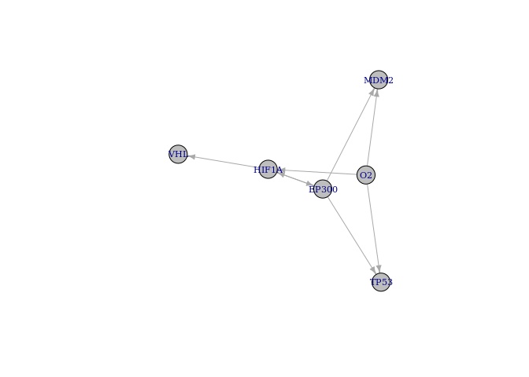<!-- -->

``` r
print(net)
```

    ## Probabilistic Boolean network with 6 genes
    ## 
    ## Involved genes:
    ## EP300 HIF1A MDM2 TP53 VHL O2
    ## 
    ## Transition functions:
    ## 
    ## Alternative transition functions for gene EP300:
    ## EP300 = (HIF1A) ( probability: 1, error: 0)
    ## 
    ## Alternative transition functions for gene HIF1A:
    ## HIF1A = (O2) ( probability: 0.5, error: 0)
    ## HIF1A = (!EP300) ( probability: 0.5, error: 0)
    ## 
    ## Alternative transition functions for gene MDM2:
    ## MDM2 = (!O2) ( probability: 0.5, error: 0)
    ## MDM2 = (EP300) ( probability: 0.5, error: 0)
    ## 
    ## Alternative transition functions for gene TP53:
    ## TP53 = (!O2) ( probability: 0.5, error: 0)
    ## TP53 = (EP300) ( probability: 0.5, error: 0)
    ## 
    ## Alternative transition functions for gene VHL:
    ## VHL = (HIF1A) ( probability: 1, error: 0)
    ## 
    ## Alternative transition functions for gene O2:
    ## O2 = 0 ( probability: 1, error: 0)
    ## 
    ## Knocked-out and over-expressed genes:
    ## O2 = 0

``` r
net <- reconstructNetwork(breast2x, method="bestfit",returnPBN=TRUE,readableFunctions=TRUE)
plotNetworkWiring(net)
```

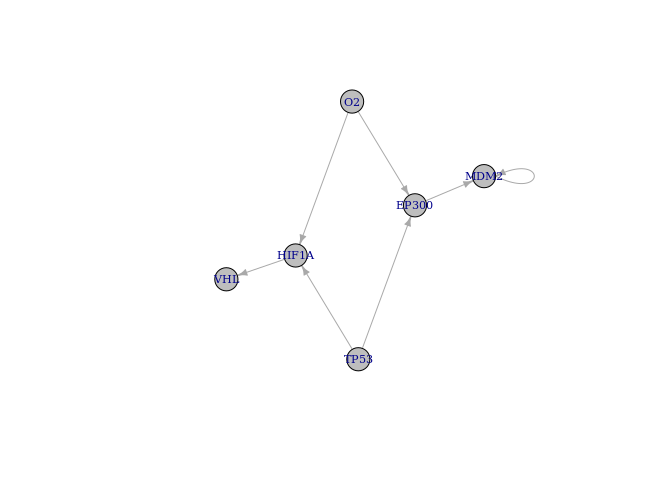<!-- -->

``` r
print(net)
```

    ## Probabilistic Boolean network with 6 genes
    ## 
    ## Involved genes:
    ## EP300 HIF1A MDM2 TP53 VHL O2
    ## 
    ## Transition functions:
    ## 
    ## Alternative transition functions for gene EP300:
    ## EP300 = (!O2) ( probability: 0.5, error: 0)
    ## EP300 = (TP53) ( probability: 0.5, error: 0)
    ## 
    ## Alternative transition functions for gene HIF1A:
    ## HIF1A = (O2) ( probability: 0.5, error: 0)
    ## HIF1A = (!TP53) ( probability: 0.5, error: 0)
    ## 
    ## Alternative transition functions for gene MDM2:
    ## MDM2 = (!MDM2) ( probability: 0.5, error: 0)
    ## MDM2 = (!EP300) ( probability: 0.5, error: 0)
    ## 
    ## Alternative transition functions for gene TP53:
    ## TP53 = 1 ( probability: 1, error: 0)
    ## 
    ## Alternative transition functions for gene VHL:
    ## VHL = (HIF1A) ( probability: 1, error: 0)
    ## 
    ## Alternative transition functions for gene O2:
    ## O2 = 0 ( probability: 1, error: 0)
    ## 
    ## Knocked-out and over-expressed genes:
    ## TP53 = 1
    ## O2 = 0

``` r
net <- reconstructNetwork(breast3x, method="bestfit",returnPBN=TRUE,readableFunctions=TRUE)
plotNetworkWiring(net)
```

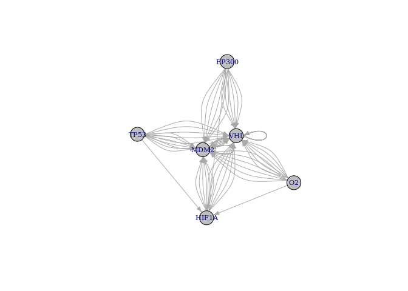<!-- -->

``` r
print(net)
```

    ## Probabilistic Boolean network with 6 genes
    ## 
    ## Involved genes:
    ## EP300 HIF1A MDM2 TP53 VHL O2
    ## 
    ## Transition functions:
    ## 
    ## Alternative transition functions for gene EP300:
    ## EP300 = 1 ( probability: 1, error: 0)
    ## 
    ## Alternative transition functions for gene HIF1A:
    ## HIF1A = (O2) ( probability: 0.3333333, error: 0)
    ## HIF1A = (!TP53) ( probability: 0.3333333, error: 0)
    ## HIF1A = (!EP300) ( probability: 0.3333333, error: 0)
    ## 
    ## Alternative transition functions for gene MDM2:
    ## MDM2 = (!VHL & !O2) | (VHL & O2) ( probability: 0.05555556, error: 0)
    ## MDM2 = (!VHL) | (O2) ( probability: 0.05555556, error: 0)
    ## MDM2 = (!TP53 & VHL) | (TP53 & !VHL) ( probability: 0.05555556, error: 0)
    ## MDM2 = (!VHL) | (!TP53) ( probability: 0.05555556, error: 0)
    ## MDM2 = (!MDM2 & !O2) | (MDM2 & O2) ( probability: 0.05555556, error: 0)
    ## MDM2 = (!MDM2) | (O2) ( probability: 0.05555556, error: 0)
    ## MDM2 = (!MDM2 & TP53) | (MDM2 & !TP53) ( probability: 0.05555556, error: 0)
    ## MDM2 = (!TP53) | (!MDM2) ( probability: 0.05555556, error: 0)
    ## MDM2 = (!HIF1A & !O2) | (HIF1A & O2) ( probability: 0.05555556, error: 0)
    ## MDM2 = (!HIF1A) | (O2) ( probability: 0.05555556, error: 0)
    ## MDM2 = (!HIF1A & TP53) | (HIF1A & !TP53) ( probability: 0.05555556, error: 0)
    ## MDM2 = (!TP53) | (!HIF1A) ( probability: 0.05555556, error: 0)
    ## MDM2 = (!EP300 & VHL) | (EP300 & !VHL) ( probability: 0.05555556, error: 0)
    ## MDM2 = (!VHL) | (!EP300) ( probability: 0.05555556, error: 0)
    ## MDM2 = (!EP300 & MDM2) | (EP300 & !MDM2) ( probability: 0.05555556, error: 0)
    ## MDM2 = (!MDM2) | (!EP300) ( probability: 0.05555556, error: 0)
    ## MDM2 = (!EP300 & HIF1A) | (EP300 & !HIF1A) ( probability: 0.05555556, error: 0)
    ## MDM2 = (!HIF1A) | (!EP300) ( probability: 0.05555556, error: 0)
    ## 
    ## Alternative transition functions for gene TP53:
    ## TP53 = 1 ( probability: 1, error: 0)
    ## 
    ## Alternative transition functions for gene VHL:
    ## VHL = (!VHL & !O2) | (VHL & O2) ( probability: 0.05555556, error: 0)
    ## VHL = (!VHL) | (O2) ( probability: 0.05555556, error: 0)
    ## VHL = (!TP53 & VHL) | (TP53 & !VHL) ( probability: 0.05555556, error: 0)
    ## VHL = (!VHL) | (!TP53) ( probability: 0.05555556, error: 0)
    ## VHL = (!MDM2 & !O2) | (MDM2 & O2) ( probability: 0.05555556, error: 0)
    ## VHL = (!MDM2) | (O2) ( probability: 0.05555556, error: 0)
    ## VHL = (!MDM2 & TP53) | (MDM2 & !TP53) ( probability: 0.05555556, error: 0)
    ## VHL = (!TP53) | (!MDM2) ( probability: 0.05555556, error: 0)
    ## VHL = (!HIF1A & !O2) | (HIF1A & O2) ( probability: 0.05555556, error: 0)
    ## VHL = (!HIF1A) | (O2) ( probability: 0.05555556, error: 0)
    ## VHL = (!HIF1A & TP53) | (HIF1A & !TP53) ( probability: 0.05555556, error: 0)
    ## VHL = (!TP53) | (!HIF1A) ( probability: 0.05555556, error: 0)
    ## VHL = (!EP300 & VHL) | (EP300 & !VHL) ( probability: 0.05555556, error: 0)
    ## VHL = (!VHL) | (!EP300) ( probability: 0.05555556, error: 0)
    ## VHL = (!EP300 & MDM2) | (EP300 & !MDM2) ( probability: 0.05555556, error: 0)
    ## VHL = (!MDM2) | (!EP300) ( probability: 0.05555556, error: 0)
    ## VHL = (!EP300 & HIF1A) | (EP300 & !HIF1A) ( probability: 0.05555556, error: 0)
    ## VHL = (!HIF1A) | (!EP300) ( probability: 0.05555556, error: 0)
    ## 
    ## Alternative transition functions for gene O2:
    ## O2 = 0 ( probability: 1, error: 0)
    ## 
    ## Knocked-out and over-expressed genes:
    ## EP300 = 1
    ## TP53 = 1
    ## O2 = 0

# HepG2 hepatoma

``` r
hepatoma1x <- 
exp.EGEOD18494.hif %>% 
  dplyr::select(c(data.EGEOD18494$codes[data.EGEOD18494$cell_line == "HepG2 hepatoma" &
                  data.EGEOD18494$rep == 1], "symbol"))  %>% 
  binNet(.) 
hepatoma1x
```

<div data-pagedtable="false">

<script data-pagedtable-source type="application/json">
{"columns":[{"label":[""],"name":["_rn_"],"type":[""],"align":["left"]},{"label":["norm.control.H.1"],"name":[1],"type":["chr"],"align":["left"]},{"label":["hypo.4h.H.1"],"name":[2],"type":["chr"],"align":["left"]},{"label":["hypo.8h.H.1"],"name":[3],"type":["chr"],"align":["left"]},{"label":["hypo.12h.H.1"],"name":[4],"type":["chr"],"align":["left"]}],"data":[{"1":"1","2":"1","3":"0","4":"0","_rn_":"EP300"},{"1":"0","2":"0","3":"1","4":"0","_rn_":"HIF1A"},{"1":"1","2":"1","3":"0","4":"1","_rn_":"MDM2"},{"1":"1","2":"1","3":"0","4":"1","_rn_":"TP53"},{"1":"1","2":"0","3":"1","4":"0","_rn_":"VHL"},{"1":"1","2":"0","3":"0","4":"0","_rn_":"O2"}],"options":{"columns":{"min":{},"max":[10]},"rows":{"min":[10],"max":[10]},"pages":{}}}
  </script>

</div>

``` r
hepatoma2x <- 
exp.EGEOD18494.hif %>% 
  dplyr::select(c(data.EGEOD18494$codes[data.EGEOD18494$cell_line == "HepG2 hepatoma" &
                  data.EGEOD18494$rep == 2], "symbol"))  %>% 
  binNet(.) 
hepatoma2x
```

<div data-pagedtable="false">

<script data-pagedtable-source type="application/json">
{"columns":[{"label":[""],"name":["_rn_"],"type":[""],"align":["left"]},{"label":["norm.control.H.2"],"name":[1],"type":["chr"],"align":["left"]},{"label":["hypo.4h.H.2"],"name":[2],"type":["chr"],"align":["left"]},{"label":["hypo.8h.H.2"],"name":[3],"type":["chr"],"align":["left"]},{"label":["hypo.12h.H.2"],"name":[4],"type":["chr"],"align":["left"]}],"data":[{"1":"0","2":"1","3":"1","4":"1","_rn_":"EP300"},{"1":"0","2":"0","3":"1","4":"0","_rn_":"HIF1A"},{"1":"0","2":"1","3":"1","4":"1","_rn_":"MDM2"},{"1":"0","2":"1","3":"1","4":"0","_rn_":"TP53"},{"1":"1","2":"0","3":"1","4":"1","_rn_":"VHL"},{"1":"1","2":"0","3":"0","4":"0","_rn_":"O2"}],"options":{"columns":{"min":{},"max":[10]},"rows":{"min":[10],"max":[10]},"pages":{}}}
  </script>

</div>

``` r
hepatoma3x <- 
exp.EGEOD18494.hif %>% 
  dplyr::select(c(data.EGEOD18494$codes[data.EGEOD18494$cell_line == "HepG2 hepatoma" &
                  data.EGEOD18494$rep == 3], "symbol"))  %>% 
  binNet(.) 
hepatoma3x
```

<div data-pagedtable="false">

<script data-pagedtable-source type="application/json">
{"columns":[{"label":[""],"name":["_rn_"],"type":[""],"align":["left"]},{"label":["norm.control.H.3"],"name":[1],"type":["chr"],"align":["left"]},{"label":["hypo.4h.H.3"],"name":[2],"type":["chr"],"align":["left"]},{"label":["hypo.8h.H.3"],"name":[3],"type":["chr"],"align":["left"]},{"label":["hypo.12h.H.3"],"name":[4],"type":["chr"],"align":["left"]}],"data":[{"1":"1","2":"1","3":"0","4":"1","_rn_":"EP300"},{"1":"0","2":"1","3":"1","4":"0","_rn_":"HIF1A"},{"1":"0","2":"1","3":"0","4":"1","_rn_":"MDM2"},{"1":"1","2":"1","3":"1","4":"1","_rn_":"TP53"},{"1":"1","2":"1","3":"0","4":"0","_rn_":"VHL"},{"1":"1","2":"0","3":"0","4":"0","_rn_":"O2"}],"options":{"columns":{"min":{},"max":[10]},"rows":{"min":[10],"max":[10]},"pages":{}}}
  </script>

</div>

``` r
# All nets hepatoma merged:

net <- reconstructNetwork(list(hepatoma1x, hepatoma2x, hepatoma3x), method="bestfit",returnPBN=TRUE,readableFunctions=TRUE)
plotNetworkWiring(net)
```

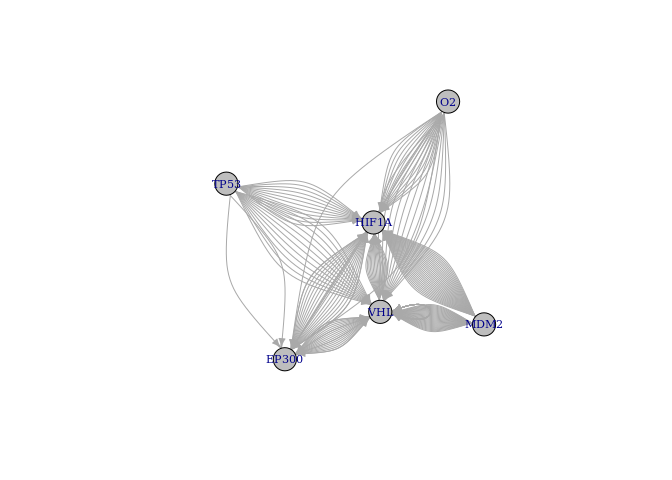<!-- -->

``` r
print(net)
```

    ## Probabilistic Boolean network with 6 genes
    ## 
    ## Involved genes:
    ## EP300 HIF1A MDM2 TP53 VHL O2
    ## 
    ## Transition functions:
    ## 
    ## Alternative transition functions for gene EP300:
    ## EP300 = (!VHL & !O2) | (VHL & O2) ( probability: 0.1666667, error: 2)
    ## EP300 = (!VHL) | (O2) ( probability: 0.1666667, error: 2)
    ## EP300 = (O2) | (TP53) ( probability: 0.1666667, error: 2)
    ## EP300 = (!HIF1A & VHL) | (HIF1A & !VHL) ( probability: 0.1666667, error: 2)
    ## EP300 = (!VHL) | (!HIF1A) ( probability: 0.1666667, error: 2)
    ## EP300 = (!HIF1A) | (TP53) ( probability: 0.1666667, error: 2)
    ## 
    ## Alternative transition functions for gene HIF1A:
    ## HIF1A = (!MDM2 & TP53 & O2) | (MDM2 & TP53 & !O2) ( probability: 0.03571429, error: 1)
    ## HIF1A = (!MDM2 & TP53 & O2) | (MDM2 & !TP53 & O2) | (MDM2 & TP53 & !O2) ( probability: 0.03571429, error: 1)
    ## HIF1A = (!MDM2 & TP53 & O2) | (MDM2 & !O2) ( probability: 0.03571429, error: 1)
    ## HIF1A = (!MDM2 & TP53 & O2) | (MDM2 & !O2) | (MDM2 & !TP53) ( probability: 0.03571429, error: 1)
    ## HIF1A = (!MDM2 & TP53 & VHL) | (MDM2 & TP53 & !VHL) ( probability: 0.03571429, error: 1)
    ## HIF1A = (!MDM2 & TP53 & VHL) | (MDM2 & !TP53 & VHL) | (MDM2 & TP53 & !VHL) ( probability: 0.03571429, error: 1)
    ## HIF1A = (!MDM2 & TP53 & VHL) | (MDM2 & !VHL) ( probability: 0.03571429, error: 1)
    ## HIF1A = (!MDM2 & TP53 & VHL) | (MDM2 & !VHL) | (MDM2 & !TP53) ( probability: 0.03571429, error: 1)
    ## HIF1A = (!MDM2 & !TP53 & !VHL) | (!MDM2 & TP53 & VHL) | (MDM2 & TP53 & !VHL) ( probability: 0.03571429, error: 1)
    ## HIF1A = (!MDM2 & !TP53 & !VHL) | (!MDM2 & TP53 & VHL) | (MDM2 & !TP53 & VHL) | (MDM2 & TP53 & !VHL) ( probability: 0.03571429, error: 1)
    ## HIF1A = (!TP53 & !VHL) | (!MDM2 & TP53 & VHL) | (MDM2 & !VHL) ( probability: 0.03571429, error: 1)
    ## HIF1A = (!TP53 & !VHL) | (!MDM2 & TP53 & VHL) | (MDM2 & !TP53) | (MDM2 & !VHL) ( probability: 0.03571429, error: 1)
    ## HIF1A = (EP300 & !MDM2 & O2) | (EP300 & MDM2 & !O2) ( probability: 0.03571429, error: 1)
    ## HIF1A = (EP300 & !O2) | (EP300 & !MDM2) ( probability: 0.03571429, error: 1)
    ## HIF1A = (!EP300 & MDM2 & O2) | (EP300 & !MDM2 & O2) | (EP300 & MDM2 & !O2) ( probability: 0.03571429, error: 1)
    ## HIF1A = (!EP300 & MDM2 & O2) | (EP300 & !O2) | (EP300 & !MDM2) ( probability: 0.03571429, error: 1)
    ## HIF1A = (MDM2 & !O2) | (EP300 & !MDM2 & O2) ( probability: 0.03571429, error: 1)
    ## HIF1A = (MDM2 & !O2) | (EP300 & !O2) | (EP300 & !MDM2) ( probability: 0.03571429, error: 1)
    ## HIF1A = (MDM2 & !O2) | (!EP300 & MDM2) | (EP300 & !MDM2 & O2) ( probability: 0.03571429, error: 1)
    ## HIF1A = (MDM2 & !O2) | (!EP300 & MDM2) | (EP300 & !O2) | (EP300 & !MDM2) ( probability: 0.03571429, error: 1)
    ## HIF1A = (EP300 & !MDM2 & VHL) | (EP300 & MDM2 & !VHL) ( probability: 0.03571429, error: 1)
    ## HIF1A = (EP300 & !VHL) | (EP300 & !MDM2) ( probability: 0.03571429, error: 1)
    ## HIF1A = (!EP300 & MDM2 & VHL) | (EP300 & !MDM2 & VHL) | (EP300 & MDM2 & !VHL) ( probability: 0.03571429, error: 1)
    ## HIF1A = (!EP300 & MDM2 & VHL) | (EP300 & !VHL) | (EP300 & !MDM2) ( probability: 0.03571429, error: 1)
    ## HIF1A = (MDM2 & !VHL) | (EP300 & !MDM2 & VHL) ( probability: 0.03571429, error: 1)
    ## HIF1A = (MDM2 & !VHL) | (EP300 & !VHL) | (EP300 & !MDM2) ( probability: 0.03571429, error: 1)
    ## HIF1A = (MDM2 & !VHL) | (!EP300 & MDM2) | (EP300 & !MDM2 & VHL) ( probability: 0.03571429, error: 1)
    ## HIF1A = (MDM2 & !VHL) | (!EP300 & MDM2) | (EP300 & !VHL) | (EP300 & !MDM2) ( probability: 0.03571429, error: 1)
    ## 
    ## Alternative transition functions for gene MDM2:
    ## MDM2 = 1 ( probability: 1, error: 2)
    ## 
    ## Alternative transition functions for gene TP53:
    ## TP53 = 1 ( probability: 1, error: 2)
    ## 
    ## Alternative transition functions for gene VHL:
    ## VHL = (!MDM2 & TP53 & O2) | (MDM2 & TP53 & !O2) ( probability: 0.03571429, error: 1)
    ## VHL = (!MDM2 & TP53 & O2) | (MDM2 & !TP53 & O2) | (MDM2 & TP53 & !O2) ( probability: 0.03571429, error: 1)
    ## VHL = (!MDM2 & TP53 & O2) | (MDM2 & !O2) ( probability: 0.03571429, error: 1)
    ## VHL = (!MDM2 & TP53 & O2) | (MDM2 & !O2) | (MDM2 & !TP53) ( probability: 0.03571429, error: 1)
    ## VHL = (!MDM2 & TP53 & VHL) | (MDM2 & TP53 & !VHL) ( probability: 0.03571429, error: 1)
    ## VHL = (!MDM2 & TP53 & VHL) | (MDM2 & !TP53 & VHL) | (MDM2 & TP53 & !VHL) ( probability: 0.03571429, error: 1)
    ## VHL = (!MDM2 & TP53 & VHL) | (MDM2 & !VHL) ( probability: 0.03571429, error: 1)
    ## VHL = (!MDM2 & TP53 & VHL) | (MDM2 & !VHL) | (MDM2 & !TP53) ( probability: 0.03571429, error: 1)
    ## VHL = (!MDM2 & !TP53 & !VHL) | (!MDM2 & TP53 & VHL) | (MDM2 & TP53 & !VHL) ( probability: 0.03571429, error: 1)
    ## VHL = (!MDM2 & !TP53 & !VHL) | (!MDM2 & TP53 & VHL) | (MDM2 & !TP53 & VHL) | (MDM2 & TP53 & !VHL) ( probability: 0.03571429, error: 1)
    ## VHL = (!TP53 & !VHL) | (!MDM2 & TP53 & VHL) | (MDM2 & !VHL) ( probability: 0.03571429, error: 1)
    ## VHL = (!TP53 & !VHL) | (!MDM2 & TP53 & VHL) | (MDM2 & !TP53) | (MDM2 & !VHL) ( probability: 0.03571429, error: 1)
    ## VHL = (EP300 & !MDM2 & O2) | (EP300 & MDM2 & !O2) ( probability: 0.03571429, error: 1)
    ## VHL = (EP300 & !O2) | (EP300 & !MDM2) ( probability: 0.03571429, error: 1)
    ## VHL = (!EP300 & MDM2 & O2) | (EP300 & !MDM2 & O2) | (EP300 & MDM2 & !O2) ( probability: 0.03571429, error: 1)
    ## VHL = (!EP300 & MDM2 & O2) | (EP300 & !O2) | (EP300 & !MDM2) ( probability: 0.03571429, error: 1)
    ## VHL = (MDM2 & !O2) | (EP300 & !MDM2 & O2) ( probability: 0.03571429, error: 1)
    ## VHL = (MDM2 & !O2) | (EP300 & !O2) | (EP300 & !MDM2) ( probability: 0.03571429, error: 1)
    ## VHL = (MDM2 & !O2) | (!EP300 & MDM2) | (EP300 & !MDM2 & O2) ( probability: 0.03571429, error: 1)
    ## VHL = (MDM2 & !O2) | (!EP300 & MDM2) | (EP300 & !O2) | (EP300 & !MDM2) ( probability: 0.03571429, error: 1)
    ## VHL = (EP300 & !MDM2 & VHL) | (EP300 & MDM2 & !VHL) ( probability: 0.03571429, error: 1)
    ## VHL = (EP300 & !VHL) | (EP300 & !MDM2) ( probability: 0.03571429, error: 1)
    ## VHL = (!EP300 & MDM2 & VHL) | (EP300 & !MDM2 & VHL) | (EP300 & MDM2 & !VHL) ( probability: 0.03571429, error: 1)
    ## VHL = (!EP300 & MDM2 & VHL) | (EP300 & !VHL) | (EP300 & !MDM2) ( probability: 0.03571429, error: 1)
    ## VHL = (MDM2 & !VHL) | (EP300 & !MDM2 & VHL) ( probability: 0.03571429, error: 1)
    ## VHL = (MDM2 & !VHL) | (EP300 & !VHL) | (EP300 & !MDM2) ( probability: 0.03571429, error: 1)
    ## VHL = (MDM2 & !VHL) | (!EP300 & MDM2) | (EP300 & !MDM2 & VHL) ( probability: 0.03571429, error: 1)
    ## VHL = (MDM2 & !VHL) | (!EP300 & MDM2) | (EP300 & !VHL) | (EP300 & !MDM2) ( probability: 0.03571429, error: 1)
    ## 
    ## Alternative transition functions for gene O2:
    ## O2 = 0 ( probability: 1, error: 0)
    ## 
    ## Knocked-out and over-expressed genes:
    ## MDM2 = 1
    ## TP53 = 1
    ## O2 = 0

``` r
# Individual nets of each replica:

net <- reconstructNetwork(hepatoma1x, method="bestfit",returnPBN=TRUE,readableFunctions=TRUE)
plotNetworkWiring(net)
```

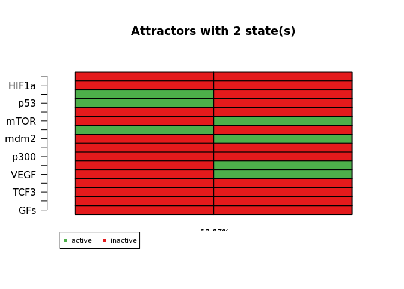<!-- -->

``` r
print(net)
```

    ## Probabilistic Boolean network with 6 genes
    ## 
    ## Involved genes:
    ## EP300 HIF1A MDM2 TP53 VHL O2
    ## 
    ## Transition functions:
    ## 
    ## Alternative transition functions for gene EP300:
    ## EP300 = (O2) ( probability: 1, error: 0)
    ## 
    ## Alternative transition functions for gene HIF1A:
    ## HIF1A = (!VHL) ( probability: 1, error: 0)
    ## 
    ## Alternative transition functions for gene MDM2:
    ## MDM2 = (VHL) ( probability: 1, error: 0)
    ## 
    ## Alternative transition functions for gene TP53:
    ## TP53 = (VHL) ( probability: 1, error: 0)
    ## 
    ## Alternative transition functions for gene VHL:
    ## VHL = (!VHL) ( probability: 1, error: 0)
    ## 
    ## Alternative transition functions for gene O2:
    ## O2 = 0 ( probability: 1, error: 0)
    ## 
    ## Knocked-out and over-expressed genes:
    ## O2 = 0

``` r
net <- reconstructNetwork(hepatoma2x, method="bestfit",returnPBN=TRUE,readableFunctions=TRUE)
plotNetworkWiring(net)
```

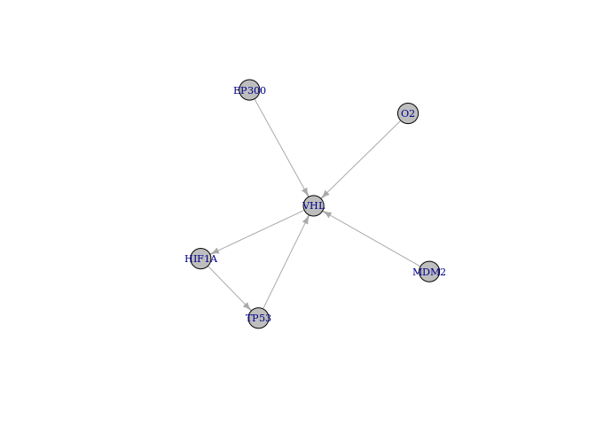<!-- -->

``` r
print(net)
```

    ## Probabilistic Boolean network with 6 genes
    ## 
    ## Involved genes:
    ## EP300 HIF1A MDM2 TP53 VHL O2
    ## 
    ## Transition functions:
    ## 
    ## Alternative transition functions for gene EP300:
    ## EP300 = 1 ( probability: 1, error: 0)
    ## 
    ## Alternative transition functions for gene HIF1A:
    ## HIF1A = (!VHL) ( probability: 1, error: 0)
    ## 
    ## Alternative transition functions for gene MDM2:
    ## MDM2 = 1 ( probability: 1, error: 0)
    ## 
    ## Alternative transition functions for gene TP53:
    ## TP53 = (!HIF1A) ( probability: 1, error: 0)
    ## 
    ## Alternative transition functions for gene VHL:
    ## VHL = (!O2) ( probability: 0.25, error: 0)
    ## VHL = (TP53) ( probability: 0.25, error: 0)
    ## VHL = (MDM2) ( probability: 0.25, error: 0)
    ## VHL = (EP300) ( probability: 0.25, error: 0)
    ## 
    ## Alternative transition functions for gene O2:
    ## O2 = 0 ( probability: 1, error: 0)
    ## 
    ## Knocked-out and over-expressed genes:
    ## EP300 = 1
    ## MDM2 = 1
    ## O2 = 0

``` r
net <- reconstructNetwork(hepatoma3x, method="bestfit",returnPBN=TRUE,readableFunctions=TRUE)
plotNetworkWiring(net)
```

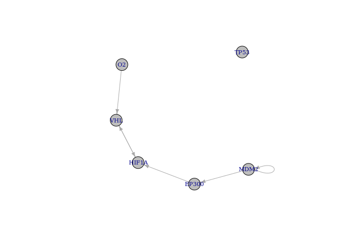<!-- -->

``` r
print(net)
```

    ## Probabilistic Boolean network with 6 genes
    ## 
    ## Involved genes:
    ## EP300 HIF1A MDM2 TP53 VHL O2
    ## 
    ## Transition functions:
    ## 
    ## Alternative transition functions for gene EP300:
    ## EP300 = (!MDM2) ( probability: 1, error: 0)
    ## 
    ## Alternative transition functions for gene HIF1A:
    ## HIF1A = (VHL) ( probability: 0.5, error: 0)
    ## HIF1A = (EP300) ( probability: 0.5, error: 0)
    ## 
    ## Alternative transition functions for gene MDM2:
    ## MDM2 = (!MDM2) ( probability: 1, error: 0)
    ## 
    ## Alternative transition functions for gene TP53:
    ## TP53 = 1 ( probability: 1, error: 0)
    ## 
    ## Alternative transition functions for gene VHL:
    ## VHL = (O2) ( probability: 0.5, error: 0)
    ## VHL = (!HIF1A) ( probability: 0.5, error: 0)
    ## 
    ## Alternative transition functions for gene O2:
    ## O2 = 0 ( probability: 1, error: 0)
    ## 
    ## Knocked-out and over-expressed genes:
    ## TP53 = 1
    ## O2 = 0

# U87 glioma

``` r
glioma1x <- 
exp.EGEOD18494.hif %>% 
  dplyr::select(c(data.EGEOD18494$codes[data.EGEOD18494$cell_line == "U87 glioma" &
                  data.EGEOD18494$rep == 1], "symbol"))  %>% 
  binNet(.) 
glioma1x
```

<div data-pagedtable="false">

<script data-pagedtable-source type="application/json">
{"columns":[{"label":[""],"name":["_rn_"],"type":[""],"align":["left"]},{"label":["norm.control.U.1"],"name":[1],"type":["chr"],"align":["left"]},{"label":["hypo.4h.U.1"],"name":[2],"type":["chr"],"align":["left"]},{"label":["hypo.8h.U.1"],"name":[3],"type":["chr"],"align":["left"]},{"label":["hypo.12h.U.1"],"name":[4],"type":["chr"],"align":["left"]}],"data":[{"1":"1","2":"0","3":"0","4":"1","_rn_":"EP300"},{"1":"1","2":"0","3":"0","4":"0","_rn_":"HIF1A"},{"1":"1","2":"0","3":"0","4":"0","_rn_":"MDM2"},{"1":"1","2":"0","3":"1","4":"1","_rn_":"TP53"},{"1":"1","2":"1","3":"0","4":"1","_rn_":"VHL"},{"1":"1","2":"0","3":"0","4":"0","_rn_":"O2"}],"options":{"columns":{"min":{},"max":[10]},"rows":{"min":[10],"max":[10]},"pages":{}}}
  </script>

</div>

``` r
glioma2x <- 
exp.EGEOD18494.hif %>% 
  dplyr::select(c(data.EGEOD18494$codes[data.EGEOD18494$cell_line == "U87 glioma" &
                  data.EGEOD18494$rep == 2], "symbol"))  %>% 
  binNet(.) 
glioma2x
```

<div data-pagedtable="false">

<script data-pagedtable-source type="application/json">
{"columns":[{"label":[""],"name":["_rn_"],"type":[""],"align":["left"]},{"label":["norm.control.U.2"],"name":[1],"type":["chr"],"align":["left"]},{"label":["hypo.4h.U.2"],"name":[2],"type":["chr"],"align":["left"]},{"label":["hypo.8h.U.2"],"name":[3],"type":["chr"],"align":["left"]},{"label":["hypo.12h.U.2"],"name":[4],"type":["chr"],"align":["left"]}],"data":[{"1":"1","2":"0","3":"1","4":"0","_rn_":"EP300"},{"1":"1","2":"1","3":"0","4":"0","_rn_":"HIF1A"},{"1":"0","2":"0","3":"0","4":"1","_rn_":"MDM2"},{"1":"1","2":"0","3":"1","4":"0","_rn_":"TP53"},{"1":"0","2":"1","3":"1","4":"0","_rn_":"VHL"},{"1":"1","2":"0","3":"0","4":"0","_rn_":"O2"}],"options":{"columns":{"min":{},"max":[10]},"rows":{"min":[10],"max":[10]},"pages":{}}}
  </script>

</div>

``` r
glioma3x <- 
exp.EGEOD18494.hif %>% 
  dplyr::select(c(data.EGEOD18494$codes[data.EGEOD18494$cell_line == "U87 glioma" &
                  data.EGEOD18494$rep == 3], "symbol"))  %>% 
  binNet(.) 
glioma3x
```

<div data-pagedtable="false">

<script data-pagedtable-source type="application/json">
{"columns":[{"label":[""],"name":["_rn_"],"type":[""],"align":["left"]},{"label":["norm.control.U.3"],"name":[1],"type":["chr"],"align":["left"]},{"label":["hypo.4h.U.3"],"name":[2],"type":["chr"],"align":["left"]},{"label":["hypo.8h.U.3"],"name":[3],"type":["chr"],"align":["left"]},{"label":["hypo.12h.U.3"],"name":[4],"type":["chr"],"align":["left"]}],"data":[{"1":"1","2":"1","3":"1","4":"0","_rn_":"EP300"},{"1":"1","2":"1","3":"0","4":"0","_rn_":"HIF1A"},{"1":"1","2":"1","3":"1","4":"0","_rn_":"MDM2"},{"1":"1","2":"1","3":"1","4":"1","_rn_":"TP53"},{"1":"1","2":"0","3":"1","4":"1","_rn_":"VHL"},{"1":"1","2":"0","3":"0","4":"0","_rn_":"O2"}],"options":{"columns":{"min":{},"max":[10]},"rows":{"min":[10],"max":[10]},"pages":{}}}
  </script>

</div>

``` r
# All glioma nets merged:

net <- reconstructNetwork(list(glioma1x, glioma2x, glioma3x), method="bestfit",returnPBN=TRUE,readableFunctions=TRUE)
plotNetworkWiring(net)
```

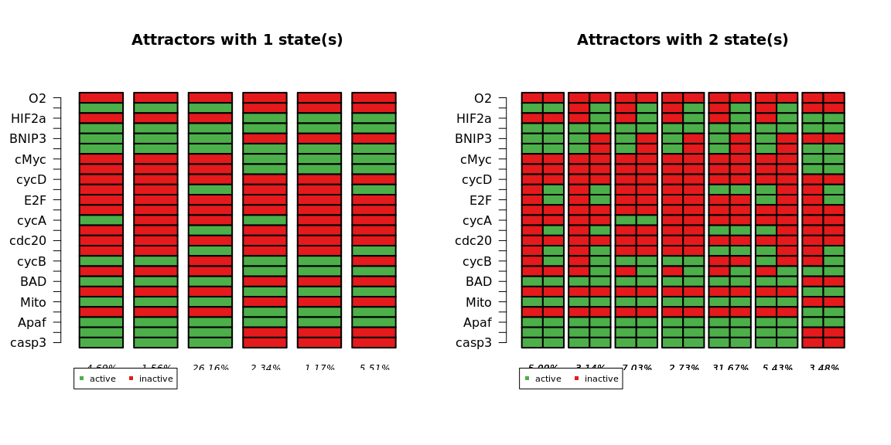<!-- -->

``` r
print(net)
```

    ## Probabilistic Boolean network with 6 genes
    ## 
    ## Involved genes:
    ## EP300 HIF1A MDM2 TP53 VHL O2
    ## 
    ## Transition functions:
    ## 
    ## Alternative transition functions for gene EP300:
    ## EP300 = (!VHL & !O2) | (HIF1A & !O2) ( probability: 0.08333333, error: 1)
    ## EP300 = (!VHL & !O2) | (HIF1A & !O2) | (HIF1A & VHL) ( probability: 0.08333333, error: 1)
    ## EP300 = (!VHL & !O2) | (!HIF1A & VHL & O2) | (HIF1A & !O2) ( probability: 0.08333333, error: 1)
    ## EP300 = (!VHL & !O2) | (VHL & O2) | (HIF1A & !O2) ( probability: 0.08333333, error: 1)
    ## EP300 = (!VHL & !O2) | (!HIF1A & !VHL) | (HIF1A & !O2) ( probability: 0.08333333, error: 1)
    ## EP300 = (!VHL & !O2) | (!HIF1A & !VHL) | (HIF1A & !O2) | (HIF1A & VHL) ( probability: 0.08333333, error: 1)
    ## EP300 = (!VHL & !O2) | (!HIF1A & O2) | (HIF1A & !O2) ( probability: 0.08333333, error: 1)
    ## EP300 = (!VHL & !O2) | (!HIF1A & O2) | (HIF1A & !O2) | (VHL & O2) ( probability: 0.08333333, error: 1)
    ## EP300 = (!HIF1A & !MDM2 & !VHL) | (HIF1A & !MDM2 & VHL) | (HIF1A & MDM2 & !VHL) ( probability: 0.08333333, error: 1)
    ## EP300 = (!HIF1A & !MDM2 & !VHL) | (HIF1A & VHL) | (HIF1A & MDM2) ( probability: 0.08333333, error: 1)
    ## EP300 = (!HIF1A & !VHL) | (HIF1A & !MDM2 & VHL) | (MDM2 & !VHL) ( probability: 0.08333333, error: 1)
    ## EP300 = (!HIF1A & !VHL) | (HIF1A & VHL) | (MDM2 & !VHL) ( probability: 0.08333333, error: 1)
    ## 
    ## Alternative transition functions for gene HIF1A:
    ## HIF1A = (O2) ( probability: 1, error: 1)
    ## 
    ## Alternative transition functions for gene MDM2:
    ## MDM2 = (!MDM2 & TP53 & VHL) | (MDM2 & TP53 & !VHL) ( probability: 0.0625, error: 1)
    ## MDM2 = (!MDM2 & TP53 & VHL) | (MDM2 & !TP53 & VHL) | (MDM2 & TP53 & !VHL) ( probability: 0.0625, error: 1)
    ## MDM2 = (!MDM2 & TP53 & VHL) | (MDM2 & !VHL) ( probability: 0.0625, error: 1)
    ## MDM2 = (!MDM2 & TP53 & VHL) | (MDM2 & !VHL) | (MDM2 & !TP53) ( probability: 0.0625, error: 1)
    ## MDM2 = (!MDM2 & !TP53 & !VHL) | (!MDM2 & TP53 & VHL) | (MDM2 & TP53 & !VHL) ( probability: 0.0625, error: 1)
    ## MDM2 = (!MDM2 & !TP53 & !VHL) | (!MDM2 & TP53 & VHL) | (MDM2 & !TP53 & VHL) | (MDM2 & TP53 & !VHL) ( probability: 0.0625, error: 1)
    ## MDM2 = (!TP53 & !VHL) | (!MDM2 & TP53 & VHL) | (MDM2 & !VHL) ( probability: 0.0625, error: 1)
    ## MDM2 = (!TP53 & !VHL) | (!MDM2 & TP53 & VHL) | (MDM2 & !TP53) | (MDM2 & !VHL) ( probability: 0.0625, error: 1)
    ## MDM2 = (EP300 & !MDM2 & VHL) | (EP300 & MDM2 & !VHL) ( probability: 0.0625, error: 1)
    ## MDM2 = (!EP300 & MDM2 & VHL) | (EP300 & !MDM2 & VHL) | (EP300 & MDM2 & !VHL) ( probability: 0.0625, error: 1)
    ## MDM2 = (MDM2 & !VHL) | (EP300 & !MDM2 & VHL) ( probability: 0.0625, error: 1)
    ## MDM2 = (MDM2 & !VHL) | (!EP300 & MDM2) | (EP300 & !MDM2 & VHL) ( probability: 0.0625, error: 1)
    ## MDM2 = (EP300 & !HIF1A & !MDM2) | (EP300 & HIF1A & MDM2) ( probability: 0.0625, error: 1)
    ## MDM2 = (HIF1A & MDM2) | (EP300 & !HIF1A & !MDM2) ( probability: 0.0625, error: 1)
    ## MDM2 = (!EP300 & !HIF1A & MDM2) | (EP300 & !HIF1A & !MDM2) | (EP300 & HIF1A & MDM2) ( probability: 0.0625, error: 1)
    ## MDM2 = (!EP300 & MDM2) | (EP300 & !HIF1A & !MDM2) | (HIF1A & MDM2) ( probability: 0.0625, error: 1)
    ## 
    ## Alternative transition functions for gene TP53:
    ## TP53 = (!EP300 & !MDM2) | (EP300 & MDM2) ( probability: 0.5, error: 1)
    ## TP53 = (!EP300) | (MDM2) ( probability: 0.5, error: 1)
    ## 
    ## Alternative transition functions for gene VHL:
    ## VHL = (!MDM2 & !VHL) | (!HIF1A & MDM2 & VHL) | (HIF1A & !MDM2) | (HIF1A & !VHL) ( probability: 0.25, error: 1)
    ## VHL = (!MDM2 & !VHL) | (MDM2 & VHL) | (HIF1A) ( probability: 0.25, error: 1)
    ## VHL = (!VHL) | (!HIF1A & MDM2) | (HIF1A & !MDM2) ( probability: 0.25, error: 1)
    ## VHL = (!VHL) | (MDM2) | (HIF1A) ( probability: 0.25, error: 1)
    ## 
    ## Alternative transition functions for gene O2:
    ## O2 = 0 ( probability: 1, error: 0)
    ## 
    ## Knocked-out and over-expressed genes:
    ## O2 = 0

``` r
# Individual nets of each replica:

net <- reconstructNetwork(glioma1x, method="bestfit",returnPBN=TRUE,readableFunctions=TRUE)
plotNetworkWiring(net)
```

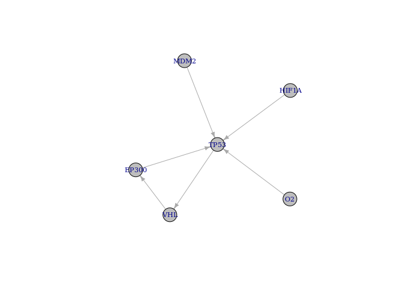<!-- -->

``` r
print(net)
```

    ## Probabilistic Boolean network with 6 genes
    ## 
    ## Involved genes:
    ## EP300 HIF1A MDM2 TP53 VHL O2
    ## 
    ## Transition functions:
    ## 
    ## Alternative transition functions for gene EP300:
    ## EP300 = (!VHL) ( probability: 1, error: 0)
    ## 
    ## Alternative transition functions for gene HIF1A:
    ## HIF1A = 0 ( probability: 1, error: 0)
    ## 
    ## Alternative transition functions for gene MDM2:
    ## MDM2 = 0 ( probability: 1, error: 0)
    ## 
    ## Alternative transition functions for gene TP53:
    ## TP53 = (!O2) ( probability: 0.25, error: 0)
    ## TP53 = (!MDM2) ( probability: 0.25, error: 0)
    ## TP53 = (!HIF1A) ( probability: 0.25, error: 0)
    ## TP53 = (!EP300) ( probability: 0.25, error: 0)
    ## 
    ## Alternative transition functions for gene VHL:
    ## VHL = (TP53) ( probability: 1, error: 0)
    ## 
    ## Alternative transition functions for gene O2:
    ## O2 = 0 ( probability: 1, error: 0)
    ## 
    ## Knocked-out and over-expressed genes:
    ## HIF1A = 0
    ## MDM2 = 0
    ## O2 = 0

``` r
net <- reconstructNetwork(glioma2x, method="bestfit",returnPBN=TRUE,readableFunctions=TRUE)
plotNetworkWiring(net)
```

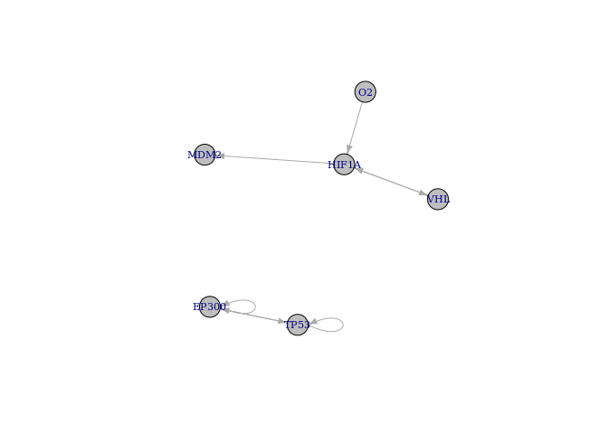<!-- -->

``` r
print(net)
```

    ## Probabilistic Boolean network with 6 genes
    ## 
    ## Involved genes:
    ## EP300 HIF1A MDM2 TP53 VHL O2
    ## 
    ## Transition functions:
    ## 
    ## Alternative transition functions for gene EP300:
    ## EP300 = (!TP53) ( probability: 0.5, error: 0)
    ## EP300 = (!EP300) ( probability: 0.5, error: 0)
    ## 
    ## Alternative transition functions for gene HIF1A:
    ## HIF1A = (O2) ( probability: 0.5, error: 0)
    ## HIF1A = (!VHL) ( probability: 0.5, error: 0)
    ## 
    ## Alternative transition functions for gene MDM2:
    ## MDM2 = (!HIF1A) ( probability: 1, error: 0)
    ## 
    ## Alternative transition functions for gene TP53:
    ## TP53 = (!TP53) ( probability: 0.5, error: 0)
    ## TP53 = (!EP300) ( probability: 0.5, error: 0)
    ## 
    ## Alternative transition functions for gene VHL:
    ## VHL = (HIF1A) ( probability: 1, error: 0)
    ## 
    ## Alternative transition functions for gene O2:
    ## O2 = 0 ( probability: 1, error: 0)
    ## 
    ## Knocked-out and over-expressed genes:
    ## O2 = 0

``` r
net <- reconstructNetwork(glioma3x, method="bestfit",returnPBN=TRUE,readableFunctions=TRUE)
plotNetworkWiring(net)
```

<!-- -->

``` r
print(net)
```

    ## Probabilistic Boolean network with 6 genes
    ## 
    ## Involved genes:
    ## EP300 HIF1A MDM2 TP53 VHL O2
    ## 
    ## Transition functions:
    ## 
    ## Alternative transition functions for gene EP300:
    ## EP300 = (HIF1A) ( probability: 1, error: 0)
    ## 
    ## Alternative transition functions for gene HIF1A:
    ## HIF1A = (O2) ( probability: 1, error: 0)
    ## 
    ## Alternative transition functions for gene MDM2:
    ## MDM2 = (HIF1A) ( probability: 1, error: 0)
    ## 
    ## Alternative transition functions for gene TP53:
    ## TP53 = 1 ( probability: 1, error: 0)
    ## 
    ## Alternative transition functions for gene VHL:
    ## VHL = (!O2) ( probability: 1, error: 0)
    ## 
    ## Alternative transition functions for gene O2:
    ## O2 = 0 ( probability: 1, error: 0)
    ## 
    ## Knocked-out and over-expressed genes:
    ## TP53 = 1
    ## O2 = 0
