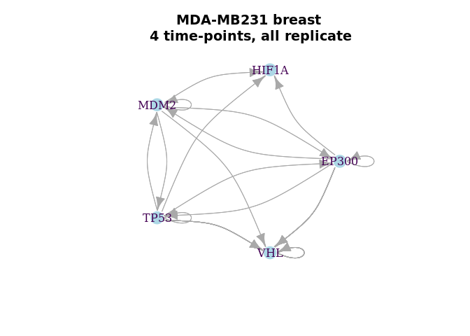
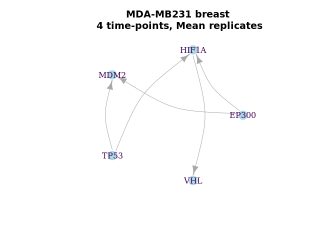
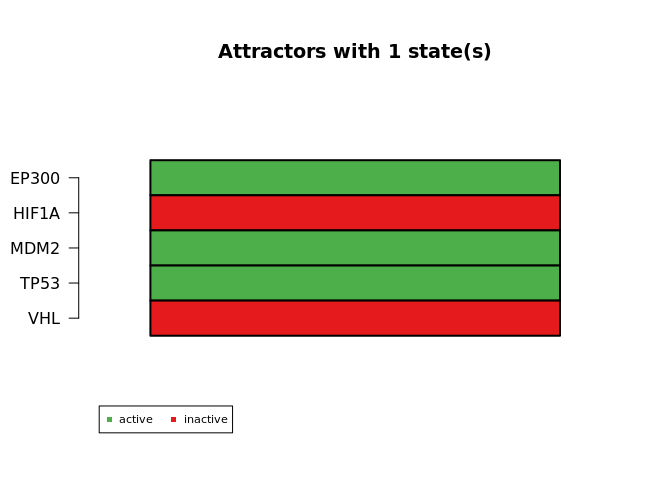
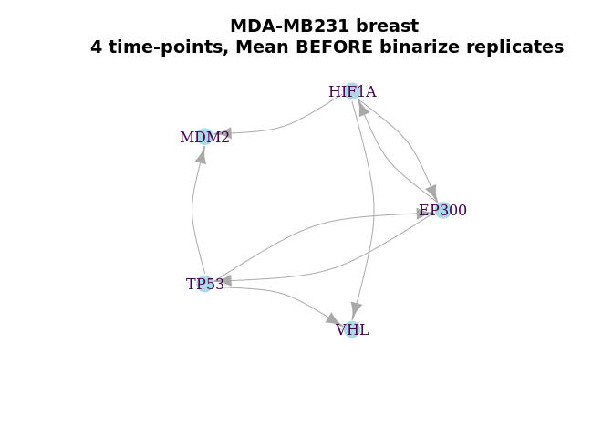

BoolNet Inference HepG2 hepatoma, U87 glioma, and MDA-MB231 breast
cancer (E-GEOD-18494)
================

Expression profiling of hypoxic HepG2 hepatoma, U87 glioma, and
MDA-MB231 breast cancer cells: time course (E-GEOD-18494)

Analysis of expression changes of cultured HepG2 hepatoma, U87 glioma,
and MDA-MB231 breast cancer cells subjected to hypoxia (0.5% O2) for 0,
4, 8, 12 hours . Results provide insight to cell type-specific response
to hypoxia. HepG2 hepatoma, U87 glioma, and MDA-MB231 breast cancer
cells were collected under normoxic conditions (\~19% O2, 0 hours) and
after 4, 8 and 12 hours of hypoxia treatment (0.5% O2). For each cell
line, three replicates of total RNA at each time point were prepared
using Trizol and submitted to the DFCI Microarray Core for labeling,
hybridization to Affymetrix HG-U133Plus2 oligonucleotide arrays and
image scanning.

<https://www.ebi.ac.uk/arrayexpress/experiments/E-GEOD-18494/>

``` r
packages_cran = c("igraph", "BoolNet", "BiocManager", "tidyverse", "fs")
# Install and load packages
package.check <- lapply(packages_cran, FUN = function(x) {
  if (!require(x, character.only = TRUE)) {
    install.packages(x, dependencies = TRUE)
    library(x, character.only = TRUE)
  }
})
packages_bioconductor = c("Biobase", "GEOquery", "vsn", "hgu133plus2.db")
# Install and load packages
package.check <- lapply(packages_bioconductor, FUN = function(x) {
  if (!require(x, character.only = TRUE)) {
    BiocManager::install(x, dependencies = TRUE)
    library(x, character.only = TRUE)
  }
})

rm(package.check, packages_bioconductor, packages_cran)
```

<!-- ```{r message=FALSE, warning=FALSE } -->

<!-- download_dir <- fs::path(".data_tmp") -->

<!-- if (!dir_exists(download_dir)) { -->

<!--     dir_create(download_dir) -->

<!--     EGEOD18494 <- ArrayExpress( "E-GEOD-18494", save=TRUE, path=download_dir) -->

<!-- } else { -->

<!--     EGEOD18494 <- ArrayExpress( "E-GEOD-18494", save=TRUE, path=download_dir) -->

<!-- } -->

<!-- data.EGEOD18494 <- Biobase::pData(EGEOD18494) -->

<!-- data.EGEOD18494 <- data.frame( -->

<!--                   codes = substr(data.EGEOD18494$Source.Name,1,9), -->

<!--                   cell_line = data.EGEOD18494$Characteristics..cell.line., -->

<!--                   time = data.EGEOD18494$Characteristics..time, -->

<!--                   condition = data.EGEOD18494$Characteristics..stress. -->

<!--                   ) -->

<!-- data.EGEOD18494 <- data.EGEOD18494[order(data.EGEOD18494$codes),] -->

<!-- data.EGEOD18494$rep <- rep(1:3, n= length(data.EGEOD18494$codes)) -->

<!-- # Normalisation -->

<!-- eset.EGEOD18494 <- oligo::rma(EGEOD18494,  normalize = TRUE) -->

<!-- expr.EGEOD18494 <- exprs(eset.EGEOD18494) -->

<!-- # Convert to a data.frame -->

<!-- expr.EGEOD18494 <- as.data.frame(as.ffdf(expr.EGEOD18494)) -->

<!-- colnames(expr.EGEOD18494) <- substr(colnames(expr.EGEOD18494),1,9) -->

<!-- # Convert the probes to Symbol names -->

<!-- anno.EGEOD18494 <- AnnotationDbi::select(hgu133plus2.db,  -->

<!--                                          keys=rownames(expr.EGEOD18494),  -->

<!--                                          columns=c("ENSEMBL", "SYMBOL", "GENENAME"),  -->

<!--                                          keytype="PROBEID") -->

<!-- colnames(anno.EGEOD18494) <- c("probes", "ensgene", "symbol", "description") -->

<!-- rm(download_dir, EGEOD18494, eset.EGEOD18494) -->

<!-- save.image("../data/data.EGEOD18494.Rdata") -->

<!-- ``` -->

# Load the pre-processed

``` r
load("../data/data.EGEOD18494.Rdata")
eset <- ExpressionSet(assayData = as.matrix(expr.EGEOD18494), 
                      probeNames = row.names(expr.EGEOD18494))
expr.EGEOD18494 <- exprs(justvsn(eset))
```

# Selecting the HIF Genes

``` r
# Selecting genes from HIF Axis
hif.symbols <- c("TP53", "HIF1A", "EP300", "MDM2", "VHL")

hif.probes <- anno.EGEOD18494$probes[anno.EGEOD18494$symbol %in% hif.symbols]

# Select the probes and genes
expr.EGEOD18494.hif <- as.data.frame(expr.EGEOD18494) %>% 
  rownames_to_column('probes') %>% 
  filter(probes %in% hif.probes) %>% 
  merge(anno.EGEOD18494[anno.EGEOD18494$symbol %in% hif.symbols, c("probes","symbol")], by = "probes") %>% 
  #distinct(symbol, .keep_all = TRUE) %>% # Take the first one
  dplyr::select(!(probes)) 
```

``` r
# Function to binarize according an consensus mean of probes, add the O2 state and rename columns 

binNet <- function(b){
  
  cols <- data.EGEOD18494$codes %in% names(b)
  
  binarizeTimeSeries(b[,-1], method="kmeans")$binarizedMeasurements  %>% 
  as.data.frame(.)  %>% 
  aggregate(., list(symbol = b$symbol), mean) %>%  # mean of binarized probes
  mutate_at(vars(-symbol), funs(ifelse(. >= 0.5, 1, 0))) %>%  # consensus with a bies to 1 (>= 0.5)
  #rbind(., c("O2", 1,0,0,0)) %>% 
    rename_at(vars(data.EGEOD18494$codes[cols] ),
            ~paste0(substr(data.EGEOD18494$condition[cols],1,2),".",
                    data.EGEOD18494$time[cols],".",
                    substr(data.EGEOD18494$cell_line[cols],1,2), ".",
                    data.EGEOD18494$rep[cols])) %>% 
  column_to_rownames("symbol")
  
}
```

``` r
# Function to calculate the mean and binarize after, according an consensus mean of probes 

meanBinNet <- function(b){
  
  cols <- data.EGEOD18494$codes %in% names(b)
  
  b <-b %>% 
  rename_at(vars(data.EGEOD18494$codes[cols] ),
            ~paste0(substr(data.EGEOD18494$condition[cols],1,2),".",
                    data.EGEOD18494$time[cols],".",
                    substr(data.EGEOD18494$cell_line[cols],1,2), ".",
                    data.EGEOD18494$rep[cols])) %>% 
  mutate(no.ctrl = rowMeans(dplyr::select(.,starts_with("no.control")), na.rm = TRUE)) %>% 
  mutate(hy.4h = rowMeans(dplyr::select(.,starts_with("hy.4h")), na.rm = TRUE)) %>% 
  mutate(hy.8h = rowMeans(dplyr::select(.,starts_with("hy.8h")), na.rm = TRUE)) %>% 
  mutate(hy.12h = rowMeans(dplyr::select(.,starts_with("hy.12h")), na.rm = TRUE)) %>%
  dplyr::select(c("symbol", "no.ctrl", "hy.4h", "hy.8h", "hy.12h")) 
  
  binarizeTimeSeries(b[,-1], method="kmeans")$binarizedMeasurements  %>% 
  as.data.frame(.)  %>% 
  aggregate(., list(symbol = b$symbol), mean) %>%  # mean of binarized probes
  mutate_at(vars(-symbol), funs(ifelse(. >= 0.5, 1, 0))) %>%  # consensus with a bies to 1 (>= 0.5)
  #rbind(., c("O2", 1,0,0,0)) %>% 
  column_to_rownames("symbol")
  
}
```

# Exemplifying the Binarization

``` r
cols <- (data.EGEOD18494$cell_line == "MDA-MB231 breast cancer" & data.EGEOD18494$rep == 1)

breast1x <- 
expr.EGEOD18494.hif %>% 
  dplyr::select(c("symbol", data.EGEOD18494$codes[cols])) %>% arrange(symbol) %>% 
  arrange(symbol) %>% 
  rename_at(vars(data.EGEOD18494$codes[cols]),
            ~paste0(substr(data.EGEOD18494$condition[cols],1,2),".",
                    data.EGEOD18494$time[cols],".",
                    substr(data.EGEOD18494$cell_line[cols],1,2)))

breast1x %>% 
  knitr::kable(.)
```

| symbol | no.control.MD | hy.4h.MD | hy.8h.MD | hy.12h.MD |
| :----- | ------------: | -------: | -------: | --------: |
| EP300  |      2.546113 | 2.626751 | 2.654011 |  2.547178 |
| EP300  |      2.617732 | 2.641452 | 2.655325 |  2.613432 |
| HIF1A  |      3.452495 | 3.377380 | 3.200654 |  3.152428 |
| MDM2   |      2.084020 | 2.013627 | 2.026330 |  2.060950 |
| MDM2   |      1.461779 | 1.357165 | 1.484469 |  1.571494 |
| MDM2   |      1.923286 | 1.865037 | 1.907608 |  1.889048 |
| MDM2   |      2.343501 | 2.337237 | 2.354995 |  2.471546 |
| MDM2   |      1.583780 | 1.794800 | 1.761824 |  1.668576 |
| MDM2   |      2.784604 | 2.789847 | 2.797232 |  2.773494 |
| MDM2   |      2.587246 | 2.569956 | 2.548837 |  2.510208 |
| MDM2   |      1.220965 | 1.343511 | 1.305911 |  1.492542 |
| MDM2   |      1.466768 | 1.505834 | 1.478688 |  1.571045 |
| MDM2   |      2.793894 | 2.703201 | 2.674944 |  2.710847 |
| TP53   |      2.930941 | 2.909605 | 2.970412 |  2.981704 |
| TP53   |      2.873767 | 2.802698 | 2.882359 |  2.891784 |
| VHL    |      2.683352 | 2.688519 | 2.603420 |  2.546111 |
| VHL    |      1.290983 | 1.297170 | 1.309405 |  1.230831 |

``` r
binarizeTimeSeries(breast1x[,-1], method="kmeans")$binarizedMeasurements  %>% 
  data.frame(.)  %>% 
  add_column(symbol = breast1x$symbol, .before=0) %>% 
  knitr::kable(.)
```

| symbol | no.control.MD | hy.4h.MD | hy.8h.MD | hy.12h.MD |
| :----- | ------------: | -------: | -------: | --------: |
| EP300  |             0 |        1 |        1 |         0 |
| EP300  |             0 |        1 |        1 |         0 |
| HIF1A  |             1 |        1 |        0 |         0 |
| MDM2   |             1 |        0 |        0 |         1 |
| MDM2   |             1 |        0 |        1 |         1 |
| MDM2   |             1 |        0 |        1 |         0 |
| MDM2   |             0 |        0 |        0 |         1 |
| MDM2   |             0 |        1 |        1 |         0 |
| MDM2   |             1 |        1 |        1 |         0 |
| MDM2   |             1 |        1 |        1 |         0 |
| MDM2   |             0 |        0 |        0 |         1 |
| MDM2   |             0 |        0 |        0 |         1 |
| MDM2   |             1 |        0 |        0 |         0 |
| TP53   |             0 |        0 |        1 |         1 |
| TP53   |             1 |        0 |        1 |         1 |
| VHL    |             1 |        1 |        0 |         0 |
| VHL    |             1 |        1 |        1 |         0 |

``` r
binarizeTimeSeries(breast1x[,-1], method="kmeans")$binarizedMeasurements  %>% 
  data.frame(.)  %>% 
  aggregate(., list(symbol = breast1x$symbol), mean) %>% 
  mutate_at(vars(-symbol), funs(ifelse(. >= 0.5, 1, 0))) %>% 
  #rbind(., c("O2", 1,0,0,0)) %>% 
  knitr::kable(.)
```

| symbol | no.control.MD | hy.4h.MD | hy.8h.MD | hy.12h.MD |
| :----- | ------------: | -------: | -------: | --------: |
| EP300  |             0 |        1 |        1 |         0 |
| HIF1A  |             1 |        1 |        0 |         0 |
| MDM2   |             1 |        0 |        1 |         1 |
| TP53   |             1 |        0 |        1 |         1 |
| VHL    |             1 |        1 |        1 |         0 |

# MDA-MB231 breast cancer

``` r
cellline.rep1 <- (data.EGEOD18494$cell_line == "MDA-MB231 breast cancer" &  data.EGEOD18494$rep == 1)
cellline.rep2 <- (data.EGEOD18494$cell_line == "MDA-MB231 breast cancer" &  data.EGEOD18494$rep == 2)
cellline.rep3 <- (data.EGEOD18494$cell_line == "MDA-MB231 breast cancer" &  data.EGEOD18494$rep == 3)

breast1x <- 
expr.EGEOD18494.hif %>% 
  dplyr::select(c("symbol", data.EGEOD18494$codes[cellline.rep1])) %>% binNet(.) 

breast1x %>% knitr::kable(.)
```

|       | no.control.MD.1 | hy.4h.MD.1 | hy.8h.MD.1 | hy.12h.MD.1 |
| :---- | --------------: | ---------: | ---------: | ----------: |
| EP300 |               0 |          1 |          1 |           0 |
| HIF1A |               1 |          1 |          0 |           0 |
| MDM2  |               1 |          0 |          1 |           1 |
| TP53  |               1 |          0 |          1 |           1 |
| VHL   |               1 |          1 |          1 |           0 |

``` r
breast2x <- 
expr.EGEOD18494.hif %>% 
  dplyr::select(c("symbol", data.EGEOD18494$codes[cellline.rep2])) %>% binNet(.) 

breast2x  %>% knitr::kable(.)
```

|       | no.control.MD.2 | hy.4h.MD.2 | hy.8h.MD.2 | hy.12h.MD.2 |
| :---- | --------------: | ---------: | ---------: | ----------: |
| EP300 |               1 |          0 |          1 |           1 |
| HIF1A |               1 |          1 |          0 |           0 |
| MDM2  |               1 |          0 |          1 |           0 |
| TP53  |               0 |          1 |          1 |           1 |
| VHL   |               1 |          1 |          1 |           0 |

``` r
breast3x <- 
expr.EGEOD18494.hif %>% 
  dplyr::select(c("symbol", data.EGEOD18494$codes[cellline.rep3])) %>% binNet(.) 

breast3x %>% knitr::kable(.)
```

|       | no.control.MD.3 | hy.4h.MD.3 | hy.8h.MD.3 | hy.12h.MD.3 |
| :---- | --------------: | ---------: | ---------: | ----------: |
| EP300 |               0 |          1 |          1 |           1 |
| HIF1A |               1 |          1 |          0 |           0 |
| MDM2  |               1 |          1 |          0 |           1 |
| TP53  |               0 |          1 |          1 |           1 |
| VHL   |               1 |          1 |          0 |           1 |

``` r
breast.mean <- 
cbind(breast1x, breast2x,breast3x) %>%
  tibble::rownames_to_column('gene') %>%
  mutate_at(vars(-gene), as.numeric) %>% 
  mutate(no.ctrl = rowMeans(dplyr::select(.,starts_with("no.control")), na.rm = TRUE)) %>% 
  mutate(hy.4h = rowMeans(dplyr::select(.,starts_with("hy.4h")), na.rm = TRUE)) %>% 
  mutate(hy.8h = rowMeans(dplyr::select(.,starts_with("hy.8h")), na.rm = TRUE)) %>% 
  mutate(hy.12h = rowMeans(dplyr::select(.,starts_with("hy.12h")), na.rm = TRUE)) %>%
  dplyr::select(c("no.ctrl", "hy.4h", "hy.8h", "hy.12h", "gene")) %>%
  mutate_at(c("no.ctrl", "hy.4h", "hy.8h", "hy.12h"), funs(ifelse(. >= 0.5, 1, 0)))  %>%  # consensus with a bies to 1 (>= 0.5)  
  tibble::column_to_rownames('gene')

breast.mean %>% 
  knitr::kable(.)
```

|       | no.ctrl | hy.4h | hy.8h | hy.12h |
| :---- | ------: | ----: | ----: | -----: |
| EP300 |       0 |     1 |     1 |      1 |
| HIF1A |       1 |     1 |     0 |      0 |
| MDM2  |       1 |     0 |     1 |      1 |
| TP53  |       0 |     1 |     1 |      1 |
| VHL   |       1 |     1 |     1 |      0 |

``` r
cellline.breast <- (data.EGEOD18494$cell_line == "MDA-MB231 breast cancer")
                  
breast.meanBin <- 
expr.EGEOD18494.hif %>% 
  dplyr::select(c("symbol", data.EGEOD18494$codes[cellline.breast])) %>% meanBinNet(.) 

breast.meanBin %>% 
  knitr::kable(.)
```

|       | no.ctrl | hy.4h | hy.8h | hy.12h |
| :---- | ------: | ----: | ----: | -----: |
| EP300 |       0 |     1 |     1 |      0 |
| HIF1A |       1 |     1 |     0 |      0 |
| MDM2  |       0 |     0 |     0 |      1 |
| TP53  |       0 |     0 |     1 |      1 |
| VHL   |       1 |     1 |     1 |      0 |

<!-- # HepG2 hepatoma -->

<!-- ```{r} -->

<!-- cellline.rep1 <- (data.EGEOD18494$cell_line == "HepG2 hepatoma" &  data.EGEOD18494$rep == 1) -->

<!-- cellline.rep2 <- (data.EGEOD18494$cell_line == "HepG2 hepatoma" &  data.EGEOD18494$rep == 2) -->

<!-- cellline.rep3 <- (data.EGEOD18494$cell_line == "HepG2 hepatoma" &  data.EGEOD18494$rep == 3) -->

<!-- hepatoma1x <-  -->

<!-- expr.EGEOD18494.hif %>%  -->

<!--   dplyr::select(c("symbol", data.EGEOD18494$codes[cellline.rep1]))  %>%  -->

<!--   binNet(.)  -->

<!-- hepatoma1x %>%  -->

<!--   knitr::kable(.) -->

<!-- hepatoma2x <-  -->

<!-- expr.EGEOD18494.hif %>%  -->

<!--   dplyr::select(c("symbol", data.EGEOD18494$codes[cellline.rep2]))  %>%  -->

<!--   binNet(.)  -->

<!-- hepatoma2x %>%  -->

<!--   knitr::kable(.) -->

<!-- hepatoma3x <-  -->

<!-- expr.EGEOD18494.hif %>%  -->

<!--   dplyr::select(c("symbol", data.EGEOD18494$codes[cellline.rep3]))  %>%  -->

<!--   binNet(.)  -->

<!-- hepatoma3x %>%  -->

<!--   knitr::kable(.) -->

<!-- ``` -->

<!-- # U87 glioma -->

<!-- ```{r} -->

<!-- cellline.rep1 <- (data.EGEOD18494$cell_line == "U87 glioma" &  data.EGEOD18494$rep == 1) -->

<!-- cellline.rep2 <- (data.EGEOD18494$cell_line == "U87 glioma" &  data.EGEOD18494$rep == 2) -->

<!-- cellline.rep3 <- (data.EGEOD18494$cell_line == "U87 glioma" &  data.EGEOD18494$rep == 3) -->

<!-- glioma1x <-  -->

<!-- expr.EGEOD18494.hif %>%  -->

<!--   dplyr::select(c("symbol", data.EGEOD18494$codes[cellline.rep1]))  %>%  -->

<!--   binNet(.)  -->

<!-- glioma1x %>%  -->

<!--   knitr::kable(.) -->

<!-- glioma2x <-  -->

<!-- expr.EGEOD18494.hif %>%  -->

<!--   dplyr::select(c("symbol", data.EGEOD18494$codes[cellline.rep2]))  %>%  -->

<!--   binNet(.)  -->

<!-- glioma2x %>%  -->

<!--   knitr::kable(.) -->

<!-- glioma3x <-  -->

<!-- expr.EGEOD18494.hif %>%  -->

<!--   dplyr::select(c("symbol", data.EGEOD18494$codes[cellline.rep3]))  %>%  -->

<!--   binNet(.)  -->

<!-- glioma3x %>%  -->

<!--   knitr::kable(.) -->

<!-- ``` -->

# Network inference:

``` r
# MDA-MB231 breast cancer - 4 time-points
par(mfrow = c(1,3))
plot(breast1x.p, vertex.label.color="#440154ff", vertex.color="lightblue", vertex.frame.color="white", layout=layout_in_circle, edge.curved=.3,
     main="MDA-MB231 breast\n 4 time-points, replicate 1")
plot(breast2x.p, vertex.label.color="#440154ff", vertex.color="lightblue", vertex.frame.color="white", layout=layout_in_circle, edge.curved=.3,
     main="MDA-MB231 breast\n 4 time-points, replicate 2")
plot(breast3x.p, vertex.label.color="#440154ff", vertex.color="lightblue", vertex.frame.color="white", layout=layout_in_circle, edge.curved=.3,
     main="MDA-MB231 breast\n 4 time-points, replicate 3")
```

<!-- -->

``` r
par(mfrow = c(1,1))
plot(breast.all.p, vertex.label.color="#440154ff", vertex.color="lightblue", vertex.frame.color="white", layout=layout_in_circle, edge.curved=.3,
     main="MDA-MB231 breast\n 4 time-points, all replicate")
```

<!-- -->

``` r
# 
# # HepG2 hepatoma
# par(mfrow = c(1,3))
# plot(hepatoma1x.p, vertex.label.color="#440154ff", vertex.color="lightblue", vertex.frame.color="white", layout=layout_in_circle, edge.curved=.3,
#      main="HepG2 hepatoma\n 4 steps, replicate 1")
# plot(hepatoma2x.p, vertex.label.color="#440154ff", vertex.color="lightblue", vertex.frame.color="white", layout=layout_in_circle, edge.curved=.3,
#      main="HepG2 hepatoma\n 4 steps, replicate 2")
# plot(hepatoma3x.p, vertex.label.color="#440154ff", vertex.color="lightblue", vertex.frame.color="white", layout=layout_in_circle, edge.curved=.3,
#      main="HepG2 hepatoma\n 4 steps, replicate 3")
# 
# par(mfrow = c(1,1))
# plot(hepatoma.all.p, vertex.label.color="#440154ff", vertex.color="lightblue", vertex.frame.color="white", layout=layout_in_circle, edge.curved=.3,
#      main="HepG2 hepatoma\n 4 steps, replicate 3")
# 
# # U87 glioma
# par(mfrow = c(1,3))
# plot(glioma1x.p, vertex.label.color="#440154ff", vertex.color="lightblue", vertex.frame.color="white", layout=layout_in_circle, edge.curved=.3,
#      main="U87 glioma\n 4 steps, replicate 1")
# plot(glioma2x.p, vertex.label.color="#440154ff", vertex.color="lightblue", vertex.frame.color="white", layout=layout_in_circle, edge.curved=.3,
#      main="U87 glioma\n 4 steps, replicate 2")
# plot(glioma3x.p, vertex.label.color="#440154ff", vertex.color="lightblue", vertex.frame.color="white", layout=layout_in_circle, edge.curved=.3,
#      main="U87 glioma\n 4 steps, replicate 3")
# 
# par(mfrow = c(1,1))
# plot(glioma.all.p, vertex.label.color="#440154ff", vertex.color="lightblue", vertex.frame.color="white", layout=layout_in_circle, edge.curved=.3,
#      main="U87 glioma\n 4 steps, replicate 3")
```

# Mean AFTER binarize the replicates of breast cancer net :

``` r
par(mfrow = c(1,1))
plot(mean.p, vertex.label.color="#440154ff", vertex.color="lightblue", vertex.frame.color="white", layout=layout_in_circle, edge.curved=.3,
     main="MDA-MB231 breast\n 4 time-points, Mean replicates")
```

<!-- -->

``` r
print(mean.net)
```

    ## Probabilistic Boolean network with 5 genes
    ## 
    ## Involved genes:
    ## EP300 HIF1A MDM2 TP53 VHL
    ## 
    ## Transition functions:
    ## 
    ## Alternative transition functions for gene EP300:
    ## EP300 = 1 ( probability: 1, error: 0)
    ## 
    ## Alternative transition functions for gene HIF1A:
    ## HIF1A = (!TP53) ( probability: 0.5, error: 0)
    ## HIF1A = (!EP300) ( probability: 0.5, error: 0)
    ## 
    ## Alternative transition functions for gene MDM2:
    ## MDM2 = (TP53) ( probability: 0.5, error: 0)
    ## MDM2 = (EP300) ( probability: 0.5, error: 0)
    ## 
    ## Alternative transition functions for gene TP53:
    ## TP53 = 1 ( probability: 1, error: 0)
    ## 
    ## Alternative transition functions for gene VHL:
    ## VHL = (HIF1A) ( probability: 1, error: 0)
    ## 
    ## Knocked-out and over-expressed genes:
    ## EP300 = 1
    ## TP53 = 1

``` r
try({
sink("../data/ATOTS_inferred_EGEOD18494.bn")
cat("targets, factors\n")
cat("EP300, 1\n")
cat("HIF1A, (!TP53 | !EP300 )\n")
cat("MDM2, (TP53 | EP300)\n")
cat("TP53, 1\n")
cat("VHL, HIF1A\n")
sink()}, silent = T)
```

``` r
net <- loadNetwork("../data/ATOTS_inferred_EGEOD18494.bn")
print(net)
```

    ## Boolean network with 5 genes
    ## 
    ## Involved genes:
    ## EP300 HIF1A MDM2 TP53 VHL
    ## 
    ## Transition functions:
    ## EP300 = 1
    ## HIF1A = (!TP53 | !EP300 )
    ## MDM2 = (TP53 | EP300)
    ## TP53 = 1
    ## VHL = HIF1A
    ## 
    ## Knocked-out and over-expressed genes:
    ## EP300 = 1
    ## TP53 = 1

``` r
attr.syn <- getAttractors(net, type = "synchronous")
plotAttractors(attr.syn)
```

<!-- -->

    ## $`1`
    ##       Attr1.1
    ## EP300       1
    ## HIF1A       0
    ## MDM2        1
    ## TP53        1
    ## VHL         0

# Mean BEFORE binarize the replicates of breast cancer net :

``` r
par(mfrow = c(1,1))
plot(meanBin.p, vertex.label.color="#440154ff", vertex.color="lightblue", vertex.frame.color="white", layout=layout_in_circle, edge.curved=.3,
     main="MDA-MB231 breast\n 4 time-points, Mean BEFORE binarize replicates")
```

<!-- -->

``` r
print(meanBin.net)
```

    ## Probabilistic Boolean network with 5 genes
    ## 
    ## Involved genes:
    ## EP300 HIF1A MDM2 TP53 VHL
    ## 
    ## Transition functions:
    ## 
    ## Alternative transition functions for gene EP300:
    ## EP300 = (!TP53) ( probability: 0.5, error: 0)
    ## EP300 = (HIF1A) ( probability: 0.5, error: 0)
    ## 
    ## Alternative transition functions for gene HIF1A:
    ## HIF1A = (!EP300) ( probability: 1, error: 0)
    ## 
    ## Alternative transition functions for gene MDM2:
    ## MDM2 = (TP53) ( probability: 0.5, error: 0)
    ## MDM2 = (!HIF1A) ( probability: 0.5, error: 0)
    ## 
    ## Alternative transition functions for gene TP53:
    ## TP53 = (EP300) ( probability: 1, error: 0)
    ## 
    ## Alternative transition functions for gene VHL:
    ## VHL = (!TP53) ( probability: 0.5, error: 0)
    ## VHL = (HIF1A) ( probability: 0.5, error: 0)

``` r
try({
sink("../data/ATOTS_inferred_EGEOD18494_meanBin.bn")
cat("targets, factors\n")
cat("EP300, (!TP53 | HIF1A) \n")
cat("HIF1A,  !EP300 \n")
cat("MDM2, (TP53 | !HIF1A)\n")
cat("TP53, EP300\n")
cat("VHL, (!TP53 | HIF1A)\n")
sink()}, silent = T)
```

``` r
net <- loadNetwork("../data/ATOTS_inferred_EGEOD18494_meanBin.bn")
print(net)
```

    ## Boolean network with 5 genes
    ## 
    ## Involved genes:
    ## EP300 HIF1A MDM2 TP53 VHL
    ## 
    ## Transition functions:
    ## EP300 = (!TP53 | HIF1A)
    ## HIF1A = !EP300
    ## MDM2 = (TP53 | !HIF1A)
    ## TP53 = EP300
    ## VHL = (!TP53 | HIF1A)

``` r
attr.syn <- getAttractors(net, type = "synchronous")
plotAttractors(attr.syn)
```

<!-- -->

    ## $`4`
    ##       Attr1.1 Attr1.2 Attr1.3 Attr1.4
    ## EP300       0       1       1       0
    ## HIF1A       1       1       0       0
    ## MDM2        1       0       0       1
    ## TP53        0       0       1       1
    ## VHL         0       1       1       0
