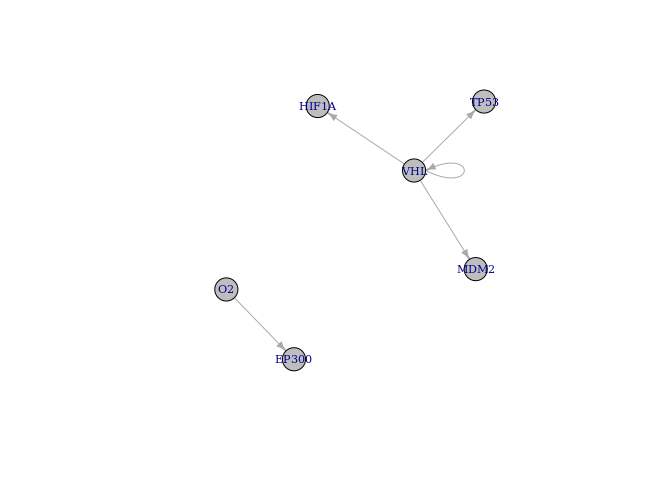
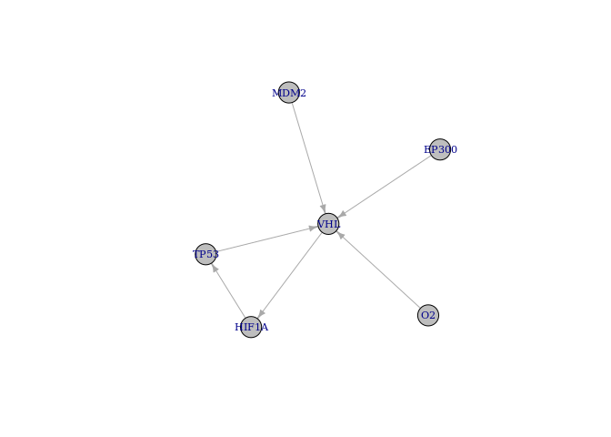
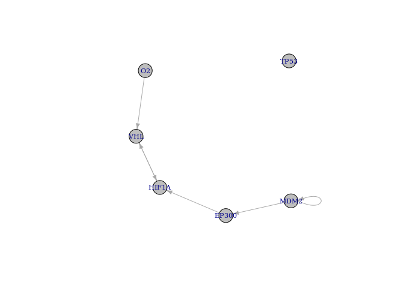
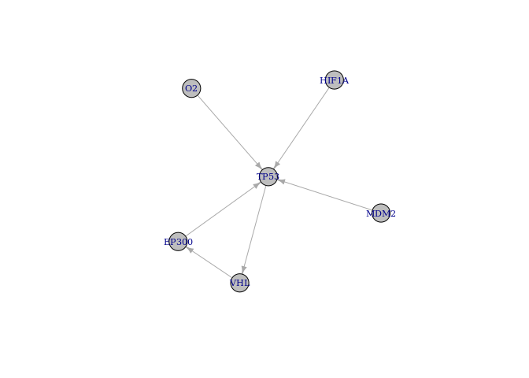
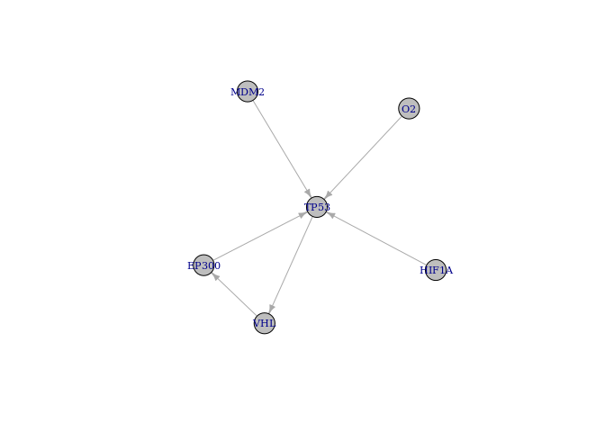
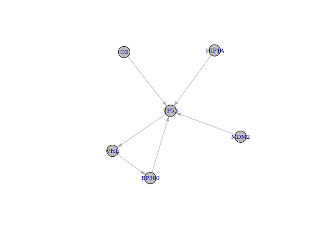

BoolNet Inference (E-GEOD-18494)
================

Expression profiling of hypoxic HepG2 hepatoma, U87 glioma, and
MDA-MB231 breast cancer cells: time course (E-GEOD-18494)

Analysis of expression changes of cultured HepG2 hepatoma, U87 glioma,
and MDA-MB231 breast cancer cells subjected to hypoxia (0.5% O2) for 0,
4, 8, 12 hours . Results provide insight to cell type-specific response
to hypoxia. HepG2 hepatoma, U87 glioma, and MDA-MB231 breast cancer
cells were collected under normoxic conditions (\~19% O2, 0 hours) and
after 4, 8 and 12 hours of hypoxia treatment (0.5% O2). For each cell
line, three replicates of total RNA at each time point were prepared
using Trizol and submitted to the DFCI Microarray Core for labeling,
hybridization to Affymetrix HG-U133Plus2 oligonucleotide arrays and
image scanning.

<https://www.ebi.ac.uk/arrayexpress/experiments/E-GEOD-18494/>

``` r
packages_cran = c("igraph", "BoolNet", "BiocManager", "tidyverse", "fs", "ff", "RSQLite")


# Install and load packages
package.check <- lapply(packages_cran, FUN = function(x) {
  if (!require(x, character.only = TRUE)) {
    install.packages(x, dependencies = TRUE)
    library(x, character.only = TRUE)
  }
})

# For oligo First install:
#install.packages('https://cran.r-project.org/src/contrib/Archive/ff/ff_2.2-14.tar.gz',repos=NULL)

packages_bioconductor = c("Biobase", "GEOquery", "ArrayExpress", "hgu133plus2.db")

# Install and load packages
package.check <- lapply(packages_bioconductor, FUN = function(x) {
  if (!require(x, character.only = TRUE)) {
    BiocManager::install(x, dependencies = TRUE)
    library(x, character.only = TRUE)
  }
})

rm(package.check, packages_bioconductor, packages_cran)
```

``` r
download_dir <- fs::path(".data_tmp")
if (!dir_exists(download_dir)) {
    dir_create(download_dir)
    EGEOD18494 <- ArrayExpress( "E-GEOD-18494", save=TRUE, path=download_dir)
} else {
    EGEOD18494 <- ArrayExpress( "E-GEOD-18494", save=TRUE, path=download_dir)
}

data.EGEOD18494 <- Biobase::pData(EGEOD18494)

data.EGEOD18494 <- data.frame(
                  codes = substr(data.EGEOD18494$Source.Name,1,9),
                  cell_line = data.EGEOD18494$Characteristics..cell.line.,
                  time = data.EGEOD18494$Characteristics..time,
                  condition = data.EGEOD18494$Characteristics..stress.
                  )
data.EGEOD18494 <- data.EGEOD18494[order(data.EGEOD18494$codes),]
data.EGEOD18494$rep <- rep(1:3, n= length(data.EGEOD18494$codes))

# Normalisation
eset.EGEOD18494 <- oligo::rma(EGEOD18494,  normalize = TRUE)

expr.EGEOD18494 <- exprs(eset.EGEOD18494)

# Convert to a data.frame
expr.EGEOD18494 <- as.data.frame(as.ffdf(expr.EGEOD18494))

colnames(expr.EGEOD18494) <- substr(colnames(expr.EGEOD18494),1,9)

rm(download_dir, EGEOD18494, eset.EGEOD18494)
```

# Convert the probes to Symbol names

``` r
anno.EGEOD18494 <- AnnotationDbi::select(hgu133plus2.db, keys=rownames(expr.EGEOD18494), columns=c("ENSEMBL", "SYMBOL", "GENENAME"), keytype="PROBEID")
```

    ## 'select()' returned 1:many mapping between keys and columns

``` r
colnames(anno.EGEOD18494) <- c("probes", "ensgene", "symbol", "description")
```

# Selecting the HIF Genes

``` r
# Selecting genes from HIF Axis
hif.symbols <- c("TP53", "HIF1A", "EP300", "MDM2", "VHL")

hif.probes <- anno.EGEOD18494$probes[anno.EGEOD18494$symbol %in% hif.symbols]

# Select the probes and genes
expr.EGEOD18494.hif <- as.data.frame(expr.EGEOD18494) %>% 
  rownames_to_column('probes') %>% 
  filter(probes %in% hif.probes) %>% 
  merge(anno.EGEOD18494[anno.EGEOD18494$symbol %in% hif.symbols, c("probes","symbol")], by = "probes") %>% 
  #distinct(symbol, .keep_all = TRUE) %>% # Take the first one
  dplyr::select(!(probes)) 
```

``` r
# Function to binarize according an consensus mean of probes, add the O2 state and rename columns 

binNet <- function(b){
  
  cols <- data.EGEOD18494$codes %in% names(b)
  
  binarizeTimeSeries(b[,-1], method="kmeans")$binarizedMeasurements  %>% 
  as.data.frame(.)  %>% 
  aggregate(., list(symbol = b$symbol), mean) %>% 
  mutate_at(vars(-symbol), funs(ifelse(. >= 0.5, 1, 0))) %>% 
  rbind(., c("O2", 1,0,0,0)) %>% 
    rename_at(vars(data.EGEOD18494$codes[cols] ),
            ~paste0(substr(data.EGEOD18494$condition[cols],1,2),".",
                    data.EGEOD18494$time[cols],".",
                    substr(data.EGEOD18494$cell_line[cols],1,2), ".",
                    data.EGEOD18494$rep[cols])) %>% 
  column_to_rownames("symbol")
  
}
```

# Exemplifying the Binarization

``` r
cols <- (data.EGEOD18494$cell_line == "MDA-MB231 breast cancer" & data.EGEOD18494$rep == 1)

breast1x <- 
expr.EGEOD18494.hif %>% 
  dplyr::select(c("symbol", data.EGEOD18494$codes[cols])) %>% arrange(symbol) %>% 
  arrange(symbol) %>% 
  rename_at(vars(data.EGEOD18494$codes[cols]),
            ~paste0(substr(data.EGEOD18494$condition[cols],1,2),".",
                    data.EGEOD18494$time[cols],".",
                    substr(data.EGEOD18494$cell_line[cols],1,2)))

breast1x %>% 
  knitr::kable(.)
```

| symbol | no.control.MD |  hy.4h.MD |  hy.8h.MD | hy.12h.MD |
| :----- | ------------: | --------: | --------: | --------: |
| EP300  |      7.117723 |  7.444650 |  7.564863 |  7.102371 |
| EP300  |      7.413672 |  7.507501 |  7.570583 |  7.374402 |
| HIF1A  |     12.201881 | 11.633014 | 10.456373 | 10.119609 |
| MDM2   |      5.524042 |  5.320023 |  5.350573 |  5.446186 |
| MDM2   |      4.045154 |  3.853332 |  4.078569 |  4.257243 |
| MDM2   |      5.078994 |  4.927372 |  5.029658 |  4.981994 |
| MDM2   |      6.355831 |  6.328876 |  6.389927 |  6.806724 |
| MDM2   |      4.287158 |  4.755383 |  4.670058 |  4.462138 |
| MDM2   |      8.162994 |  8.179121 |  8.219938 |  8.085525 |
| MDM2   |      7.285900 |  7.207761 |  7.123573 |  6.955918 |
| MDM2   |      3.623543 |  3.829355 |  3.753720 |  4.100483 |
| MDM2   |      4.054654 |  4.129631 |  4.067410 |  4.256327 |
| MDM2   |      8.207312 |  7.778604 |  7.656600 |  7.797764 |
| TP53   |      8.895355 |  8.773830 |  9.104009 |  9.136858 |
| TP53   |      8.600345 |  8.240599 |  8.641253 |  8.664151 |
| VHL    |      7.698038 |  7.713089 |  7.348580 |  7.098092 |
| VHL    |      3.738962 |  3.749649 |  3.759698 |  3.638137 |

``` r
binarizeTimeSeries(breast1x[,-1], method="kmeans")$binarizedMeasurements  %>% 
  data.frame(.)  %>% 
  add_column(symbol = breast1x$symbol, .before=0) %>% 
  knitr::kable(.)
```

| symbol | no.control.MD | hy.4h.MD | hy.8h.MD | hy.12h.MD |
| :----- | ------------: | -------: | -------: | --------: |
| EP300  |             0 |        1 |        1 |         0 |
| EP300  |             0 |        1 |        1 |         0 |
| HIF1A  |             1 |        1 |        0 |         0 |
| MDM2   |             1 |        0 |        0 |         1 |
| MDM2   |             1 |        0 |        1 |         1 |
| MDM2   |             1 |        0 |        1 |         0 |
| MDM2   |             0 |        0 |        0 |         1 |
| MDM2   |             0 |        1 |        1 |         0 |
| MDM2   |             1 |        1 |        1 |         0 |
| MDM2   |             1 |        1 |        1 |         0 |
| MDM2   |             0 |        0 |        0 |         1 |
| MDM2   |             0 |        0 |        0 |         1 |
| MDM2   |             1 |        0 |        0 |         0 |
| TP53   |             0 |        0 |        1 |         1 |
| TP53   |             1 |        0 |        1 |         1 |
| VHL    |             1 |        1 |        0 |         0 |
| VHL    |             1 |        1 |        1 |         0 |

``` r
binarizeTimeSeries(breast1x[,-1], method="kmeans")$binarizedMeasurements  %>% 
  data.frame(.)  %>% 
  aggregate(., list(symbol = breast1x$symbol), mean) %>% 
  mutate_at(vars(-symbol), funs(ifelse(. >= 0.5, 1, 0))) %>% 
  rbind(., c("O2", 1,0,0,0)) %>% 
  knitr::kable(.)
```

| symbol | no.control.MD | hy.4h.MD | hy.8h.MD | hy.12h.MD |
| :----- | :------------ | :------- | :------- | :-------- |
| EP300  | 0             | 1        | 1        | 0         |
| HIF1A  | 1             | 1        | 0        | 0         |
| MDM2   | 1             | 0        | 1        | 1         |
| TP53   | 1             | 0        | 1        | 1         |
| VHL    | 1             | 1        | 1        | 0         |
| O2     | 1             | 0        | 0        | 0         |

# MDA-MB231 breast cancer

``` r
cellline.rep1 <- (data.EGEOD18494$cell_line == "MDA-MB231 breast cancer" &  data.EGEOD18494$rep == 1)
cellline.rep2 <- (data.EGEOD18494$cell_line == "MDA-MB231 breast cancer" &  data.EGEOD18494$rep == 2)
cellline.rep3 <- (data.EGEOD18494$cell_line == "MDA-MB231 breast cancer" &  data.EGEOD18494$rep == 3)

breast1x <- 
expr.EGEOD18494.hif %>% 
  dplyr::select(c("symbol", data.EGEOD18494$codes[cellline.rep1])) %>% 
  binNet(.) 

breast1x %>% 
  knitr::kable(.)
```

|       | no.control.MD.1 | hy.4h.MD.1 | hy.8h.MD.1 | hy.12h.MD.1 |
| :---- | :-------------- | :--------- | :--------- | :---------- |
| EP300 | 0               | 1          | 1          | 0           |
| HIF1A | 1               | 1          | 0          | 0           |
| MDM2  | 1               | 0          | 1          | 1           |
| TP53  | 1               | 0          | 1          | 1           |
| VHL   | 1               | 1          | 1          | 0           |
| O2    | 1               | 0          | 0          | 0           |

``` r
breast2x <- 
expr.EGEOD18494.hif %>% 
  dplyr::select(c("symbol", data.EGEOD18494$codes[cellline.rep2])) %>% 
  binNet(.) 

breast2x  %>% 
  knitr::kable(.)
```

|       | no.control.MD.2 | hy.4h.MD.2 | hy.8h.MD.2 | hy.12h.MD.2 |
| :---- | :-------------- | :--------- | :--------- | :---------- |
| EP300 | 1               | 0          | 1          | 1           |
| HIF1A | 1               | 1          | 0          | 0           |
| MDM2  | 1               | 0          | 1          | 0           |
| TP53  | 0               | 1          | 1          | 1           |
| VHL   | 1               | 1          | 1          | 0           |
| O2    | 1               | 0          | 0          | 0           |

``` r
breast3x <- 
expr.EGEOD18494.hif %>% 
  dplyr::select(c("symbol", data.EGEOD18494$codes[cellline.rep3])) %>% 
  binNet(.) 

breast3x %>% 
  knitr::kable(.)
```

|       | no.control.MD.3 | hy.4h.MD.3 | hy.8h.MD.3 | hy.12h.MD.3 |
| :---- | :-------------- | :--------- | :--------- | :---------- |
| EP300 | 0               | 1          | 1          | 1           |
| HIF1A | 1               | 1          | 0          | 0           |
| MDM2  | 1               | 1          | 0          | 1           |
| TP53  | 0               | 1          | 1          | 1           |
| VHL   | 1               | 1          | 0          | 1           |
| O2    | 1               | 0          | 0          | 0           |

``` r
# All breast cancer nets merged:

net <- reconstructNetwork(list(breast1x, breast2x, breast3x), method="bestfit",returnPBN=TRUE,readableFunctions=TRUE)
plotNetworkWiring(net)
```

<!-- -->

``` r
print(net)
```

    ## Probabilistic Boolean network with 6 genes
    ## 
    ## Involved genes:
    ## EP300 HIF1A MDM2 TP53 VHL O2
    ## 
    ## Transition functions:
    ## 
    ## Alternative transition functions for gene EP300:
    ## EP300 = (!O2) | (!EP300) ( probability: 1, error: 1)
    ## 
    ## Alternative transition functions for gene HIF1A:
    ## HIF1A = (O2) ( probability: 1, error: 0)
    ## 
    ## Alternative transition functions for gene MDM2:
    ## MDM2 = (!MDM2 & TP53) | (!EP300 & MDM2 & !TP53) | (EP300 & !MDM2) ( probability: 0.5, error: 1)
    ## MDM2 = (!MDM2) | (!EP300 & !TP53) ( probability: 0.5, error: 1)
    ## 
    ## Alternative transition functions for gene TP53:
    ## TP53 = (!O2) | (!TP53) ( probability: 1, error: 0)
    ## 
    ## Alternative transition functions for gene VHL:
    ## VHL = (!MDM2 & !O2) | (MDM2 & O2) ( probability: 0.5, error: 0)
    ## VHL = (!MDM2) | (O2) ( probability: 0.5, error: 0)
    ## 
    ## Alternative transition functions for gene O2:
    ## O2 = 0 ( probability: 1, error: 0)
    ## 
    ## Knocked-out and over-expressed genes:
    ## O2 = 0

``` r
# Individual nets of each replica:

net <- reconstructNetwork(breast1x, method="bestfit", returnPBN=TRUE, readableFunctions=TRUE)
plotNetworkWiring(net)
```

<!-- -->

``` r
print(net)
```

    ## Probabilistic Boolean network with 6 genes
    ## 
    ## Involved genes:
    ## EP300 HIF1A MDM2 TP53 VHL O2
    ## 
    ## Transition functions:
    ## 
    ## Alternative transition functions for gene EP300:
    ## EP300 = (HIF1A) ( probability: 1, error: 0)
    ## 
    ## Alternative transition functions for gene HIF1A:
    ## HIF1A = (O2) ( probability: 0.5, error: 0)
    ## HIF1A = (!EP300) ( probability: 0.5, error: 0)
    ## 
    ## Alternative transition functions for gene MDM2:
    ## MDM2 = (!O2) ( probability: 0.5, error: 0)
    ## MDM2 = (EP300) ( probability: 0.5, error: 0)
    ## 
    ## Alternative transition functions for gene TP53:
    ## TP53 = (!O2) ( probability: 0.5, error: 0)
    ## TP53 = (EP300) ( probability: 0.5, error: 0)
    ## 
    ## Alternative transition functions for gene VHL:
    ## VHL = (HIF1A) ( probability: 1, error: 0)
    ## 
    ## Alternative transition functions for gene O2:
    ## O2 = 0 ( probability: 1, error: 0)
    ## 
    ## Knocked-out and over-expressed genes:
    ## O2 = 0

``` r
net <- reconstructNetwork(breast2x, method="bestfit", returnPBN=TRUE, readableFunctions=TRUE)
plotNetworkWiring(net)
```

<!-- -->

``` r
print(net)
```

    ## Probabilistic Boolean network with 6 genes
    ## 
    ## Involved genes:
    ## EP300 HIF1A MDM2 TP53 VHL O2
    ## 
    ## Transition functions:
    ## 
    ## Alternative transition functions for gene EP300:
    ## EP300 = (!O2) ( probability: 0.5, error: 0)
    ## EP300 = (TP53) ( probability: 0.5, error: 0)
    ## 
    ## Alternative transition functions for gene HIF1A:
    ## HIF1A = (O2) ( probability: 0.5, error: 0)
    ## HIF1A = (!TP53) ( probability: 0.5, error: 0)
    ## 
    ## Alternative transition functions for gene MDM2:
    ## MDM2 = (!MDM2) ( probability: 0.5, error: 0)
    ## MDM2 = (!EP300) ( probability: 0.5, error: 0)
    ## 
    ## Alternative transition functions for gene TP53:
    ## TP53 = 1 ( probability: 1, error: 0)
    ## 
    ## Alternative transition functions for gene VHL:
    ## VHL = (HIF1A) ( probability: 1, error: 0)
    ## 
    ## Alternative transition functions for gene O2:
    ## O2 = 0 ( probability: 1, error: 0)
    ## 
    ## Knocked-out and over-expressed genes:
    ## TP53 = 1
    ## O2 = 0

``` r
net <- reconstructNetwork(breast3x, method="bestfit", returnPBN=TRUE, readableFunctions=TRUE)
plotNetworkWiring(net)
```

<!-- -->

``` r
print(net)
```

    ## Probabilistic Boolean network with 6 genes
    ## 
    ## Involved genes:
    ## EP300 HIF1A MDM2 TP53 VHL O2
    ## 
    ## Transition functions:
    ## 
    ## Alternative transition functions for gene EP300:
    ## EP300 = 1 ( probability: 1, error: 0)
    ## 
    ## Alternative transition functions for gene HIF1A:
    ## HIF1A = (O2) ( probability: 0.3333333, error: 0)
    ## HIF1A = (!TP53) ( probability: 0.3333333, error: 0)
    ## HIF1A = (!EP300) ( probability: 0.3333333, error: 0)
    ## 
    ## Alternative transition functions for gene MDM2:
    ## MDM2 = (!VHL & !O2) | (VHL & O2) ( probability: 0.05555556, error: 0)
    ## MDM2 = (!VHL) | (O2) ( probability: 0.05555556, error: 0)
    ## MDM2 = (!TP53 & VHL) | (TP53 & !VHL) ( probability: 0.05555556, error: 0)
    ## MDM2 = (!VHL) | (!TP53) ( probability: 0.05555556, error: 0)
    ## MDM2 = (!MDM2 & !O2) | (MDM2 & O2) ( probability: 0.05555556, error: 0)
    ## MDM2 = (!MDM2) | (O2) ( probability: 0.05555556, error: 0)
    ## MDM2 = (!MDM2 & TP53) | (MDM2 & !TP53) ( probability: 0.05555556, error: 0)
    ## MDM2 = (!TP53) | (!MDM2) ( probability: 0.05555556, error: 0)
    ## MDM2 = (!HIF1A & !O2) | (HIF1A & O2) ( probability: 0.05555556, error: 0)
    ## MDM2 = (!HIF1A) | (O2) ( probability: 0.05555556, error: 0)
    ## MDM2 = (!HIF1A & TP53) | (HIF1A & !TP53) ( probability: 0.05555556, error: 0)
    ## MDM2 = (!TP53) | (!HIF1A) ( probability: 0.05555556, error: 0)
    ## MDM2 = (!EP300 & VHL) | (EP300 & !VHL) ( probability: 0.05555556, error: 0)
    ## MDM2 = (!VHL) | (!EP300) ( probability: 0.05555556, error: 0)
    ## MDM2 = (!EP300 & MDM2) | (EP300 & !MDM2) ( probability: 0.05555556, error: 0)
    ## MDM2 = (!MDM2) | (!EP300) ( probability: 0.05555556, error: 0)
    ## MDM2 = (!EP300 & HIF1A) | (EP300 & !HIF1A) ( probability: 0.05555556, error: 0)
    ## MDM2 = (!HIF1A) | (!EP300) ( probability: 0.05555556, error: 0)
    ## 
    ## Alternative transition functions for gene TP53:
    ## TP53 = 1 ( probability: 1, error: 0)
    ## 
    ## Alternative transition functions for gene VHL:
    ## VHL = (!VHL & !O2) | (VHL & O2) ( probability: 0.05555556, error: 0)
    ## VHL = (!VHL) | (O2) ( probability: 0.05555556, error: 0)
    ## VHL = (!TP53 & VHL) | (TP53 & !VHL) ( probability: 0.05555556, error: 0)
    ## VHL = (!VHL) | (!TP53) ( probability: 0.05555556, error: 0)
    ## VHL = (!MDM2 & !O2) | (MDM2 & O2) ( probability: 0.05555556, error: 0)
    ## VHL = (!MDM2) | (O2) ( probability: 0.05555556, error: 0)
    ## VHL = (!MDM2 & TP53) | (MDM2 & !TP53) ( probability: 0.05555556, error: 0)
    ## VHL = (!TP53) | (!MDM2) ( probability: 0.05555556, error: 0)
    ## VHL = (!HIF1A & !O2) | (HIF1A & O2) ( probability: 0.05555556, error: 0)
    ## VHL = (!HIF1A) | (O2) ( probability: 0.05555556, error: 0)
    ## VHL = (!HIF1A & TP53) | (HIF1A & !TP53) ( probability: 0.05555556, error: 0)
    ## VHL = (!TP53) | (!HIF1A) ( probability: 0.05555556, error: 0)
    ## VHL = (!EP300 & VHL) | (EP300 & !VHL) ( probability: 0.05555556, error: 0)
    ## VHL = (!VHL) | (!EP300) ( probability: 0.05555556, error: 0)
    ## VHL = (!EP300 & MDM2) | (EP300 & !MDM2) ( probability: 0.05555556, error: 0)
    ## VHL = (!MDM2) | (!EP300) ( probability: 0.05555556, error: 0)
    ## VHL = (!EP300 & HIF1A) | (EP300 & !HIF1A) ( probability: 0.05555556, error: 0)
    ## VHL = (!HIF1A) | (!EP300) ( probability: 0.05555556, error: 0)
    ## 
    ## Alternative transition functions for gene O2:
    ## O2 = 0 ( probability: 1, error: 0)
    ## 
    ## Knocked-out and over-expressed genes:
    ## EP300 = 1
    ## TP53 = 1
    ## O2 = 0

# HepG2 hepatoma

``` r
cellline.rep1 <- (data.EGEOD18494$cell_line == "HepG2 hepatoma" &  data.EGEOD18494$rep == 1)
cellline.rep2 <- (data.EGEOD18494$cell_line == "HepG2 hepatoma" &  data.EGEOD18494$rep == 2)
cellline.rep3 <- (data.EGEOD18494$cell_line == "HepG2 hepatoma" &  data.EGEOD18494$rep == 3)

hepatoma1x <- 
expr.EGEOD18494.hif %>% 
  dplyr::select(c("symbol", data.EGEOD18494$codes[cellline.rep1]))  %>% 
  binNet(.) 

hepatoma1x %>% 
  knitr::kable(.)
```

|       | no.control.He.1 | hy.4h.He.1 | hy.8h.He.1 | hy.12h.He.1 |
| :---- | :-------------- | :--------- | :--------- | :---------- |
| EP300 | 1               | 1          | 0          | 0           |
| HIF1A | 0               | 0          | 1          | 0           |
| MDM2  | 1               | 1          | 0          | 1           |
| TP53  | 1               | 1          | 0          | 1           |
| VHL   | 1               | 0          | 1          | 0           |
| O2    | 1               | 0          | 0          | 0           |

``` r
hepatoma2x <- 
expr.EGEOD18494.hif %>% 
  dplyr::select(c("symbol", data.EGEOD18494$codes[cellline.rep2]))  %>% 
  binNet(.) 

hepatoma2x %>% 
  knitr::kable(.)
```

|       | no.control.He.2 | hy.4h.He.2 | hy.8h.He.2 | hy.12h.He.2 |
| :---- | :-------------- | :--------- | :--------- | :---------- |
| EP300 | 0               | 1          | 1          | 1           |
| HIF1A | 0               | 0          | 1          | 0           |
| MDM2  | 0               | 1          | 1          | 1           |
| TP53  | 0               | 1          | 1          | 0           |
| VHL   | 1               | 0          | 1          | 1           |
| O2    | 1               | 0          | 0          | 0           |

``` r
hepatoma3x <- 
expr.EGEOD18494.hif %>% 
  dplyr::select(c("symbol", data.EGEOD18494$codes[cellline.rep3]))  %>% 
  binNet(.) 

hepatoma3x %>% 
  knitr::kable(.)
```

|       | no.control.He.3 | hy.4h.He.3 | hy.8h.He.3 | hy.12h.He.3 |
| :---- | :-------------- | :--------- | :--------- | :---------- |
| EP300 | 1               | 1          | 0          | 1           |
| HIF1A | 0               | 1          | 1          | 0           |
| MDM2  | 0               | 1          | 0          | 1           |
| TP53  | 1               | 1          | 1          | 1           |
| VHL   | 1               | 1          | 0          | 0           |
| O2    | 1               | 0          | 0          | 0           |

``` r
# All nets hepatoma merged:

net <- reconstructNetwork(list(hepatoma1x, hepatoma2x, hepatoma3x), method="bestfit",returnPBN=TRUE,readableFunctions=TRUE)
plotNetworkWiring(net)
```

<!-- -->

``` r
print(net)
```

    ## Probabilistic Boolean network with 6 genes
    ## 
    ## Involved genes:
    ## EP300 HIF1A MDM2 TP53 VHL O2
    ## 
    ## Transition functions:
    ## 
    ## Alternative transition functions for gene EP300:
    ## EP300 = (!VHL & !O2) | (VHL & O2) ( probability: 0.1666667, error: 2)
    ## EP300 = (!VHL) | (O2) ( probability: 0.1666667, error: 2)
    ## EP300 = (O2) | (TP53) ( probability: 0.1666667, error: 2)
    ## EP300 = (!HIF1A & VHL) | (HIF1A & !VHL) ( probability: 0.1666667, error: 2)
    ## EP300 = (!VHL) | (!HIF1A) ( probability: 0.1666667, error: 2)
    ## EP300 = (!HIF1A) | (TP53) ( probability: 0.1666667, error: 2)
    ## 
    ## Alternative transition functions for gene HIF1A:
    ## HIF1A = (!MDM2 & TP53 & O2) | (MDM2 & TP53 & !O2) ( probability: 0.03571429, error: 1)
    ## HIF1A = (!MDM2 & TP53 & O2) | (MDM2 & !TP53 & O2) | (MDM2 & TP53 & !O2) ( probability: 0.03571429, error: 1)
    ## HIF1A = (!MDM2 & TP53 & O2) | (MDM2 & !O2) ( probability: 0.03571429, error: 1)
    ## HIF1A = (!MDM2 & TP53 & O2) | (MDM2 & !O2) | (MDM2 & !TP53) ( probability: 0.03571429, error: 1)
    ## HIF1A = (!MDM2 & TP53 & VHL) | (MDM2 & TP53 & !VHL) ( probability: 0.03571429, error: 1)
    ## HIF1A = (!MDM2 & TP53 & VHL) | (MDM2 & !TP53 & VHL) | (MDM2 & TP53 & !VHL) ( probability: 0.03571429, error: 1)
    ## HIF1A = (!MDM2 & TP53 & VHL) | (MDM2 & !VHL) ( probability: 0.03571429, error: 1)
    ## HIF1A = (!MDM2 & TP53 & VHL) | (MDM2 & !VHL) | (MDM2 & !TP53) ( probability: 0.03571429, error: 1)
    ## HIF1A = (!MDM2 & !TP53 & !VHL) | (!MDM2 & TP53 & VHL) | (MDM2 & TP53 & !VHL) ( probability: 0.03571429, error: 1)
    ## HIF1A = (!MDM2 & !TP53 & !VHL) | (!MDM2 & TP53 & VHL) | (MDM2 & !TP53 & VHL) | (MDM2 & TP53 & !VHL) ( probability: 0.03571429, error: 1)
    ## HIF1A = (!TP53 & !VHL) | (!MDM2 & TP53 & VHL) | (MDM2 & !VHL) ( probability: 0.03571429, error: 1)
    ## HIF1A = (!TP53 & !VHL) | (!MDM2 & TP53 & VHL) | (MDM2 & !TP53) | (MDM2 & !VHL) ( probability: 0.03571429, error: 1)
    ## HIF1A = (EP300 & !MDM2 & O2) | (EP300 & MDM2 & !O2) ( probability: 0.03571429, error: 1)
    ## HIF1A = (EP300 & !O2) | (EP300 & !MDM2) ( probability: 0.03571429, error: 1)
    ## HIF1A = (!EP300 & MDM2 & O2) | (EP300 & !MDM2 & O2) | (EP300 & MDM2 & !O2) ( probability: 0.03571429, error: 1)
    ## HIF1A = (!EP300 & MDM2 & O2) | (EP300 & !O2) | (EP300 & !MDM2) ( probability: 0.03571429, error: 1)
    ## HIF1A = (MDM2 & !O2) | (EP300 & !MDM2 & O2) ( probability: 0.03571429, error: 1)
    ## HIF1A = (MDM2 & !O2) | (EP300 & !O2) | (EP300 & !MDM2) ( probability: 0.03571429, error: 1)
    ## HIF1A = (MDM2 & !O2) | (!EP300 & MDM2) | (EP300 & !MDM2 & O2) ( probability: 0.03571429, error: 1)
    ## HIF1A = (MDM2 & !O2) | (!EP300 & MDM2) | (EP300 & !O2) | (EP300 & !MDM2) ( probability: 0.03571429, error: 1)
    ## HIF1A = (EP300 & !MDM2 & VHL) | (EP300 & MDM2 & !VHL) ( probability: 0.03571429, error: 1)
    ## HIF1A = (EP300 & !VHL) | (EP300 & !MDM2) ( probability: 0.03571429, error: 1)
    ## HIF1A = (!EP300 & MDM2 & VHL) | (EP300 & !MDM2 & VHL) | (EP300 & MDM2 & !VHL) ( probability: 0.03571429, error: 1)
    ## HIF1A = (!EP300 & MDM2 & VHL) | (EP300 & !VHL) | (EP300 & !MDM2) ( probability: 0.03571429, error: 1)
    ## HIF1A = (MDM2 & !VHL) | (EP300 & !MDM2 & VHL) ( probability: 0.03571429, error: 1)
    ## HIF1A = (MDM2 & !VHL) | (EP300 & !VHL) | (EP300 & !MDM2) ( probability: 0.03571429, error: 1)
    ## HIF1A = (MDM2 & !VHL) | (!EP300 & MDM2) | (EP300 & !MDM2 & VHL) ( probability: 0.03571429, error: 1)
    ## HIF1A = (MDM2 & !VHL) | (!EP300 & MDM2) | (EP300 & !VHL) | (EP300 & !MDM2) ( probability: 0.03571429, error: 1)
    ## 
    ## Alternative transition functions for gene MDM2:
    ## MDM2 = 1 ( probability: 1, error: 2)
    ## 
    ## Alternative transition functions for gene TP53:
    ## TP53 = 1 ( probability: 1, error: 2)
    ## 
    ## Alternative transition functions for gene VHL:
    ## VHL = (!MDM2 & TP53 & O2) | (MDM2 & TP53 & !O2) ( probability: 0.03571429, error: 1)
    ## VHL = (!MDM2 & TP53 & O2) | (MDM2 & !TP53 & O2) | (MDM2 & TP53 & !O2) ( probability: 0.03571429, error: 1)
    ## VHL = (!MDM2 & TP53 & O2) | (MDM2 & !O2) ( probability: 0.03571429, error: 1)
    ## VHL = (!MDM2 & TP53 & O2) | (MDM2 & !O2) | (MDM2 & !TP53) ( probability: 0.03571429, error: 1)
    ## VHL = (!MDM2 & TP53 & VHL) | (MDM2 & TP53 & !VHL) ( probability: 0.03571429, error: 1)
    ## VHL = (!MDM2 & TP53 & VHL) | (MDM2 & !TP53 & VHL) | (MDM2 & TP53 & !VHL) ( probability: 0.03571429, error: 1)
    ## VHL = (!MDM2 & TP53 & VHL) | (MDM2 & !VHL) ( probability: 0.03571429, error: 1)
    ## VHL = (!MDM2 & TP53 & VHL) | (MDM2 & !VHL) | (MDM2 & !TP53) ( probability: 0.03571429, error: 1)
    ## VHL = (!MDM2 & !TP53 & !VHL) | (!MDM2 & TP53 & VHL) | (MDM2 & TP53 & !VHL) ( probability: 0.03571429, error: 1)
    ## VHL = (!MDM2 & !TP53 & !VHL) | (!MDM2 & TP53 & VHL) | (MDM2 & !TP53 & VHL) | (MDM2 & TP53 & !VHL) ( probability: 0.03571429, error: 1)
    ## VHL = (!TP53 & !VHL) | (!MDM2 & TP53 & VHL) | (MDM2 & !VHL) ( probability: 0.03571429, error: 1)
    ## VHL = (!TP53 & !VHL) | (!MDM2 & TP53 & VHL) | (MDM2 & !TP53) | (MDM2 & !VHL) ( probability: 0.03571429, error: 1)
    ## VHL = (EP300 & !MDM2 & O2) | (EP300 & MDM2 & !O2) ( probability: 0.03571429, error: 1)
    ## VHL = (EP300 & !O2) | (EP300 & !MDM2) ( probability: 0.03571429, error: 1)
    ## VHL = (!EP300 & MDM2 & O2) | (EP300 & !MDM2 & O2) | (EP300 & MDM2 & !O2) ( probability: 0.03571429, error: 1)
    ## VHL = (!EP300 & MDM2 & O2) | (EP300 & !O2) | (EP300 & !MDM2) ( probability: 0.03571429, error: 1)
    ## VHL = (MDM2 & !O2) | (EP300 & !MDM2 & O2) ( probability: 0.03571429, error: 1)
    ## VHL = (MDM2 & !O2) | (EP300 & !O2) | (EP300 & !MDM2) ( probability: 0.03571429, error: 1)
    ## VHL = (MDM2 & !O2) | (!EP300 & MDM2) | (EP300 & !MDM2 & O2) ( probability: 0.03571429, error: 1)
    ## VHL = (MDM2 & !O2) | (!EP300 & MDM2) | (EP300 & !O2) | (EP300 & !MDM2) ( probability: 0.03571429, error: 1)
    ## VHL = (EP300 & !MDM2 & VHL) | (EP300 & MDM2 & !VHL) ( probability: 0.03571429, error: 1)
    ## VHL = (EP300 & !VHL) | (EP300 & !MDM2) ( probability: 0.03571429, error: 1)
    ## VHL = (!EP300 & MDM2 & VHL) | (EP300 & !MDM2 & VHL) | (EP300 & MDM2 & !VHL) ( probability: 0.03571429, error: 1)
    ## VHL = (!EP300 & MDM2 & VHL) | (EP300 & !VHL) | (EP300 & !MDM2) ( probability: 0.03571429, error: 1)
    ## VHL = (MDM2 & !VHL) | (EP300 & !MDM2 & VHL) ( probability: 0.03571429, error: 1)
    ## VHL = (MDM2 & !VHL) | (EP300 & !VHL) | (EP300 & !MDM2) ( probability: 0.03571429, error: 1)
    ## VHL = (MDM2 & !VHL) | (!EP300 & MDM2) | (EP300 & !MDM2 & VHL) ( probability: 0.03571429, error: 1)
    ## VHL = (MDM2 & !VHL) | (!EP300 & MDM2) | (EP300 & !VHL) | (EP300 & !MDM2) ( probability: 0.03571429, error: 1)
    ## 
    ## Alternative transition functions for gene O2:
    ## O2 = 0 ( probability: 1, error: 0)
    ## 
    ## Knocked-out and over-expressed genes:
    ## MDM2 = 1
    ## TP53 = 1
    ## O2 = 0

``` r
# Individual nets of each replica:

net <- reconstructNetwork(hepatoma1x, method="bestfit",returnPBN=TRUE,readableFunctions=TRUE)
plotNetworkWiring(net)
```

<!-- -->

``` r
print(net)
```

    ## Probabilistic Boolean network with 6 genes
    ## 
    ## Involved genes:
    ## EP300 HIF1A MDM2 TP53 VHL O2
    ## 
    ## Transition functions:
    ## 
    ## Alternative transition functions for gene EP300:
    ## EP300 = (O2) ( probability: 1, error: 0)
    ## 
    ## Alternative transition functions for gene HIF1A:
    ## HIF1A = (!VHL) ( probability: 1, error: 0)
    ## 
    ## Alternative transition functions for gene MDM2:
    ## MDM2 = (VHL) ( probability: 1, error: 0)
    ## 
    ## Alternative transition functions for gene TP53:
    ## TP53 = (VHL) ( probability: 1, error: 0)
    ## 
    ## Alternative transition functions for gene VHL:
    ## VHL = (!VHL) ( probability: 1, error: 0)
    ## 
    ## Alternative transition functions for gene O2:
    ## O2 = 0 ( probability: 1, error: 0)
    ## 
    ## Knocked-out and over-expressed genes:
    ## O2 = 0

``` r
net <- reconstructNetwork(hepatoma2x, method="bestfit",returnPBN=TRUE,readableFunctions=TRUE)
plotNetworkWiring(net)
```

<!-- -->

``` r
print(net)
```

    ## Probabilistic Boolean network with 6 genes
    ## 
    ## Involved genes:
    ## EP300 HIF1A MDM2 TP53 VHL O2
    ## 
    ## Transition functions:
    ## 
    ## Alternative transition functions for gene EP300:
    ## EP300 = 1 ( probability: 1, error: 0)
    ## 
    ## Alternative transition functions for gene HIF1A:
    ## HIF1A = (!VHL) ( probability: 1, error: 0)
    ## 
    ## Alternative transition functions for gene MDM2:
    ## MDM2 = 1 ( probability: 1, error: 0)
    ## 
    ## Alternative transition functions for gene TP53:
    ## TP53 = (!HIF1A) ( probability: 1, error: 0)
    ## 
    ## Alternative transition functions for gene VHL:
    ## VHL = (!O2) ( probability: 0.25, error: 0)
    ## VHL = (TP53) ( probability: 0.25, error: 0)
    ## VHL = (MDM2) ( probability: 0.25, error: 0)
    ## VHL = (EP300) ( probability: 0.25, error: 0)
    ## 
    ## Alternative transition functions for gene O2:
    ## O2 = 0 ( probability: 1, error: 0)
    ## 
    ## Knocked-out and over-expressed genes:
    ## EP300 = 1
    ## MDM2 = 1
    ## O2 = 0

``` r
net <- reconstructNetwork(hepatoma3x, method="bestfit",returnPBN=TRUE,readableFunctions=TRUE)
plotNetworkWiring(net)
```

<!-- -->

``` r
print(net)
```

    ## Probabilistic Boolean network with 6 genes
    ## 
    ## Involved genes:
    ## EP300 HIF1A MDM2 TP53 VHL O2
    ## 
    ## Transition functions:
    ## 
    ## Alternative transition functions for gene EP300:
    ## EP300 = (!MDM2) ( probability: 1, error: 0)
    ## 
    ## Alternative transition functions for gene HIF1A:
    ## HIF1A = (VHL) ( probability: 0.5, error: 0)
    ## HIF1A = (EP300) ( probability: 0.5, error: 0)
    ## 
    ## Alternative transition functions for gene MDM2:
    ## MDM2 = (!MDM2) ( probability: 1, error: 0)
    ## 
    ## Alternative transition functions for gene TP53:
    ## TP53 = 1 ( probability: 1, error: 0)
    ## 
    ## Alternative transition functions for gene VHL:
    ## VHL = (O2) ( probability: 0.5, error: 0)
    ## VHL = (!HIF1A) ( probability: 0.5, error: 0)
    ## 
    ## Alternative transition functions for gene O2:
    ## O2 = 0 ( probability: 1, error: 0)
    ## 
    ## Knocked-out and over-expressed genes:
    ## TP53 = 1
    ## O2 = 0

# U87 glioma

``` r
cellline.rep1 <- (data.EGEOD18494$cell_line == "U87 glioma" &  data.EGEOD18494$rep == 1)
cellline.rep2 <- (data.EGEOD18494$cell_line == "U87 glioma" &  data.EGEOD18494$rep == 2)
cellline.rep3 <- (data.EGEOD18494$cell_line == "U87 glioma" &  data.EGEOD18494$rep == 3)

glioma1x <- 
expr.EGEOD18494.hif %>% 
  dplyr::select(c("symbol", data.EGEOD18494$codes[cellline.rep1]))  %>% 
  binNet(.) 

glioma1x %>% 
  knitr::kable(.)
```

|       | no.control.U8.1 | hy.4h.U8.1 | hy.8h.U8.1 | hy.12h.U8.1 |
| :---- | :-------------- | :--------- | :--------- | :---------- |
| EP300 | 1               | 0          | 0          | 1           |
| HIF1A | 1               | 0          | 0          | 0           |
| MDM2  | 1               | 0          | 0          | 0           |
| TP53  | 1               | 0          | 1          | 1           |
| VHL   | 1               | 1          | 0          | 1           |
| O2    | 1               | 0          | 0          | 0           |

``` r
glioma2x <- 
expr.EGEOD18494.hif %>% 
  dplyr::select(c("symbol", data.EGEOD18494$codes[cellline.rep1]))  %>% 
  binNet(.) 

glioma2x %>% 
  knitr::kable(.)
```

|       | no.control.U8.1 | hy.4h.U8.1 | hy.8h.U8.1 | hy.12h.U8.1 |
| :---- | :-------------- | :--------- | :--------- | :---------- |
| EP300 | 1               | 0          | 0          | 1           |
| HIF1A | 1               | 0          | 0          | 0           |
| MDM2  | 1               | 0          | 0          | 0           |
| TP53  | 1               | 0          | 1          | 1           |
| VHL   | 1               | 1          | 0          | 1           |
| O2    | 1               | 0          | 0          | 0           |

``` r
glioma3x <- 
expr.EGEOD18494.hif %>% 
  dplyr::select(c("symbol", data.EGEOD18494$codes[cellline.rep1]))  %>% 
  binNet(.) 

glioma3x %>% 
  knitr::kable(.)
```

|       | no.control.U8.1 | hy.4h.U8.1 | hy.8h.U8.1 | hy.12h.U8.1 |
| :---- | :-------------- | :--------- | :--------- | :---------- |
| EP300 | 1               | 0          | 0          | 1           |
| HIF1A | 1               | 0          | 0          | 0           |
| MDM2  | 1               | 0          | 0          | 0           |
| TP53  | 1               | 0          | 1          | 1           |
| VHL   | 1               | 1          | 0          | 1           |
| O2    | 1               | 0          | 0          | 0           |

``` r
# All glioma nets merged:

net <- reconstructNetwork(list(glioma1x, glioma2x, glioma3x), method="bestfit",returnPBN=TRUE,readableFunctions=TRUE)
plotNetworkWiring(net)
```

<!-- -->

``` r
print(net)
```

    ## Probabilistic Boolean network with 6 genes
    ## 
    ## Involved genes:
    ## EP300 HIF1A MDM2 TP53 VHL O2
    ## 
    ## Transition functions:
    ## 
    ## Alternative transition functions for gene EP300:
    ## EP300 = (!VHL) ( probability: 1, error: 0)
    ## 
    ## Alternative transition functions for gene HIF1A:
    ## HIF1A = 0 ( probability: 1, error: 0)
    ## 
    ## Alternative transition functions for gene MDM2:
    ## MDM2 = 0 ( probability: 1, error: 0)
    ## 
    ## Alternative transition functions for gene TP53:
    ## TP53 = (!O2) ( probability: 0.25, error: 0)
    ## TP53 = (!MDM2) ( probability: 0.25, error: 0)
    ## TP53 = (!HIF1A) ( probability: 0.25, error: 0)
    ## TP53 = (!EP300) ( probability: 0.25, error: 0)
    ## 
    ## Alternative transition functions for gene VHL:
    ## VHL = (TP53) ( probability: 1, error: 0)
    ## 
    ## Alternative transition functions for gene O2:
    ## O2 = 0 ( probability: 1, error: 0)
    ## 
    ## Knocked-out and over-expressed genes:
    ## HIF1A = 0
    ## MDM2 = 0
    ## O2 = 0

``` r
# Individual nets of each replica:

net <- reconstructNetwork(glioma1x, method="bestfit",returnPBN=TRUE,readableFunctions=TRUE)
plotNetworkWiring(net)
```

<!-- -->

``` r
print(net)
```

    ## Probabilistic Boolean network with 6 genes
    ## 
    ## Involved genes:
    ## EP300 HIF1A MDM2 TP53 VHL O2
    ## 
    ## Transition functions:
    ## 
    ## Alternative transition functions for gene EP300:
    ## EP300 = (!VHL) ( probability: 1, error: 0)
    ## 
    ## Alternative transition functions for gene HIF1A:
    ## HIF1A = 0 ( probability: 1, error: 0)
    ## 
    ## Alternative transition functions for gene MDM2:
    ## MDM2 = 0 ( probability: 1, error: 0)
    ## 
    ## Alternative transition functions for gene TP53:
    ## TP53 = (!O2) ( probability: 0.25, error: 0)
    ## TP53 = (!MDM2) ( probability: 0.25, error: 0)
    ## TP53 = (!HIF1A) ( probability: 0.25, error: 0)
    ## TP53 = (!EP300) ( probability: 0.25, error: 0)
    ## 
    ## Alternative transition functions for gene VHL:
    ## VHL = (TP53) ( probability: 1, error: 0)
    ## 
    ## Alternative transition functions for gene O2:
    ## O2 = 0 ( probability: 1, error: 0)
    ## 
    ## Knocked-out and over-expressed genes:
    ## HIF1A = 0
    ## MDM2 = 0
    ## O2 = 0

``` r
net <- reconstructNetwork(glioma2x, method="bestfit",returnPBN=TRUE,readableFunctions=TRUE)
plotNetworkWiring(net)
```

<!-- -->

``` r
print(net)
```

    ## Probabilistic Boolean network with 6 genes
    ## 
    ## Involved genes:
    ## EP300 HIF1A MDM2 TP53 VHL O2
    ## 
    ## Transition functions:
    ## 
    ## Alternative transition functions for gene EP300:
    ## EP300 = (!VHL) ( probability: 1, error: 0)
    ## 
    ## Alternative transition functions for gene HIF1A:
    ## HIF1A = 0 ( probability: 1, error: 0)
    ## 
    ## Alternative transition functions for gene MDM2:
    ## MDM2 = 0 ( probability: 1, error: 0)
    ## 
    ## Alternative transition functions for gene TP53:
    ## TP53 = (!O2) ( probability: 0.25, error: 0)
    ## TP53 = (!MDM2) ( probability: 0.25, error: 0)
    ## TP53 = (!HIF1A) ( probability: 0.25, error: 0)
    ## TP53 = (!EP300) ( probability: 0.25, error: 0)
    ## 
    ## Alternative transition functions for gene VHL:
    ## VHL = (TP53) ( probability: 1, error: 0)
    ## 
    ## Alternative transition functions for gene O2:
    ## O2 = 0 ( probability: 1, error: 0)
    ## 
    ## Knocked-out and over-expressed genes:
    ## HIF1A = 0
    ## MDM2 = 0
    ## O2 = 0

``` r
net <- reconstructNetwork(glioma3x, method="bestfit",returnPBN=TRUE,readableFunctions=TRUE)
plotNetworkWiring(net)
```

<!-- -->

``` r
print(net)
```

    ## Probabilistic Boolean network with 6 genes
    ## 
    ## Involved genes:
    ## EP300 HIF1A MDM2 TP53 VHL O2
    ## 
    ## Transition functions:
    ## 
    ## Alternative transition functions for gene EP300:
    ## EP300 = (!VHL) ( probability: 1, error: 0)
    ## 
    ## Alternative transition functions for gene HIF1A:
    ## HIF1A = 0 ( probability: 1, error: 0)
    ## 
    ## Alternative transition functions for gene MDM2:
    ## MDM2 = 0 ( probability: 1, error: 0)
    ## 
    ## Alternative transition functions for gene TP53:
    ## TP53 = (!O2) ( probability: 0.25, error: 0)
    ## TP53 = (!MDM2) ( probability: 0.25, error: 0)
    ## TP53 = (!HIF1A) ( probability: 0.25, error: 0)
    ## TP53 = (!EP300) ( probability: 0.25, error: 0)
    ## 
    ## Alternative transition functions for gene VHL:
    ## VHL = (TP53) ( probability: 1, error: 0)
    ## 
    ## Alternative transition functions for gene O2:
    ## O2 = 0 ( probability: 1, error: 0)
    ## 
    ## Knocked-out and over-expressed genes:
    ## HIF1A = 0
    ## MDM2 = 0
    ## O2 = 0
