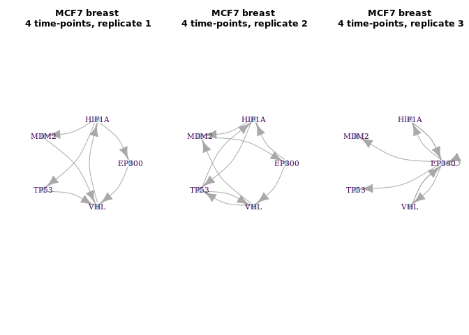
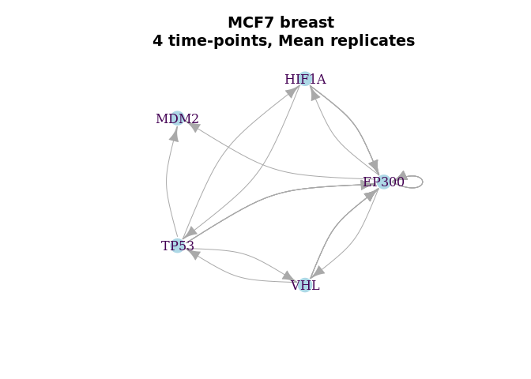

BoolNet Inference MCF-7 breast (GSE47533)
================

Integrated analysis of microRNA and mRNA expression and association with
HIF binding in MCF-7 cells under hypoxia (GSE47533)

Camps C, Saini HK, Mole DR, Choudhry H et al. Integrated analysis of
microRNA and mRNA expression and association with HIF binding reveals
the complexity of microRNA expression regulation under hypoxia. Mol
Cancer 2014 Feb 11;13:28. PMID: 24517586

<https://www.ncbi.nlm.nih.gov/geo/query/acc.cgi?acc=GSE47533>

This SuperSeries is composed of the following SubSeries:

GSE47532 MCF-7 cells under hypoxia \[miRNA\] - Samples (11) - 822 miRNA

GSE47533 MCF-7 cells under hypoxia \[mRNA\] - GPL6884 - Samples (12)

GSE47602 MCF-7 cells under hypoxia (miRNA-Seq) - Samples (8) - missing

``` r
packages_cran = c("igraph", "BoolNet", "BiocManager", "tidyverse", "fs", "ff", "effectsize")
# Install and load packages
package.check <- lapply(packages_cran, FUN = function(x) {
  if (!require(x, character.only = TRUE)) {
    install.packages(x, dependencies = TRUE)
    library(x, character.only = TRUE)
  }
})
# For oligo and ArrayExpress First install:
#install.packages('https://cran.r-project.org/src/contrib/Archive/ff/ff_2.2-14.tar.gz',repos=NULL)
# packages_bioconductor = c("Biobase", "GEOquery", "affyPLM", "ArrayExpress", "illuminaHumanv3.db")
# # Install and load packages
# package.check <- lapply(packages_bioconductor, FUN = function(x) {
#   if (!require(x, character.only = TRUE)) {
#     BiocManager::install(x, dependencies = TRUE)
#     library(x, character.only = TRUE)
#   }
# })
rm(package.check, packages_cran)
```

<!-- ```{r} -->

<!-- download_dir <- fs::path(".data_tmp") -->

<!-- if (!dir_exists(download_dir)) { dir_create(download_dir) } -->

<!-- if (!dir_exists(".data_tmp/GSE47533_series_matrix.txt.gz")) { -->

<!--   GSE47533 <-getGEO("GSE47533", destdir = download_dir, GSEMatrix = T) -->

<!--   } else{ -->

<!--   GSE47533 <-getGEO(filename=".data_tmp/GSE47533_series_matrix.txt.gz") -->

<!-- } -->

<!-- # Normalisation: the data is already normalised -->

<!-- expr.GSE47533 <- as.matrix(exprs(normalize.ExpressionSet.quantiles(GSE47533[[1]]))) -->

<!-- prob.GSE47533 <- unique(rownames(expr.GSE47533)) -->

<!-- data.GSE47533 <- pData(GSE47533[[1]]) -->

<!-- data.GSE47533 <- data.frame( -->

<!--                   codes = as.character(data.GSE47533$geo_accession), -->

<!--                   cell_line = "MCF7", -->

<!--                   time = data.GSE47533$`time of exposure:ch1`, -->

<!--                   condition = substr(as.character(data.GSE47533$description), 1, 4), -->

<!--                   rep = data.GSE47533$description.1) -->

<!-- data.GSE47533 <- data.GSE47533 %>% -->

<!--   mutate(rep = recode(rep, "replicate 1" = 1, -->

<!--                            "replicate 2" = 2, -->

<!--                            "replicate 3" = 3)) %>% -->

<!--   mutate_at(vars(time), as.character)  %>% -->

<!--   mutate(time = ifelse(condition == "Norm", 0, time)) -->

<!-- # Convert the probes to Symbol names -->

<!-- # The below function call will return a datafram with probe_id, gene symbol -->

<!-- # and ŕefgene_id for your data -->

<!-- anno.GSE47533 <- AnnotationDbi::select(illuminaHumanv3.db, -->

<!--        keys = prob.GSE47533, -->

<!--        columns=c("ENSEMBL", "SYMBOL", "GENENAME"), -->

<!--        keytype="PROBEID") -->

<!-- colnames(anno.GSE47533) <- c("probes", "ensgene", "symbol", "description") -->

<!-- rm(download_dir, GSE47533,  prob.GSE47533) -->

<!-- save.image("../data/data.GSE47533.Rdata") -->

<!-- ``` -->

# Load the pre-processed data

``` r
load("../data/data.GSE47533.Rdata")
cols <- colnames(expr.GSE47533)
rows <- rownames(expr.GSE47533)
expr.GSE47533 <- as.data.frame(matrix(effectsize::normalize(as.matrix(expr.GSE47533)), ncol = length(cols), nrow = length(rows) ))
colnames(expr.GSE47533) <- cols
rownames(expr.GSE47533) <- rows 
```

# Selecting the HIF Genes

``` r
# Selected genes from HIF Axis
hif.symbols <- c("TP53", "HIF1A", "EP300", "MDM2", "VHL")
hif.probes <- anno.GSE47533$probes[anno.GSE47533$symbol %in% hif.symbols]

# Select the probes and genes
expr.GSE47533.hif <- data.frame(expr.GSE47533) %>% 
  rownames_to_column('probes') %>% 
  filter(probes %in% hif.probes) %>% 
  merge(anno.GSE47533[anno.GSE47533$symbol %in% hif.symbols, c("probes","symbol")], by = "probes") %>% 
  #distinct(symbol, .keep_all = TRUE) %>% # Take the first one
  dplyr::select(!(probes)) %>% 
  arrange(symbol)
```

# Example of Binarizing

``` r
cols <- (data.GSE47533$rep == 1)
breast1_MCF7 <- 
expr.GSE47533.hif %>% 
  dplyr::select(c("symbol", data.GSE47533$codes[cols])) %>% arrange(symbol) %>% 
  arrange(symbol) %>% 
  rename_at(vars(data.GSE47533$codes[cols]),
            ~paste0(substr(data.GSE47533$condition[cols],1,2),".",
                    data.GSE47533$time[cols],".",
                    substr(data.GSE47533$cell_line[cols],1,2)))

knitr::kable(breast1_MCF7)
```

| symbol |   No.0.MC | Hy.16h.MC | Hy.32h.MC | Hy.48h.MC |
| :----- | --------: | --------: | --------: | --------: |
| EP300  | 0.3905888 | 0.4059010 | 0.3807511 | 0.3843123 |
| HIF1A  | 0.3425241 | 0.2580229 | 0.2966044 | 0.3318575 |
| HIF1A  | 0.4544587 | 0.3946856 | 0.4195721 | 0.4575903 |
| HIF1A  | 0.3373892 | 0.2539398 | 0.3155750 | 0.3127921 |
| MDM2   | 0.2387532 | 0.2707557 | 0.2344911 | 0.2914341 |
| MDM2   | 0.1046909 | 0.0953542 | 0.1050768 | 0.1024391 |
| MDM2   | 0.0802744 | 0.0708871 | 0.0802306 | 0.0856708 |
| TP53   | 0.4333610 | 0.4631014 | 0.4197433 | 0.4349020 |
| VHL    | 0.2860114 | 0.2518470 | 0.2895173 | 0.3811038 |
| VHL    | 0.6636049 | 0.6479165 | 0.6242634 | 0.6568183 |
| VHL    | 0.4648981 | 0.4494688 | 0.4277231 | 0.4031015 |
| VHL    | 0.4393973 | 0.3727216 | 0.4281843 | 0.4088407 |

``` r
binarizeTimeSeries(breast1_MCF7[,-1], method="kmeans")$binarizedMeasurements  %>% 
  data.frame(.)  %>% 
  add_column(symbol = breast1_MCF7$symbol, .before=0) %>% 
  knitr::kable(.)
```

| symbol | No.0.MC | Hy.16h.MC | Hy.32h.MC | Hy.48h.MC |
| :----- | ------: | --------: | --------: | --------: |
| EP300  |       0 |         1 |         0 |         0 |
| HIF1A  |       1 |         0 |         0 |         1 |
| HIF1A  |       1 |         0 |         0 |         1 |
| HIF1A  |       1 |         0 |         1 |         1 |
| MDM2   |       0 |         1 |         0 |         1 |
| MDM2   |       1 |         0 |         1 |         1 |
| MDM2   |       1 |         0 |         1 |         1 |
| TP53   |       0 |         1 |         0 |         0 |
| VHL    |       0 |         0 |         0 |         1 |
| VHL    |       1 |         1 |         0 |         1 |
| VHL    |       1 |         1 |         0 |         0 |
| VHL    |       1 |         0 |         1 |         1 |

``` r
binarizeTimeSeries(breast1_MCF7[,-1], method="kmeans")$binarizedMeasurements  %>% 
  data.frame(.)  %>% 
  aggregate(., list(symbol = breast1_MCF7$symbol), mean) %>% 
  mutate_at(vars(-symbol), funs(ifelse(. >= 0.5, 1, 0))) %>% 
  #rbind(., c("O2", 1,0,0,0)) %>%  # removing O2
  knitr::kable(.)
```

| symbol | No.0.MC | Hy.16h.MC | Hy.32h.MC | Hy.48h.MC |
| :----- | ------: | --------: | --------: | --------: |
| EP300  |       0 |         1 |         0 |         0 |
| HIF1A  |       1 |         0 |         0 |         1 |
| MDM2   |       1 |         0 |         1 |         1 |
| TP53   |       0 |         1 |         0 |         0 |
| VHL    |       1 |         1 |         0 |         1 |

``` r
# Function to binarize according an consensus mean of probes, add the O2 state and rename columns 
binNet <- function(b){
  
  cols <- data.GSE47533$codes %in% names(b)
  
  binarizeTimeSeries(b[,-1], method="kmeans")$binarizedMeasurements  %>% 
  as.data.frame(.)  %>% 
  aggregate(., list(symbol = b$symbol), mean) %>%  # mean of binarized probes
  mutate_at(vars(-symbol), funs(ifelse(. >= 0.5, 1, 0))) %>%  # consensus with a bies to 1 (>= 0.5)
  #rbind(., c("O2", 1,0,0,0)) %>%  # removing O2
    rename_at(vars(data.GSE47533$codes[cols] ),
            ~paste0(substr(data.GSE47533$condition[cols],1,2),".",
                    data.GSE47533$time[cols],".",
                    substr(data.GSE47533$cell_line[cols],1,2), ".",
                    data.GSE47533$rep[cols])) %>% 
  column_to_rownames("symbol")
  
}
```

``` r
# Function to calculate the mean and binarize after, according an consensus mean of probes 

meanBinNet <- function(b){
  
  cols <- data.GSE47533$codes %in% names(b)
  
  b <-b %>% 
  rename_at(vars(data.GSE47533$codes[cols] ),
            ~paste0(substr(data.GSE47533$condition[cols],1,2),".",
                    data.GSE47533$time[cols],".",
                    substr(data.GSE47533$cell_line[cols],1,2), ".",
                    data.GSE47533$rep[cols])) %>% 
  mutate(No.0.MC = rowMeans(dplyr::select(.,starts_with("No.0.MC")), na.rm = TRUE)) %>% 
  mutate(Hy.16h.MC = rowMeans(dplyr::select(.,starts_with("Hy.16h.MC")), na.rm = TRUE)) %>% 
  mutate(Hy.32h.MC = rowMeans(dplyr::select(.,starts_with("Hy.32h.MC")), na.rm = TRUE)) %>% 
  mutate(Hy.48h.MC = rowMeans(dplyr::select(.,starts_with("Hy.48h.MC")), na.rm = TRUE)) %>%
  dplyr::select(c("symbol", "No.0.MC", "Hy.16h.MC", "Hy.32h.MC", "Hy.48h.MC")) 
  
  binarizeTimeSeries(b[,-1], method="kmeans")$binarizedMeasurements  %>% 
  as.data.frame(.)  %>% 
  aggregate(., list(symbol = b$symbol), mean) %>%  # mean of binarized probes
  mutate_at(vars(-symbol), funs(ifelse(. >= 0.5, 1, 0))) %>%  # consensus with a bies to 1 (>= 0.5)
  #rbind(., c("O2", 1,0,0,0)) %>% 
  column_to_rownames("symbol")
  
}
```

``` r
breast_MCF7.1 <- 
expr.GSE47533.hif %>% 
  dplyr::select(c("symbol", data.GSE47533$codes[data.GSE47533$rep == 1]))  %>% 
  binNet(.) 

breast_MCF7.1 %>% 
  knitr::kable(.)
```

|       | No.0.MC.1 | Hy.16h.MC.1 | Hy.32h.MC.1 | Hy.48h.MC.1 |
| :---- | --------: | ----------: | ----------: | ----------: |
| EP300 |         0 |           1 |           0 |           0 |
| HIF1A |         1 |           0 |           0 |           1 |
| MDM2  |         1 |           0 |           1 |           1 |
| TP53  |         0 |           1 |           0 |           0 |
| VHL   |         1 |           1 |           0 |           1 |

``` r
breast_MCF7.2 <- 
expr.GSE47533.hif %>% 
  dplyr::select(c("symbol", data.GSE47533$codes[data.GSE47533$rep == 2]))  %>% 
  binNet(.) 

breast_MCF7.2  %>% 
  knitr::kable(.)
```

|       | No.0.MC.2 | Hy.16h.MC.2 | Hy.32h.MC.2 | Hy.48h.MC.2 |
| :---- | --------: | ----------: | ----------: | ----------: |
| EP300 |         0 |           0 |           1 |           0 |
| HIF1A |         1 |           0 |           0 |           1 |
| MDM2  |         0 |           1 |           0 |           0 |
| TP53  |         1 |           1 |           0 |           0 |
| VHL   |         1 |           0 |           0 |           1 |

``` r
breast_MCF7.3 <- 
expr.GSE47533.hif %>% 
  dplyr::select(c("symbol", data.GSE47533$codes[data.GSE47533$rep == 3]))  %>% 
  binNet(.) 

breast_MCF7.3 %>% 
  knitr::kable(.)
```

|       | No.0.MC.3 | Hy.16h.MC.3 | Hy.32h.MC.3 | Hy.48h.MC.3 |
| :---- | --------: | ----------: | ----------: | ----------: |
| EP300 |         0 |           0 |           1 |           0 |
| HIF1A |         1 |           0 |           0 |           1 |
| MDM2  |         0 |           0 |           0 |           1 |
| TP53  |         1 |           1 |           1 |           0 |
| VHL   |         1 |           0 |           0 |           1 |

``` r
breast_MCF7.mean <- 
cbind(breast_MCF7.1, breast_MCF7.2,breast_MCF7.3) %>%
  tibble::rownames_to_column('gene') %>%
  mutate_at(vars(-gene), as.numeric) %>% 
  mutate(No.0.MC = rowMeans(dplyr::select(.,starts_with("No.0.MC")), na.rm = TRUE)) %>% 
  mutate(Hy.16h.MC = rowMeans(dplyr::select(.,starts_with("Hy.16h.MC")), na.rm = TRUE)) %>% 
  mutate(Hy.32h.MC = rowMeans(dplyr::select(.,starts_with("Hy.32h.MC")), na.rm = TRUE)) %>% 
  mutate(Hy.48h.MC = rowMeans(dplyr::select(.,starts_with("Hy.48h.MC")), na.rm = TRUE)) %>%
  dplyr::select(c("No.0.MC", "Hy.16h.MC", "Hy.32h.MC", "Hy.48h.MC", "gene")) %>%
  mutate_at(c("No.0.MC", "Hy.16h.MC", "Hy.32h.MC", "Hy.48h.MC"), funs(ifelse(. >= 0.5, 1, 0)))  %>%  # consensus with a bies to 1 (>= 0.5)  
  tibble::column_to_rownames('gene')

breast_MCF7.mean %>% 
  knitr::kable(.)
```

|       | No.0.MC | Hy.16h.MC | Hy.32h.MC | Hy.48h.MC |
| :---- | ------: | --------: | --------: | --------: |
| EP300 |       0 |         0 |         1 |         0 |
| HIF1A |       1 |         0 |         0 |         1 |
| MDM2  |       0 |         0 |         0 |         1 |
| TP53  |       1 |         1 |         0 |         0 |
| VHL   |       1 |         0 |         0 |         1 |

``` r
breast.meanBin <- 
expr.GSE47533.hif %>% 
  dplyr::select(c("symbol", data.GSE47533$codes)) %>% meanBinNet(.) 

breast.meanBin %>% 
  knitr::kable(.)
```

|       | No.0.MC | Hy.16h.MC | Hy.32h.MC | Hy.48h.MC |
| :---- | ------: | --------: | --------: | --------: |
| EP300 |       0 |         0 |         1 |         0 |
| HIF1A |       1 |         0 |         0 |         1 |
| MDM2  |       0 |         0 |         0 |         1 |
| TP53  |       1 |         1 |         0 |         0 |
| VHL   |       1 |         0 |         0 |         1 |

``` r
# All breast cancer nets merged:
all.nets <- reconstructNetwork(list(breast_MCF7.1, breast_MCF7.2, breast_MCF7.3),
                               method="bestfit",returnPBN=TRUE,readableFunctions=TRUE)

all.p <- plotNetworkWiring(all.nets, plotIt=F)


# # Mean of replicate breast cancer net without O2 :
# mean.nox.net <- reconstructNetwork(breast_MCF7.mean[c(1:5),],
#                                method="bestfit",returnPBN=TRUE,readableFunctions=TRUE)
# 
# mean.nox.p <- plotNetworkWiring(mean.nox.net, plotIt=F)

# Mean of replicate breast cancer net with only Hypoxia state:
# 
# mean.hyp.net <- reconstructNetwork(breast_MCF7.mean[,c("Hy.16h.MC", "Hy.32h.MC", "Hy.48h.MC")],
#                                method="bestfit",returnPBN=TRUE,readableFunctions=TRUE)
# 
# mean.hyp.p <- plotNetworkWiring(mean.hyp.net, plotIt=F)

  
# Mean AFTER binarize the replicates of breast cancer net :

mean.net <- reconstructNetwork(breast_MCF7.mean,
                               method="bestfit",returnPBN=TRUE,readableFunctions=TRUE)

mean.p <- plotNetworkWiring(mean.net, plotIt=F)


# Mean BEFORE binarize the replicates of breast cancer net :

meanBin.net <- reconstructNetwork(breast.meanBin,
                               method="bestfit",returnPBN=TRUE,readableFunctions=TRUE)

meanBin.p <- plotNetworkWiring(meanBin.net, plotIt=F)
```

# MCF7 breast cancer

``` r
# MCF7 breast cancer - 4 time-points
breast_MCF7.1.net <- reconstructNetwork(breast_MCF7.1, method="bestfit",returnPBN=TRUE,readableFunctions=TRUE)
breast_MCF7.2.net <- reconstructNetwork(breast_MCF7.2, method="bestfit",returnPBN=TRUE,readableFunctions=TRUE)
breast_MCF7.3.net <- reconstructNetwork(breast_MCF7.3, method="bestfit",returnPBN=TRUE,readableFunctions=TRUE)

breast_MCF7.1.p <- plotNetworkWiring(breast_MCF7.1.net, plotIt=F)
breast_MCF7.2.p <- plotNetworkWiring(breast_MCF7.2.net, plotIt=F)
breast_MCF7.3.p <- plotNetworkWiring(breast_MCF7.3.net, plotIt=F)
```

<!-- ```{r} -->

<!-- # MCF7 breast - 4 steps, replicate 1 -->

<!-- print(breast_MCF7.1.net) -->

<!-- # MCF7 breast - 4 steps, replicate 2 -->

<!-- print(breast_MCF7.2.net) -->

<!-- # MCF7 breast - 4 steps, replicate 3 -->

<!-- print(breast_MCF7.3.net) -->

<!-- # MCF7 breast - 4 steps, all replicates -->

<!-- print(all.nets) -->

<!-- # MCF7 breast - 4 steps, all replicates -->

<!-- print(mean.net) -->

<!-- ``` -->

<!-- ```{r} -->

<!-- par(mfrow = c(1,1)) -->

<!-- plot(all.p, vertex.label.color="#440154ff", vertex.color="lightblue", vertex.frame.color="white", layout=layout_in_circle, edge.curved=.3, -->

<!--      main="MCF7 breast\n 4 time-points, all replicates") -->

<!-- ``` -->

<!-- ```{r} -->

<!-- par(mfrow = c(1,1)) -->

<!-- plot(mean.hyp.p, vertex.label.color="#440154ff", vertex.color="lightblue", vertex.frame.color="white", layout=layout_in_circle,# edge.curved=.3, -->

<!--      main="MCF7 breast\n 3 time-points, without Normoxia time-point") -->

<!-- ``` -->

# Mean BEFORE binarize the replicates of breast cancer net :

``` r
par(mfrow = c(1,1))
plot(meanBin.p, vertex.label.color="#440154ff", vertex.color="lightblue", vertex.frame.color="white", layout=layout_in_circle, edge.curved=.3,
     main="MCF7 breast\n 4 time-points, Mean BEFORE binarize replicates")
```

<!-- -->

``` r
print(meanBin.net)
```

    ## Probabilistic Boolean network with 5 genes
    ## 
    ## Involved genes:
    ## EP300 HIF1A MDM2 TP53 VHL
    ## 
    ## Transition functions:
    ## 
    ## Alternative transition functions for gene EP300:
    ## EP300 = (TP53 & !VHL) ( probability: 0.125, error: 0)
    ## EP300 = (!TP53 & VHL) | (TP53 & !VHL) ( probability: 0.125, error: 0)
    ## EP300 = (!HIF1A & TP53) ( probability: 0.125, error: 0)
    ## EP300 = (!HIF1A & TP53) | (HIF1A & !TP53) ( probability: 0.125, error: 0)
    ## EP300 = (!EP300 & !VHL) ( probability: 0.125, error: 0)
    ## EP300 = (!EP300 & !VHL) | (EP300 & VHL) ( probability: 0.125, error: 0)
    ## EP300 = (!EP300 & !HIF1A) ( probability: 0.125, error: 0)
    ## EP300 = (!EP300 & !HIF1A) | (EP300 & HIF1A) ( probability: 0.125, error: 0)
    ## 
    ## Alternative transition functions for gene HIF1A:
    ## HIF1A = (!TP53) ( probability: 0.5, error: 0)
    ## HIF1A = (EP300) ( probability: 0.5, error: 0)
    ## 
    ## Alternative transition functions for gene MDM2:
    ## MDM2 = (!TP53) ( probability: 0.5, error: 0)
    ## MDM2 = (EP300) ( probability: 0.5, error: 0)
    ## 
    ## Alternative transition functions for gene TP53:
    ## TP53 = (VHL) ( probability: 0.5, error: 0)
    ## TP53 = (HIF1A) ( probability: 0.5, error: 0)
    ## 
    ## Alternative transition functions for gene VHL:
    ## VHL = (!TP53) ( probability: 0.5, error: 0)
    ## VHL = (EP300) ( probability: 0.5, error: 0)

``` r
try({
sink("../data/ATOTS_inferred_GSE47533_meanBin.bn")
cat("targets, factors\n")
cat("EP300, (!TP53 & VHL) | (TP53 & !VHL)  \n")
cat("HIF1A,  (!TP53) | (EP300) \n")
cat("MDM2, (!TP53) | (EP300)\n")
cat("TP53, (VHL) | (HIF1A)\n")
cat("VHL, (!TP53) |(EP300)\n")
sink()}, silent = T)
```

``` r
net <- loadNetwork("../data/ATOTS_inferred_GSE47533_meanBin.bn")
print(net)
```

    ## Boolean network with 5 genes
    ## 
    ## Involved genes:
    ## EP300 HIF1A MDM2 TP53 VHL
    ## 
    ## Transition functions:
    ## EP300 = (!TP53 & VHL) | (TP53 & !VHL)
    ## HIF1A = (!TP53) | (EP300)
    ## MDM2 = (!TP53) | (EP300)
    ## TP53 = (VHL) | (HIF1A)
    ## VHL = (!TP53) |(EP300)

``` r
attr.syn <- getAttractors(net, type = "synchronous")
plotAttractors(attr.syn, title = "MCF7 breast, mean Before binarize replicates")
```

<!-- -->

    ## $`5`
    ##       Attr1.1 Attr1.2 Attr1.3 Attr1.4 Attr1.5
    ## EP300       1       0       1       0       0
    ## HIF1A       0       1       1       1       0
    ## MDM2        0       1       1       1       0
    ## TP53        0       0       1       1       1
    ## VHL         0       1       1       1       0

# Mean AFTER binarize the replicates of breast cancer net :

``` r
# MCF7 breast cancer - 4 time-points 
par(mfrow = c(1,3))
plot(breast_MCF7.1.p, vertex.label.color="#440154ff", vertex.color="lightblue", vertex.frame.color="white", layout=layout_in_circle, edge.curved=.3,
     main="MCF7 breast\n 4 time-points, replicate 1")
plot(breast_MCF7.2.p, vertex.label.color="#440154ff", vertex.color="lightblue", vertex.frame.color="white", layout=layout_in_circle, edge.curved=.3,
     main="MCF7 breast\n 4 time-points, replicate 2")
plot(breast_MCF7.3.p, vertex.label.color="#440154ff", vertex.color="lightblue", vertex.frame.color="white", layout=layout_in_circle, edge.curved=.3,
     main="MCF7 breast\n 4 time-points, replicate 3")
```

<!-- -->

``` r
par(mfrow = c(1,1))
plot(mean.p, vertex.label.color="#440154ff", vertex.color="lightblue", vertex.frame.color="white", layout=layout_in_circle, edge.curved=.3,
     main="MCF7 breast\n 4 time-points, Mean replicates")
```

<!-- -->

``` r
print(mean.net)
```

    ## Probabilistic Boolean network with 5 genes
    ## 
    ## Involved genes:
    ## EP300 HIF1A MDM2 TP53 VHL
    ## 
    ## Transition functions:
    ## 
    ## Alternative transition functions for gene EP300:
    ## EP300 = (TP53 & !VHL) ( probability: 0.125, error: 0)
    ## EP300 = (!TP53 & VHL) | (TP53 & !VHL) ( probability: 0.125, error: 0)
    ## EP300 = (!HIF1A & TP53) ( probability: 0.125, error: 0)
    ## EP300 = (!HIF1A & TP53) | (HIF1A & !TP53) ( probability: 0.125, error: 0)
    ## EP300 = (!EP300 & !VHL) ( probability: 0.125, error: 0)
    ## EP300 = (!EP300 & !VHL) | (EP300 & VHL) ( probability: 0.125, error: 0)
    ## EP300 = (!EP300 & !HIF1A) ( probability: 0.125, error: 0)
    ## EP300 = (!EP300 & !HIF1A) | (EP300 & HIF1A) ( probability: 0.125, error: 0)
    ## 
    ## Alternative transition functions for gene HIF1A:
    ## HIF1A = (!TP53) ( probability: 0.5, error: 0)
    ## HIF1A = (EP300) ( probability: 0.5, error: 0)
    ## 
    ## Alternative transition functions for gene MDM2:
    ## MDM2 = (!TP53) ( probability: 0.5, error: 0)
    ## MDM2 = (EP300) ( probability: 0.5, error: 0)
    ## 
    ## Alternative transition functions for gene TP53:
    ## TP53 = (VHL) ( probability: 0.5, error: 0)
    ## TP53 = (HIF1A) ( probability: 0.5, error: 0)
    ## 
    ## Alternative transition functions for gene VHL:
    ## VHL = (!TP53) ( probability: 0.5, error: 0)
    ## VHL = (EP300) ( probability: 0.5, error: 0)

<!-- ```{r} -->

<!-- par(mfrow = c(1,1)) -->

<!-- plot(mean.nox.p, vertex.label.color="#440154ff", vertex.color="lightblue", vertex.frame.color="white", layout=layout_in_circle, edge.curved=.3, -->

<!--      main="MCF7 breast\n 4 time-points, without O2") -->

<!-- ``` -->

``` r
# sink("ATOTS_inferred.bn")
# cat("targets, factors\n")
# cat("EP300, (TP53 & !VHL) | (!TP53 & VHL) | (TP53 & !VHL) | (!HIF1A & TP53) |  (!HIF1A & TP53) | (HIF1A & !TP53) | (!EP300 & !VHL) | (!EP300 & !VHL) | (EP300 & VHL) | (!EP300 & !HIF1A) | (EP300 & HIF1A)\n")
# cat("HIF1A, !TP53 | EP300\n")
# cat("MDM2, TP53 & !VHL\n")
# cat("TP53, VHL | HIF1A\n")
# cat("VHL, !TP53 | !EP300\n")
# sink()
try({
sink("../data/ATOTS_inferred_GSE47533.bn")
cat("targets, factors\n")
cat("EP300, (!HIF1A & TP53) | (HIF1A & !TP53)\n")
cat("HIF1A, EP300\n")
cat("MDM2, EP300\n")
cat("TP53, HIF1A\n")
cat("VHL, !TP53\n")
sink()}, silent = T)
```

``` r
net <- loadNetwork("../data/ATOTS_inferred_GSE47533.bn")
print(net)
```

    ## Boolean network with 5 genes
    ## 
    ## Involved genes:
    ## EP300 HIF1A MDM2 TP53 VHL
    ## 
    ## Transition functions:
    ## EP300 = (!HIF1A & TP53) | (HIF1A & !TP53)
    ## HIF1A = EP300
    ## MDM2 = EP300
    ## TP53 = HIF1A
    ## VHL = !TP53

``` r
attr.syn <- getAttractors(net, type = "synchronous")
plotAttractors(attr.syn, title = "MCF7 breast, mean After binarize replicates")
```

<!-- --><!-- -->

    ## $`1`
    ##       Attr1.1
    ## EP300       0
    ## HIF1A       0
    ## MDM2        0
    ## TP53        0
    ## VHL         1
    ## 
    ## $`7`
    ##       Attr2.1 Attr2.2 Attr2.3 Attr2.4 Attr2.5 Attr2.6 Attr2.7
    ## EP300       1       0       1       1       1       0       0
    ## HIF1A       0       1       0       1       1       1       0
    ## MDM2        0       1       0       1       1       1       0
    ## TP53        0       0       1       0       1       1       1
    ## VHL         0       1       1       0       1       0       0
