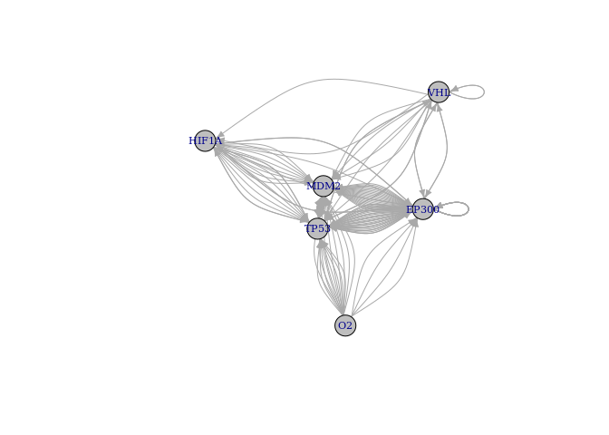
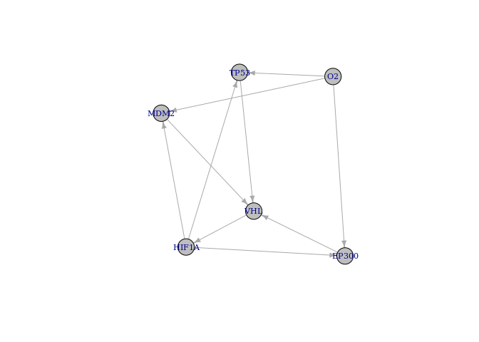
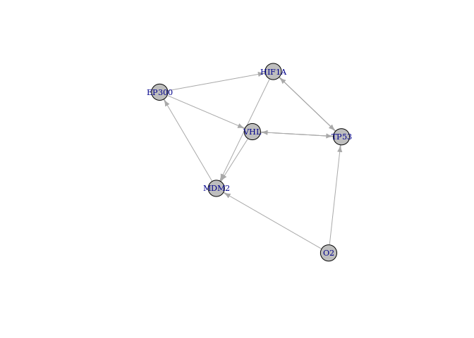
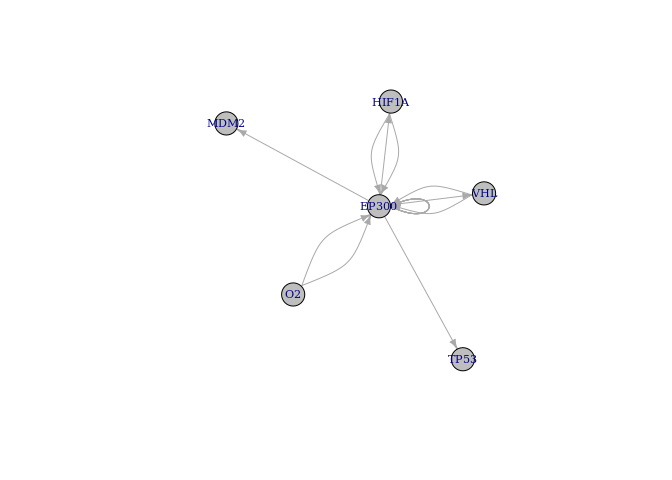

BoolNet Inference (GSE47533)
================

Integrated analysis of microRNA and mRNA expression and association with
HIF binding in MCF-7 cells under hypoxia (GSE47533)

Camps C, Saini HK, Mole DR, Choudhry H et al. Integrated analysis of
microRNA and mRNA expression and association with HIF binding reveals
the complexity of microRNA expression regulation under hypoxia. Mol
Cancer 2014 Feb 11;13:28. PMID: 24517586

<https://www.ncbi.nlm.nih.gov/geo/query/acc.cgi?acc=GSE47533>

This SuperSeries is composed of the following SubSeries:

GSE47532 MCF-7 cells under hypoxia \[miRNA\] - GPL8227 Agilent-019118
Human miRNA Microarray 2.0 G4470B - Samples (11) - 822 miRNA

GSE47533 MCF-7 cells under hypoxia \[mRNA\] - GPL6884 Illumina HumanWG-6
v3.0 expression beadchip - Samples (12)

GSE47602 MCF-7 cells under hypoxia (miRNA-Seq) - GPL11154 Illumina HiSeq
2000 (Homo sapiens) - Samples (8) - Don’t exist

``` r
packages_cran = c("igraph", "BoolNet", "BiocManager", "tidyverse", "fs", "ff")


# Install and load packages
package.check <- lapply(packages_cran, FUN = function(x) {
  if (!require(x, character.only = TRUE)) {
    install.packages(x, dependencies = TRUE)
    library(x, character.only = TRUE)
  }
})

# For oligo and ArrayExpress First install:
#install.packages('https://cran.r-project.org/src/contrib/Archive/ff/ff_2.2-14.tar.gz',repos=NULL)

packages_bioconductor = c("Biobase", "GEOquery", "oligo", "ArrayExpress", "hgu133plus2.db", "preprocessCore")

# Install and load packages
package.check <- lapply(packages_bioconductor, FUN = function(x) {
  if (!require(x, character.only = TRUE)) {
    BiocManager::install(x, dependencies = TRUE)
    library(x, character.only = TRUE)
  }
})

rm(package.check, packages_bioconductor, packages_cran)
```

``` r
download_dir <- fs::path(".data_tmp")
if (!dir_exists(download_dir)) { dir_create(download_dir) }  

GSE47533 <-getGEO("GSE47533", destdir = download_dir, GSEMatrix = T)
```

    ## Found 1 file(s)

    ## GSE47533_series_matrix.txt.gz

    ## Using locally cached version: .data_tmp/GSE47533_series_matrix.txt.gz

    ## 
    ## ── Column specification ──────────────────────────────────────────────────────────────────────────────────────────────────────────────
    ## cols(
    ##   ID_REF = col_character(),
    ##   GSM1151682 = col_double(),
    ##   GSM1151683 = col_double(),
    ##   GSM1151684 = col_double(),
    ##   GSM1151685 = col_double(),
    ##   GSM1151686 = col_double(),
    ##   GSM1151687 = col_double(),
    ##   GSM1151688 = col_double(),
    ##   GSM1151689 = col_double(),
    ##   GSM1151690 = col_double(),
    ##   GSM1151691 = col_double(),
    ##   GSM1151692 = col_double(),
    ##   GSM1151693 = col_double()
    ## )

    ## Using locally cached version of GPL6884 found here:
    ## .data_tmp/GPL6884.soft

``` r
expr.GSE47533 <- exprs(GSE47533[[1]])
prob.GSE47533 <- unique(rownames(expr.GSE47533))
data.GSE47533 <- pData(GSE47533[[1]])

data.GSE47533 <- data.frame(
                  codes = as.character(data.GSE47533$geo_accession),
                  cell_line = "MCF7",
                  time = data.GSE47533$`time of exposure:ch1`,
                  condition = substr(as.character(data.GSE47533$description), 1, 4),
                  rep = data.GSE47533$description.1)

data.GSE47533 <- data.GSE47533 %>%
  mutate(rep = recode(rep, "replicate 1" = 1,
                           "replicate 2" = 2,
                           "replicate 3" = 3)) 

data.GSE47533$time <- as.character(data.GSE47533$time)
data.GSE47533$time[data.GSE47533$condition == "Norm"] <- ''


# Convert the probes to Symbol names

#  load/install the package
if(!require("illuminaHumanv3.db")) BiocManager::install("illuminaHumanv3.db")
```

    ## Loading required package: illuminaHumanv3.db

    ## 

``` r
# The below function call will return a datafram with probe_id, gene symbol
# and ŕefgene_id for your data

anno.GSE47533 <- AnnotationDbi::select(illuminaHumanv3.db, 
       keys = prob.GSE47533, 
       columns=c("ENSEMBL", "SYMBOL", "GENENAME"), 
       keytype="PROBEID")
```

    ## 'select()' returned 1:many mapping between keys and columns

``` r
colnames(anno.GSE47533) <- c("probes", "ensgene", "symbol", "description")

rm(download_dir, GSE47533,  prob.GSE47533)
```

# Selecting the HIF Genes

``` r
# Genes from Boolean Network:    
# HIF1a, HIF2a, p53, BNIP3, VEGF, cMyc, Oct4, cdc20, cycA, cycB, cycE, cycD, p27, Rb, E2F, cdh1, mdm2, BAD, BclX

# hif.symbols <- c("HIF1A", "HIF1", "PASD8", "MOP1", "EPAS1", "HIF2A", "HLF", "PASD2", "MOP2", "VEGFA", "VPF", "MVCD1", "VEGF-A", "TP53", "P53", "MYC", "C-Myc", "POU5F1", "OCT3", "OTF3", "CDC20", "P55CDC", "CDC20A", "CCNA1", "CCNA1", "CCNA2", "CCN1", "CCNA", "CCNB1", "CCNB", "CCNB1", "CCNB2", "CCNB2", "HsT17299", "CCND1", "PRAD1", "CCND2", "MPPH3", "CCNE1", "CCNE1", "CCNE", "PCCNE1", "CCNE2", "CCNE2", "CCNE", "PCCNE1", "CDKN1B", "KIP1", "P27KIP1", "CDKN4MEN4", "RB1", "PPP1R130", "Pp110", "E2F1", "RBAP-1", "BNIP3", "NIP3", "BCL2", "MCL1", "BCL2L3", "CDH1", "CD324", "UBE2C", "BAD", "BCL2L8", "VHL", "PVHL", "VHL1", "MDM2", "HDM2", "EP300", "P300", "KAT3B")

# Selected genes from HIF Axis
hif.symbols <- c("TP53", "HIF1A", "EP300", "MDM2", "VHL")

hif.probes <- anno.GSE47533$probes[anno.GSE47533$symbol %in% hif.symbols]

# Select the probes and genes
expr.GSE47533.hif <- data.frame(expr.GSE47533) %>% 
  rownames_to_column('probes') %>% 
  filter(probes %in% hif.probes) %>% 
  merge(anno.GSE47533[anno.GSE47533$symbol %in% hif.symbols, c("probes","symbol")], by = "probes") %>% 
  #distinct(symbol, .keep_all = TRUE) %>% # Take the first one
  dplyr::select(!(probes)) %>% 
  arrange(symbol)
  

# Function to binarize according an consensus mean of probes, add the O2 state and rename columns 
binNet <- function(b){
  binarizeTimeSeries(b[,-5], method="kmeans")$binarizedMeasurements  %>% 
  data.frame(.)  %>% 
  aggregate(., list(symbol = b$symbol), mean) %>% 
  mutate_at(vars(-symbol), funs(ifelse(. > 0.4, 1, 0))) %>% 
  rbind(., c("O2", 1,0,0,0)) %>% 
    rename_at(vars(data.GSE47533$codes[data.GSE47533$codes %in% names(b)]),
            ~paste0(data.GSE47533$condition[data.GSE47533$codes %in% names(b)],".",
                    data.GSE47533$time[data.GSE47533$codes %in% names(b)],".",
                    data.GSE47533$rep[data.GSE47533$codes %in% names(b)])) %>% 
  column_to_rownames("symbol")
}
```

``` r
breast1_MCF7 <- 
expr.GSE47533.hif %>% 
  dplyr::select(c(data.GSE47533$codes[data.GSE47533$rep == 1], "symbol")) %>% arrange(symbol)

names(breast1_MCF7) <- c("Norm..1","Hypo.16h.1","Hypo.32h.1","Hypo.48h.1", "symbol")

knitr::kable(breast1_MCF7[, c("symbol", "Norm..1","Hypo.16h.1","Hypo.32h.1","Hypo.48h.1")])
```

| symbol |   Norm..1 | Hypo.16h.1 | Hypo.32h.1 | Hypo.48h.1 |
| :----- | --------: | ---------: | ---------: | ---------: |
| EP300  |  9.038936 |   9.183945 |   8.945772 |   8.979497 |
| HIF1A  |  8.583756 |   7.783518 |   8.148891 |   8.482742 |
| HIF1A  |  9.643793 |   9.077734 |   9.313412 |   9.673450 |
| HIF1A  |  8.535129 |   7.744851 |   8.328545 |   8.302191 |
| MDM2   |  7.601032 |   7.904100 |   7.560669 |   8.099927 |
| MDM2   |  6.331443 |   6.243023 |   6.335099 |   6.310119 |
| MDM2   |  6.100215 |   6.011316 |   6.099801 |   6.151320 |
| TP53   |  9.443995 |   9.725640 |   9.315033 |   9.458588 |
| VHL    |  8.048573 |   7.725032 |   8.081774 |   8.949112 |
| VHL    | 11.624437 |  11.475865 |  11.251867 |  11.560166 |
| VHL    |  9.742655 |   9.596538 |   9.390603 |   9.157433 |
| VHL    |  9.501160 |   8.869732 |   9.394971 |   9.211784 |

``` r
binarizeTimeSeries(breast1_MCF7[,-5], method="kmeans")$binarizedMeasurements  %>% 
  data.frame(.)  %>% 
  add_column(symbol = breast1_MCF7$symbol) %>%   dplyr::select(c("symbol", "Norm..1","Hypo.16h.1","Hypo.32h.1","Hypo.48h.1"))  %>% 
  knitr::kable(.)
```

| symbol | Norm..1 | Hypo.16h.1 | Hypo.32h.1 | Hypo.48h.1 |
| :----- | ------: | ---------: | ---------: | ---------: |
| EP300  |       0 |          1 |          0 |          0 |
| HIF1A  |       1 |          0 |          0 |          1 |
| HIF1A  |       1 |          0 |          0 |          1 |
| HIF1A  |       1 |          0 |          1 |          1 |
| MDM2   |       0 |          1 |          0 |          1 |
| MDM2   |       1 |          0 |          1 |          1 |
| MDM2   |       1 |          0 |          1 |          1 |
| TP53   |       0 |          1 |          0 |          0 |
| VHL    |       0 |          0 |          0 |          1 |
| VHL    |       1 |          1 |          0 |          1 |
| VHL    |       1 |          1 |          0 |          0 |
| VHL    |       1 |          0 |          1 |          1 |

``` r
binarizeTimeSeries(breast1_MCF7[,-5], method="kmeans")$binarizedMeasurements  %>% 
  data.frame(.)  %>% 
  aggregate(., list(symbol = breast1_MCF7$symbol), mean) %>% 
  mutate_at(vars(-symbol), funs(ifelse(. > 0.4, 1, 0))) %>% 
  rbind(., c("O2", 1,0,0,0)) %>% 
  knitr::kable(.)
```

    ## Warning: `funs()` is deprecated as of dplyr 0.8.0.
    ## Please use a list of either functions or lambdas: 
    ## 
    ##   # Simple named list: 
    ##   list(mean = mean, median = median)
    ## 
    ##   # Auto named with `tibble::lst()`: 
    ##   tibble::lst(mean, median)
    ## 
    ##   # Using lambdas
    ##   list(~ mean(., trim = .2), ~ median(., na.rm = TRUE))
    ## This warning is displayed once every 8 hours.
    ## Call `lifecycle::last_warnings()` to see where this warning was generated.

| symbol | Norm..1 | Hypo.16h.1 | Hypo.32h.1 | Hypo.48h.1 |
| :----- | :------ | :--------- | :--------- | :--------- |
| EP300  | 0       | 1          | 0          | 0          |
| HIF1A  | 1       | 0          | 0          | 1          |
| MDM2   | 1       | 0          | 1          | 1          |
| TP53   | 0       | 1          | 0          | 0          |
| VHL    | 1       | 1          | 0          | 1          |
| O2     | 1       | 0          | 0          | 0          |

# MDA-MB231 breast cancer

``` r
breast1_MCF7 <- 
expr.GSE47533.hif %>% 
  dplyr::select(c(data.GSE47533$codes[data.GSE47533$rep == 1], "symbol"))  %>% 
  binNet(.) 
knitr::kable(breast1_MCF7)
```

|       | Norm..1 | Hypo.16h.1 | Hypo.32h.1 | Hypo.48h.1 |
| :---- | :------ | :--------- | :--------- | :--------- |
| EP300 | 0       | 1          | 0          | 0          |
| HIF1A | 1       | 0          | 0          | 1          |
| MDM2  | 1       | 0          | 1          | 1          |
| TP53  | 0       | 1          | 0          | 0          |
| VHL   | 1       | 1          | 0          | 1          |
| O2    | 1       | 0          | 0          | 0          |

``` r
breast2_MCF7 <- 
expr.GSE47533.hif %>% 
  dplyr::select(c(data.GSE47533$codes[data.GSE47533$rep == 2], "symbol"))  %>% 
  binNet(.) 
knitr::kable(breast2_MCF7)
```

|       | Norm..2 | Hypo.16h.2 | Hypo.32h.2 | Hypo.48h.2 |
| :---- | :------ | :--------- | :--------- | :--------- |
| EP300 | 0       | 0          | 1          | 0          |
| HIF1A | 1       | 0          | 0          | 1          |
| MDM2  | 0       | 1          | 0          | 0          |
| TP53  | 1       | 1          | 0          | 0          |
| VHL   | 1       | 0          | 0          | 1          |
| O2    | 1       | 0          | 0          | 0          |

``` r
breast3_MCF7 <- 
expr.GSE47533.hif %>% 
  dplyr::select(c(data.GSE47533$codes[data.GSE47533$rep == 3], "symbol"))  %>% 
  binNet(.) 
knitr::kable(breast3_MCF7)
```

|       | Norm..3 | Hypo.16h.3 | Hypo.32h.3 | Hypo.48h.3 |
| :---- | :------ | :--------- | :--------- | :--------- |
| EP300 | 0       | 0          | 1          | 0          |
| HIF1A | 1       | 0          | 0          | 1          |
| MDM2  | 0       | 0          | 0          | 1          |
| TP53  | 1       | 1          | 1          | 0          |
| VHL   | 1       | 0          | 0          | 1          |
| O2    | 1       | 0          | 0          | 0          |

``` r
# All breast cancer nets merged:

net <- reconstructNetwork(list(breast1_MCF7, breast2_MCF7, breast3_MCF7), method="bestfit",returnPBN=TRUE,readableFunctions=TRUE)
plotNetworkWiring(net)
```

<!-- -->

``` r
print(net)
```

    ## Probabilistic Boolean network with 6 genes
    ## 
    ## Involved genes:
    ## EP300 HIF1A MDM2 TP53 VHL O2
    ## 
    ## Transition functions:
    ## 
    ## Alternative transition functions for gene EP300:
    ## EP300 = (!EP300 & !TP53 & O2) | (!EP300 & TP53 & !O2) ( probability: 0.1, error: 0)
    ## EP300 = (!EP300 & !TP53 & O2) | (!EP300 & TP53 & !O2) | (EP300 & TP53 & O2) ( probability: 0.1, error: 0)
    ## EP300 = (!TP53 & O2) | (!EP300 & TP53 & !O2) ( probability: 0.1, error: 0)
    ## EP300 = (!TP53 & O2) | (!EP300 & TP53 & !O2) | (EP300 & O2) ( probability: 0.1, error: 0)
    ## EP300 = (!EP300 & !TP53 & VHL) | (!EP300 & TP53 & !VHL) ( probability: 0.1, error: 0)
    ## EP300 = (!TP53 & VHL) | (!EP300 & TP53 & !VHL) ( probability: 0.1, error: 0)
    ## EP300 = (!EP300 & !HIF1A & TP53) | (!EP300 & HIF1A & !TP53) ( probability: 0.1, error: 0)
    ## EP300 = (!EP300 & !HIF1A & TP53) | (!EP300 & HIF1A & !TP53) | (EP300 & HIF1A & TP53) ( probability: 0.1, error: 0)
    ## EP300 = (!EP300 & !HIF1A & TP53) | (HIF1A & !TP53) ( probability: 0.1, error: 0)
    ## EP300 = (!EP300 & !HIF1A & TP53) | (HIF1A & !TP53) | (EP300 & HIF1A) ( probability: 0.1, error: 0)
    ## 
    ## Alternative transition functions for gene HIF1A:
    ## HIF1A = (!TP53 & !VHL) | (EP300 & !VHL) ( probability: 0.5, error: 0)
    ## HIF1A = (!TP53 & !VHL) | (EP300 & !TP53) | (EP300 & !VHL) ( probability: 0.5, error: 0)
    ## 
    ## Alternative transition functions for gene MDM2:
    ## MDM2 = (!EP300 & !TP53 & !O2) | (EP300 & TP53 & !O2) ( probability: 0.05, error: 1)
    ## MDM2 = (!EP300 & !TP53 & !O2) | (EP300 & TP53) ( probability: 0.05, error: 1)
    ## MDM2 = (!EP300 & !TP53 & !O2) | (EP300 & !TP53 & O2) | (EP300 & TP53 & !O2) ( probability: 0.05, error: 1)
    ## MDM2 = (!EP300 & !TP53 & !O2) | (EP300 & O2) | (EP300 & TP53) ( probability: 0.05, error: 1)
    ## MDM2 = (!EP300 & !TP53 & !O2) | (!EP300 & TP53 & O2) | (EP300 & TP53 & !O2) ( probability: 0.05, error: 1)
    ## MDM2 = (!EP300 & !TP53 & !O2) | (TP53 & O2) | (EP300 & TP53) ( probability: 0.05, error: 1)
    ## MDM2 = (!EP300 & !TP53 & !O2) | (!EP300 & TP53 & O2) | (EP300 & !TP53 & O2) | (EP300 & TP53 & !O2) ( probability: 0.05, error: 1)
    ## MDM2 = (!EP300 & !TP53 & !O2) | (TP53 & O2) | (EP300 & O2) | (EP300 & TP53) ( probability: 0.05, error: 1)
    ## MDM2 = (!EP300 & !TP53 & !VHL) | (EP300 & TP53) ( probability: 0.05, error: 1)
    ## MDM2 = (!EP300 & !TP53 & !VHL) | (EP300 & VHL) | (EP300 & TP53) ( probability: 0.05, error: 1)
    ## MDM2 = (!EP300 & !TP53 & !VHL) | (TP53 & VHL) | (EP300 & TP53) ( probability: 0.05, error: 1)
    ## MDM2 = (!EP300 & !TP53 & !VHL) | (TP53 & VHL) | (EP300 & VHL) | (EP300 & TP53) ( probability: 0.05, error: 1)
    ## MDM2 = (!EP300 & !HIF1A & !TP53) | (EP300 & !HIF1A & TP53) ( probability: 0.05, error: 1)
    ## MDM2 = (!EP300 & !HIF1A & !TP53) | (EP300 & TP53) ( probability: 0.05, error: 1)
    ## MDM2 = (!EP300 & !HIF1A & !TP53) | (EP300 & !HIF1A & TP53) | (EP300 & HIF1A & !TP53) ( probability: 0.05, error: 1)
    ## MDM2 = (!EP300 & !HIF1A & !TP53) | (EP300 & TP53) | (EP300 & HIF1A) ( probability: 0.05, error: 1)
    ## MDM2 = (!EP300 & !HIF1A & !TP53) | (!EP300 & HIF1A & TP53) | (EP300 & !HIF1A & TP53) ( probability: 0.05, error: 1)
    ## MDM2 = (!EP300 & !HIF1A & !TP53) | (HIF1A & TP53) | (EP300 & TP53) ( probability: 0.05, error: 1)
    ## MDM2 = (!EP300 & !HIF1A & !TP53) | (!EP300 & HIF1A & TP53) | (EP300 & !HIF1A & TP53) | (EP300 & HIF1A & !TP53) ( probability: 0.05, error: 1)
    ## MDM2 = (!EP300 & !HIF1A & !TP53) | (HIF1A & TP53) | (EP300 & TP53) | (EP300 & HIF1A) ( probability: 0.05, error: 1)
    ## 
    ## Alternative transition functions for gene TP53:
    ## TP53 = (!EP300 & !MDM2) | (!EP300 & O2) ( probability: 0.05, error: 0)
    ## TP53 = (!EP300 & !MDM2) | (MDM2 & O2) ( probability: 0.05, error: 0)
    ## TP53 = (!EP300 & !MDM2) | (!EP300 & O2) | (EP300 & MDM2 & !O2) ( probability: 0.05, error: 0)
    ## TP53 = (!EP300 & !MDM2) | (MDM2 & O2) | (EP300 & MDM2) ( probability: 0.05, error: 0)
    ## TP53 = (!EP300 & !MDM2) | (!EP300 & O2) | (!MDM2 & O2) ( probability: 0.05, error: 0)
    ## TP53 = (!EP300 & !MDM2) | (O2) ( probability: 0.05, error: 0)
    ## TP53 = (!EP300 & !MDM2) | (!EP300 & O2) | (!MDM2 & O2) | (EP300 & MDM2 & !O2) ( probability: 0.05, error: 0)
    ## TP53 = (!EP300 & !MDM2) | (O2) | (EP300 & MDM2) ( probability: 0.05, error: 0)
    ## TP53 = (!EP300 & !MDM2) | (!EP300 & VHL) ( probability: 0.05, error: 0)
    ## TP53 = (!EP300 & !MDM2) | (MDM2 & VHL) ( probability: 0.05, error: 0)
    ## TP53 = (!EP300 & !MDM2) | (!EP300 & VHL) | (EP300 & MDM2 & !VHL) ( probability: 0.05, error: 0)
    ## TP53 = (!EP300 & !MDM2) | (MDM2 & VHL) | (EP300 & MDM2) ( probability: 0.05, error: 0)
    ## TP53 = (!EP300 & !MDM2) | (!EP300 & HIF1A) ( probability: 0.05, error: 0)
    ## TP53 = (!EP300 & !MDM2) | (HIF1A & MDM2) ( probability: 0.05, error: 0)
    ## TP53 = (!EP300 & !MDM2) | (!EP300 & HIF1A) | (HIF1A & !MDM2) ( probability: 0.05, error: 0)
    ## TP53 = (!EP300 & !MDM2) | (HIF1A) ( probability: 0.05, error: 0)
    ## TP53 = (!EP300 & !MDM2) | (!EP300 & HIF1A) | (EP300 & !HIF1A & MDM2) ( probability: 0.05, error: 0)
    ## TP53 = (!EP300 & !MDM2) | (HIF1A & MDM2) | (EP300 & MDM2) ( probability: 0.05, error: 0)
    ## TP53 = (!EP300 & !MDM2) | (!EP300 & HIF1A) | (EP300 & !HIF1A & MDM2) | (HIF1A & !MDM2) ( probability: 0.05, error: 0)
    ## TP53 = (!EP300 & !MDM2) | (HIF1A) | (EP300 & MDM2) ( probability: 0.05, error: 0)
    ## 
    ## Alternative transition functions for gene VHL:
    ## VHL = (!TP53 & !VHL) | (!EP300 & !TP53) | (EP300 & !VHL) ( probability: 0.5, error: 0)
    ## VHL = (!TP53) | (EP300 & !VHL) ( probability: 0.5, error: 0)
    ## 
    ## Alternative transition functions for gene O2:
    ## O2 = 0 ( probability: 1, error: 0)
    ## 
    ## Knocked-out and over-expressed genes:
    ## O2 = 0

``` r
# Individual nets of each replica:

net <- reconstructNetwork(breast1_MCF7, method="bestfit",returnPBN=TRUE,readableFunctions=TRUE)
plotNetworkWiring(net)
```

<!-- -->

``` r
print(net)
```

    ## Probabilistic Boolean network with 6 genes
    ## 
    ## Involved genes:
    ## EP300 HIF1A MDM2 TP53 VHL O2
    ## 
    ## Transition functions:
    ## 
    ## Alternative transition functions for gene EP300:
    ## EP300 = (O2) ( probability: 0.5, error: 0)
    ## EP300 = (HIF1A) ( probability: 0.5, error: 0)
    ## 
    ## Alternative transition functions for gene HIF1A:
    ## HIF1A = (!VHL) ( probability: 1, error: 0)
    ## 
    ## Alternative transition functions for gene MDM2:
    ## MDM2 = (!O2) ( probability: 0.5, error: 0)
    ## MDM2 = (!HIF1A) ( probability: 0.5, error: 0)
    ## 
    ## Alternative transition functions for gene TP53:
    ## TP53 = (O2) ( probability: 0.5, error: 0)
    ## TP53 = (HIF1A) ( probability: 0.5, error: 0)
    ## 
    ## Alternative transition functions for gene VHL:
    ## VHL = (!TP53) ( probability: 0.3333333, error: 0)
    ## VHL = (MDM2) ( probability: 0.3333333, error: 0)
    ## VHL = (!EP300) ( probability: 0.3333333, error: 0)
    ## 
    ## Alternative transition functions for gene O2:
    ## O2 = 0 ( probability: 1, error: 0)
    ## 
    ## Knocked-out and over-expressed genes:
    ## O2 = 0

``` r
net <- reconstructNetwork(breast2_MCF7, method="bestfit",returnPBN=TRUE,readableFunctions=TRUE)
plotNetworkWiring(net)
```

<!-- -->

``` r
print(net)
```

    ## Probabilistic Boolean network with 6 genes
    ## 
    ## Involved genes:
    ## EP300 HIF1A MDM2 TP53 VHL O2
    ## 
    ## Transition functions:
    ## 
    ## Alternative transition functions for gene EP300:
    ## EP300 = (MDM2) ( probability: 1, error: 0)
    ## 
    ## Alternative transition functions for gene HIF1A:
    ## HIF1A = (!TP53) ( probability: 0.5, error: 0)
    ## HIF1A = (EP300) ( probability: 0.5, error: 0)
    ## 
    ## Alternative transition functions for gene MDM2:
    ## MDM2 = (O2) ( probability: 0.3333333, error: 0)
    ## MDM2 = (VHL) ( probability: 0.3333333, error: 0)
    ## MDM2 = (HIF1A) ( probability: 0.3333333, error: 0)
    ## 
    ## Alternative transition functions for gene TP53:
    ## TP53 = (O2) ( probability: 0.3333333, error: 0)
    ## TP53 = (VHL) ( probability: 0.3333333, error: 0)
    ## TP53 = (HIF1A) ( probability: 0.3333333, error: 0)
    ## 
    ## Alternative transition functions for gene VHL:
    ## VHL = (!TP53) ( probability: 0.5, error: 0)
    ## VHL = (EP300) ( probability: 0.5, error: 0)
    ## 
    ## Alternative transition functions for gene O2:
    ## O2 = 0 ( probability: 1, error: 0)
    ## 
    ## Knocked-out and over-expressed genes:
    ## O2 = 0

``` r
net <- reconstructNetwork(breast3_MCF7, method="bestfit",returnPBN=TRUE,readableFunctions=TRUE)
plotNetworkWiring(net)
```

<!-- -->

``` r
print(net)
```

    ## Probabilistic Boolean network with 6 genes
    ## 
    ## Involved genes:
    ## EP300 HIF1A MDM2 TP53 VHL O2
    ## 
    ## Transition functions:
    ## 
    ## Alternative transition functions for gene EP300:
    ## EP300 = (!EP300 & !O2) ( probability: 0.1666667, error: 0)
    ## EP300 = (!EP300 & !O2) | (EP300 & O2) ( probability: 0.1666667, error: 0)
    ## EP300 = (!EP300 & !VHL) ( probability: 0.1666667, error: 0)
    ## EP300 = (!EP300 & !VHL) | (EP300 & VHL) ( probability: 0.1666667, error: 0)
    ## EP300 = (!EP300 & !HIF1A) ( probability: 0.1666667, error: 0)
    ## EP300 = (!EP300 & !HIF1A) | (EP300 & HIF1A) ( probability: 0.1666667, error: 0)
    ## 
    ## Alternative transition functions for gene HIF1A:
    ## HIF1A = (EP300) ( probability: 1, error: 0)
    ## 
    ## Alternative transition functions for gene MDM2:
    ## MDM2 = (EP300) ( probability: 1, error: 0)
    ## 
    ## Alternative transition functions for gene TP53:
    ## TP53 = (!EP300) ( probability: 1, error: 0)
    ## 
    ## Alternative transition functions for gene VHL:
    ## VHL = (EP300) ( probability: 1, error: 0)
    ## 
    ## Alternative transition functions for gene O2:
    ## O2 = 0 ( probability: 1, error: 0)
    ## 
    ## Knocked-out and over-expressed genes:
    ## O2 = 0
