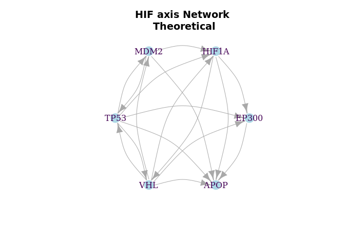
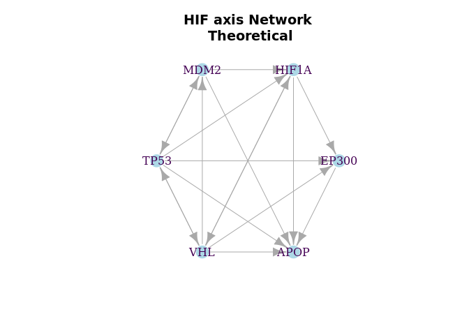
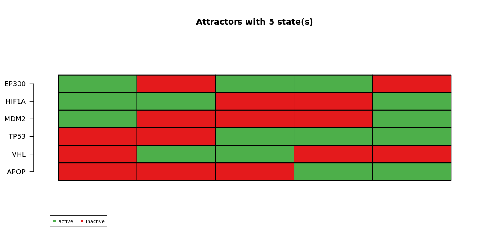
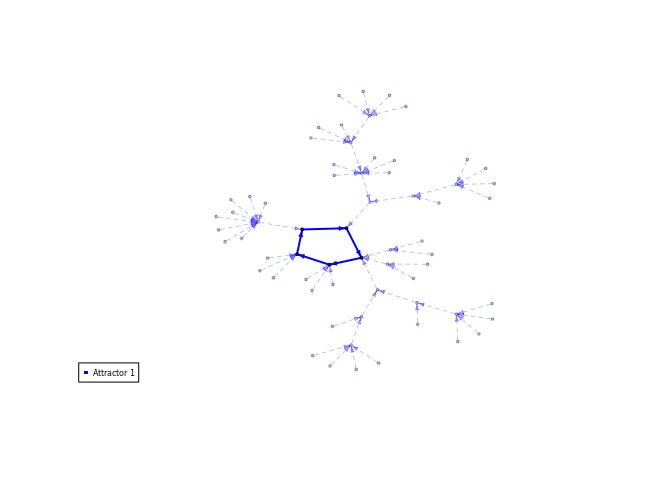

Theoretical Network: BoolNet
================

# Boolean network from HIFaxis

``` r
net <- loadNetwork("../data/ATOTS.bn")
net
```

    ## Boolean network with 6 genes
    ## 
    ## Involved genes:
    ## EP300 HIF1A MDM2 TP53 VHL APOP
    ## 
    ## Transition functions:
    ## EP300 = ((TP53 & HIF1A) & !VHL) | (!(TP53 & HIF1A) & VHL)
    ## HIF1A = !VHL | (!TP53 & MDM2)
    ## MDM2 = TP53 & !VHL
    ## TP53 = !MDM2 | VHL
    ## VHL = HIF1A & !TP53
    ## APOP = TP53 & EP300 & (!HIF1A | !VHL | !MDM2)

``` r
HIFaxis.p <- plotNetworkWiring(net, plotIt=F)
plot(HIFaxis.p, vertex.label.color="#440154ff",  vertex.color="lightblue", vertex.frame.color="white", layout=layout_in_circle, edge.curved=.3,
     main="HIF axis Network\n Theoretical")
```

<!-- -->

``` r
plot(HIFaxis.p, vertex.label.color="#440154ff",  vertex.color="lightblue", vertex.frame.color="white", layout=layout_in_circle,
     main="HIF axis Network\n Theoretical")
```

<!-- -->

``` r
attr.syn <- getAttractors(net, type = "synchronous")

# calculate number of different attractor lengths, 
# and plot attractors side by side in "table" mode
par(mfrow=c(1, length(table(sapply(attr.syn$attractors,
                          function(attr.syn)
                          {
                            length(attr.syn$involvedStates)
                          })))))

plotAttractors(attr.syn)
```

<!-- -->

    ## $`5`
    ##       Attr1.1 Attr1.2 Attr1.3 Attr1.4 Attr1.5
    ## EP300       1       0       1       1       0
    ## HIF1A       1       1       0       0       1
    ## MDM2        1       0       0       0       1
    ## TP53        0       0       1       1       1
    ## VHL         0       1       1       0       0
    ## APOP        0       0       0       1       1

``` r
# # plot attractors in "graph" mode
# par(mfrow=c(1, length(attr.syn$attractors)))
# plotAttractors(attr.syn, mode="graph")
# 
# # identify asynchronous attractors
# attr.asyn <- getAttractors(net, type="asynchronous")
# 
# # plot attractors in "graph" mode
# par(mfrow=c(1, length(attr.asyn$attractors)))
# plotAttractors(attr.asyn, mode="graph")
```

``` r
plotStateGraph(attr.syn)
```

<!-- -->

``` r
sim <- markovSimulation(net,
                        numIterations=1024,
                        returnTable=FALSE)
sim
```

    ## States reached at the end of the simulation:
    ##   EP300 HIF1A MDM2 TP53 VHL APOP Probability
    ## 1     1     1    1    0   0    0      0.1875
    ## 2     0     1    0    0   1    0      0.4375
    ## 3     1     0    0    1   1    0      0.1250
    ## 4     1     0    0    1   0    1      0.1250
    ## 5     0     1    1    1   0    1      0.1250
