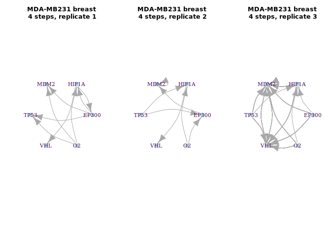
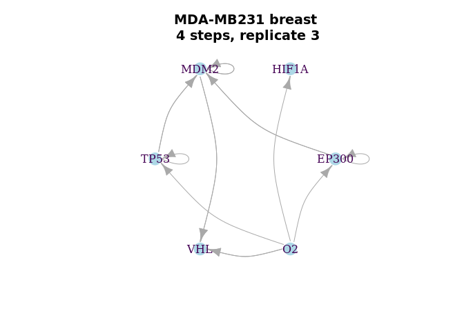
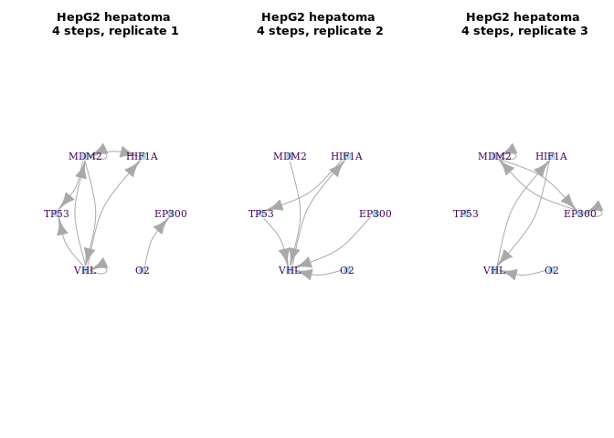
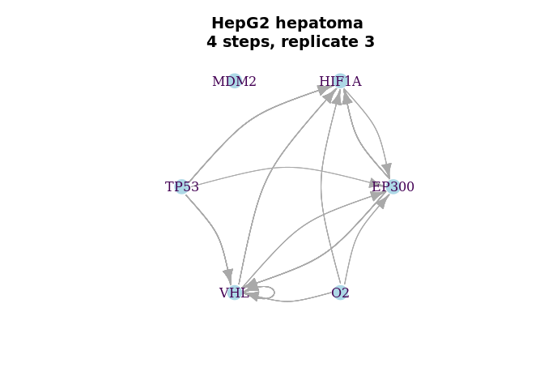
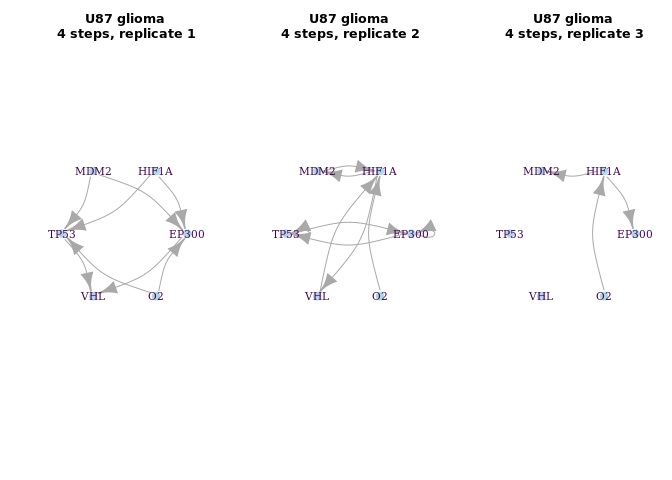
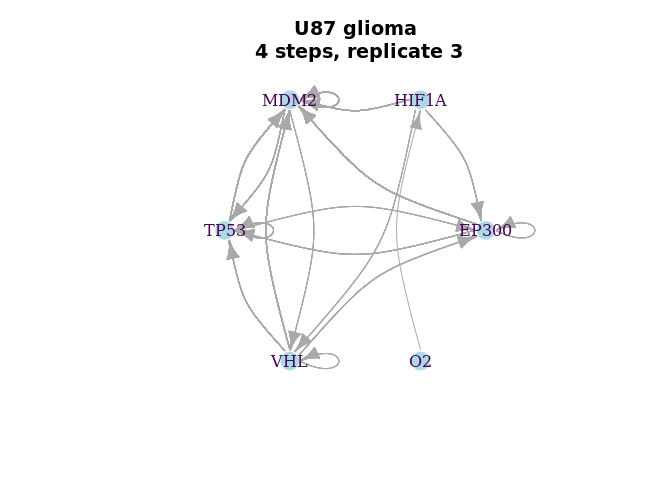

BoolNet Inference HepG2 hepatoma, U87 glioma, and MDA-MB231 breast
cancer (E-GEOD-18494)
================

Expression profiling of hypoxic HepG2 hepatoma, U87 glioma, and
MDA-MB231 breast cancer cells: time course (E-GEOD-18494)

Analysis of expression changes of cultured HepG2 hepatoma, U87 glioma,
and MDA-MB231 breast cancer cells subjected to hypoxia (0.5% O2) for 0,
4, 8, 12 hours . Results provide insight to cell type-specific response
to hypoxia. HepG2 hepatoma, U87 glioma, and MDA-MB231 breast cancer
cells were collected under normoxic conditions (\~19% O2, 0 hours) and
after 4, 8 and 12 hours of hypoxia treatment (0.5% O2). For each cell
line, three replicates of total RNA at each time point were prepared
using Trizol and submitted to the DFCI Microarray Core for labeling,
hybridization to Affymetrix HG-U133Plus2 oligonucleotide arrays and
image scanning.

<https://www.ebi.ac.uk/arrayexpress/experiments/E-GEOD-18494/>

``` r
packages_cran = c("igraph", "BoolNet", "BiocManager", "tidyverse", "fs")
# Install and load packages
package.check <- lapply(packages_cran, FUN = function(x) {
  if (!require(x, character.only = TRUE)) {
    install.packages(x, dependencies = TRUE)
    library(x, character.only = TRUE)
  }
})
packages_bioconductor = c("Biobase", "GEOquery", "vsn", "hgu133plus2.db")
# Install and load packages
package.check <- lapply(packages_bioconductor, FUN = function(x) {
  if (!require(x, character.only = TRUE)) {
    BiocManager::install(x, dependencies = TRUE)
    library(x, character.only = TRUE)
  }
})

rm(package.check, packages_bioconductor, packages_cran)
```

<!-- ```{r message=FALSE, warning=FALSE } -->

<!-- download_dir <- fs::path(".data_tmp") -->

<!-- if (!dir_exists(download_dir)) { -->

<!--     dir_create(download_dir) -->

<!--     EGEOD18494 <- ArrayExpress( "E-GEOD-18494", save=TRUE, path=download_dir) -->

<!-- } else { -->

<!--     EGEOD18494 <- ArrayExpress( "E-GEOD-18494", save=TRUE, path=download_dir) -->

<!-- } -->

<!-- data.EGEOD18494 <- Biobase::pData(EGEOD18494) -->

<!-- data.EGEOD18494 <- data.frame( -->

<!--                   codes = substr(data.EGEOD18494$Source.Name,1,9), -->

<!--                   cell_line = data.EGEOD18494$Characteristics..cell.line., -->

<!--                   time = data.EGEOD18494$Characteristics..time, -->

<!--                   condition = data.EGEOD18494$Characteristics..stress. -->

<!--                   ) -->

<!-- data.EGEOD18494 <- data.EGEOD18494[order(data.EGEOD18494$codes),] -->

<!-- data.EGEOD18494$rep <- rep(1:3, n= length(data.EGEOD18494$codes)) -->

<!-- # Normalisation -->

<!-- eset.EGEOD18494 <- oligo::rma(EGEOD18494,  normalize = TRUE) -->

<!-- expr.EGEOD18494 <- exprs(eset.EGEOD18494) -->

<!-- # Convert to a data.frame -->

<!-- expr.EGEOD18494 <- as.data.frame(as.ffdf(expr.EGEOD18494)) -->

<!-- colnames(expr.EGEOD18494) <- substr(colnames(expr.EGEOD18494),1,9) -->

<!-- # Convert the probes to Symbol names -->

<!-- anno.EGEOD18494 <- AnnotationDbi::select(hgu133plus2.db,  -->

<!--                                          keys=rownames(expr.EGEOD18494),  -->

<!--                                          columns=c("ENSEMBL", "SYMBOL", "GENENAME"),  -->

<!--                                          keytype="PROBEID") -->

<!-- colnames(anno.EGEOD18494) <- c("probes", "ensgene", "symbol", "description") -->

<!-- rm(download_dir, EGEOD18494, eset.EGEOD18494) -->

<!-- save.image("../data/data.EGEOD18494.Rdata") -->

<!-- ``` -->

# Load the pre-processed

``` r
load("../data/data.EGEOD18494.Rdata")
eset <- ExpressionSet(assayData = as.matrix(expr.EGEOD18494), 
                      probeNames = row.names(expr.EGEOD18494))
expr.EGEOD18494 <- exprs(justvsn(eset))
```

# Selecting the HIF Genes

``` r
# Selecting genes from HIF Axis
hif.symbols <- c("TP53", "HIF1A", "EP300", "MDM2", "VHL")

hif.probes <- anno.EGEOD18494$probes[anno.EGEOD18494$symbol %in% hif.symbols]

# Select the probes and genes
expr.EGEOD18494.hif <- as.data.frame(expr.EGEOD18494) %>% 
  rownames_to_column('probes') %>% 
  filter(probes %in% hif.probes) %>% 
  merge(anno.EGEOD18494[anno.EGEOD18494$symbol %in% hif.symbols, c("probes","symbol")], by = "probes") %>% 
  #distinct(symbol, .keep_all = TRUE) %>% # Take the first one
  dplyr::select(!(probes)) 
```

``` r
# Function to binarize according an consensus mean of probes, add the O2 state and rename columns 

binNet <- function(b){
  
  cols <- data.EGEOD18494$codes %in% names(b)
  
  binarizeTimeSeries(b[,-1], method="kmeans")$binarizedMeasurements  %>% 
  as.data.frame(.)  %>% 
  aggregate(., list(symbol = b$symbol), mean) %>%  # mean of binarized probes
  mutate_at(vars(-symbol), funs(ifelse(. >= 0.5, 1, 0))) %>%  # consensus with a bies to 1 (>= 0.5)
  rbind(., c("O2", 1,0,0,0)) %>% 
    rename_at(vars(data.EGEOD18494$codes[cols] ),
            ~paste0(substr(data.EGEOD18494$condition[cols],1,2),".",
                    data.EGEOD18494$time[cols],".",
                    substr(data.EGEOD18494$cell_line[cols],1,2), ".",
                    data.EGEOD18494$rep[cols])) %>% 
  column_to_rownames("symbol")
  
}
```

# Exemplifying the Binarization

``` r
cols <- (data.EGEOD18494$cell_line == "MDA-MB231 breast cancer" & data.EGEOD18494$rep == 1)

breast1x <- 
expr.EGEOD18494.hif %>% 
  dplyr::select(c("symbol", data.EGEOD18494$codes[cols])) %>% arrange(symbol) %>% 
  arrange(symbol) %>% 
  rename_at(vars(data.EGEOD18494$codes[cols]),
            ~paste0(substr(data.EGEOD18494$condition[cols],1,2),".",
                    data.EGEOD18494$time[cols],".",
                    substr(data.EGEOD18494$cell_line[cols],1,2)))

breast1x %>% 
  knitr::kable(.)
```

| symbol | no.control.MD | hy.4h.MD | hy.8h.MD | hy.12h.MD |
| :----- | ------------: | -------: | -------: | --------: |
| EP300  |      2.549070 | 2.629721 | 2.656562 |  2.550405 |
| EP300  |      2.620624 | 2.644411 | 2.657875 |  2.616628 |
| HIF1A  |      3.454857 | 3.379930 | 3.202643 |  3.155433 |
| MDM2   |      2.087500 | 2.017202 | 2.029907 |  2.064475 |
| MDM2   |      1.466399 | 1.361895 | 1.489469 |  1.575513 |
| MDM2   |      1.927003 | 1.868816 | 1.911444 |  1.892719 |
| MDM2   |      2.346662 | 2.340452 | 2.357972 |  2.474810 |
| MDM2   |      1.588123 | 1.798685 | 1.766015 |  1.672476 |
| MDM2   |      2.787360 | 2.792702 | 2.799612 |  2.776623 |
| MDM2   |      2.590166 | 2.572969 | 2.551526 |  2.513453 |
| MDM2   |      1.226232 | 1.348273 | 1.311544 |  1.496668 |
| MDM2   |      1.471376 | 1.510237 | 1.483707 |  1.575065 |
| MDM2   |      2.796643 | 2.706115 | 2.677469 |  2.714001 |
| TP53   |      2.933592 | 2.912386 | 2.972610 |  2.984760 |
| TP53   |      2.876457 | 2.805545 | 2.884647 |  2.894870 |
| VHL    |      2.686189 | 2.691444 | 2.606037 |  2.549339 |
| VHL    |      1.296047 | 1.302045 | 1.315025 |  1.235383 |

``` r
binarizeTimeSeries(breast1x[,-1], method="kmeans")$binarizedMeasurements  %>% 
  data.frame(.)  %>% 
  add_column(symbol = breast1x$symbol, .before=0) %>% 
  knitr::kable(.)
```

| symbol | no.control.MD | hy.4h.MD | hy.8h.MD | hy.12h.MD |
| :----- | ------------: | -------: | -------: | --------: |
| EP300  |             0 |        1 |        1 |         0 |
| EP300  |             0 |        1 |        1 |         0 |
| HIF1A  |             1 |        1 |        0 |         0 |
| MDM2   |             1 |        0 |        0 |         1 |
| MDM2   |             1 |        0 |        1 |         1 |
| MDM2   |             1 |        0 |        1 |         0 |
| MDM2   |             0 |        0 |        0 |         1 |
| MDM2   |             0 |        1 |        1 |         0 |
| MDM2   |             1 |        1 |        1 |         0 |
| MDM2   |             1 |        1 |        1 |         0 |
| MDM2   |             0 |        0 |        0 |         1 |
| MDM2   |             0 |        0 |        0 |         1 |
| MDM2   |             1 |        0 |        0 |         0 |
| TP53   |             0 |        0 |        1 |         1 |
| TP53   |             1 |        0 |        1 |         1 |
| VHL    |             1 |        1 |        0 |         0 |
| VHL    |             1 |        1 |        1 |         0 |

``` r
binarizeTimeSeries(breast1x[,-1], method="kmeans")$binarizedMeasurements  %>% 
  data.frame(.)  %>% 
  aggregate(., list(symbol = breast1x$symbol), mean) %>% 
  mutate_at(vars(-symbol), funs(ifelse(. >= 0.5, 1, 0))) %>% 
  rbind(., c("O2", 1,0,0,0)) %>% 
  knitr::kable(.)
```

| symbol | no.control.MD | hy.4h.MD | hy.8h.MD | hy.12h.MD |
| :----- | :------------ | :------- | :------- | :-------- |
| EP300  | 0             | 1        | 1        | 0         |
| HIF1A  | 1             | 1        | 0        | 0         |
| MDM2   | 1             | 0        | 1        | 1         |
| TP53   | 1             | 0        | 1        | 1         |
| VHL    | 1             | 1        | 1        | 0         |
| O2     | 1             | 0        | 0        | 0         |

# MDA-MB231 breast cancer

``` r
cellline.rep1 <- (data.EGEOD18494$cell_line == "MDA-MB231 breast cancer" &  data.EGEOD18494$rep == 1)
cellline.rep2 <- (data.EGEOD18494$cell_line == "MDA-MB231 breast cancer" &  data.EGEOD18494$rep == 2)
cellline.rep3 <- (data.EGEOD18494$cell_line == "MDA-MB231 breast cancer" &  data.EGEOD18494$rep == 3)

breast1x <- 
expr.EGEOD18494.hif %>% 
  dplyr::select(c("symbol", data.EGEOD18494$codes[cellline.rep1])) %>% binNet(.) 

breast1x %>% knitr::kable(.)
```

|       | no.control.MD.1 | hy.4h.MD.1 | hy.8h.MD.1 | hy.12h.MD.1 |
| :---- | :-------------- | :--------- | :--------- | :---------- |
| EP300 | 0               | 1          | 1          | 0           |
| HIF1A | 1               | 1          | 0          | 0           |
| MDM2  | 1               | 0          | 1          | 1           |
| TP53  | 1               | 0          | 1          | 1           |
| VHL   | 1               | 1          | 1          | 0           |
| O2    | 1               | 0          | 0          | 0           |

``` r
breast2x <- 
expr.EGEOD18494.hif %>% 
  dplyr::select(c("symbol", data.EGEOD18494$codes[cellline.rep2])) %>% binNet(.) 

breast2x  %>% knitr::kable(.)
```

|       | no.control.MD.2 | hy.4h.MD.2 | hy.8h.MD.2 | hy.12h.MD.2 |
| :---- | :-------------- | :--------- | :--------- | :---------- |
| EP300 | 1               | 0          | 1          | 1           |
| HIF1A | 1               | 1          | 0          | 0           |
| MDM2  | 1               | 0          | 1          | 0           |
| TP53  | 0               | 1          | 1          | 1           |
| VHL   | 1               | 1          | 1          | 0           |
| O2    | 1               | 0          | 0          | 0           |

``` r
breast3x <- 
expr.EGEOD18494.hif %>% 
  dplyr::select(c("symbol", data.EGEOD18494$codes[cellline.rep3])) %>% binNet(.) 

breast3x %>% knitr::kable(.)
```

|       | no.control.MD.3 | hy.4h.MD.3 | hy.8h.MD.3 | hy.12h.MD.3 |
| :---- | :-------------- | :--------- | :--------- | :---------- |
| EP300 | 0               | 1          | 1          | 1           |
| HIF1A | 1               | 1          | 0          | 0           |
| MDM2  | 1               | 1          | 0          | 1           |
| TP53  | 0               | 1          | 1          | 1           |
| VHL   | 1               | 1          | 0          | 1           |
| O2    | 1               | 0          | 0          | 0           |

# HepG2 hepatoma

``` r
cellline.rep1 <- (data.EGEOD18494$cell_line == "HepG2 hepatoma" &  data.EGEOD18494$rep == 1)
cellline.rep2 <- (data.EGEOD18494$cell_line == "HepG2 hepatoma" &  data.EGEOD18494$rep == 2)
cellline.rep3 <- (data.EGEOD18494$cell_line == "HepG2 hepatoma" &  data.EGEOD18494$rep == 3)

hepatoma1x <- 
expr.EGEOD18494.hif %>% 
  dplyr::select(c("symbol", data.EGEOD18494$codes[cellline.rep1]))  %>% 
  binNet(.) 

hepatoma1x %>% 
  knitr::kable(.)
```

|       | no.control.He.1 | hy.4h.He.1 | hy.8h.He.1 | hy.12h.He.1 |
| :---- | :-------------- | :--------- | :--------- | :---------- |
| EP300 | 1               | 1          | 0          | 0           |
| HIF1A | 0               | 0          | 1          | 0           |
| MDM2  | 0               | 1          | 0          | 1           |
| TP53  | 1               | 1          | 0          | 1           |
| VHL   | 1               | 0          | 1          | 0           |
| O2    | 1               | 0          | 0          | 0           |

``` r
hepatoma2x <- 
expr.EGEOD18494.hif %>% 
  dplyr::select(c("symbol", data.EGEOD18494$codes[cellline.rep2]))  %>% 
  binNet(.) 

hepatoma2x %>% 
  knitr::kable(.)
```

|       | no.control.He.2 | hy.4h.He.2 | hy.8h.He.2 | hy.12h.He.2 |
| :---- | :-------------- | :--------- | :--------- | :---------- |
| EP300 | 0               | 1          | 1          | 1           |
| HIF1A | 0               | 0          | 1          | 0           |
| MDM2  | 0               | 1          | 1          | 1           |
| TP53  | 0               | 1          | 1          | 0           |
| VHL   | 1               | 0          | 1          | 1           |
| O2    | 1               | 0          | 0          | 0           |

``` r
hepatoma3x <- 
expr.EGEOD18494.hif %>% 
  dplyr::select(c("symbol", data.EGEOD18494$codes[cellline.rep3]))  %>% 
  binNet(.) 

hepatoma3x %>% 
  knitr::kable(.)
```

|       | no.control.He.3 | hy.4h.He.3 | hy.8h.He.3 | hy.12h.He.3 |
| :---- | :-------------- | :--------- | :--------- | :---------- |
| EP300 | 0               | 1          | 0          | 1           |
| HIF1A | 0               | 1          | 1          | 0           |
| MDM2  | 0               | 1          | 0          | 1           |
| TP53  | 1               | 1          | 1          | 1           |
| VHL   | 1               | 1          | 0          | 0           |
| O2    | 1               | 0          | 0          | 0           |

# U87 glioma

``` r
cellline.rep1 <- (data.EGEOD18494$cell_line == "U87 glioma" &  data.EGEOD18494$rep == 1)
cellline.rep2 <- (data.EGEOD18494$cell_line == "U87 glioma" &  data.EGEOD18494$rep == 2)
cellline.rep3 <- (data.EGEOD18494$cell_line == "U87 glioma" &  data.EGEOD18494$rep == 3)

glioma1x <- 
expr.EGEOD18494.hif %>% 
  dplyr::select(c("symbol", data.EGEOD18494$codes[cellline.rep1]))  %>% 
  binNet(.) 

glioma1x %>% 
  knitr::kable(.)
```

|       | no.control.U8.1 | hy.4h.U8.1 | hy.8h.U8.1 | hy.12h.U8.1 |
| :---- | :-------------- | :--------- | :--------- | :---------- |
| EP300 | 1               | 0          | 1          | 1           |
| HIF1A | 1               | 0          | 0          | 0           |
| MDM2  | 1               | 0          | 0          | 0           |
| TP53  | 1               | 0          | 1          | 1           |
| VHL   | 1               | 1          | 0          | 1           |
| O2    | 1               | 0          | 0          | 0           |

``` r
glioma2x <- 
expr.EGEOD18494.hif %>% 
  dplyr::select(c("symbol", data.EGEOD18494$codes[cellline.rep2]))  %>% 
  binNet(.) 

glioma2x %>% 
  knitr::kable(.)
```

|       | no.control.U8.2 | hy.4h.U8.2 | hy.8h.U8.2 | hy.12h.U8.2 |
| :---- | :-------------- | :--------- | :--------- | :---------- |
| EP300 | 1               | 0          | 1          | 0           |
| HIF1A | 1               | 1          | 0          | 0           |
| MDM2  | 1               | 0          | 0          | 1           |
| TP53  | 1               | 0          | 1          | 0           |
| VHL   | 0               | 1          | 1          | 0           |
| O2    | 1               | 0          | 0          | 0           |

``` r
glioma3x <- 
expr.EGEOD18494.hif %>% 
  dplyr::select(c("symbol", data.EGEOD18494$codes[cellline.rep3]))  %>% 
  binNet(.) 

glioma3x %>% 
  knitr::kable(.)
```

|       | no.control.U8.3 | hy.4h.U8.3 | hy.8h.U8.3 | hy.12h.U8.3 |
| :---- | :-------------- | :--------- | :--------- | :---------- |
| EP300 | 1               | 1          | 1          | 0           |
| HIF1A | 1               | 1          | 0          | 0           |
| MDM2  | 1               | 1          | 1          | 0           |
| TP53  | 1               | 1          | 1          | 1           |
| VHL   | 1               | 1          | 1          | 1           |
| O2    | 1               | 0          | 0          | 0           |

# Network inference:

``` r
# MDA-MB231 breast cancer - 4 time-points
par(mfrow = c(1,3))
plot(breast1x.p, vertex.label.color="#440154ff", vertex.color="lightblue", vertex.frame.color="white", layout=layout_in_circle, edge.curved=.3,
     main="MDA-MB231 breast\n 4 steps, replicate 1")
plot(breast2x.p, vertex.label.color="#440154ff", vertex.color="lightblue", vertex.frame.color="white", layout=layout_in_circle, edge.curved=.3,
     main="MDA-MB231 breast\n 4 steps, replicate 2")
plot(breast3x.p, vertex.label.color="#440154ff", vertex.color="lightblue", vertex.frame.color="white", layout=layout_in_circle, edge.curved=.3,
     main="MDA-MB231 breast\n 4 steps, replicate 3")
```

<!-- -->

``` r
par(mfrow = c(1,1))
plot(breast.all.p, vertex.label.color="#440154ff", vertex.color="lightblue", vertex.frame.color="white", layout=layout_in_circle, edge.curved=.3,
     main="MDA-MB231 breast\n 4 steps, replicate 3")
```

<!-- -->

``` r
# HepG2 hepatoma
par(mfrow = c(1,3))
plot(hepatoma1x.p, vertex.label.color="#440154ff", vertex.color="lightblue", vertex.frame.color="white", layout=layout_in_circle, edge.curved=.3,
     main="HepG2 hepatoma\n 4 steps, replicate 1")
plot(hepatoma2x.p, vertex.label.color="#440154ff", vertex.color="lightblue", vertex.frame.color="white", layout=layout_in_circle, edge.curved=.3,
     main="HepG2 hepatoma\n 4 steps, replicate 2")
plot(hepatoma3x.p, vertex.label.color="#440154ff", vertex.color="lightblue", vertex.frame.color="white", layout=layout_in_circle, edge.curved=.3,
     main="HepG2 hepatoma\n 4 steps, replicate 3")
```

<!-- -->

``` r
par(mfrow = c(1,1))
plot(hepatoma.all.p, vertex.label.color="#440154ff", vertex.color="lightblue", vertex.frame.color="white", layout=layout_in_circle, edge.curved=.3,
     main="HepG2 hepatoma\n 4 steps, replicate 3")
```

<!-- -->

``` r
# U87 glioma
par(mfrow = c(1,3))
plot(glioma1x.p, vertex.label.color="#440154ff", vertex.color="lightblue", vertex.frame.color="white", layout=layout_in_circle, edge.curved=.3,
     main="U87 glioma\n 4 steps, replicate 1")
plot(glioma2x.p, vertex.label.color="#440154ff", vertex.color="lightblue", vertex.frame.color="white", layout=layout_in_circle, edge.curved=.3,
     main="U87 glioma\n 4 steps, replicate 2")
plot(glioma3x.p, vertex.label.color="#440154ff", vertex.color="lightblue", vertex.frame.color="white", layout=layout_in_circle, edge.curved=.3,
     main="U87 glioma\n 4 steps, replicate 3")
```

<!-- -->

``` r
par(mfrow = c(1,1))
plot(glioma.all.p, vertex.label.color="#440154ff", vertex.color="lightblue", vertex.frame.color="white", layout=layout_in_circle, edge.curved=.3,
     main="U87 glioma\n 4 steps, replicate 3")
```

<!-- -->
