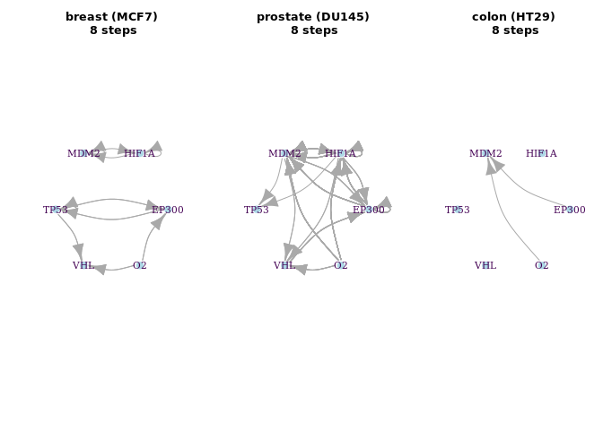

BoolNet Inference (GSE41491)
================

Hypoxia transcriptomic time-series data in three different cancer cell
lines (GSE41491)

Tumour hypoxia exhibits a highly dynamic spatial and temporal
distribution and is associated with increased malignancy and poor
prognosis. Exponentially growing prostate (DU145), colon (HT29) and
breast (MCF7) carcinoma cells were seeded on glass dishes in McCoy, DMEM
or RPMI media, respectively with 10% FCS.

<https://www.ncbi.nlm.nih.gov/geo/query/acc.cgi?acc=GSE41491>

``` r
packages_cran = c("igraph", "BoolNet", "BiocManager", "tidyverse", "fs", "effectsize")


# Install and load packages
package.check <- lapply(packages_cran, FUN = function(x) {
  if (!require(x, character.only = TRUE)) {
    install.packages(x, dependencies = TRUE)
    library(x, character.only = TRUE)
  }
})

if(!require("hgu133plus2hsentrezg.db")){ 
  install.packages('http://mbni.org/customcdf/13.0.0/entrezg.download/hgu133plus2hsentrezg.db_13.0.0.tar.gz',repos=NULL) 
  }

packages_bioconductor = c("Biobase", "GEOquery", "affyPLM", "annotate")

# Install and load packages
package.check <- lapply(packages_bioconductor, FUN = function(x) {
  if (!require(x, character.only = TRUE)) {
    BiocManager::install(x, dependencies = TRUE)
    library(x, character.only = TRUE)
  }
})

rm(package.check, packages_bioconductor, packages_cran)
```

<!-- ```{r} -->

<!-- download_dir <- fs::path(".data_tmp") -->

<!-- if (!dir_exists(download_dir)) { dir_create(download_dir) } -->

<!-- GSE41491 <-getGEO("GSE41491", destdir = download_dir, GSEMatrix = T) -->

<!-- expr.GSE41491 <- as.matrix(exprs(normalize.ExpressionSet.quantiles(GSE41491[[1]]))) -->

<!-- data.GSE41491 <- pData(GSE41491[[1]]) -->

<!-- data.GSE41491 <- data.frame( -->

<!--                   codes = as.character(data.GSE41491$geo_accession), -->

<!--                   cell_line = gsub("[(]","",gsub("[)]","",substr(as.character(data.GSE41491$source_name_ch1),18,25))), -->

<!--                   time = substr(as.character(data.GSE41491$characteristics_ch1.1),18,19), -->

<!--                   condition = substr(as.character(data.GSE41491$characteristics_ch1),12,13)) -->

<!-- GPL14877 <- read_delim(".data_tmp/GPL14877.soft", -->

<!--     "\t", escape_double = FALSE, trim_ws = TRUE, -->

<!--     skip = 393) -->

<!-- ENTREZID <- as.character(unique(GPL14877$SPOT_ID)) -->

<!-- PROBES <- unique(rownames(expr.GSE41491)) -->

<!-- library(hgu133plus2hsentrezg.db) -->

<!-- SYMBOL <- getSYMBOL(PROBES, "hgu133plus2hsentrezg") -->

<!-- results <- as.data.frame(cbind(PROBES, SYMBOL)) -->

<!-- # Convert the probes to Symbol names -->

<!-- anno.GSE41491 <- AnnotationDbi::select(hgu133plus2.db, -->

<!--        keys = ENTREZID, -->

<!--        columns=c("SYMBOL", "GENENAME"), -->

<!--        keytype="ENTREZID") -->

<!-- anno.GSE41491 <- merge(anno.GSE41491, results, by="SYMBOL", all.x = T) %>% -->

<!--   filter(!is.na(SYMBOL)) %>% -->

<!--   mutate_all(as.character) %>% -->

<!--   rename_at(vars(c("SYMBOL", "ENTREZID", "GENENAME", "PROBES")), ~ c("symbol", "entrezid", "description", "probes")) -->

<!-- rm(download_dir, GSE41491, results, GPL14877, PROBES, SYMBOL, ENTREZID) -->

<!-- save.image("../data/data.GSE41491.Rdata") -->

<!-- ``` -->

# Load the pre-processed data

``` r
load("../data/data.GSE41491.Rdata")
cols <- colnames(expr.GSE41491)
rows <- rownames(expr.GSE41491)
expr.GSE41491 <- data.frame(matrix(effectsize::normalize(as.matrix(expr.GSE41491)), ncol = length(cols), nrow = length(rows) ))
colnames(expr.GSE41491) <- cols
rownames(expr.GSE41491) <- rows 
```

# Selecting the HIF Genes

``` r
# Selected genes from HIF Axis
hif.symbols <- c("TP53", "HIF1A", "EP300", "MDM2", "VBP1") 
hif.probes <- unique(anno.GSE41491$probes[anno.GSE41491$symbol %in% hif.symbols])

# Select the probes and genes
expr.GSE41491.hif <- data.frame(expr.GSE41491) %>% 
  rownames_to_column('probes') %>% 
  filter(probes %in% hif.probes) %>% 
  merge(anno.GSE41491[anno.GSE41491$symbol %in% hif.symbols, c("probes","symbol")], by = "probes") %>% 
  dplyr::select(!(probes)) %>%  arrange(symbol)

expr.GSE41491.hif$symbol[expr.GSE41491.hif$symbol == "VBP1"] <- "VHL"
```

# breast (MCF7) carcinoma cells - 8 time-points

``` r
breast1_MCF7 <- 
expr.GSE41491.hif %>% 
  dplyr::select(c("symbol", data.GSE41491$codes[data.GSE41491$cell_line == "MCF7"])) %>% arrange(symbol) %>% 
  rename_at(vars(data.GSE41491$codes[data.GSE41491$cell_line == "MCF7"]),
            ~paste0(data.GSE41491$condition[data.GSE41491$cell_line == "MCF7"],".",
                    data.GSE41491$time[data.GSE41491$cell_line == "MCF7"],".",
                    data.GSE41491$cell_line[data.GSE41491$cell_line == "MCF7"]))

knitr::kable(breast1_MCF7)
```

| symbol | no.0.MCF7 | hy.1.MCF7 | hy.2.MCF7 | hy.4.MCF7 | hy.8.MCF7 | hy.12.MCF7 | hy.16.MCF7 | hy.24.MCF7 |
| :----- | --------: | --------: | --------: | --------: | --------: | ---------: | ---------: | ---------: |
| EP300  | 0.3344733 | 0.3203669 | 0.3100172 | 0.3055717 | 0.2995711 |  0.3164877 |  0.3003126 |  0.3057192 |
| HIF1A  | 0.8057876 | 0.8082182 | 0.8011014 | 0.7760006 | 0.6946824 |  0.6841852 |  0.6748412 |  0.6657997 |
| MDM2   | 0.3145618 | 0.3141594 | 0.3047653 | 0.3266271 | 0.3606068 |  0.3903793 |  0.3848019 |  0.3685650 |
| TP53   | 0.4050531 | 0.3851325 | 0.3918101 | 0.3900418 | 0.4161346 |  0.4032283 |  0.3955757 |  0.4271853 |
| VHL    | 0.7341068 | 0.7419874 | 0.7264952 | 0.7277200 | 0.7332659 |  0.7437101 |  0.7321908 |  0.7222367 |

``` r
binarizeTimeSeries(breast1_MCF7[,-1], method="kmeans")$binarizedMeasurements  %>% 
  data.frame(.)  %>% 
  add_column(symbol = breast1_MCF7$symbol, .before=0) %>% 
  knitr::kable(.)
```

| symbol | no.0.MCF7 | hy.1.MCF7 | hy.2.MCF7 | hy.4.MCF7 | hy.8.MCF7 | hy.12.MCF7 | hy.16.MCF7 | hy.24.MCF7 |
| :----- | --------: | --------: | --------: | --------: | --------: | ---------: | ---------: | ---------: |
| EP300  |         1 |         1 |         0 |         0 |         0 |          1 |          0 |          0 |
| HIF1A  |         1 |         1 |         1 |         1 |         0 |          0 |          0 |          0 |
| MDM2   |         0 |         0 |         0 |         0 |         1 |          1 |          1 |          1 |
| TP53   |         0 |         0 |         0 |         0 |         1 |          0 |          0 |          1 |
| VHL    |         0 |         1 |         0 |         0 |         0 |          1 |          0 |          0 |

``` r
binarizeTimeSeries(breast1_MCF7[,-1], method="kmeans")$binarizedMeasurements  %>% 
  data.frame(.)  %>% 
  aggregate(., list(symbol = breast1_MCF7$symbol), mean) %>% 
  mutate_at(vars(-symbol), funs(ifelse(. >= 0.5, 1, 0))) %>% 
  rbind(., c("O2", 1,0,0,0,0,0,0,0)) %>% 
  knitr::kable(.)
```

| symbol | no.0.MCF7 | hy.1.MCF7 | hy.2.MCF7 | hy.4.MCF7 | hy.8.MCF7 | hy.12.MCF7 | hy.16.MCF7 | hy.24.MCF7 |
| :----- | :-------- | :-------- | :-------- | :-------- | :-------- | :--------- | :--------- | :--------- |
| EP300  | 1         | 1         | 0         | 0         | 0         | 1          | 0          | 0          |
| HIF1A  | 1         | 1         | 1         | 1         | 0         | 0          | 0          | 0          |
| MDM2   | 0         | 0         | 0         | 0         | 1         | 1          | 1          | 1          |
| TP53   | 0         | 0         | 0         | 0         | 1         | 0          | 0          | 1          |
| VHL    | 0         | 1         | 0         | 0         | 0         | 1          | 0          | 0          |
| O2     | 1         | 0         | 0         | 0         | 0         | 0          | 0          | 0          |

# prostate (DU145) carcinoma cells - 8 time-points

``` r
prostate_DU145 %>% 
  knitr::kable(.)
```

|       | no.0.DU | hy.1.DU | hy.2.DU | hy.4.DU | hy.8.DU | hy.12.DU | hy.16.DU | hy.24.DU |
| :---- | :------ | :------ | :------ | :------ | :------ | :------- | :------- | :------- |
| EP300 | 0       | 1       | 1       | 0       | 1       | 1        | 0        | 0        |
| HIF1A | 1       | 1       | 1       | 1       | 0       | 0        | 0        | 0        |
| MDM2  | 0       | 0       | 0       | 0       | 1       | 1        | 1        | 1        |
| TP53  | 0       | 0       | 0       | 0       | 0       | 1        | 1        | 1        |
| VHL   | 0       | 1       | 0       | 0       | 0       | 1        | 1        | 1        |
| O2    | 1       | 0       | 0       | 0       | 0       | 0        | 0        | 0        |

# colon (HT29) carcinoma cells - 8 time-points

``` r
colon_HT29 %>% 
  knitr::kable(.)
```

|       | no.0.HT | hy.1.HT | hy.2.HT | hy.4.HT | hy.8.HT | hy.12.HT | hy.16.HT | hy.24.HT |
| :---- | :------ | :------ | :------ | :------ | :------ | :------- | :------- | :------- |
| EP300 | 0       | 1       | 1       | 1       | 1       | 1        | 1        | 0        |
| HIF1A | 0       | 1       | 1       | 1       | 0       | 1        | 1        | 1        |
| MDM2  | 0       | 0       | 1       | 1       | 1       | 1        | 1        | 1        |
| TP53  | 0       | 0       | 0       | 0       | 0       | 0        | 0        | 1        |
| VHL   | 1       | 1       | 1       | 1       | 1       | 1        | 1        | 0        |
| O2    | 1       | 0       | 0       | 0       | 0       | 0        | 0        | 0        |

``` r
# breast (MCF7) carcinoma cells - 8 time-points
breast_MCF7.net <- reconstructNetwork(breast_MCF7, method="bestfit",returnPBN=TRUE,readableFunctions=TRUE)
breast_MCF7.p <- plotNetworkWiring(breast_MCF7.net, plotIt=F)

# prostate (DU145) carcinoma cells - 8 time-points
prostate_DU145.net <- reconstructNetwork(prostate_DU145, method="bestfit",returnPBN=TRUE,readableFunctions=TRUE)
prostate_DU145.p <- plotNetworkWiring(prostate_DU145.net, plotIt=F)

# colon (HT29) carcinoma cells - 8 time-points
colon_HT29.net <- reconstructNetwork(colon_HT29, method="bestfit",returnPBN=TRUE,readableFunctions=TRUE)
colon_HT29.p <- plotNetworkWiring(colon_HT29.net, plotIt=F)
```

``` r
par(mfrow = c(1,3))
plot(breast_MCF7.p, vertex.label.color="#440154ff", vertex.color="lightblue", vertex.frame.color="white", layout=layout_in_circle, edge.curved=.3,
     main="breast (MCF7)\n 8 steps")
plot(prostate_DU145.p, vertex.label.color="#440154ff", vertex.color="lightblue", vertex.frame.color="white", layout=layout_in_circle, edge.curved=.3,
     main="prostate (DU145)\n 8 steps")
plot(colon_HT29.p, vertex.label.color="#440154ff", vertex.color="lightblue", vertex.frame.color="white", layout=layout_in_circle, edge.curved=.3,
     main="colon (HT29)\n 8 steps")
```

<!-- -->

<!-- ```{r} -->

<!-- all.nets <- reconstructNetwork(list(breast_MCF7, prostate_DU145, colon_HT29), method="bestfit",returnPBN=TRUE,readableFunctions=TRUE) -->

<!-- plotNetworkWiring(net.all, vertex.label.color="#440154ff", vertex.color="lightblue", vertex.frame.color="white", layout=layout_in_circle, edge.curved=.3, -->

<!--      main="all lines \n breast, prostate, colon - 4 steps") -->

<!-- ``` -->

``` r
# breast (MCF7) carcinoma cells - 8 time-points
print(breast_MCF7.net)
```

    ## Probabilistic Boolean network with 6 genes
    ## 
    ## Involved genes:
    ## EP300 HIF1A MDM2 TP53 VHL O2
    ## 
    ## Transition functions:
    ## 
    ## Alternative transition functions for gene EP300:
    ## EP300 = (!TP53 & O2) | (TP53 & !O2) ( probability: 0.5, error: 0)
    ## EP300 = (O2) | (TP53) ( probability: 0.5, error: 0)
    ## 
    ## Alternative transition functions for gene HIF1A:
    ## HIF1A = (!MDM2) ( probability: 0.5, error: 1)
    ## HIF1A = (HIF1A) ( probability: 0.5, error: 1)
    ## 
    ## Alternative transition functions for gene MDM2:
    ## MDM2 = (MDM2) ( probability: 0.5, error: 1)
    ## MDM2 = (!HIF1A) ( probability: 0.5, error: 1)
    ## 
    ## Alternative transition functions for gene TP53:
    ## TP53 = (!EP300 & !TP53) ( probability: 0.5, error: 1)
    ## TP53 = (!EP300 & !TP53) | (EP300 & TP53) ( probability: 0.5, error: 1)
    ## 
    ## Alternative transition functions for gene VHL:
    ## VHL = (!TP53 & O2) | (TP53 & !O2) ( probability: 0.5, error: 0)
    ## VHL = (O2) | (TP53) ( probability: 0.5, error: 0)
    ## 
    ## Alternative transition functions for gene O2:
    ## O2 = 0 ( probability: 1, error: 0)
    ## 
    ## Knocked-out and over-expressed genes:
    ## O2 = 0

``` r
# prostate (DU145) carcinoma cells - 8 time-points
print(prostate_DU145.net)
```

    ## Probabilistic Boolean network with 6 genes
    ## 
    ## Involved genes:
    ## EP300 HIF1A MDM2 TP53 VHL O2
    ## 
    ## Transition functions:
    ## 
    ## Alternative transition functions for gene EP300:
    ## EP300 = (!EP300 & !MDM2 & !VHL) | (EP300 & !MDM2 & VHL) | (EP300 & MDM2 & !VHL) ( probability: 0.125, error: 0)
    ## EP300 = (!EP300 & !VHL) | (EP300 & !MDM2 & VHL) | (MDM2 & !VHL) ( probability: 0.125, error: 0)
    ## EP300 = (!EP300 & !MDM2) | (!MDM2 & VHL) | (EP300 & MDM2 & !VHL) ( probability: 0.125, error: 0)
    ## EP300 = (!EP300 & !VHL) | (!MDM2 & VHL) | (MDM2 & !VHL) ( probability: 0.125, error: 0)
    ## EP300 = (!EP300 & HIF1A & !VHL) | (EP300 & !HIF1A & !VHL) | (EP300 & HIF1A & VHL) ( probability: 0.125, error: 0)
    ## EP300 = (!EP300 & HIF1A) | (EP300 & !HIF1A & !VHL) | (HIF1A & VHL) ( probability: 0.125, error: 0)
    ## EP300 = (!HIF1A & !VHL) | (!EP300 & !VHL) | (EP300 & HIF1A & VHL) ( probability: 0.125, error: 0)
    ## EP300 = (!HIF1A & !VHL) | (!EP300 & !VHL) | (HIF1A & VHL) ( probability: 0.125, error: 0)
    ## 
    ## Alternative transition functions for gene HIF1A:
    ## HIF1A = (!EP300 & !MDM2 & O2) | (EP300 & !MDM2 & !O2) ( probability: 0.0625, error: 0)
    ## HIF1A = (!EP300 & !MDM2 & O2) | (EP300 & !MDM2 & !O2) | (EP300 & MDM2 & O2) ( probability: 0.0625, error: 0)
    ## HIF1A = (!MDM2 & O2) | (EP300 & !MDM2) ( probability: 0.0625, error: 0)
    ## HIF1A = (!MDM2 & O2) | (EP300 & !MDM2) | (EP300 & O2) ( probability: 0.0625, error: 0)
    ## HIF1A = (!EP300 & O2) | (EP300 & !MDM2 & !O2) ( probability: 0.0625, error: 0)
    ## HIF1A = (!EP300 & O2) | (EP300 & !MDM2 & !O2) | (MDM2 & O2) ( probability: 0.0625, error: 0)
    ## HIF1A = (!MDM2 & O2) | (!EP300 & O2) | (EP300 & !MDM2) ( probability: 0.0625, error: 0)
    ## HIF1A = (O2) | (EP300 & !MDM2) ( probability: 0.0625, error: 0)
    ## HIF1A = (!EP300 & HIF1A & O2) | (EP300 & HIF1A & !O2) ( probability: 0.0625, error: 0)
    ## HIF1A = (HIF1A & O2) | (EP300 & HIF1A) ( probability: 0.0625, error: 0)
    ## HIF1A = (!EP300 & HIF1A & O2) | (EP300 & !HIF1A & O2) | (EP300 & HIF1A & !O2) ( probability: 0.0625, error: 0)
    ## HIF1A = (HIF1A & O2) | (EP300 & O2) | (EP300 & HIF1A) ( probability: 0.0625, error: 0)
    ## HIF1A = (!EP300 & O2) | (EP300 & HIF1A & !O2) ( probability: 0.0625, error: 0)
    ## HIF1A = (!EP300 & O2) | (EP300 & HIF1A) ( probability: 0.0625, error: 0)
    ## HIF1A = (!HIF1A & O2) | (!EP300 & O2) | (EP300 & HIF1A & !O2) ( probability: 0.0625, error: 0)
    ## HIF1A = (O2) | (EP300 & HIF1A) ( probability: 0.0625, error: 0)
    ## 
    ## Alternative transition functions for gene MDM2:
    ## MDM2 = (!EP300 & !O2) | (MDM2 & !O2) ( probability: 0.0625, error: 0)
    ## MDM2 = (!EP300 & !O2) | (MDM2 & !O2) | (EP300 & MDM2) ( probability: 0.0625, error: 0)
    ## MDM2 = (!EP300 & !O2) | (EP300 & !MDM2 & O2) | (MDM2 & !O2) ( probability: 0.0625, error: 0)
    ## MDM2 = (!EP300 & !O2) | (EP300 & O2) | (MDM2 & !O2) ( probability: 0.0625, error: 0)
    ## MDM2 = (!EP300 & !O2) | (!EP300 & MDM2) | (MDM2 & !O2) ( probability: 0.0625, error: 0)
    ## MDM2 = (!EP300 & !O2) | (MDM2) ( probability: 0.0625, error: 0)
    ## MDM2 = (!EP300 & !O2) | (!EP300 & MDM2) | (EP300 & !MDM2 & O2) | (MDM2 & !O2) ( probability: 0.0625, error: 0)
    ## MDM2 = (!EP300 & !O2) | (MDM2) | (EP300 & O2) ( probability: 0.0625, error: 0)
    ## MDM2 = (!HIF1A & !O2) | (!EP300 & !O2) ( probability: 0.0625, error: 0)
    ## MDM2 = (!HIF1A & !O2) | (!EP300 & !O2) | (EP300 & HIF1A & O2) ( probability: 0.0625, error: 0)
    ## MDM2 = (!HIF1A & !O2) | (!EP300 & !O2) | (EP300 & !HIF1A) ( probability: 0.0625, error: 0)
    ## MDM2 = (!HIF1A & !O2) | (!EP300 & !O2) | (EP300 & O2) ( probability: 0.0625, error: 0)
    ## MDM2 = (!HIF1A & !O2) | (!EP300 & !HIF1A) | (!EP300 & !O2) ( probability: 0.0625, error: 0)
    ## MDM2 = (!HIF1A & !O2) | (!EP300 & !HIF1A) | (!EP300 & !O2) | (EP300 & HIF1A & O2) ( probability: 0.0625, error: 0)
    ## MDM2 = (!HIF1A) | (!EP300 & !O2) ( probability: 0.0625, error: 0)
    ## MDM2 = (!HIF1A) | (!EP300 & !O2) | (EP300 & O2) ( probability: 0.0625, error: 0)
    ## 
    ## Alternative transition functions for gene TP53:
    ## TP53 = (MDM2) ( probability: 0.5, error: 0)
    ## TP53 = (!HIF1A) ( probability: 0.5, error: 0)
    ## 
    ## Alternative transition functions for gene VHL:
    ## VHL = (!MDM2 & O2) | (MDM2 & !O2) ( probability: 0.25, error: 0)
    ## VHL = (O2) | (MDM2) ( probability: 0.25, error: 0)
    ## VHL = (!HIF1A & !O2) | (HIF1A & O2) ( probability: 0.25, error: 0)
    ## VHL = (!HIF1A) | (O2) ( probability: 0.25, error: 0)
    ## 
    ## Alternative transition functions for gene O2:
    ## O2 = 0 ( probability: 1, error: 0)
    ## 
    ## Knocked-out and over-expressed genes:
    ## O2 = 0

``` r
# colon (HT29) carcinoma cells - 8 time-points
print(colon_HT29.net)
```

    ## Probabilistic Boolean network with 6 genes
    ## 
    ## Involved genes:
    ## EP300 HIF1A MDM2 TP53 VHL O2
    ## 
    ## Transition functions:
    ## 
    ## Alternative transition functions for gene EP300:
    ## EP300 = 1 ( probability: 1, error: 1)
    ## 
    ## Alternative transition functions for gene HIF1A:
    ## HIF1A = 1 ( probability: 1, error: 1)
    ## 
    ## Alternative transition functions for gene MDM2:
    ## MDM2 = (!O2) ( probability: 0.5, error: 0)
    ## MDM2 = (EP300) ( probability: 0.5, error: 0)
    ## 
    ## Alternative transition functions for gene TP53:
    ## TP53 = 0 ( probability: 1, error: 1)
    ## 
    ## Alternative transition functions for gene VHL:
    ## VHL = 1 ( probability: 1, error: 1)
    ## 
    ## Alternative transition functions for gene O2:
    ## O2 = 0 ( probability: 1, error: 0)
    ## 
    ## Knocked-out and over-expressed genes:
    ## EP300 = 1
    ## HIF1A = 1
    ## TP53 = 0
    ## VHL = 1
    ## O2 = 0

``` r
# all lines - breast, prostate, colon - 4 steps
#print(all.nets)
```
