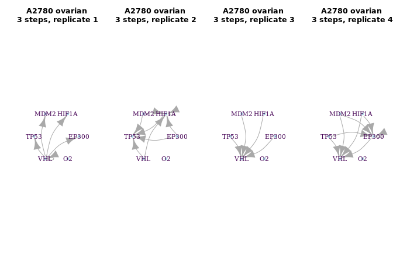

BoolNet Inference ovarian cancer cell A2780 (GSE52695)
================

RNA-seq analysis of Hypoxia and Normoxia cultured cancer cells
(GSE52695)

Purpose: To study differential mRNA and precursor miRNA expression under
hypoxia exposure in epithelial ovarian cancer cells. We treated ovarian
cancer cell line A2780 under hypoxia condition at different time points.
Normoxi acultured cells at corresponding time point were used as
controls. Overall design A2780 cancer cells, cultured under hypoxia and
normoxia. Time points tested: 6hr, 48hr, 6days.

<https://www.ncbi.nlm.nih.gov/geo/query/acc.cgi?acc=GSE52695>

Rupaimoole R, Wu SY, Pradeep S, Ivan C et al. Hypoxia-mediated
downregulation of miRNA biogenesis promotes tumour progression. Nat
Commun 2014 Oct 29;5:5202. PMID: 25351346

``` r
packages_cran = c("igraph", "BoolNet", "BiocManager", "tidyverse", "fs", "effectsize")
# Install and load packages
package.check <- lapply(packages_cran, FUN = function(x) {
  if (!require(x, character.only = TRUE)) {
    install.packages(x, dependencies = TRUE)
    library(x, character.only = TRUE)
  }
})
packages_bioconductor = c("Biobase", "GEOquery", "vsn", "ArrayExpress", "illuminaHumanv3.db")
# Install and load packages
package.check <- lapply(packages_bioconductor, FUN = function(x) {
  if (!require(x, character.only = TRUE)) {
    BiocManager::install(x, dependencies = TRUE)
    library(x, character.only = TRUE)
  }
})
rm(package.check, packages_bioconductor, packages_cran)
```

<!-- ```{r} -->

<!-- download_dir <- fs::path(".data_tmp") -->

<!-- if (!dir_exists(download_dir)) { dir_create(download_dir) } -->

<!-- if (!dir_exists(".data_tmp/GSE52695_series_matrix.txt.gz")) { -->

<!--   GSE52695 <-getGEO("GSE52695", destdir = download_dir, GSEMatrix = T) -->

<!--   } else{ -->

<!--   GSE52695 <-getGEO(filename=".data_tmp/GSE52695_series_matrix.txt.gz") -->

<!--   } -->

<!-- GSE52695_supp <- getGEOSuppFiles("GSE52695", baseDir = download_dir) -->

<!-- expr.GSE52695 <- read.table(rownames(GSE52695_supp)[2], header = T, row.names = "ID") -->

<!-- prob.GSE52695 <- unique(rownames(expr.GSE52695)) -->

<!-- data.GSE52695 <- pData(GSE52695[[1]]) -->

<!-- data.GSE52695 <- data.GSE52695[data.GSE52695$description.1 %in% "RNA",] -->

<!-- expr.GSE52695 <- expr.GSE52695 %>% -->

<!--   rename_at(vars(data.GSE52695$description), ~data.GSE52695$geo_accession) -->

<!-- data.GSE52695 <- data.frame( -->

<!--                   codes = as.character(data.GSE52695$geo_accession), -->

<!--                   cell_line ="ovarian A2780", -->

<!--                   time = data.GSE52695$`time:ch1`, -->

<!--                   condition = data.GSE52695$`stress:ch1`) -->

<!-- data.GSE52695$rep <- rep(1:4, n= length(data.GSE52695$codes)) -->

<!-- data.GSE52695 <- data.GSE52695 %>% -->

<!--   mutate(time = recode(time, "6hr" = "6h", -->

<!--                              "48hr" = "2d", -->

<!--                              "6days" = "6d")) %>% -->

<!--   mutate(condition = recode(condition, "control" = "no", -->

<!--                              "Hypoxia" = "hy")) -->

<!-- rm(download_dir, GSE52695, GSE52695_supp, prob.GSE52695) -->

<!-- save.image("../data/data.GSE52695.Rdata") -->

<!-- ``` -->

# Load the pre-processed data

``` r
load("../data/data.GSE52695.Rdata")
eset <- ExpressionSet(assayData = as.matrix(expr.GSE52695), 
                      probeNames = row.names(expr.GSE52695))
expr.GSE52695 <- exprs(justvsn(eset))
```

# Selecting the HIF Genes

``` r
# Selected genes from HIF Axis
hif.symbols <- c("TP53", "HIF1A", "EP300", "MDM2", "VHL")

# Select the probes and genes
expr.GSE52695.hif <- as.data.frame(expr.GSE52695) %>% 
  rownames_to_column('symbol') %>% 
  filter(symbol %in% hif.symbols) %>% 
  arrange(symbol)
```

# Example of Binarizing

``` r
cols <- (data.GSE52695$rep == 1)
ov_1 <- 
expr.GSE52695.hif %>% 
  dplyr::select(c("symbol", data.GSE52695$codes[cols])) %>% arrange(symbol) %>% 
  arrange(symbol) %>% 
  rename_at(vars(data.GSE52695$codes[cols]),
            ~paste0(substr(data.GSE52695$condition[cols],1,2),".",
                    data.GSE52695$time[cols],".",
                    substr(data.GSE52695$cell_line[cols],1,2)))
knitr::kable(ov_1)
```

| symbol | no.6h.ov | no.2d.ov | no.6d.ov |
| :----- | -------: | -------: | -------: |
| EP300  | 2.472476 | 2.508330 | 2.928631 |
| HIF1A  | 3.911729 | 3.921996 | 4.546781 |
| MDM2   | 2.843657 | 2.988164 | 3.368365 |
| TP53   | 2.397712 | 2.563628 | 3.616591 |
| VHL    | 2.693130 | 2.480025 | 2.805941 |

``` r
binarizeTimeSeries(ov_1[,-1], method="kmeans")$binarizedMeasurements  %>% 
  data.frame(.)  %>% 
  add_column(symbol = ov_1$symbol, .before=0) %>% 
  knitr::kable(.)
```

| symbol | no.6h.ov | no.2d.ov | no.6d.ov |
| :----- | -------: | -------: | -------: |
| EP300  |        0 |        0 |        1 |
| HIF1A  |        0 |        0 |        1 |
| MDM2   |        0 |        0 |        1 |
| TP53   |        0 |        0 |        1 |
| VHL    |        1 |        0 |        1 |

``` r
binarizeTimeSeries(ov_1[,-1], method="kmeans")$binarizedMeasurements  %>% 
  data.frame(.)  %>% 
  aggregate(., list(symbol = ov_1$symbol), mean) %>% 
  mutate_at(vars(-symbol), funs(ifelse(. >= 0.5, 1, 0))) %>% 
  rbind(., c("O2", 1,1,1)) %>% 
  knitr::kable(.)
```

| symbol | no.6h.ov | no.2d.ov | no.6d.ov |
| :----- | :------- | :------- | :------- |
| EP300  | 0        | 0        | 1        |
| HIF1A  | 0        | 0        | 1        |
| MDM2   | 0        | 0        | 1        |
| TP53   | 0        | 0        | 1        |
| VHL    | 1        | 0        | 1        |
| O2     | 1        | 1        | 1        |

``` r
# Function to binarize according an consensus mean of probes, add the O2 state and rename columns 
binNetHy <- function(b){

  cols <- data.GSE52695$codes %in% names(b)

    binarizeTimeSeries(b[,-1], method="kmeans")$binarizedMeasurements  %>% 
    as.data.frame(.)  %>% 
    aggregate(., list(symbol = b$symbol), mean) %>%  # mean of binarized probes
    mutate_at(vars(-symbol), funs(ifelse(. >= 0.5, 1, 0))) %>%  # consensus with a bies to 1 (>= 0.5)
    rbind(., c("O2",0,0,0)) %>% 
      rename_at(vars(data.GSE52695$codes[cols] ),
              ~paste0(substr(data.GSE52695$condition[cols],1,2),".",
                      data.GSE52695$time[cols],".",
                      substr(data.GSE52695$cell_line[cols],1,2), ".",
                      data.GSE52695$rep[cols])) %>% 
    column_to_rownames("symbol")
}    
    
binNetNo <- function(b){    
    cols <- data.GSE52695$codes %in% names(b)

    binarizeTimeSeries(b[,-1], method="kmeans")$binarizedMeasurements  %>% 
    as.data.frame(.)  %>% 
    aggregate(., list(symbol = b$symbol), mean) %>%  # mean of binarized probes
    mutate_at(vars(-symbol), funs(ifelse(. >= 0.5, 1, 0))) %>%  # consensus with a bies to 1 (>= 0.5)
    rbind(., c("O2",1,1,1)) %>% 
      rename_at(vars(data.GSE52695$codes[cols] ),
              ~paste0(substr(data.GSE52695$condition[cols],1,2),".",
                      data.GSE52695$time[cols],".",
                      substr(data.GSE52695$cell_line[cols],1,2), ".",
                      data.GSE52695$rep[cols])) %>% 
    column_to_rownames("symbol")    
}

ov.1 <- 
expr.GSE52695.hif %>% 
  dplyr::select(c("symbol", data.GSE52695$codes[data.GSE52695$rep == 1]))  %>% 
  binNetNo(.) 

ov.2 <- 
expr.GSE52695.hif %>% 
  dplyr::select(c("symbol", data.GSE52695$codes[data.GSE52695$rep == 2]))  %>% 
  binNetNo(.) 

ov.3 <- 
expr.GSE52695.hif %>% 
  dplyr::select(c("symbol", data.GSE52695$codes[data.GSE52695$rep == 3]))  %>% 
  binNetHy(.) 

ov.4 <- 
expr.GSE52695.hif %>% 
  dplyr::select(c("symbol", data.GSE52695$codes[data.GSE52695$rep == 4]))  %>% 
  binNetHy(.) 
```

# epithelial ovarian cancer cell line A2780

``` r
# epithelial ovarian cancer cell line A2780 - 3 time-points, 4 replicates
ov.1.net <- reconstructNetwork(ov.1, method="bestfit",returnPBN=TRUE,readableFunctions=TRUE)
ov.2.net <- reconstructNetwork(ov.2, method="bestfit",returnPBN=TRUE,readableFunctions=TRUE)
ov.3.net <- reconstructNetwork(ov.3, method="bestfit",returnPBN=TRUE,readableFunctions=TRUE)
ov.4.net <- reconstructNetwork(ov.4, method="bestfit",returnPBN=TRUE,readableFunctions=TRUE)

ov.1.p <- plotNetworkWiring(ov.1.net, plotIt=F)
ov.2.p <- plotNetworkWiring(ov.2.net, plotIt=F)
ov.3.p <- plotNetworkWiring(ov.3.net, plotIt=F)
ov.4.p <- plotNetworkWiring(ov.4.net, plotIt=F)

# ov.all <- reconstructNetwork(list(ov.1.net,ov.2.net,ov.3.net,ov.4.net),method="bestfit",returnPBN=TRUE,readableFunctions=TRUE)
# ov.all.p <- plotNetworkWiring(ov.all, plotIt=F)
```

``` r
# A2780 ovarian - 3 steps, replicate 1
print(ov.1.net)
```

    ## Probabilistic Boolean network with 6 genes
    ## 
    ## Involved genes:
    ## EP300 HIF1A MDM2 TP53 VHL O2
    ## 
    ## Transition functions:
    ## 
    ## Alternative transition functions for gene EP300:
    ## EP300 = (!VHL) ( probability: 1, error: 0)
    ## 
    ## Alternative transition functions for gene HIF1A:
    ## HIF1A = (!VHL) ( probability: 1, error: 0)
    ## 
    ## Alternative transition functions for gene MDM2:
    ## MDM2 = (!VHL) ( probability: 1, error: 0)
    ## 
    ## Alternative transition functions for gene TP53:
    ## TP53 = (!VHL) ( probability: 1, error: 0)
    ## 
    ## Alternative transition functions for gene VHL:
    ## VHL = (!VHL) ( probability: 1, error: 0)
    ## 
    ## Alternative transition functions for gene O2:
    ## O2 = 1 ( probability: 1, error: 0)
    ## 
    ## Knocked-out and over-expressed genes:
    ## O2 = 1

``` r
# A2780 ovarian - 3 steps, replicate 2
print(ov.2.net)
```

    ## Probabilistic Boolean network with 6 genes
    ## 
    ## Involved genes:
    ## EP300 HIF1A MDM2 TP53 VHL O2
    ## 
    ## Transition functions:
    ## 
    ## Alternative transition functions for gene EP300:
    ## EP300 = 0 ( probability: 1, error: 0)
    ## 
    ## Alternative transition functions for gene HIF1A:
    ## HIF1A = (!VHL) ( probability: 0.25, error: 0)
    ## HIF1A = (!MDM2) ( probability: 0.25, error: 0)
    ## HIF1A = (!HIF1A) ( probability: 0.25, error: 0)
    ## HIF1A = (!EP300) ( probability: 0.25, error: 0)
    ## 
    ## Alternative transition functions for gene MDM2:
    ## MDM2 = 0 ( probability: 1, error: 0)
    ## 
    ## Alternative transition functions for gene TP53:
    ## TP53 = (!VHL) ( probability: 0.25, error: 0)
    ## TP53 = (!MDM2) ( probability: 0.25, error: 0)
    ## TP53 = (!HIF1A) ( probability: 0.25, error: 0)
    ## TP53 = (!EP300) ( probability: 0.25, error: 0)
    ## 
    ## Alternative transition functions for gene VHL:
    ## VHL = 0 ( probability: 1, error: 0)
    ## 
    ## Alternative transition functions for gene O2:
    ## O2 = 1 ( probability: 1, error: 0)
    ## 
    ## Knocked-out and over-expressed genes:
    ## EP300 = 0
    ## MDM2 = 0
    ## VHL = 0
    ## O2 = 1

``` r
# A2780 ovarian - 3 steps, replicate 3
print(ov.3.net)
```

    ## Probabilistic Boolean network with 6 genes
    ## 
    ## Involved genes:
    ## EP300 HIF1A MDM2 TP53 VHL O2
    ## 
    ## Transition functions:
    ## 
    ## Alternative transition functions for gene EP300:
    ## EP300 = 0 ( probability: 1, error: 0)
    ## 
    ## Alternative transition functions for gene HIF1A:
    ## HIF1A = 0 ( probability: 1, error: 0)
    ## 
    ## Alternative transition functions for gene MDM2:
    ## MDM2 = 0 ( probability: 1, error: 0)
    ## 
    ## Alternative transition functions for gene TP53:
    ## TP53 = 1 ( probability: 1, error: 0)
    ## 
    ## Alternative transition functions for gene VHL:
    ## VHL = (!TP53) ( probability: 0.25, error: 0)
    ## VHL = (MDM2) ( probability: 0.25, error: 0)
    ## VHL = (HIF1A) ( probability: 0.25, error: 0)
    ## VHL = (EP300) ( probability: 0.25, error: 0)
    ## 
    ## Alternative transition functions for gene O2:
    ## O2 = 0 ( probability: 1, error: 0)
    ## 
    ## Knocked-out and over-expressed genes:
    ## EP300 = 0
    ## HIF1A = 0
    ## MDM2 = 0
    ## TP53 = 1
    ## O2 = 0

``` r
# A2780 ovarian - 3 steps, replicate 4
print(ov.3.net)
```

    ## Probabilistic Boolean network with 6 genes
    ## 
    ## Involved genes:
    ## EP300 HIF1A MDM2 TP53 VHL O2
    ## 
    ## Transition functions:
    ## 
    ## Alternative transition functions for gene EP300:
    ## EP300 = 0 ( probability: 1, error: 0)
    ## 
    ## Alternative transition functions for gene HIF1A:
    ## HIF1A = 0 ( probability: 1, error: 0)
    ## 
    ## Alternative transition functions for gene MDM2:
    ## MDM2 = 0 ( probability: 1, error: 0)
    ## 
    ## Alternative transition functions for gene TP53:
    ## TP53 = 1 ( probability: 1, error: 0)
    ## 
    ## Alternative transition functions for gene VHL:
    ## VHL = (!TP53) ( probability: 0.25, error: 0)
    ## VHL = (MDM2) ( probability: 0.25, error: 0)
    ## VHL = (HIF1A) ( probability: 0.25, error: 0)
    ## VHL = (EP300) ( probability: 0.25, error: 0)
    ## 
    ## Alternative transition functions for gene O2:
    ## O2 = 0 ( probability: 1, error: 0)
    ## 
    ## Knocked-out and over-expressed genes:
    ## EP300 = 0
    ## HIF1A = 0
    ## MDM2 = 0
    ## TP53 = 1
    ## O2 = 0

``` r
# # A2780 ovarian - 3 steps, all replicates
# print(ov.all.p)
```

``` r
# A2780 ovarian cancer - 4 time-points 
par(mfrow = c(1,4))
plot(ov.1.p, vertex.label.color="#440154ff", vertex.color="lightblue", vertex.frame.color="white", layout=layout_in_circle, edge.curved=.3,
     main="A2780 ovarian\n 3 steps, replicate 1")
plot(ov.2.p, vertex.label.color="#440154ff", vertex.color="lightblue", vertex.frame.color="white", layout=layout_in_circle, edge.curved=.3,
     main="A2780 ovarian\n 3 steps, replicate 2")
plot(ov.3.p, vertex.label.color="#440154ff", vertex.color="lightblue", vertex.frame.color="white", layout=layout_in_circle, edge.curved=.3,
     main="A2780 ovarian\n 3 steps, replicate 3")
plot(ov.4.p, vertex.label.color="#440154ff", vertex.color="lightblue", vertex.frame.color="white", layout=layout_in_circle, edge.curved=.3,
     main="A2780 ovarian\n 3 steps, replicate 4")
```

<!-- -->

<!-- ```{r} -->

<!-- par(mfrow = c(1,1)) -->

<!-- plot(ov.all.p, vertex.label.color="#440154ff", vertex.color="lightblue", vertex.frame.color="white", layout=layout_in_circle, edge.curved=.3, -->

<!--      main="A2780 ovarian\n 3 steps, all replicates") -->

<!-- ``` -->
