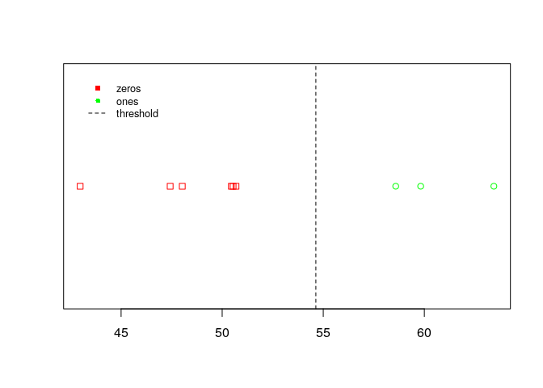
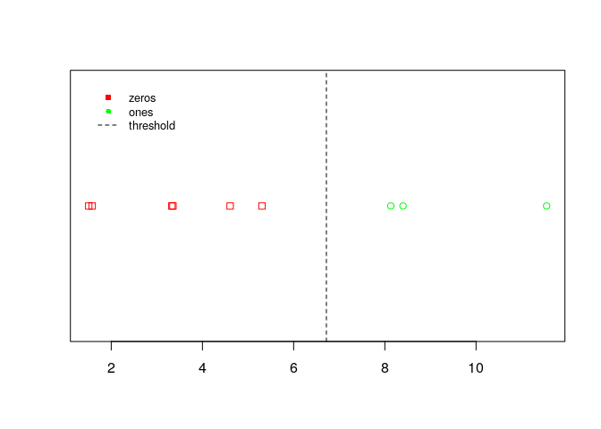
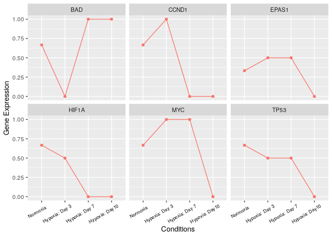
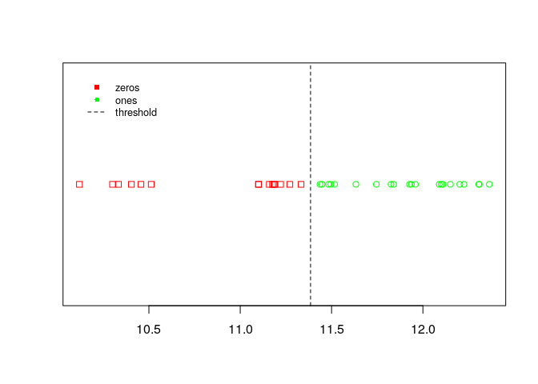
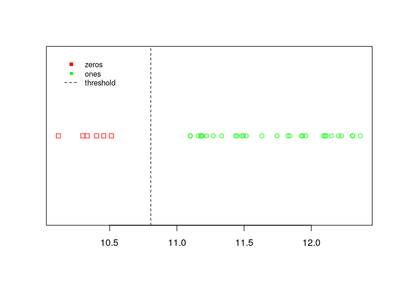
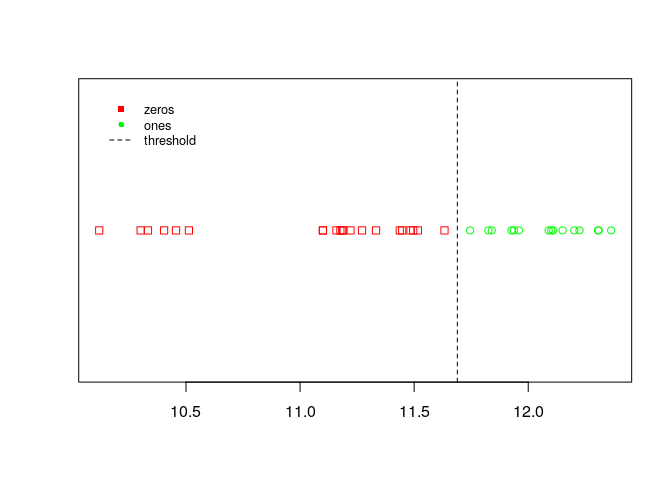
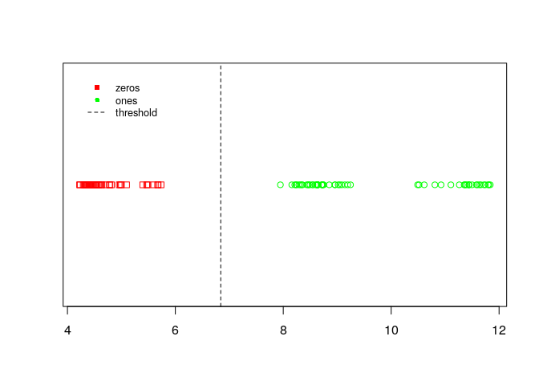
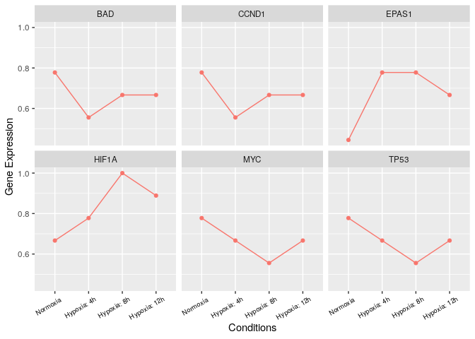

Discretization of Hypoxia and Normoxia
================

# Installing and Loading Libraries

``` r
packages_bioconductor = c("limma")

#use this function to check if each package is on the local machine
#if a package is installed, it will be loaded
#if any are not, the missing package(s) will be installed from Bioconductor and loaded
package.check <- lapply(packages_bioconductor, FUN = function(x) {
  if (!require(x, character.only = TRUE)) {
    BiocManager::install(x, dependencies = TRUE)
    library(x, character.only = TRUE)
  }
})

packages_cran = c("tidyverse","BiTrinA")
  
#use this function to check if each package is on the local machine
#if a package is installed, it will be loaded
#if any are not, the missing package(s) will be installed from CRAN and loaded
package.check <- lapply(packages_cran, FUN = function(x) {
  if (!require(x, character.only = TRUE)) {
    install.packages(x, dependencies = TRUE)
    library(x, character.only = TRUE)
  }
})

rm(package.check, packages_bioconductor, packages_cran)
```

``` r
setwd(".")
load("pipeline_EGEOD18494.RData")
load("pipeline_GSE142867.RData")
```

# BiTrinA

Müssel C, Schmid F, Blätte TJ, Hopfensitz M, Lausser L, Kestler HA.
BiTrinA–multiscale binarization and trinarization with quality analysis.
Bioinformatics. 2016;32(3):465-468. <doi:10.1093/bioinformatics/btv591>.
<https://pubmed.ncbi.nlm.nih.gov/26468003/>

<https://cran.r-project.org/web/packages/BiTrinA/vignettes/Vignette.pdf>

*Arguments*

  - *method*: Chooses the BASC method to use (see details), i.e. either
    “A” or “B”.

  - *vect*: A real-valued vector of data to binarize.

  - *tau*: This parameter adjusts the sensitivity and the specificity of
    the statistical testing procedure that rates the quality of the
    binarization. Defaults to 0.01.

  - *Compute a series of step functions*: An initial step function is
    obtained by rearranging the original time series measurements in
    increasing order. Then, step functions with fewer discontinuities
    are calculated. BASC A calculates these step functions in such a way
    that each minimizes the Euclidean distance to the initial step
    function. BASC B obtains step functions from smoothened versions of
    the input function in a scale-space manner.

  - *Find strongest discontinuity in each step function*: A strong
    discontinuity is a high jump size (derivative) in combination with a
    low approximation error.

  - *Estimate location and variation of the strongest discontinuities*:
    Based on these estimates, data values can be excluded from further
    analyses.

<!-- end list -->

``` r
# Correcting an outlier on HIF1A:
exp.GSE142867.hif$GSM4246818 <- NULL
exp.GSE142867.hif.pivot <- exp.GSE142867.hif.pivot[exp.GSE142867.hif.pivot$codes !="GSM4246818", ]
pData.GSE142867 <- pData.GSE142867[pData.GSE142867$codes != "GSM4246818",]

result <- binarize.kMeans(exp.GSE142867.hif.pivot[exp.GSE142867.hif.pivot$Symbol =="HIF1A", "value"])
print(result@originalMeasurements)
```

    ## [1] 63.4396 47.4268 58.5841 48.0257 59.8188 42.9745 50.4544 50.6839 50.5401

``` r
print(result)
```

    ## Method: k-Means
    ## 
    ## Threshold: 54.634
    ## 
    ## Binarized vector: [ 1 0 1 0 1 0 0 0 0 ]
    ## 
    ## p value: 0.5220407

``` r
plot(result)

result <- binarize.BASC(exp.GSE142867.hif.pivot[exp.GSE142867.hif.pivot$Symbol =="HIF1A", "value"], method="A", tau=0.15)

print(result)
```

    ## Method: BASC A
    ## 
    ## Threshold: 54.634
    ## 
    ## Binarized vector: [ 1 0 1 0 1 0 0 0 0 ]
    ## 
    ## p value: 0.001

``` r
plot(result)
```

<!-- -->

``` r
result <- binarize.BASC(exp.GSE142867.hif.pivot[exp.GSE142867.hif.pivot$Symbol =="HIF1A", "value"], method="B", tau=0.15)

print(result)
```

    ## Method: BASC B
    ## 
    ## Threshold: 54.634
    ## 
    ## Binarized vector: [ 1 0 1 0 1 0 0 0 0 ]
    ## 
    ## p value: 0.001

``` r
plot(result)
```

``` r
result <- binarize.kMeans(exp.GSE142867.hif.pivot[exp.GSE142867.hif.pivot$Symbol =="EPAS1", "value"])
print(result@originalMeasurements)
```

    ## [1]  8.13003  3.32933  1.58128  3.35318  8.39851  5.30624 11.54760  1.50617
    ## [9]  4.60700

``` r
print(result)
```

    ## Method: k-Means
    ## 
    ## Threshold: 6.718135
    ## 
    ## Binarized vector: [ 1 0 0 0 1 0 1 0 0 ]
    ## 
    ## p value: 0.4382491

``` r
plot(result)

result <- binarize.BASC(exp.GSE142867.hif.pivot[exp.GSE142867.hif.pivot$Symbol =="EPAS1", "value"], method="A", tau=0.15)

print(result)
```

    ## Method: BASC A
    ## 
    ## Threshold: 6.718135
    ## 
    ## Binarized vector: [ 1 0 0 0 1 0 1 0 0 ]
    ## 
    ## p value: 0.001

``` r
plot(result)
```

<!-- -->

``` r
result <- binarize.BASC(exp.GSE142867.hif.pivot[exp.GSE142867.hif.pivot$Symbol =="EPAS1", "value"], method="B", tau=0.15)

print(result)
```

    ## Method: BASC B
    ## 
    ## Threshold: 6.718135
    ## 
    ## Binarized vector: [ 1 0 0 0 1 0 1 0 0 ]
    ## 
    ## p value: 0.001

``` r
plot(result)
```

# BinarizeMatrix of GSE142867

``` r
exp.GSE142867.hif.bin <- binarizeMatrix(exp.GSE142867.hif[,c(2:10)], 
               method = c("BASCA"), 
               adjustment = "none")

exp.GSE142867.hif.bin <- cbind(exp.GSE142867.hif.bin, exp.GSE142867.hif$Symbol)

pData.GSE142867$rep <- pData.GSE142867$title %>% 
                      as.character(.) %>%
                      strsplit( "rep " ) %>%
                      sapply( "[", 2 ) %>% str_replace_na(replacement="")


names(exp.GSE142867.hif.bin) <- c(paste0(substr(pData.GSE142867$condition,1,4),".", pData.GSE142867$time, ".", pData.GSE142867$rep), c("threshold", "p.value", "Symbol"))

# Selecting the probes with smaller p-value
exp.GSE142867.hif.bin <- data.frame(exp.GSE142867.hif.bin %>%
     group_by(Symbol) %>%
     slice(which.min(p.value)))

head(exp.GSE142867.hif.bin)
```

<div data-pagedtable="false">

<script data-pagedtable-source type="application/json">
{"columns":[{"label":[""],"name":["_rn_"],"type":[""],"align":["left"]},{"label":["norm.d3."],"name":[1],"type":["int"],"align":["right"]},{"label":["norm.d7."],"name":[2],"type":["int"],"align":["right"]},{"label":["norm.d10."],"name":[3],"type":["int"],"align":["right"]},{"label":["hypo.d3.1"],"name":[4],"type":["int"],"align":["right"]},{"label":["hypo.d3.2"],"name":[5],"type":["int"],"align":["right"]},{"label":["hypo.d7.1"],"name":[6],"type":["int"],"align":["right"]},{"label":["hypo.d7.2"],"name":[7],"type":["int"],"align":["right"]},{"label":["hypo.d10.1"],"name":[8],"type":["int"],"align":["right"]},{"label":["hypo.d10.2"],"name":[9],"type":["int"],"align":["right"]},{"label":["threshold"],"name":[10],"type":["dbl"],"align":["right"]},{"label":["p.value"],"name":[11],"type":["dbl"],"align":["right"]},{"label":["Symbol"],"name":[12],"type":["fctr"],"align":["left"]}],"data":[{"1":"1","2":"1","3":"0","4":"1","5":"1","6":"1","7":"1","8":"0","9":"1","10":"23.564150","11":"0.001","12":"AKIP1","_rn_":"1"},{"1":"0","2":"1","3":"1","4":"0","5":"0","6":"1","7":"1","8":"1","9":"1","10":"17.104050","11":"0.749","12":"BAD","_rn_":"2"},{"1":"1","2":"0","3":"0","4":"0","5":"1","6":"0","7":"0","8":"0","9":"0","10":"8.272825","11":"0.001","12":"BCL2","_rn_":"3"},{"1":"0","2":"0","3":"0","4":"0","5":"1","6":"1","7":"1","8":"1","9":"1","10":"82.043400","11":"0.001","12":"BNIP3","_rn_":"4"},{"1":"0","2":"0","3":"1","4":"0","5":"0","6":"0","7":"0","8":"1","9":"1","10":"85.699850","11":"1.000","12":"CCNA2","_rn_":"5"},{"1":"0","2":"1","3":"0","4":"1","5":"0","6":"1","7":"0","8":"1","9":"0","10":"206.863000","11":"0.904","12":"CCNB1","_rn_":"6"}],"options":{"columns":{"min":{},"max":[10]},"rows":{"min":[10],"max":[10]},"pages":{}}}
  </script>

</div>

``` r
exp.GSE142867.hif.mean <- exp.GSE142867.hif.bin %>%
 mutate(norm = rowMeans(dplyr::select(., starts_with("norm"))),
        hypo.d3 = rowMeans(dplyr::select(., starts_with("hypo.d3"))),
        hypo.d7 = rowMeans(dplyr::select(., starts_with("hypo.d7"))),
        hypo.d10 = rowMeans(dplyr::select(., starts_with("hypo.d10"))))  %>%
  dplyr::select(., -ends_with(c(".",".1",".2")))

exp.GSE142867.hif.mean
```

<div data-pagedtable="false">

<script data-pagedtable-source type="application/json">
{"columns":[{"label":["threshold"],"name":[1],"type":["dbl"],"align":["right"]},{"label":["p.value"],"name":[2],"type":["dbl"],"align":["right"]},{"label":["Symbol"],"name":[3],"type":["fctr"],"align":["left"]},{"label":["norm"],"name":[4],"type":["dbl"],"align":["right"]},{"label":["hypo.d3"],"name":[5],"type":["dbl"],"align":["right"]},{"label":["hypo.d7"],"name":[6],"type":["dbl"],"align":["right"]},{"label":["hypo.d10"],"name":[7],"type":["dbl"],"align":["right"]}],"data":[{"1":"23.56415000","2":"0.001","3":"AKIP1","4":"0.6666667","5":"1.0","6":"1.0","7":"0.5"},{"1":"17.10405000","2":"0.749","3":"BAD","4":"0.6666667","5":"0.0","6":"1.0","7":"1.0"},{"1":"8.27282500","2":"0.001","3":"BCL2","4":"0.3333333","5":"0.5","6":"0.0","7":"0.0"},{"1":"82.04340000","2":"0.001","3":"BNIP3","4":"0.0000000","5":"0.5","6":"1.0","7":"1.0"},{"1":"85.69985000","2":"1.000","3":"CCNA2","4":"0.3333333","5":"0.0","6":"0.0","7":"1.0"},{"1":"206.86300000","2":"0.904","3":"CCNB1","4":"0.3333333","5":"0.5","6":"0.5","7":"0.5"},{"1":"8.33386500","2":"0.001","3":"CCND1","4":"0.6666667","5":"1.0","6":"0.0","7":"0.0"},{"1":"59.18920000","2":"0.001","3":"CCNE1","4":"0.3333333","5":"0.0","6":"0.5","7":"1.0"},{"1":"30.95525000","2":"0.001","3":"CCNE2","4":"0.3333333","5":"0.0","6":"0.0","7":"1.0"},{"1":"243.48500000","2":"0.001","3":"CDC20","4":"0.0000000","5":"0.0","6":"0.5","7":"0.5"},{"1":"0.28327800","2":"0.001","3":"CDC20B","4":"0.0000000","5":"0.5","6":"0.5","7":"0.5"},{"1":"161.61100000","2":"0.001","3":"CDH1","4":"0.6666667","5":"0.5","6":"1.0","7":"1.0"},{"1":"63.36015000","2":"0.001","3":"CDKN1B","4":"0.3333333","5":"0.0","6":"0.0","7":"1.0"},{"1":"17.31785000","2":"1.000","3":"E2F1","4":"0.6666667","5":"0.0","6":"1.0","7":"1.0"},{"1":"25.31700000","2":"0.001","3":"E2F2","4":"0.3333333","5":"0.0","6":"0.0","7":"1.0"},{"1":"6.71813500","2":"0.001","3":"EPAS1","4":"0.3333333","5":"0.5","6":"0.5","7":"0.0"},{"1":"54.63400000","2":"0.001","3":"HIF1A","4":"0.6666667","5":"0.5","6":"0.0","7":"0.0"},{"1":"67.13335000","2":"0.537","3":"MCL1","4":"0.6666667","5":"1.0","6":"0.0","7":"0.5"},{"1":"75.24485000","2":"0.896","3":"MDM2","4":"0.0000000","5":"0.0","6":"0.5","7":"1.0"},{"1":"134.85275000","2":"0.001","3":"MYC","4":"0.6666667","5":"1.0","6":"1.0","7":"0.0"},{"1":"1.67470000","2":"0.001","3":"POU5F1","4":"0.6666667","5":"0.5","6":"0.0","7":"0.5"},{"1":"42.01210000","2":"0.001","3":"RB1","4":"0.3333333","5":"0.0","6":"0.0","7":"1.0"},{"1":"244.62650000","2":"0.001","3":"TP53","4":"0.6666667","5":"0.5","6":"0.5","7":"0.0"},{"1":"130.54700000","2":"0.895","3":"VEGFA","4":"0.0000000","5":"0.0","6":"1.0","7":"1.0"},{"1":"19.46365000","2":"0.001","3":"VEGFB","4":"0.6666667","5":"1.0","6":"1.0","7":"0.5"},{"1":"0.06326050","2":"0.001","3":"VEGFC","4":"1.0000000","5":"0.0","6":"0.0","7":"0.0"},{"1":"0.05937625","2":"1.000","3":"VEGFD","4":"0.6666667","5":"0.5","6":"0.5","7":"1.0"}],"options":{"columns":{"min":{},"max":[10]},"rows":{"min":[10],"max":[10]},"pages":{}}}
  </script>

</div>

``` r
exp.GSE142867.hif.pivot <- exp.GSE142867.hif.mean %>%
  group_by(Symbol) %>%
  pivot_longer(cols = starts_with(c("norm","hypo")), names_to = "codes", values_to = "value")

exp.GSE142867.hif.pivot$codes <- factor(exp.GSE142867.hif.pivot$codes,  levels =  c("norm", "hypo.d3" , "hypo.d7" , "hypo.d10"))

exp.GSE142867.hif.pivot$time <- as.numeric(exp.GSE142867.hif.pivot$codes)

head(exp.GSE142867.hif.pivot)
```

<div data-pagedtable="false">

<script data-pagedtable-source type="application/json">
{"columns":[{"label":["threshold"],"name":[1],"type":["dbl"],"align":["right"]},{"label":["p.value"],"name":[2],"type":["dbl"],"align":["right"]},{"label":["Symbol"],"name":[3],"type":["fctr"],"align":["left"]},{"label":["codes"],"name":[4],"type":["fctr"],"align":["left"]},{"label":["value"],"name":[5],"type":["dbl"],"align":["right"]},{"label":["time"],"name":[6],"type":["dbl"],"align":["right"]}],"data":[{"1":"23.56415","2":"0.001","3":"AKIP1","4":"norm","5":"0.6666667","6":"1"},{"1":"23.56415","2":"0.001","3":"AKIP1","4":"hypo.d3","5":"1.0000000","6":"2"},{"1":"23.56415","2":"0.001","3":"AKIP1","4":"hypo.d7","5":"1.0000000","6":"3"},{"1":"23.56415","2":"0.001","3":"AKIP1","4":"hypo.d10","5":"0.5000000","6":"4"},{"1":"17.10405","2":"0.749","3":"BAD","4":"norm","5":"0.6666667","6":"1"},{"1":"17.10405","2":"0.749","3":"BAD","4":"hypo.d3","5":"0.0000000","6":"2"}],"options":{"columns":{"min":{},"max":[10]},"rows":{"min":[10],"max":[10]},"pages":{}}}
  </script>

</div>

``` r
ggplot(aes(x = factor(time), y = value, group = Symbol, color="red"),  
           data = exp.GSE142867.hif.pivot[exp.GSE142867.hif.pivot$Symbol %in% c("HIF1A", "EPAS1", "TP53", "CCND1", "MYC", "BAD"),]) +
  geom_point() + 
  geom_line() + 
  scale_x_discrete(breaks = c(1, 2, 3, 4), 
                 labels = c("Normoxia", "Hypoxia: Day 3" , "Hypoxia: Day 7" , "Hypoxia: Day10")) +
  xlab("Conditions") + ylab("Gene Expression") +
  theme(legend.position = "none", axis.text.x=element_text(color = "black", size=7, angle=30, vjust=.8, hjust=0.8)) +
  #geom_line(aes(linetype=Symbol, color=Symbol)) +
  facet_wrap(~ Symbol) 
```

<!-- -->

``` r
result <- binarize.kMeans(exp.EGEOD18494.hif.pivot[exp.EGEOD18494.hif.pivot$Symbol =="HIF1A", "value"])
print(result@originalMeasurements)
```

    ##  [1] 11.09993 11.10031 11.18908 11.22083 11.15930 11.33301 11.48345 11.43693
    ##  [9] 11.44758 11.17674 11.18464 11.27155 12.36357 12.30590 12.30870 12.10095
    ## [17] 12.08955 12.15049 11.95877 11.82543 11.93702 11.92661 11.83996 11.74528
    ## [25] 12.20188 12.22473 12.10952 11.63301 11.51628 11.49576 10.45637 10.51275
    ## [33] 10.40399 10.11961 10.30104 10.33338

``` r
print(result)
```

    ## Method: k-Means
    ## 
    ## Threshold: 11.38497
    ## 
    ## Binarized vector: [ 0 0 0 0 0 0 1 1 1 0 0 0 1 1 1 1 1 1 1 1 1 1 1 1 1 1 1 1 1 1 0 0 0 0 0 0 ]
    ## 
    ## p value: 0.6033718

``` r
plot(result)
```

<!-- -->

``` r
result <- binarize.BASC(exp.EGEOD18494.hif.pivot[exp.EGEOD18494.hif.pivot$Symbol =="HIF1A", "value"], method="A", tau=0.15)

print(result)
```

    ## Method: BASC A
    ## 
    ## Threshold: 10.80634
    ## 
    ## Binarized vector: [ 1 1 1 1 1 1 1 1 1 1 1 1 1 1 1 1 1 1 1 1 1 1 1 1 1 1 1 1 1 1 0 0 0 0 0 0 ]
    ## 
    ## p value: 0.001

``` r
plot(result)
```

<!-- -->

``` r
result <- binarize.BASC(exp.EGEOD18494.hif.pivot[exp.EGEOD18494.hif.pivot$Symbol =="HIF1A", "value"], method="B", tau=0.15)

print(result)
```

    ## Method: BASC B
    ## 
    ## Threshold: 11.68915
    ## 
    ## Binarized vector: [ 0 0 0 0 0 0 0 0 0 0 0 0 1 1 1 1 1 1 1 1 1 1 1 1 1 1 1 0 0 0 0 0 0 0 0 0 ]
    ## 
    ## p value: 0.714

``` r
plot(result)
```

<!-- -->

``` r
result <- binarize.kMeans(exp.EGEOD18494.hif.pivot[exp.EGEOD18494.hif.pivot$Symbol =="EPAS1", "value"])
print(result@originalMeasurements)
```

    ##   [1]  8.158603 10.490430  4.411840  7.946806  4.778343 10.516568  8.236044
    ##   [8]  4.581157 10.612618  4.526004 10.810452  8.728469  8.495558 10.924638
    ##  [15]  4.816005  8.959960  4.624078 11.106704 11.403527  8.958029  4.411714
    ##  [22]  4.787820 11.353203  9.045852  9.142403 11.377785  4.555586  4.510526
    ##  [29] 11.262849  9.085448  4.530283  9.194425 11.365007 11.442036  9.246650
    ##  [36]  4.406581  4.293595  8.467167 11.809628  9.019338  4.346712 11.745523
    ##  [43]  8.463109  4.236207 11.836060  8.713637 11.663188  4.639237  8.853363
    ##  [50] 11.719763  4.540322  8.596764 11.797749  4.324933  8.356824  4.224678
    ##  [57] 11.637172  8.289320  4.508829 11.580829  4.469112 11.597624  8.434009
    ##  [64] 11.500355  8.317885  4.351934  4.314356  8.248103 11.444356 11.441650
    ##  [71]  8.341875  4.392230  4.362293  5.680692  8.640426  8.645186  4.367829
    ##  [78]  4.999542  8.619877  5.487918  4.450952  8.737130  4.588162  4.713284
    ##  [85]  8.550161  4.442202  4.958152  8.631684  4.432199  5.735518  4.429855
    ##  [92]  5.468998  8.747547  5.396533  8.637927  4.345203  4.981276  8.716295
    ##  [99]  4.402596  5.598347  8.632322  4.380594  4.343227  5.095773  8.542137
    ## [106]  4.481929  8.213758  5.672337

``` r
print(result)
```

    ## Method: k-Means
    ## 
    ## Threshold: 6.841162
    ## 
    ## Binarized vector: [ 1 1 0 1 0 1 1 0 1 0 1 1 1 1 0 1 0 1 1 1 0 0 1 1 1 1 0 0 1 1 0 1 1 1 1 0 0 1 1 1 0 1 1 0 1 1 1 0 1 1 0 1 1 0 1 0 1 1 0 1 0 1 1 1 1 0 0 1 1 1 1 0 0 0 1 1 0 0 1 0 0 1 0 0 1 0 0 1 0 0 0 0 1 0 1 0 0 1 0 0 1 0 0 0 1 0 1 0 ]
    ## 
    ## p value: 0

``` r
plot(result)

result <- binarize.BASC(exp.EGEOD18494.hif.pivot[exp.EGEOD18494.hif.pivot$Symbol =="EPAS1", "value"], method="A", tau=0.15)

print(result)
```

    ## Method: BASC A
    ## 
    ## Threshold: 6.841162
    ## 
    ## Binarized vector: [ 1 1 0 1 0 1 1 0 1 0 1 1 1 1 0 1 0 1 1 1 0 0 1 1 1 1 0 0 1 1 0 1 1 1 1 0 0 1 1 1 0 1 1 0 1 1 1 0 1 1 0 1 1 0 1 0 1 1 0 1 0 1 1 1 1 0 0 1 1 1 1 0 0 0 1 1 0 0 1 0 0 1 0 0 1 0 0 1 0 0 0 0 1 0 1 0 0 1 0 0 1 0 0 0 1 0 1 0 ]
    ## 
    ## p value: 0.001

``` r
plot(result)
```

<!-- -->

``` r
result <- binarize.BASC(exp.EGEOD18494.hif.pivot[exp.EGEOD18494.hif.pivot$Symbol =="EPAS1", "value"], method="B", tau=0.15)

print(result)
```

    ## Method: BASC B
    ## 
    ## Threshold: 6.841162
    ## 
    ## Binarized vector: [ 1 1 0 1 0 1 1 0 1 0 1 1 1 1 0 1 0 1 1 1 0 0 1 1 1 1 0 0 1 1 0 1 1 1 1 0 0 1 1 1 0 1 1 0 1 1 1 0 1 1 0 1 1 0 1 0 1 1 0 1 0 1 1 1 1 0 0 1 1 1 1 0 0 0 1 1 0 0 1 0 0 1 0 0 1 0 0 1 0 0 0 0 1 0 1 0 0 1 0 0 1 0 0 0 1 0 1 0 ]
    ## 
    ## p value: 0.001

``` r
plot(result)
```

# BinarizeMatrix of EGEOD18494

``` r
library(dplyr)

df <- exp.EGEOD18494.hif %>% dplyr::select(contains("GSM"))

exp.EGEOD18494.hif.bin <- binarizeMatrix(df, 
               method = c("BASCA"), 
               adjustment = "none")

exp.EGEOD18494.hif.bin <- cbind(exp.EGEOD18494.hif.bin, exp.EGEOD18494.hif$Symbol)

names <- exp.EGEOD18494.hif.bin %>% dplyr::select(contains("GSM")) %>% names()
pData.EGEOD18494 <- pData.EGEOD18494[order(pData.EGEOD18494$codes),]
pData.EGEOD18494$rep <- rep(1:3, n= length(pData.EGEOD18494$codes))
names(exp.EGEOD18494.hif.bin) <- c(paste0(substr(pData.EGEOD18494$condition,1,4),".", pData.EGEOD18494$time,".", substr(pData.EGEOD18494$cell_line,1,1) , pData.EGEOD18494$rep), c("threshold", "p.value", "Symbol"))


# Selecting the probes with smaller p-value
exp.EGEOD18494.hif.bin <- data.frame(exp.EGEOD18494.hif.bin %>%
     group_by(Symbol) %>%
     slice(which.min(p.value)))

head(exp.EGEOD18494.hif.bin)
```

<div data-pagedtable="false">

<script data-pagedtable-source type="application/json">
{"columns":[{"label":[""],"name":["_rn_"],"type":[""],"align":["left"]},{"label":["norm.control.H1"],"name":[1],"type":["int"],"align":["right"]},{"label":["norm.control.H2"],"name":[2],"type":["int"],"align":["right"]},{"label":["norm.control.H3"],"name":[3],"type":["int"],"align":["right"]},{"label":["hypo.4h.H1"],"name":[4],"type":["int"],"align":["right"]},{"label":["hypo.4h.H2"],"name":[5],"type":["int"],"align":["right"]},{"label":["hypo.4h.H3"],"name":[6],"type":["int"],"align":["right"]},{"label":["hypo.8h.H1"],"name":[7],"type":["int"],"align":["right"]},{"label":["hypo.8h.H2"],"name":[8],"type":["int"],"align":["right"]},{"label":["hypo.8h.H3"],"name":[9],"type":["int"],"align":["right"]},{"label":["hypo.12h.H1"],"name":[10],"type":["int"],"align":["right"]},{"label":["hypo.12h.H2"],"name":[11],"type":["int"],"align":["right"]},{"label":["hypo.12h.H3"],"name":[12],"type":["int"],"align":["right"]},{"label":["norm.control.U1"],"name":[13],"type":["int"],"align":["right"]},{"label":["norm.control.U2"],"name":[14],"type":["int"],"align":["right"]},{"label":["norm.control.U3"],"name":[15],"type":["int"],"align":["right"]},{"label":["hypo.4h.U1"],"name":[16],"type":["int"],"align":["right"]},{"label":["hypo.4h.U2"],"name":[17],"type":["int"],"align":["right"]},{"label":["hypo.4h.U3"],"name":[18],"type":["int"],"align":["right"]},{"label":["hypo.8h.U1"],"name":[19],"type":["int"],"align":["right"]},{"label":["hypo.8h.U2"],"name":[20],"type":["int"],"align":["right"]},{"label":["hypo.8h.U3"],"name":[21],"type":["int"],"align":["right"]},{"label":["hypo.12h.U1"],"name":[22],"type":["int"],"align":["right"]},{"label":["hypo.12h.U2"],"name":[23],"type":["int"],"align":["right"]},{"label":["hypo.12h.U3"],"name":[24],"type":["int"],"align":["right"]},{"label":["norm.control.M1"],"name":[25],"type":["int"],"align":["right"]},{"label":["norm.control.M2"],"name":[26],"type":["int"],"align":["right"]},{"label":["norm.control.M3"],"name":[27],"type":["int"],"align":["right"]},{"label":["hypo.4h.M1"],"name":[28],"type":["int"],"align":["right"]},{"label":["hypo.4h.M2"],"name":[29],"type":["int"],"align":["right"]},{"label":["hypo.4h.M3"],"name":[30],"type":["int"],"align":["right"]},{"label":["hypo.8h.M1"],"name":[31],"type":["int"],"align":["right"]},{"label":["hypo.8h.M2"],"name":[32],"type":["int"],"align":["right"]},{"label":["hypo.8h.M3"],"name":[33],"type":["int"],"align":["right"]},{"label":["hypo.12h.M1"],"name":[34],"type":["int"],"align":["right"]},{"label":["hypo.12h.M2"],"name":[35],"type":["int"],"align":["right"]},{"label":["hypo.12h.M3"],"name":[36],"type":["int"],"align":["right"]},{"label":["threshold"],"name":[37],"type":["dbl"],"align":["right"]},{"label":["p.value"],"name":[38],"type":["dbl"],"align":["right"]},{"label":["Symbol"],"name":[39],"type":["fctr"],"align":["left"]}],"data":[{"1":"0","2":"1","3":"0","4":"0","5":"1","6":"0","7":"1","8":"0","9":"0","10":"1","11":"0","12":"1","13":"1","14":"1","15":"0","16":"0","17":"0","18":"0","19":"0","20":"0","21":"0","22":"0","23":"0","24":"0","25":"0","26":"1","27":"1","28":"0","29":"0","30":"1","31":"0","32":"0","33":"1","34":"0","35":"1","36":"0","37":"6.542956","38":"0.001","39":"AKIP1","_rn_":"1"},{"1":"0","2":"1","3":"1","4":"1","5":"1","6":"0","7":"1","8":"1","9":"0","10":"1","11":"0","12":"1","13":"1","14":"1","15":"1","16":"1","17":"0","18":"0","19":"1","20":"1","21":"1","22":"1","23":"0","24":"1","25":"0","26":"1","27":"1","28":"0","29":"1","30":"1","31":"0","32":"0","33":"1","34":"0","35":"1","36":"1","37":"6.995191","38":"0.001","39":"BAD","_rn_":"2"},{"1":"1","2":"1","3":"0","4":"1","5":"1","6":"0","7":"1","8":"0","9":"0","10":"1","11":"0","12":"1","13":"1","14":"1","15":"0","16":"0","17":"0","18":"0","19":"0","20":"0","21":"0","22":"0","23":"0","24":"1","25":"0","26":"1","27":"1","28":"0","29":"0","30":"1","31":"0","32":"0","33":"1","34":"0","35":"1","36":"1","37":"5.500426","38":"0.001","39":"BCL2","_rn_":"3"},{"1":"1","2":"1","3":"1","4":"1","5":"1","6":"1","7":"1","8":"1","9":"1","10":"1","11":"1","12":"1","13":"1","14":"1","15":"1","16":"1","17":"1","18":"0","19":"1","20":"1","21":"1","22":"1","23":"0","24":"1","25":"0","26":"1","27":"1","28":"0","29":"1","30":"1","31":"1","32":"0","33":"1","34":"0","35":"1","36":"1","37":"11.480652","38":"0.882","39":"BNIP3","_rn_":"4"},{"1":"0","2":"0","3":"0","4":"0","5":"0","6":"0","7":"0","8":"0","9":"0","10":"0","11":"0","12":"0","13":"0","14":"0","15":"0","16":"0","17":"0","18":"1","19":"0","20":"0","21":"0","22":"0","23":"1","24":"0","25":"1","26":"0","27":"0","28":"1","29":"0","30":"0","31":"0","32":"1","33":"0","34":"1","35":"0","36":"0","37":"10.438243","38":"0.940","39":"CCNA2","_rn_":"5"},{"1":"0","2":"1","3":"1","4":"0","5":"1","6":"0","7":"1","8":"0","9":"0","10":"1","11":"0","12":"1","13":"1","14":"1","15":"0","16":"1","17":"0","18":"0","19":"0","20":"0","21":"0","22":"0","23":"1","24":"0","25":"1","26":"1","27":"1","28":"0","29":"0","30":"1","31":"0","32":"1","33":"1","34":"0","35":"1","36":"0","37":"10.361244","38":"0.001","39":"CCNB1","_rn_":"6"}],"options":{"columns":{"min":{},"max":[10]},"rows":{"min":[10],"max":[10]},"pages":{}}}
  </script>

</div>

``` r
exp.EGEOD18494.hif.mean <- exp.EGEOD18494.hif.bin %>%
 mutate(norm = rowMeans(dplyr::select(., starts_with("norm.control"))),
        hypo.4h = rowMeans(dplyr::select(., starts_with("hypo.4"))),
        hypo.8h = rowMeans(dplyr::select(., starts_with("hypo.8"))),
        hypo.12h = rowMeans(dplyr::select(., starts_with("hypo.12"))))  %>%
  dplyr::select(., -ends_with(c("1","2","3")))

exp.EGEOD18494.hif.mean
```

<div data-pagedtable="false">

<script data-pagedtable-source type="application/json">
{"columns":[{"label":["threshold"],"name":[1],"type":["dbl"],"align":["right"]},{"label":["p.value"],"name":[2],"type":["dbl"],"align":["right"]},{"label":["Symbol"],"name":[3],"type":["fctr"],"align":["left"]},{"label":["norm"],"name":[4],"type":["dbl"],"align":["right"]},{"label":["hypo.4h"],"name":[5],"type":["dbl"],"align":["right"]},{"label":["hypo.8h"],"name":[6],"type":["dbl"],"align":["right"]},{"label":["hypo.12h"],"name":[7],"type":["dbl"],"align":["right"]}],"data":[{"1":"6.542956","2":"0.001","3":"AKIP1","4":"0.5555556","5":"0.2222222","6":"0.2222222","7":"0.3333333"},{"1":"6.995191","2":"0.001","3":"BAD","4":"0.7777778","5":"0.5555556","6":"0.6666667","7":"0.6666667"},{"1":"5.500426","2":"0.001","3":"BCL2","4":"0.6666667","5":"0.3333333","6":"0.2222222","7":"0.5555556"},{"1":"11.480652","2":"0.882","3":"BNIP3","4":"0.8888889","5":"0.7777778","6":"0.8888889","7":"0.7777778"},{"1":"10.438243","2":"0.940","3":"CCNA2","4":"0.1111111","5":"0.2222222","6":"0.1111111","7":"0.2222222"},{"1":"10.361244","2":"0.001","3":"CCNB1","4":"0.7777778","5":"0.3333333","6":"0.3333333","7":"0.4444444"},{"1":"9.945023","2":"0.001","3":"CCND1","4":"0.7777778","5":"0.5555556","6":"0.6666667","7":"0.6666667"},{"1":"8.887440","2":"0.280","3":"CCNE1","4":"0.1111111","5":"0.2222222","6":"0.1111111","7":"0.2222222"},{"1":"6.170169","2":"0.001","3":"CCNE2","4":"0.7777778","5":"0.5555556","6":"0.6666667","7":"0.6666667"},{"1":"9.878912","2":"1.000","3":"CDC20","4":"0.7777778","5":"0.4444444","6":"0.4444444","7":"0.5555556"},{"1":"5.858471","2":"0.001","3":"CDC20B","4":"0.2222222","5":"0.3333333","6":"0.3333333","7":"0.1111111"},{"1":"4.087456","2":"0.001","3":"CDH1","4":"0.3333333","5":"0.4444444","6":"0.2222222","7":"0.3333333"},{"1":"8.755380","2":"0.001","3":"CDKN1B","4":"0.4444444","5":"0.6666667","6":"0.7777778","7":"0.5555556"},{"1":"8.350644","2":"0.001","3":"E2F1","4":"0.7777778","5":"0.3333333","6":"0.5555556","7":"0.6666667"},{"1":"8.046547","2":"0.478","3":"E2F2","4":"0.7777778","5":"0.4444444","6":"0.3333333","7":"0.5555556"},{"1":"9.618988","2":"0.001","3":"EPAS1","4":"0.4444444","5":"0.7777778","6":"0.7777778","7":"0.6666667"},{"1":"10.806342","2":"0.868","3":"HIF1A","4":"0.6666667","5":"0.7777778","6":"1.0000000","7":"0.8888889"},{"1":"9.850518","2":"0.001","3":"MCL1","4":"0.1111111","5":"0.4444444","6":"0.2222222","7":"0.2222222"},{"1":"5.601225","2":"0.001","3":"MDM2","4":"0.2222222","5":"0.4444444","6":"0.3333333","7":"0.3333333"},{"1":"9.821867","2":"0.001","3":"MYC","4":"0.7777778","5":"0.6666667","6":"0.5555556","7":"0.6666667"},{"1":"8.245554","2":"0.984","3":"POU5F1","4":"0.2222222","5":"0.2222222","6":"0.3333333","7":"0.2222222"},{"1":"8.137099","2":"0.001","3":"RB1","4":"0.5555556","5":"0.2222222","6":"0.2222222","7":"0.3333333"},{"1":"7.238310","2":"0.001","3":"TP53","4":"0.7777778","5":"0.6666667","6":"0.5555556","7":"0.6666667"},{"1":"10.510155","2":"0.812","3":"VEGFA","4":"0.3333333","5":"0.7777778","6":"0.6666667","7":"0.5555556"},{"1":"8.759290","2":"0.001","3":"VEGFB","4":"0.7777778","5":"0.5555556","6":"0.6666667","7":"0.6666667"},{"1":"7.523845","2":"0.001","3":"VEGFC","4":"0.7777778","5":"0.5555556","6":"0.6666667","7":"0.6666667"},{"1":"5.187924","2":"0.994","3":"VEGFD","4":"0.6666667","5":"0.6666667","6":"0.5555556","7":"0.5555556"}],"options":{"columns":{"min":{},"max":[10]},"rows":{"min":[10],"max":[10]},"pages":{}}}
  </script>

</div>

``` r
exp.EGEOD18494.hif.mean.pivot <- exp.EGEOD18494.hif.mean %>%
  group_by(Symbol) %>%
  pivot_longer(cols = starts_with(c("norm","hypo")), names_to = "codes", values_to = "value")

exp.EGEOD18494.hif.mean.pivot$codes <- factor(exp.EGEOD18494.hif.mean.pivot$codes,  levels =  c("norm", "hypo.4h" , "hypo.8h" , "hypo.12h"))

exp.EGEOD18494.hif.mean.pivot$time <- as.numeric(exp.EGEOD18494.hif.mean.pivot$codes)

head(exp.EGEOD18494.hif.mean.pivot)
```

<div data-pagedtable="false">

<script data-pagedtable-source type="application/json">
{"columns":[{"label":["threshold"],"name":[1],"type":["dbl"],"align":["right"]},{"label":["p.value"],"name":[2],"type":["dbl"],"align":["right"]},{"label":["Symbol"],"name":[3],"type":["fctr"],"align":["left"]},{"label":["codes"],"name":[4],"type":["fctr"],"align":["left"]},{"label":["value"],"name":[5],"type":["dbl"],"align":["right"]},{"label":["time"],"name":[6],"type":["dbl"],"align":["right"]}],"data":[{"1":"6.542956","2":"0.001","3":"AKIP1","4":"norm","5":"0.5555556","6":"1"},{"1":"6.542956","2":"0.001","3":"AKIP1","4":"hypo.4h","5":"0.2222222","6":"2"},{"1":"6.542956","2":"0.001","3":"AKIP1","4":"hypo.8h","5":"0.2222222","6":"3"},{"1":"6.542956","2":"0.001","3":"AKIP1","4":"hypo.12h","5":"0.3333333","6":"4"},{"1":"6.995191","2":"0.001","3":"BAD","4":"norm","5":"0.7777778","6":"1"},{"1":"6.995191","2":"0.001","3":"BAD","4":"hypo.4h","5":"0.5555556","6":"2"}],"options":{"columns":{"min":{},"max":[10]},"rows":{"min":[10],"max":[10]},"pages":{}}}
  </script>

</div>

``` r
ggplot(aes(x = factor(time), y = value, group = Symbol, color="red"),  
           data = exp.EGEOD18494.hif.mean.pivot[exp.EGEOD18494.hif.mean.pivot$Symbol %in% c("HIF1A", "EPAS1", "TP53", "CCND1", "MYC", "BAD"),]) +
  geom_point() + 
  geom_line() + 
  scale_x_discrete(breaks = c(1, 2, 3, 4), 
                 labels = c("Normoxia", "Hypoxia: 4h" , "Hypoxia: 8h" , "Hypoxia: 12h")) +
  xlab("Conditions") + ylab("Gene Expression") +
  theme(legend.position = "none", axis.text.x=element_text(color = "black", size=7, angle=30, vjust=.8, hjust=0.8)) +
  #geom_line(aes(linetype=Symbol, color=Symbol)) +
  facet_wrap(~ Symbol) 
```

<!-- -->
