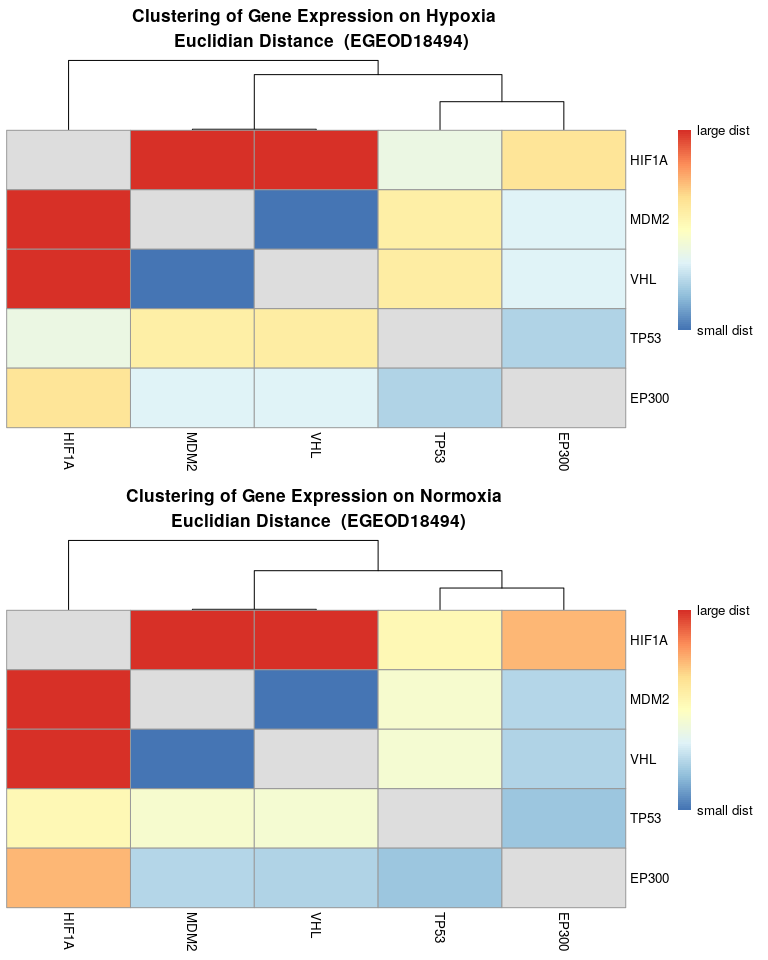
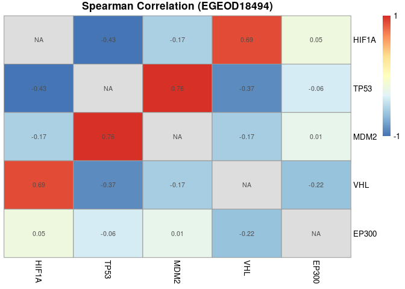
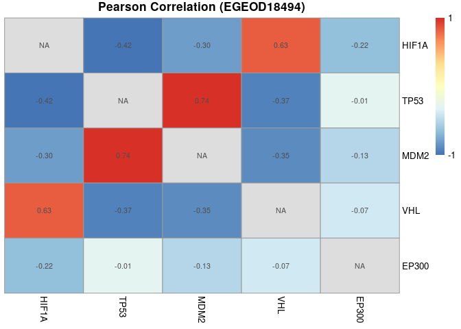
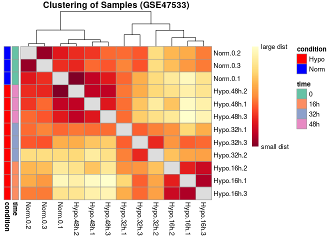
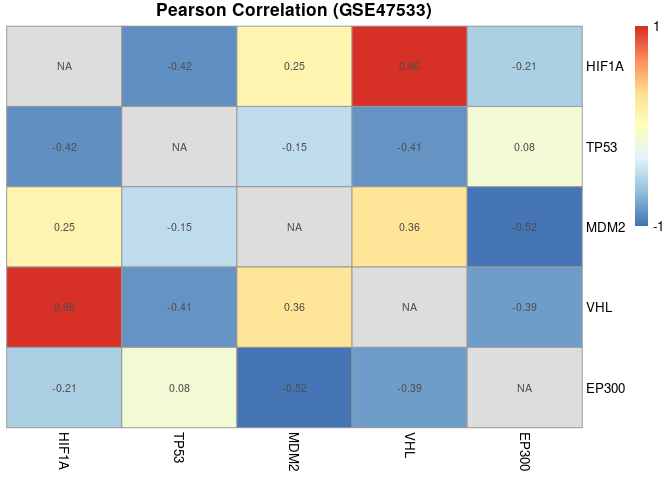
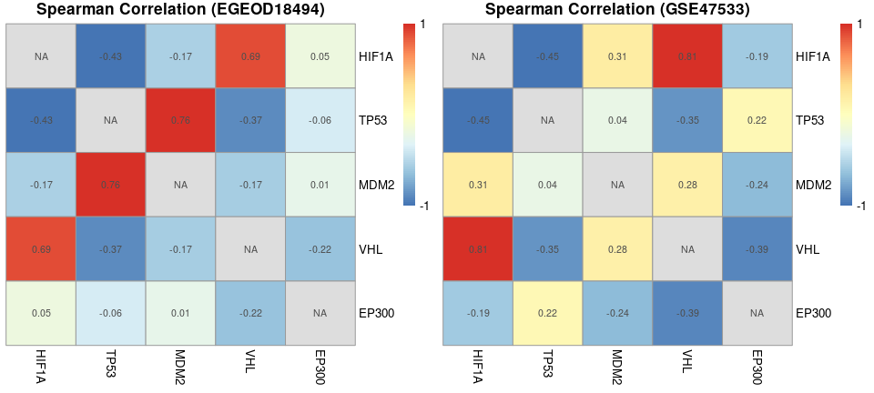
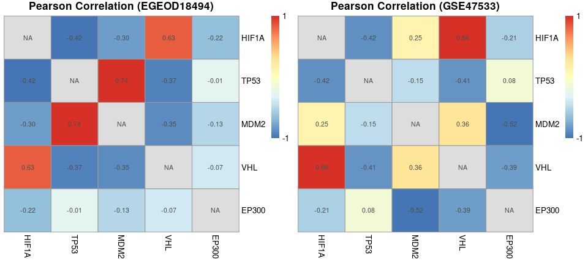
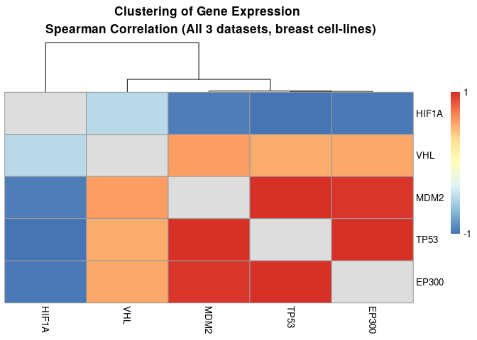
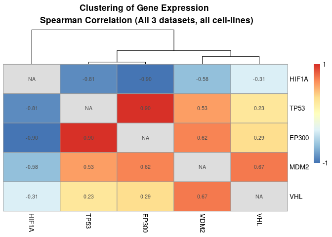

Expression Analysis of Breast Cancer Cell-lines (E-GEOD-18494, GSE47533
and GSE41491)
================

Rede Alexandre (reunião 27-11-2020)

HIF1a, \!VHL & \!O2  
p53, \!Mdm2  
Mdm2, p53 & \!VHL  
VHL, HIF1a & \!p53  
p300, ((p53 & HIF1a) & \!VHL) | (\!(p53 & HIF1a) & VHL)  
BIM, \!MCL\_1 & \!BCLXL & \!BCL2  
BAD, p53  
BID, (\!HIF1a & (p53 & VHL)) | (\!MCL\_1 & \!BCLXL & \!BCL2)  
BIK, \!MCL\_1 & \!BCLXL & \!BCL2  
MCL\_1, HIF1a  
BCLXL, HIF1a & \!(p53 & VHL) & ((\!Casp3 & \!BAD) | (\!Casp3 & BCL2))  
BCL2, HIF1a & \!(p53 & VHL) & ((MCL\_1 & \!BIM & \!BIK & \!BAD) | (\!BIM
& \!BIK & BCLXL & \!BAD))  
IAPs, \!DIABLO  
BAX, (BIM & \!BCLXL) | (BIK & \!BCLXL & \!BCL2) | (BID & \!BCLXL &
\!BCL2) | (BIM & BID) | (BIM & BIK) | (BIM & \!BCL2) | (\!MCL\_1 &
BIM)  
BAK, (\!MCL\_1 & BIM & \!BCLXL) | (BID & \!BCL2) | (BID & \!BCLXL) |
(\!MCL\_1 & BID) | (\!MCL\_1 & BIK & \!BCLXL) | (BIM & BID) | (BIK &
BID)  
DIABLO, BAX | BAK  
Cyto\_C, BAX | BAK  
Casp9, Casp3 | (\!IAPs & Cyto\_C)  
Casp3, \!IAPs & Casp9

BCLXL ?

No VHL in GSE41491

``` r
# Selected genes from HIF Axis
hif.symbols <- c("HIF1A", "TP53", "MDM2", "VHL", "EP300","TMBIM1","TMBIM4", "TMBIM6","BAD","BIK","MCL1", "BCL2","BIRC2", "BIRC3", "BIRC5", "BIRC6", "BIRC7", "DIABLO", "BAX", "CYC1", "CASP9", "CASP3") 

hif.probes <- anno.EGEOD18494$probes[anno.EGEOD18494$symbol %in% hif.symbols]

# Select the probes and genes
# EGEOD18494
expr.EGEOD18494.hif <- as.data.frame(expr.EGEOD18494) %>% 
  rownames_to_column('probes') %>% 
  filter(probes %in% hif.probes) %>% 
  merge(anno.EGEOD18494[anno.EGEOD18494$symbol %in% hif.symbols, c("probes","symbol")], by = "probes") %>% 
  mutate(., symbol=ifelse(symbol %in% c("TMBIM1","TMBIM4", "TMBIM6"), "BIM", symbol)) %>%
  mutate(., symbol=ifelse(symbol %in% c("BIRC2", "BIRC3", "BIRC5", "BIRC6", "BIRC7"), "IAPs", symbol)) %>%
  group_by(symbol) %>%
  summarise_at(vars(-probes), funs(mean(., na.rm=TRUE)))  %>%
  column_to_rownames(var = "symbol") %>%
  dplyr::select(c(data.EGEOD18494$codes[data.EGEOD18494$cell_line == "MDA-MB231 breast cancer"]))


hif.probes <- anno.GSE47533$probes[anno.GSE47533$symbol %in% hif.symbols]

# GSE47533
expr.GSE47533.hif <- as.data.frame(expr.GSE47533) %>% 
  rownames_to_column('probes') %>% 
  filter(probes %in% hif.probes) %>% 
  merge(anno.GSE47533[anno.GSE47533$symbol %in% hif.symbols, c("probes","symbol")], by = "probes") %>% 
  mutate(., symbol=ifelse(symbol %in% c("TMBIM1","TMBIM4", "TMBIM6"), "BIM", symbol)) %>%
  mutate(., symbol=ifelse(symbol %in% c("BIRC2", "BIRC3", "BIRC5", "BIRC6", "BIRC7"), "IAPs", symbol)) %>%
  group_by(symbol) %>%
  summarise_at(vars(-probes), funs(mean(., na.rm=TRUE)))  %>%
  column_to_rownames(var = "symbol") 
  

hif.probes <- anno.GSE41491$probes[anno.GSE41491$symbol %in% hif.symbols]

# GSE41491
expr.GSE41491.hif <- as.data.frame(expr.GSE41491) %>% 
  rownames_to_column('probes') %>% 
  filter(probes %in% hif.probes) %>% 
  merge(anno.GSE41491[anno.GSE41491$symbol %in% hif.symbols, c("probes","symbol")], by = "probes") %>% 
  mutate(., symbol=ifelse(symbol %in% c("TMBIM1","TMBIM4", "TMBIM6"), "BIM", symbol)) %>%
  mutate(., symbol=ifelse(symbol %in% c("BIRC2", "BIRC3", "BIRC5", "BIRC6", "BIRC7"), "IAPs", symbol)) %>%
  group_by(symbol) %>%
  summarise_at(vars(-probes), funs(mean(., na.rm=TRUE)))  %>%
  column_to_rownames(var = "symbol") 
```

``` r
write.table(expr.GSE47533.hif,"expr.GSE47533.txt", sep ="\t")
write.table(expr.EGEOD18494.hif, "expr.EGEOD18494.txt", sep ="\t")
write.table(expr.GSE41491.hif, "expr.GSE41491.txt", sep ="\t")

expr.EGEOD18494.tdm <- tdm_transform(ref_file = "expr.GSE47533.txt", file = "expr.EGEOD18494.txt")

expr.GSE41491.tdm <- tdm_transform(ref_file = "expr.GSE47533.txt", file = "expr.GSE41491.txt")

symbols <-  expr.EGEOD18494.tdm$gene
expr.EGEOD18494.tdm$gene  <- NULL

expr.EGEOD18494.tdm <- as.data.frame(matrix(as.numeric(unlist(expr.EGEOD18494.tdm)),  
                                            nrow = dim(expr.EGEOD18494.tdm)[1], 
                                            ncol = dim(expr.EGEOD18494.tdm)[2]))
colnames(expr.EGEOD18494.tdm) <- colnames(expr.EGEOD18494.hif)

rownames(expr.EGEOD18494.tdm) <- symbols
```

``` r
row_medians_assayData <- 
  Biobase::rowMedians(as.matrix(expr.GSE47533))

RLE_data <- sweep(expr.GSE47533, 1, row_medians_assayData)

RLE_data <- as.data.frame(RLE_data)
RLE_data_gathered <- 
  tidyr::gather(RLE_data, patient_array, log2_expression_deviation)

ggplot2::ggplot(RLE_data_gathered, aes(patient_array,
                                       log2_expression_deviation)) + 
  geom_boxplot(outlier.shape = NA) + 
  ylim(c(-2, 2)) + 
  ggtitle("expr.GSE47533") + 
  theme(axis.text.x = element_text(colour = "aquamarine4", 
                                  angle = 60, size = 6.5, hjust = 1 ,
                                  face = "bold"))
```

    ## Warning: Removed 142 rows containing non-finite values (stat_boxplot).

<!-- -->

``` r
row_medians_assayData <- 
  Biobase::rowMedians(as.matrix(expr.EGEOD18494.tdm))

RLE_data <- sweep(expr.EGEOD18494.tdm, 1, row_medians_assayData)

RLE_data <- as.data.frame(RLE_data)
RLE_data_gathered <- 
  tidyr::gather(RLE_data, patient_array, log2_expression_deviation)

ggplot2::ggplot(RLE_data_gathered, aes(patient_array,
                                       log2_expression_deviation)) + 
  geom_boxplot(outlier.shape = NA) + 
  ylim(c(-2, 2)) + 
  ggtitle("expr.EGEOD18494.tdm") + 
  theme(axis.text.x = element_text(colour = "aquamarine4", 
                                  angle = 60, size = 6.5, hjust = 1 ,
                                  face = "bold"))
```

<!-- -->

``` r
row_medians_assayData <- 
  Biobase::rowMedians(as.matrix(expr.EGEOD18494.hif))

RLE_data <- sweep(expr.EGEOD18494.hif, 1, row_medians_assayData)

RLE_data <- as.data.frame(RLE_data)
RLE_data_gathered <- 
  tidyr::gather(RLE_data, patient_array, log2_expression_deviation)

ggplot2::ggplot(RLE_data_gathered, aes(patient_array,
                                       log2_expression_deviation)) + 
  geom_boxplot(outlier.shape = NA) + 
  ylim(c(-2, 2)) + 
  ggtitle("expr.EGEOD18494.hif") + 
  theme(axis.text.x = element_text(colour = "aquamarine4", 
                                  angle = 60, size = 6.5, hjust = 1 ,
                                  face = "bold"))
```

<!-- -->

``` r
rm(RLE_data, RLE_data_gathered, row_medians_assayData)
```

``` r
hif.probes <- anno.GSE47533$probes[anno.GSE47533$symbol %in% hif.symbols]


row_medians_assayData <- 
  Biobase::rowMedians(as.matrix(t(expr.GSE47533.hif)))

RLE_data <- sweep(t(expr.GSE47533.hif), 1, row_medians_assayData)

RLE_data <- as.data.frame(RLE_data)
RLE_data_gathered <- 
  tidyr::gather(RLE_data, patient_array, log2_expression_deviation)

ggplot2::ggplot(RLE_data_gathered, aes(patient_array,
                                       log2_expression_deviation)) + 
  geom_boxplot(outlier.shape = NA) + 
  ylim(c(-4, 5)) + 
  ggtitle("GSE47533 MCF7 - Raw data") +
  theme(axis.text.x = element_text(colour = "aquamarine4", 
                                  angle = 60, size = 6.5, hjust = 1 ,
                                  face = "bold"))
```

<!-- -->

``` r
row_medians_assayData <- 
  Biobase::rowMedians(as.matrix(t(expr.EGEOD18494.hif)))

RLE_data <- sweep(t(expr.EGEOD18494.hif), 1, row_medians_assayData)

RLE_data <- as.data.frame(RLE_data)
RLE_data_gathered <- 
  tidyr::gather(RLE_data, patient_array, log2_expression_deviation)

ggplot2::ggplot(RLE_data_gathered, aes(patient_array,
                                       log2_expression_deviation)) + 
  geom_boxplot(outlier.shape = NA) + 
  ggtitle("EGEOD18494 MDA-MB231 - Raw data") +
  ylim(c(-4, 5)) + 
  theme(axis.text.x = element_text(colour = "aquamarine4", 
                                  angle = 60, size = 6.5, hjust = 1 ,
                                  face = "bold"))
```

<!-- -->

``` r
row_medians_assayData <- 
  Biobase::rowMedians(as.matrix(t(expr.EGEOD18494.tdm)))

RLE_data <- sweep(t(expr.EGEOD18494.tdm), 1, row_medians_assayData)

RLE_data <- as.data.frame(RLE_data)
RLE_data_gathered <- 
  tidyr::gather(RLE_data, patient_array, log2_expression_deviation)

ggplot2::ggplot(RLE_data_gathered, aes(patient_array,
                                       log2_expression_deviation)) + 
  geom_boxplot(outlier.shape = NA) + 
  ylim(c(-4, 5)) + 
  ggtitle("EGEOD18494 MDA-MB231 - TDM data") +
  theme(axis.text.x = element_text(colour = "aquamarine4", 
                                  angle = 60, size = 6.5, hjust = 1 ,
                                  face = "bold"))
```

<!-- -->

``` r
rm(RLE_data, RLE_data_gathered, row_medians_assayData)
```

``` r
require(BiTrinA)
```

# 

``` r
expr.GSE47533.hif.bin <- binarizeMatrix(expr.GSE47533.hif, 
               method = c("BASCA"), 
               adjustment = "none")

expr.GSE47533.hif.bin$symbol <- row.names(expr.GSE47533.hif.bin)

expr.GSE47533.hif.bin <- expr.GSE47533.hif.bin[, c(as.character(data.GSE47533$codes), c("threshold", "p.value", "symbol"))]

names(expr.GSE47533.hif.bin) <- c(paste0(substr(data.GSE47533$condition,1,4),".", data.GSE47533$time, ".", data.GSE47533$rep), c("threshold", "p.value", "symbol"))

head(expr.GSE47533.hif.bin) %>% 
  knitr::kable(.)
```

|       | Norm.0.1 | Norm.0.2 | Norm.0.3 | Hypo.16h.1 | Hypo.16h.2 | Hypo.16h.3 | Hypo.32h.1 | Hypo.32h.2 | Hypo.32h.3 | Hypo.48h.1 | Hypo.48h.2 | Hypo.48h.3 | threshold | p.value | symbol |
| :---- | -------: | -------: | -------: | ---------: | ---------: | ---------: | ---------: | ---------: | ---------: | ---------: | ---------: | ---------: | --------: | ------: | :----- |
| BAD   |        0 |        0 |        0 |          0 |          0 |          0 |          0 |          0 |          0 |          1 |          1 |          1 |  7.925009 |   0.794 | BAD    |
| BAX   |        0 |        1 |        1 |          0 |          0 |          0 |          1 |          0 |          0 |          1 |          1 |          1 |  7.978194 |   1.000 | BAX    |
| BCL2  |        1 |        1 |        1 |          0 |          0 |          0 |          0 |          0 |          0 |          0 |          0 |          0 |  7.272830 |   0.933 | BCL2   |
| BIK   |        0 |        0 |        0 |          1 |          1 |          1 |          1 |          1 |          1 |          1 |          1 |          1 |  8.755742 |   0.001 | BIK    |
| BIM   |        1 |        1 |        0 |          1 |          0 |          0 |          1 |          0 |          1 |          1 |          0 |          1 | 10.921161 |   0.960 | BIM    |
| CASP3 |        1 |        1 |        1 |          0 |          0 |          1 |          1 |          0 |          0 |          0 |          0 |          0 |  7.799389 |   0.001 | CASP3  |

``` r
expr.GSE47533.hif.mean <- expr.GSE47533.hif.bin %>%
 mutate(Norm = rowMeans(dplyr::select(., starts_with("Norm"))),
        Hypo.16h = rowMeans(dplyr::select(., starts_with("Hypo.16h"))),
        Hypo.32h = rowMeans(dplyr::select(., starts_with("Hypo.32h"))),
        Hypo.48h = rowMeans(dplyr::select(., starts_with("Hypo.48h"))))  %>%
  dplyr::select(., -ends_with(c(".1",".2", ".3")))


expr.GSE47533.hif.pivot <- expr.GSE47533.hif.mean %>%
  group_by(symbol) %>%
  pivot_longer(cols = starts_with(c("Norm","Hypo")), names_to = "codes", values_to = "value")

expr.GSE47533.hif.pivot$codes <- factor(expr.GSE47533.hif.pivot$codes,  levels =  c("Norm", "Hypo.16h" , "Hypo.32h" , "Hypo.48h"))

expr.GSE47533.hif.pivot$time <- as.numeric(expr.GSE47533.hif.pivot$codes)

# hif.symbols <- c("HIF1A", "TP53", "MDM2", "VHL", "EP300","TMBIM1","TMBIM4", "TMBIM6","BAD","BIK","MCL1", "BCL2","BIRC2", "BIRC3", "BIRC5", "BIRC6", "BIRC7", "DIABLO", "BAX", "CYC1", "CASP9", "CASP3") 

p.MCF7 <- ggplot(aes(x = factor(time), y = value, group = symbol, color="red"),  
           data = expr.GSE47533.hif.pivot[expr.GSE47533.hif.pivot$symbol %in% c("HIF1A", "TP53", "MDM2", "VHL", "EP300","BIM","BAD","BIK","MCL1", "BCL2","IAPs", "DIABLO", "BAX", "CYC1", "CASP9", "CASP3"),]) +
  geom_point() + 
  geom_line() + 
  scale_x_discrete(breaks = c(1, 2, 3, 4), 
                 labels = c("Normoxia", "Hypoxia: 16h" , "Hypoxia: 32h" , "Hypoxia: 48h")) +
  xlab("Conditions") + ylab("Gene Expression") + 
  ggtitle("GSE47533 MCF7 - Raw data") +
  theme(legend.position = "none", axis.text.x=element_text(color = "black", size=7, angle=30, vjust=.8, hjust=0.8)) +
  #geom_line(aes(linetype=Symbol, color=Symbol)) +
  facet_wrap(~ symbol) 

p.MCF7
```

<!-- -->

# EGEOD18494

``` r
# expr.EGEOD18494.hif.bin <- binarizeMatrix(expr.EGEOD18494.tdm, 
#                method = c("BASCA"),
#                tau = 0.15,
#                #sigma = 0.9,
#                adjustment = "none")

expr.EGEOD18494.hif.bin <- binarizeMatrix(expr.EGEOD18494.hif)

#expr.EGEOD18494.hif.bin <- expr.EGEOD18494.tdm

expr.EGEOD18494.hif.bin$symbol <- row.names(expr.EGEOD18494.hif.bin)

row <- data.EGEOD18494$cell_line == "MDA-MB231 breast cancer"
expr.EGEOD18494.hif.bin <- expr.EGEOD18494.hif.bin[, c(as.character(data.EGEOD18494$codes[row]), c("threshold", "p.value", "symbol"))]

names(expr.EGEOD18494.hif.bin) <- c(paste0(substr(data.EGEOD18494$condition[row],1,4),".", data.EGEOD18494$time[row], ".", data.EGEOD18494$rep[row]), c("threshold", "p.value", "symbol"))

#names(expr.EGEOD18494.hif.bin) <- c(paste0(substr(data.EGEOD18494$condition[row],1,4),".", data.EGEOD18494$time[row], ".", data.EGEOD18494$rep[row]), c("symbol"))

# head(expr.EGEOD18494.hif.bin) %>% 
#   knitr::kable(.)


expr.EGEOD18494.hif.mean <- expr.EGEOD18494.hif.bin %>%
 mutate(norm = rowMeans(dplyr::select(., starts_with("norm"))),
        hypo.4h = rowMeans(dplyr::select(., starts_with("hypo.4h"))),
        hypo.8h = rowMeans(dplyr::select(., starts_with("hypo.8h"))),
        hypo.12h = rowMeans(dplyr::select(., starts_with("hypo.12h"))))  %>%
  dplyr::select(., -ends_with(c(".1",".2", ".3")))


expr.EGEOD18494.hif.pivot <- expr.EGEOD18494.hif.mean %>%
  group_by(symbol) %>%
  pivot_longer(cols = starts_with(c("Norm","Hypo")), names_to = "codes", values_to = "value")

expr.EGEOD18494.hif.pivot$codes <- factor(expr.EGEOD18494.hif.pivot$codes,  levels =  c("norm", "hypo.4h" , "hypo.8h" , "hypo.12h"))

expr.EGEOD18494.hif.pivot$time <- as.numeric(expr.EGEOD18494.hif.pivot$codes)

# hif.symbols <- c("HIF1A", "TP53", "MDM2", "VHL", "EP300","TMBIM1","TMBIM4", "TMBIM6","BAD","BIK","MCL1", "BCL2","BIRC2", "BIRC3", "BIRC5", "BIRC6", "BIRC7", "DIABLO", "BAX", "CYC1", "CASP9", "CASP3") 

p.MDA <- ggplot(aes(x = factor(time), y = value, group = symbol, color="red"),  
           data = expr.EGEOD18494.hif.pivot[expr.EGEOD18494.hif.pivot$symbol %in% c("HIF1A", "TP53", "MDM2", "VHL", "EP300","BIM","BAD","BIK","MCL1", "BCL2","IAPs", "DIABLO", "BAX", "CYC1", "CASP9", "CASP3"),]) +
  geom_point() + 
  geom_line() + 
  scale_x_discrete(breaks = c(1, 2, 3, 4), 
                 labels = c("Normoxia", "Hypoxia: 4h" , "Hypoxia: 8h" , "Hypoxia: 12h")) +
  xlab("Conditions") + ylab("Gene Expression") +
  ggtitle("EGEOD18494 MDA-MB231 - Raw data") +
  theme(legend.position = "none", axis.text.x=element_text(color = "black", size=7, angle=30, vjust=.8, hjust=0.8)) +
  #geom_line(aes(linetype=Symbol, color=Symbol)) +
  facet_wrap(~ symbol) 

p.MDA
```

<!-- -->

``` r
library(cowplot)

plot_grid(p.MDA, p.MCF7, labels = c('A', 'B'))
```

<!-- -->

# Heatmaps - EGEOD18494

## Multivariate Shapiro-Wilk normality test

From the output, the p-value \> 0.05 implying that the distribution of
the data are not significantly different from normal distribution. In
other words, we can assume the normality.

``` r
library(rstatix)

rstatix::mshapiro_test(expr.EGEOD18494.hif) %>% 
  knitr::kable(.)
```

| statistic | p.value |
| --------: | ------: |
| 0.3598048 |   2e-07 |

``` r
library("pheatmap")
library("ComplexHeatmap")

data.EGEOD18494$time <- factor(data.EGEOD18494$time,  levels =  c("control", "4h" , "8h" , "12h"))

row <- data.EGEOD18494$cell_line == "MDA-MB231 breast cancer"

annotation_for_heatmap <- droplevels(data.frame(time = data.EGEOD18494$time[row], condition = data.EGEOD18494$condition[row]))

row.names(annotation_for_heatmap) <- paste0(substr(data.EGEOD18494$condition[row],1,4),".", data.EGEOD18494$time[row], ".", data.EGEOD18494$rep[row])

dists <- as.matrix(dist(t(expr.EGEOD18494.hif), method = "manhattan")) 

rownames(dists) <- c(paste0(substr(data.EGEOD18494$condition[row],1,4),".", data.EGEOD18494$time[row], ".", data.EGEOD18494$rep[row]))
colnames(dists) <- c(paste0(substr(data.EGEOD18494$condition[row],1,4),".", data.EGEOD18494$time[row], ".", data.EGEOD18494$rep[row]))

hmcol <- rev(colorRampPalette(RColorBrewer::brewer.pal(9, "YlOrRd"))(255))

diag(dists) <- NA 

ann_colors <- list(  
  time = RColorBrewer::brewer.pal(length(levels(data.EGEOD18494$time)), "Set2"),
  condition = c("red", "blue")
)

ann_colors
```

    ## $time
    ## [1] "#66C2A5" "#FC8D62" "#8DA0CB" "#E78AC3"
    ## 
    ## $condition
    ## [1] "red"  "blue"

``` r
names(ann_colors$time) <- levels(data.EGEOD18494$time)
names(ann_colors$condition) <- levels(data.EGEOD18494$condition)

pheatmap(dists, col = (hmcol), 
         annotation_row = annotation_for_heatmap,
         annotation_colors = ann_colors,
         legend = TRUE, 
         treeheight_row = 0,
         legend_breaks = c(min(dists, na.rm = TRUE), 
                           max(dists, na.rm = TRUE)), 
         legend_labels = (c("small dist", "large dist")),
         main = "Clustering of Samples (EGEOD18494)")
```

<!-- -->

``` r
dists <- as.matrix(dist(expr.EGEOD18494.hif, method = "euclidean")) 
rownames(dists) <- rownames(expr.EGEOD18494.hif)
colnames(dists) <- rownames(expr.EGEOD18494.hif)
diag(dists) <- NA 

pheatmap(dists, #row = (hmcol), 
         #annotation_col = annotation_for_heatmap,
         #annotation_colors = ann_colors,
         legend = TRUE, 
         treeheight_row = 0,
         legend_breaks = c(min(dists, na.rm = TRUE), 
                           max(dists, na.rm = TRUE)), 
         legend_labels = (c("small dist", "large dist")),
         main = "Clustering of Gene Expression \n Euclidian Distance  (EGEOD18494)")
```

<!-- -->

``` r
#---------------------------------------------------------------------------------

expr.row <- (colnames(expr.EGEOD18494.hif) %in% data.EGEOD18494$codes[data.EGEOD18494$cell_line == "MDA-MB231 breast cancer" &  data.EGEOD18494$condition == "hypoxia"])
dists <- as.matrix(dist(expr.EGEOD18494.hif[expr.row], method = "euclidean")) 
rownames(dists) <- rownames(expr.EGEOD18494.hif[expr.row])
colnames(dists) <- rownames(expr.EGEOD18494.hif[expr.row])
diag(dists) <- NA 

p1 <- pheatmap(dists, 
         legend = TRUE, 
         treeheight_row = 0,
         legend_breaks = c(min(dists, na.rm = TRUE), 
                           max(dists, na.rm = TRUE)), 
         legend_labels = (c("small dist", "large dist")),
         main = "Clustering of Gene Expression on Hypoxia \n  Euclidian Distance  (EGEOD18494)",
         silent=T)

#---------------------------------------------------------------------------------

row <- data.EGEOD18494$cell_line == "MDA-MB231 breast cancer" &  data.EGEOD18494$condition == "normoxia"

annotation_for_heatmap <- droplevels(data.frame(time = data.EGEOD18494$time[row], condition = data.EGEOD18494$condition[row]))

expr.row <- (colnames(expr.EGEOD18494.hif) %in% data.EGEOD18494$codes[data.EGEOD18494$cell_line == "MDA-MB231 breast cancer" &  data.EGEOD18494$condition == "normoxia"])

row.names(annotation_for_heatmap) <- colnames(expr.EGEOD18494.hif[expr.row])

dists <- as.matrix(dist(expr.EGEOD18494.hif[expr.row], method = "euclidean")) 

rownames(dists) <- rownames(expr.EGEOD18494.hif[expr.row])

hmcol <- rev(colorRampPalette(RColorBrewer::brewer.pal(9, "YlOrRd"))(255))
colnames(dists) <- rownames(expr.EGEOD18494.hif[expr.row])
diag(dists) <- NA 

ann_colors <- list(  
  time = RColorBrewer::brewer.pal(length(levels(data.EGEOD18494$time)), "Set2"),
  condition = c("#EF8A62", "#67A9CF")
)

ann_colors
```

    ## $time
    ## [1] "#66C2A5" "#FC8D62" "#8DA0CB" "#E78AC3"
    ## 
    ## $condition
    ## [1] "#EF8A62" "#67A9CF"

``` r
names(ann_colors$time) <- levels(data.EGEOD18494$time)
names(ann_colors$condition) <- levels(data.EGEOD18494$condition)

p2 <- pheatmap(dists, #row = (hmcol), 
         #annotation_col = annotation_for_heatmap,
         #annotation_colors = ann_colors,
         legend = TRUE, 
         treeheight_row = 0,
         legend_breaks = c(min(dists, na.rm = TRUE), 
                           max(dists, na.rm = TRUE)), 
         legend_labels = (c("small dist", "large dist")),
         main = "Clustering of Gene Expression on Normoxia \n Euclidian Distance  (EGEOD18494)",
         silent=T)
```

``` r
gridExtra::grid.arrange(grobs=list(p1$gtable, p2$gtable), 
                        nrow = 2 , labels=c('A', 'B'))
```

<!-- -->

``` r
data.EGEOD18494$time <- factor(data.EGEOD18494$time,  levels =  c("control", "4h" , "8h" , "12h 4h"))

dists <- cor(t(expr.EGEOD18494.hif), use = "pairwise.complete.obs", method = "spearman")
rownames(dists) <- rownames(expr.EGEOD18494.hif)
hmcol <- rev(colorRampPalette(RColorBrewer::brewer.pal(9, "YlOrRd"))(255))
colnames(dists) <- rownames(expr.EGEOD18494.hif)
diag(dists) <- NA 

pheatmap(dists, #row = (hmcol), 
         #annotation_col = annotation_for_heatmap,
         #annotation_colors = ann_colors,
         legend = TRUE, 
         display_numbers = T,
         treeheight_row = 0,
         legend_breaks = c(min(dists, na.rm = TRUE), 
                           max(dists, na.rm = TRUE)), 
         legend_labels = (c("-1", "1")),
         main = "Clustering of Gene Expression \n Spearman Correlation (EGEOD18494)")
```

<!-- -->

``` r
dists <- cor(t(expr.EGEOD18494.hif), use = "pairwise.complete.obs", method = "pearson")
rownames(dists) <- rownames(expr.EGEOD18494.hif)
hmcol <- rev(colorRampPalette(RColorBrewer::brewer.pal(9, "YlOrRd"))(255))
colnames(dists) <- rownames(expr.EGEOD18494.hif)
diag(dists) <- NA 

pheatmap(dists, #row = (hmcol), 
         #annotation_col = annotation_for_heatmap,
         #annotation_colors = ann_colors,
         legend = TRUE, 
         display_numbers = T,
         treeheight_row = 0,
         legend_breaks = c(min(dists, na.rm = TRUE), 
                           max(dists, na.rm = TRUE)), 
         legend_labels = (c("-1", "1")),
         main = "Clustering of Gene Expression \n Spearman Correlation (EGEOD18494)")
```

<!-- -->

```` 

# Heatmaps - GSE47533

## Multivariate Shapiro-Wilk normality test

From the output, the p-value > 0.05 implying that the distribution of the data are not significantly different from normal distribution. In other words, we can assume the normality.


```r
library(rstatix)

rstatix::mshapiro_test(expr.GSE47533.hif)  %>% 
  knitr::kable(.)
````

| statistic | p.value |
| --------: | ------: |
| 0.3834331 |   3e-07 |

``` r
library("pheatmap")
library("ComplexHeatmap")

data.GSE47533$time <- factor(data.GSE47533$time,  levels =  c("0", "16h" , "32h" , "48h"))

annotation_for_heatmap <- droplevels(data.frame(time = data.GSE47533$time, condition = data.GSE47533$condition))

row.names(annotation_for_heatmap) <- paste0(substr(data.GSE47533$condition,1,4),".", data.GSE47533$time, ".", data.GSE47533$rep)

dists <- as.matrix(dist(t(expr.GSE47533.hif), method = "manhattan")) 

rownames(dists) <- c(paste0(substr(data.GSE47533$condition,1,4),".", data.GSE47533$time, ".", data.GSE47533$rep))
colnames(dists) <- c(paste0(substr(data.GSE47533$condition,1,4),".", data.GSE47533$time, ".", data.GSE47533$rep))

hmcol <- rev(colorRampPalette(RColorBrewer::brewer.pal(9, "YlOrRd"))(255))

diag(dists) <- NA 

ann_colors <- list(  
  time = RColorBrewer::brewer.pal(length(levels(data.GSE47533$time)), "Set2"),
  condition = c("red", "blue")
)

ann_colors
```

    ## $time
    ## [1] "#66C2A5" "#FC8D62" "#8DA0CB" "#E78AC3"
    ## 
    ## $condition
    ## [1] "red"  "blue"

``` r
names(ann_colors$time) <- levels(data.GSE47533$time)
names(ann_colors$condition) <- levels(data.GSE47533$condition)

pheatmap(dists, col = (hmcol), 
         annotation_row = annotation_for_heatmap,
         annotation_colors = ann_colors,
         legend = TRUE, 
         treeheight_row = 0,
         legend_breaks = c(min(dists, na.rm = TRUE), 
                           max(dists, na.rm = TRUE)), 
         legend_labels = (c("small dist", "large dist")),
         main = "Clustering of Samples (GSE47533)")
```

<!-- -->

``` r
dists <- as.matrix(dist(expr.GSE47533.hif, method = "euclidean")) 
rownames(dists) <- rownames(expr.GSE47533.hif)
colnames(dists) <- rownames(expr.GSE47533.hif)
diag(dists) <- NA 

pheatmap(dists,
         legend = TRUE, 
         treeheight_row = 0,
         legend_breaks = c(min(dists, na.rm = TRUE), 
                           max(dists, na.rm = TRUE)), 
         legend_labels = (c("small dist", "large dist")),
         main = "Clustering of Gene Expression \n Euclidian Distance  (GSE47533)")
```

<!-- -->

``` r
#---------------------------------------------------------------------------------

expr.row <- (colnames(expr.GSE47533.hif) %in% data.GSE47533$codes[data.GSE47533$condition == "Hypo"])
dists <- as.matrix(dist(expr.GSE47533.hif[expr.row], method = "euclidean")) 
rownames(dists) <- rownames(expr.GSE47533.hif[expr.row])
colnames(dists) <- rownames(expr.GSE47533.hif[expr.row])
diag(dists) <- NA 


p1 <- pheatmap(dists,
         legend = TRUE, 
         treeheight_row = 0,
         legend_breaks = c(min(dists, na.rm = TRUE), 
                           max(dists, na.rm = TRUE)), 
         legend_labels = (c("small dist", "large dist")),
         main = "Clustering of Gene Expression on Hypoxia \n  Euclidian Distance  (GSE47533)",
         silent=T)

#---------------------------------------------------------------------------------

expr.row <- (colnames(expr.GSE47533.hif) %in% data.GSE47533$codes[data.GSE47533$condition == "Norm"])
dists <- as.matrix(dist(expr.GSE47533.hif[expr.row], method = "euclidean")) 
rownames(dists) <- rownames(expr.GSE47533.hif[expr.row])
colnames(dists) <- rownames(expr.GSE47533.hif[expr.row])
diag(dists) <- NA 


p2 <- pheatmap(dists, 
         legend = TRUE, 
         treeheight_row = 0,
         legend_breaks = c(min(dists, na.rm = TRUE), 
                           max(dists, na.rm = TRUE)), 
         legend_labels = (c("small dist", "large dist")),
         main = "Clustering of Gene Expression on Normoxia \n Euclidian Distance  (GSE47533)",
         silent=T)
```

``` r
gridExtra::grid.arrange(grobs=list(p1$gtable, p2$gtable), 
                        nrow = 2 , labels=c('A', 'B'))
```

<!-- -->

``` r
dists <- cor(t(expr.GSE47533.hif), use = "pairwise.complete.obs", method = "spearman")
rownames(dists) <- rownames(expr.GSE47533.hif)
colnames(dists) <- rownames(expr.GSE47533.hif)
diag(dists) <- NA 

pheatmap(dists, 
         legend = TRUE, 
         display_numbers = T,
         treeheight_row = 0,
         legend_breaks = c(min(dists, na.rm = TRUE), 
                           max(dists, na.rm = TRUE)), 
         legend_labels = (c("-1", "1")),
         main = "Clustering of Gene Expression \n Spearman Correlation (GSE47533)")
```

<!-- -->

``` r
dists <- cor(t(expr.GSE47533.hif), use = "pairwise.complete.obs", method = "pearson")
rownames(dists) <- rownames(expr.GSE47533.hif)
colnames(dists) <- rownames(expr.GSE47533.hif)
diag(dists) <- NA 

pheatmap(dists, 
         legend = TRUE, 
         display_numbers = T,
         treeheight_row = 0,
         legend_breaks = c(min(dists, na.rm = TRUE), 
                           max(dists, na.rm = TRUE)), 
         legend_labels = (c("-1", "1")),
         main = "Clustering of Gene Expression \n Pearson Correlation (GSE47533)")
```

<!-- -->

# Heatmaps - All datasets Breast Cell-lines (E-GEOD-18494, GSE47533, and GSE41491)

  - E-GEOD-18494 2012 / MDA-MB231 / breast / 4h, 8h, 12h / microarray  
  - GSE41491 2012 / MCF7 / breast / 1h, 2h, 4h, 8h, 12h, 16h, 24h /
    microarray  
  - GSE47534 2014 / MCF7 / breast / normoxia, 16h, 32h, 48h / mRNA

<!-- end list -->

``` r
# Imput the mean of all VHL values
mean.vhl <- mean(unlist(expr.GSE47533.hif["VHL",], expr.EGEOD18494.hif["VHL",]))
expr.GSE41491.hif["VHL",] <- rep(mean.vhl, 24)

expr.all.hif <- cbind(expr.GSE47533.hif, expr.EGEOD18494.hif, expr.GSE41491.hif)

col_brca <- union(data.GSE47533$codes[data.GSE47533$cell_line == "MCF7"], 
                  union(data.EGEOD18494$codes[data.EGEOD18494$cell_line == "MDA-MB231 breast cancer"],
                        data.GSE41491$codes[data.GSE41491$cell_line == "MCF7"]))

expr.all.hif <- expr.all.hif[, (colnames(expr.all.hif) %in% col_brca)]
```

``` r
dists <- as.matrix(dist(expr.all.hif, method = "euclidean")) 
rownames(dists) <- rownames(expr.all.hif)
colnames(dists) <- rownames(expr.all.hif)
diag(dists) <- NA 

pheatmap(dists,
         legend = TRUE, 
         treeheight_row = 0,
         legend_breaks = c(min(dists, na.rm = TRUE), 
                           max(dists, na.rm = TRUE)), 
         legend_labels = (c("small dist", "large dist")),
         main = "Clustering of Gene Expression \n Euclidian Distance  (All 3 datasets, breast cell-lines)")
```

<!-- -->

``` r
#---------------------------------------------------------------------------------

col_hypo <- union(data.GSE47533$codes[data.GSE47533$condition == "Hypo"], 
                  union(data.EGEOD18494$codes[data.EGEOD18494$condition == "hypoxia"],
                        data.GSE41491$codes[data.GSE41491$condition == "hy"]))

expr.row <- (colnames(expr.all.hif) %in% col_hypo)
dists <- as.matrix(dist(expr.all.hif[expr.row], method = "euclidean")) 
rownames(dists) <- rownames(expr.all.hif[expr.row])
colnames(dists) <- rownames(expr.all.hif[expr.row])
diag(dists) <- NA 


p1 <- pheatmap(dists,
         legend = TRUE, 
         treeheight_row = 0,
         legend_breaks = c(min(dists, na.rm = TRUE), 
                           max(dists, na.rm = TRUE)), 
         legend_labels = (c("small dist", "large dist")),
         main = "Clustering of Gene Expression on Hypoxia \n  Euclidian Distance  (All 3 datasets, breast cell-lines)",
         silent=T)

#---------------------------------------------------------------------------------

col_norm <- union(data.GSE47533$codes[data.GSE47533$condition == "Norm"], 
                  union(data.EGEOD18494$codes[data.EGEOD18494$condition == "normoxia"],
                        data.GSE41491$codes[data.GSE41491$condition == "no"]))

expr.row <- (colnames(expr.all.hif) %in% col_norm)
dists <- as.matrix(dist(expr.all.hif[expr.row], method = "euclidean")) 
rownames(dists) <- rownames(expr.all.hif[expr.row])
colnames(dists) <- rownames(expr.all.hif[expr.row])
diag(dists) <- NA 


p2 <- pheatmap(dists, 
         legend = TRUE, 
         treeheight_row = 0,
         legend_breaks = c(min(dists, na.rm = TRUE), 
                           max(dists, na.rm = TRUE)), 
         legend_labels = (c("small dist", "large dist")),
         main = "Clustering of Gene Expression on Normoxia \n Euclidian Distance (All 3 datasets, breast cell-lines)",
         silent=T)
```

``` r
gridExtra::grid.arrange(grobs=list(p1$gtable, p2$gtable), 
                        nrow = 2 , labels=c('A', 'B'))
```

<!-- -->

``` r
dists <- cor(t(expr.all.hif), use = "pairwise.complete.obs", method = "spearman")
rownames(dists) <- rownames(expr.all.hif)
colnames(dists) <- rownames(expr.all.hif)
diag(dists) <- NA 

pheatmap(dists, 
         legend = TRUE, 
         treeheight_row = 0,
         legend_breaks = c(min(dists, na.rm = TRUE), 
                           max(dists, na.rm = TRUE)), 
         legend_labels = (c("-1", "1")),
         main = "Clustering of Gene Expression \n Spearman Correlation (All 3 datasets, breast cell-lines)")
```

<!-- -->

# Heatmaps - All datasets All Cell-lines (E-GEOD-18494, GSE47533, and GSE41491)

  - E-GEOD-18494 2012 / HepG2, U87, MDA-MB231 / hepatoma, glioma, breast
    / 4h, 8h, 12h / microarray  
  - GSE41491 2012 / DU145, HT29, MCF7 / prostate, colon, breast / 1h,
    2h, 4h, 8h, 12h, 16h, 24h / microarray  
  - GSE47534 2014 / MCF7 / breast / normoxia, 16h, 32h, 48h / mRNA

<!-- end list -->

``` r
# Imput the mean of all VHL values
mean.vhl <- mean(unlist(expr.GSE47533.hif["VHL",], expr.EGEOD18494.hif["VHL",]))
expr.GSE41491.hif["VHL",] <- rep(mean.vhl, 24)

expr.all.hif <- cbind(expr.GSE47533.hif, expr.EGEOD18494.hif, expr.GSE41491.hif)
```

``` r
dists <- as.matrix(dist(expr.all.hif, method = "euclidean")) 
rownames(dists) <- rownames(expr.all.hif)
colnames(dists) <- rownames(expr.all.hif)
diag(dists) <- NA 

pheatmap(dists,
         legend = TRUE, 
         treeheight_row = 0,
         legend_breaks = c(min(dists, na.rm = TRUE), 
                           max(dists, na.rm = TRUE)), 
         legend_labels = (c("small dist", "large dist")),
         main = "Clustering of Gene Expression \n Euclidian Distance  (All 3 datasets, all cell-lines)")
```

<!-- -->

``` r
#---------------------------------------------------------------------------------

col_hypo <- union(data.GSE47533$codes[data.GSE47533$condition == "Hypo"], 
                  union(data.EGEOD18494$codes[data.EGEOD18494$condition == "hypoxia"],
                        data.GSE41491$codes[data.GSE41491$condition == "hy"]))

expr.row <- (colnames(expr.all.hif) %in% col_hypo)
dists <- as.matrix(dist(expr.all.hif[expr.row], method = "euclidean")) 
rownames(dists) <- rownames(expr.all.hif[expr.row])
colnames(dists) <- rownames(expr.all.hif[expr.row])
diag(dists) <- NA 


p1 <- pheatmap(dists,
         legend = TRUE, 
         treeheight_row = 0,
         legend_breaks = c(min(dists, na.rm = TRUE), 
                           max(dists, na.rm = TRUE)), 
         legend_labels = (c("small dist", "large dist")),
         main = "Clustering of Gene Expression on Hypoxia \n  Euclidian Distance  (All 3 datasets, all cell-lines)",
         silent=T)

#---------------------------------------------------------------------------------

expr.row <- (colnames(expr.all.hif) %in% data.GSE47533$codes[data.GSE47533$condition == "Norm"])
dists <- as.matrix(dist(expr.all.hif[expr.row], method = "euclidean")) 
rownames(dists) <- rownames(expr.all.hif[expr.row])
colnames(dists) <- rownames(expr.all.hif[expr.row])
diag(dists) <- NA 


p2 <- pheatmap(dists, 
         legend = TRUE, 
         treeheight_row = 0,
         legend_breaks = c(min(dists, na.rm = TRUE), 
                           max(dists, na.rm = TRUE)), 
         legend_labels = (c("small dist", "large dist")),
         main = "Clustering of Gene Expression on Normoxia \n Euclidian Distance (All 3 datasets, all cell-lines)",
         silent=T)
```

``` r
gridExtra::grid.arrange(grobs=list(p1$gtable, p2$gtable), 
                        nrow = 2 , labels=c('A', 'B'))
```

<!-- -->

``` r
dists <- cor(t(expr.all.hif), use = "pairwise.complete.obs", method = "spearman")
rownames(dists) <- rownames(expr.all.hif)
colnames(dists) <- rownames(expr.all.hif)
diag(dists) <- NA 

pheatmap(dists, 
         legend = TRUE, 
         treeheight_row = 0,
         legend_breaks = c(min(dists, na.rm = TRUE), 
                           max(dists, na.rm = TRUE)), 
         legend_labels = (c("-1", "1")),
         main = "Clustering of Gene Expression \n Spearman Correlation (All 3 datasets, all cell-lines)")
```

<!-- -->
